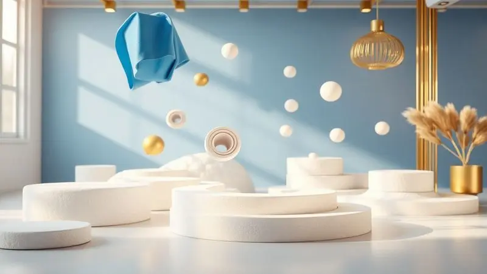
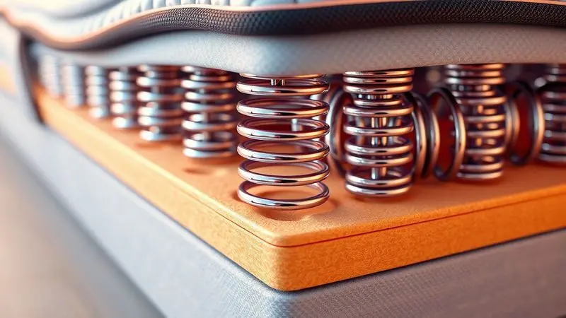

Você já parou para pensar que passamos cerca de um terço da vida dormindo? Escolher o colchão certo não é apenas uma questão de conforto, mas de investimento direto na sua saúde e qualidade de vida.

Se a marca Plumatex apareceu na sua busca, você provavelmente está diante de uma decisão importante: qual modelo realmente entrega o que promete?

Neste guia, vamos além das especificações técnicas para entender como cada colchão pode transformar suas noites em momentos verdadeiramente revigorantes.

<SummaryList products={frontmatter.top_products} />

## Colchões Plumatex: Conheça a Marca

Quando você escolhe um colchão Plumatex, está optando por uma marca que entende que o sono de qualidade vai muito além de um simples descanso.

Com décadas de presença no mercado brasileiro, a empresa constrói sua reputação sobre três pilares: tecnologia aplicada ao conforto, materiais que respeitam seu corpo e soluções pensadas para diferentes necessidades.

Seja você alguém que precisa de firmeza ortopédica ou busca o abraço macio de um viscoelástico, a Plumatex desenvolve produtos que conversam com seu jeito único de dormir.

## Principais características dos colchões Plumatex

O que realmente define a experiência de um colchão Plumatex? Imagine um produto que evolui com suas necessidades.

A marca oferece desde modelos com tecnologia de molas LFK, que parecem entender cada curva do seu corpo, até espumas de alta densidade que mantêm a firmeza ano após ano.

A ventilação inteligente garante que você não precise escolher entre conforto e frescor, enquanto capas removíveis transformam a manutenção em algo prático, não em uma tarefa tediosa.

É essa atenção aos detalhes que transforma especificações técnicas em noites realmente bem dormidas.

## Quais os diferenciais da Plumatex no mercado?

Em um mercado cheio de opções, a Plumatex se destaca por entender que conforto não é universal. Enquanto algumas marcas oferecem soluções genéricas, a empresa investe em pesquisa para criar diferenciais reais.

A tecnologia viscoelástica que se adapta à sua temperatura corporal, os tratamentos antiácaro que protegem sua saúde respiratoria, e o compromisso com processos sustentáveis mostram uma marca que pensa no longo prazo.

Mas o verdadeiro diferencial está em como esses elementos se combinam: não são apenas características isoladas, mas partes de um sistema projetado para seu bem-estar integral.

## Testes de qualidade e Plumatex no Reclame Aqui

Confiar em uma marca vai além das promessas de marketing.

Ao analisar a presença da Plumatex no Reclame Aqui, você encontra um padrão interessante: sim, há reclamações como em qualquer empresa de grande porte, mas o que chama atenção é a taxa de resolução e a consistência dos elogios à durabilidade.

Testes independentes confirmam o que muitos usuários relatam: esses colchões mantêm suas propriedades ergonômicas mesmo após anos de uso.

Para quem busca segurança no investimento, essa combinação de feedback real e certificações técnicas oferece uma base sólida de confiança.

## Quais os Top 10 Melhores Colchões Plumatex?

Com tanta variedade, como encontrar o colchão Plumatex ideal para você? Analisamos os dez modelos mais destacados do mercado, considerando não apenas especificações técnicas, mas como cada um se adapta a diferentes perfis de sono e necessidades específicas.

### 1. Colchão Plumatex de Molas LFK Resistance

<ProductBox 
  title={frontmatter.top_products[0].title} 
  image={frontmatter.top_products[0].image} 
  link={frontmatter.top_products[0].link} 
/>

Se você busca a sensação de estar sendo gentilmente envolvido enquanto mantém o suporte necessário para a coluna, este modelo com molas LFK é uma experiência à parte.

A tecnologia cria uma resposta individualizada para cada parte do seu corpo, como se o colchão aprendesse seus pontos de pressão. O Pillow Top adiciona aquela camada de aconchego que faz a diferença entre deitar e realmente descansar.

Imagine não precisar se virar várias vezes à noite porque uma parte do corpo ficou dormente. As molas LFK distribuem o peso de forma inteligente, enquanto o tratamento antiácaro e antifungo cria um ambiente saudável para seu sono.

A garantia de 12 meses acompanha um produto construído para durar, embora quem prefira firmeza extrema possa encontrar aqui um equilíbrio mais voltado para o conforto.

<CaixaProsContras>

**Prós:**

- Tecnologia de molas LFK para suporte ergonômico.

- Camada de Pillow Top para maior conforto.

- Durabilidade das molas, mantendo a qualidade ao longo do tempo.

- Tratamento antiácaro e antifungo para maior saúde.

**Contras:**

- Pode não ser ideal para quem prefere colchões muito firmes.

- A garantia é limitada a 12 meses.

</CaixaProsContras>

### 2. Colchão Plumatex de Molas Ensacadas D33 Liz Premium

<ProductBox 
  title={frontmatter.top_products[1].title} 
  image={frontmatter.top_products[1].image} 
  link={frontmatter.top_products[1].link} 
/>

Para casais onde um se mexe muito durante a noite, esta pode ser a solução para noites mais tranquilas. As molas ensacadas individualmente funcionam como pequenos sistemas independentes, absorvendo movimentos sem transferi-los para o outro lado do colchão.

A densidade D33 oferece firmeza ideal para quem pesa entre 71 kg e 80 kg, criando um suporte que não cede com o tempo.

A praticidade do design one side significa que você nunca mais precisará lutar para virar um colchão pesado. O Pillow Top transforma o simples ato de deitar em um momento de prazer imediato.

Se você valoriza durabilidade e busca um equilíbrio entre suporte e conforto, este modelo entende que um bom colchão deve ser seu aliado por muitos anos.

<CaixaProsContras>

**Prós:**

- Adaptação ao corpo com molas ensacadas.

- Camada adicional de conforto com Pillow Top.

- Fácil manutenção por ser um modelo one side.

- Alta durabilidade e suporte para diferentes pesos.

**Contras:**

- Pode parecer muito firme para quem prefere colchões mais macios.

- O modelo específico pode limitar opções de textura.

</CaixaProsContras>

### 3. Colchão Plumatex de Molas Ensacadas ConfortGel

<ProductBox 
  title={frontmatter.top_products[2].title} 
  image={frontmatter.top_products[2].image} 
  link={frontmatter.top_products[2].link} 
/>

Quem já acordou suando no meio da noite sabe o quanto a temperatura importa. Este modelo leva o conforto térmico a sério com camadas de espuma gel que regulam o calor do seu corpo, criando um microclima perfeito para dormir.

As molas ensacadas continuam trabalhando em segundo plano, garantindo que seus movimentos noturnos não se transformem em interrupções no sono.

O tratamento antiácaro é especialmente valioso para quem sofre com alergias, permitindo respirar livremente durante toda a noite. A classificação macia oferece a sensação de afundar suavemente, como se o colchão lhe desse um abraço de boas-vindas.

Se calor noturno é um problema para você, esta pode ser a resposta que seu corpo esperava.

<CaixaProsContras>

**Prós:**

- Molas ensacadas que se adaptam aos movimentos do corpo

- Camadas com espuma gel para maior conforto térmico

- Ventilação e controle de temperatura

- Tratamento contra ácaros e fungos

**Contras:**

- Pode não ser ideal para quem prefere colchões mais firmes

- Tamanhos limitados em algumas versões

</CaixaProsContras>

### 4. Colchão Plumatex de Molas Ensacadas Smart Milano

<ProductBox 
  title={frontmatter.top_products[3].title} 
  image={frontmatter.top_products[3].image} 
  link={frontmatter.top_products[3].link} 
/>

Às vezes, a elegância encontra a funcionalidade. Com seu euro pillow top e tecido em sarja, este colchão parece saído de um catálogo de design, mas sua verdadeira beleza está na engenharia inteligente.

As molas ensacadas trabalham em harmonia com a espuma D26, criando uma base que sabe quando ser firme e quando ser complacente.

A altura generosa de 24 a 25 cm não é apenas estética: ela permite camadas mais espessas de conforto, transformando sua cama em um refúgio acolhedor. Os tratamentos antiácaro e antialérgico funcionam como guardiões silenciosos da sua saúde respiratória.

Em ambientes compactos, a altura pode exigir planejamento, mas para quem busca luxo acessível, cada centímetro vale a pena.

<CaixaProsContras>

**Prós:**

- Molas ensacadas proporcionam suporte personalizado.

- Espuma certificada que garante conforto.

- Tratamentos antiácaro e antialérgico.

- Design com euro pillow top para maior suavidade.

**Contras:**

- Pode ser um pouco alto para ambientes pequenos.

- Não é necessário virar o colchão, o que pode limitar a durabilidade a longo prazo.

</CaixaProsContras>

### 5. Colchão Plumatex de Molas Verticoil Smart

<ProductBox 
  title={frontmatter.top_products[4].title} 
  image={frontmatter.top_products[4].image} 
  link={frontmatter.top_products[4].link} 
/>

Existe um ponto ideal entre firmeza e maciez, e este modelo parece tê-lo encontrado. As molas Verticoil atuam como uma rede de suporte inteligente, aliviando pontos de pressão nos ombros e quadris enquanto mantêm a coluna perfeitamente alinhada.

O resultado é aquele despertar sem dores que parece reservado apenas para sorteios.

O Euro Pillow Top adiciona uma camada de indulgência que faz você querer ficar na cama só mais cinco minutos. Os tratamentos antiácaro e antifungo garantem que esse prazer não venha com preocupações sobre alergias.

Se você não é fã de colchões muito firmes, mas também não quer afundar completamente, este equilíbrio pode ser exatamente o que seu corpo precisa.

<CaixaProsContras>

**Prós:**

- Conforto e alívio de pressão com molas Verticoil.

- Camadas extras macias com opções de Pillow Top.

- Tratamento antiácaro e antifungo em alguns modelos.

- Variedade de tamanhos disponíveis.

**Contras:**

- Pode não ser firme o suficiente para quem prefere colchões mais rígidos.

- Suporta até 110 kg por pessoa, o que pode ser limitante para algumas pessoas.

</CaixaProsContras>

### 6. Colchão Plumatex de Molas Verticoil Smart Sonata Black

<ProductBox 
  title={frontmatter.top_products[5].title} 
  image={frontmatter.top_products[5].image} 
  link={frontmatter.top_products[5].link} 
/>

"Macio com firmeza" não é um paradoxo, mas uma filosofia de design que este colchão domina. O Pillow Top Europeu oferece o primeiro contato suave, enquanto as molas Verticoil garantem que você não afunde além do confortável.

É como ter o melhor dos dois mundos: a acolhida de um colchão macio com a segurança de um suporte consistente.

Para quem lida com alergias, os tratamentos antiácaro e antifungo são mais do que especificações técnicas, são garantia de noites tranquilas sem espirros matinais.

A certificação INMETRO e o Selo Abicol funcionam como testemunhas da qualidade que você não precisa apenas acreditar, pode verificar. Se busca investimento com retorno garantido em conforto, este modelo fala a língua do sono de qualidade.

<CaixaProsContras>

**Prós:**

- Conforto equilibrado com Pillow Top Europeu

- Tratamento antiácaro e antifungo

- Alta durabilidade e qualidade

- Certificação INMETRO e Selo Abicol

**Contras:**

- Firmeza pode não agradar a todos

- Não é o modelo mais barato do mercado

</CaixaProsContras>

### 7. Colchão Plumatex de Espuma D26 Falcon Firme

<ProductBox 
  title={frontmatter.top_products[6].title} 
  image={frontmatter.top_products[6].image} 
  link={frontmatter.top_products[6].link} 
/>

Algumas pessoas não negociam quando o assunto é firmeza. Se você acorda melhor em superfícies mais rígidas, esta espuma D26 é sua aliada na busca por alinhamento postural.

A densidade garante que o colchão mantenha sua forma ano após ano, resistindo ao afundamento que tira o prazer de deitar em colchões mais velhos.

Os tratamentos antiácaro, antifungo e antialérgico transformam o cuidado com a saúde em parte integrante do design. Com opções de altura que variam de 18 cm a 22 cm, você encontra a versão que se adapta ao seu quarto e à sua base.

A firmeza pode ser uma preferência específica, mas para quem a valoriza, este colchão entrega consistência em cada noite.

<CaixaProsContras>

**Prós:**

- Excelente suporte para a coluna

- Tratamento antiácaro e antifungo

- Várias opções de altura disponíveis

- Boa durabilidade

**Contras:**

- Firmeza pode não agradar a todos

- Pode ser pesado para manusear

</CaixaProsContras>

### 8. Colchão Plumatex de Molas Superlastic Destiny

<ProductBox 
  title={frontmatter.top_products[7].title} 
  image={frontmatter.top_products[7].image} 
  link={frontmatter.top_products[7].link} 
/>

O que acontece quando você combina tecnologia de ponta com atenção aos detalhes de conforto? Este modelo com molas Superlastic responde com uma experiência de sono que parece personalizada.

A espuma D28 trabalha em conjunto com as molas, criando uma base que sabe ser firme onde precisa e complacente onde deve.

O Eurotop não é apenas uma camada extra, é um convite para relaxar profundamente. Os tratamentos antiácaro e antifungo cuidam da higiene enquanto você descansa, e a variedade de tamanhos significa que há uma versão perfeita para seu espaço.

A garantia de 12 meses reflete confiança na construção, embora alguns possam desejar prazos mais extensos para tão significativo investimento.

<CaixaProsContras>

**Prós:**

- Sistema de molas Superlastic para ótimo suporte.

- Eurotop que agrega conforto extra.

- Tratamento antiácaro e antifungo para maior higiene.

- Disponível em vários tamanhos para atender diferentes necessidades.

**Contras:**

- Garantia pode ser considerada curta por alguns.

- O peso máximo suportado varia conforme o modelo, o que pode gerar confusão.

</CaixaProsContras>

### 9. Colchão Plumatex de Molas Ensacadas Smart Flex

<ProductBox 
  title={frontmatter.top_products[8].title} 
  image={frontmatter.top_products[8].image} 
  link={frontmatter.top_products[8].link} 
/>

Flexibilidade inteligente define este modelo, onde cada mola ensacada age como um sensor individual de peso e movimento.

A espuma D26 garante que o conforto inicial se mantenha com o passar dos anos, enquanto o pillow top oferece aquela recepção suave que faz diferença após um dia cansativo.

Com altura entre 28 cm e 30 cm, este colchão impõe presença no quarto, transformando sua cama em um convite visual para o descanso. A capacidade de suporte adaptável significa que ele cresce com suas necessidades.

Como qualquer bom investimento, exige cuidados adequados: uma base rígida garante que todo o potencial de conforto seja realizado plenamente.

<CaixaProsContras>

**Prós:**

- Molas ensacadas oferecem suporte individualizado.

- Boa adaptação ao contorno do corpo.

- Espuma de alta densidade proporciona durabilidade.

- Disponível em diferentes tamanhos para atender diversas necessidades.

**Contras:**

- Pode apresentar perda de conformação com o tempo.

- Exige uma base rígida adequada para melhor desempenho.

</CaixaProsContras>

### 10. Colchão Plumatex de Molas Verticoil Smart Master Black

<ProductBox 
  title={frontmatter.top_products[9].title} 
  image={frontmatter.top_products[9].image} 
  link={frontmatter.top_products[9].link} 
/>

Elegância que funciona enquanto você dorme. Este colchão combina o visual sofisticado do jacquard com a engenharia prática das molas Verticoil.

O Pillow Inn não é apenas um nome bonito: é uma camada de conforto que parece ter sido pensada para seus momentos de relaxamento profundo.

A espuma D26 oferece maciez sem comprometer o suporte, criando uma sensação de flutuar levemente. As dimensões de 138x188x24 cm são generosas para casais, garantindo espaço pessoal sem perder a intimidade do compartilhamento.

A limitação de 100 kg por pessoa orienta a escolha consciente, enquanto a eventual dificuldade de encontrar o modelo em algumas lojas pode exigir paciência que será recompensada com noites excepcionais.

<CaixaProsContras>

**Prós:**

- Conforto macio graças à espuma D26.

- Sistema de molas Verticoil para suporte ideal.

- Acabamento elegante com revestimento em jacquard.

- Camada adicional de conforto com Pillow Inn.

**Contras:**

- Pode ser difícil de encontrar em algumas lojas.

- Peso máximo suportado por pessoa é limitado a 100 kg.

</CaixaProsContras>

### Bônus: Colchão Casal Plumatex de Molas Ensacadas Alfa

<ProductBox 
  title={frontmatter.top_products[10].title} 
  image={frontmatter.top_products[10].image} 
  link={frontmatter.top_products[10].link} 
/>

Especialmente desenhado para casais, este modelo entende que dormir juntos não significa ter que acordar junto com cada movimento.

As molas ensacadas criam zonas independentes de conforto, enquanto a firmeza da densidade D80 garante que o suporte não seja negociado em nome da adaptabilidade.

A altura de 22 cm oferece estabilidade visual, e os tratamentos antialérgicos transformam o cuidado com a saúde em parte do projeto. A praticidade do design one side significa mais tempo aproveitando seu colchão e menos tempo lutando para mantê-lo.

Se você e seu parceiro têm perfis de sono diferentes mas compartilham o desejo por noites tranquilas, este colchão pode ser o mediador perfeito.

<CaixaProsContras>

**Prós:**

- Molas ensacadas para melhor adaptação ao corpo

- Tecnologia antiácaro e antifungo

- Facilidade de manutenção sem necessidade de virar

- Excelente suporte para casais

**Contras:**

- Limitação de peso pode não atender todos os usuários

- Firmeza pode não agradar quem prefere colchões macios

</CaixaProsContras>

## Avaliação final: Colchão Plumatex é bom? Vale a pena?

Após explorar os diferentes modelos e tecnologias, a resposta não é apenas um "sim", mas um "depende do que você valoriza no seu sono".

A Plumatex se destaca não por ser a marca mais barata ou a mais luxuosa, mas por oferecer consistência em um ponto crucial: entender que conforto é pessoal.

Se você busca tecnologia comprovada que se traduz em benefícios reais, desde a adaptação corporal das molas ensacadas até a regulação térmica das espumas com gel, encontra aqui soluções que funcionam no dia a dia.

A durabilidade relatada pelos usuários e confirmada por testes independentes transforma o investimento inicial em economia a longo prazo.

Vale a pena? Se você entende que um bom colchão não é uma despesa, mas um investimento em sua saúde, produtividade e qualidade de vida, então cada modelo Plumatex representa uma oportunidade de transformar um terço da sua vida em momentos verdadeiramente reparadores.

O segredo está em escolher não apenas uma marca, mas a tecnologia que conversa com seu corpo e suas necessidades específicas.

## FAQ: Dúvidas frequentes sobre o Colchão Plumatex

Escolher um colchão gera perguntas naturais, especialmente quando se trata de uma marca com tanta variedade tecnológica. Reunimos as dúvidas mais comuns para ajudar na sua decisão.

### Qual o melhor colchão da Plumatex?

Esta pergunta tem uma resposta tão pessoal quanto sua impressão digital. O "melhor" colchão Plumatex é aquele que desaparece quando você deita, no bom sentido: não chama atenção para si, apenas permite que seu corpo descanse naturalmente.

Para quem precisa de suporte firme, os modelos com molas ensacadas e densidades mais altas criam uma base consistente. Para quem busca alívio de pressão, as tecnologias viscoelásticas e de molas LFK oferecem adaptação inteligente.

A verdadeira questão não é qual é o melhor no catálogo, mas qual é o melhor para seu peso, postura ao dormir e sensibilidade térmica. Experimentar diferentes modelos, mesmo que brevemente, revela mais do que qualquer lista de especificações.

### O que é Plumatex Mola?

Plumatex Mola não é apenas um tipo de colchão, é uma filosofia de suporte inteligente. Imagine centenas de pequenos sistemas independentes trabalhando em harmonia sob você.

Cada mola ensacada responde individualmente ao peso e movimento, criando uma superfície que se adapta em tempo real ao seu corpo.

Esta tecnologia resolve dois problemas comuns: a transferência de movimento que acorda casais e a perda de suporte em áreas de maior pressão.

A ventilação natural entre as molas mantém o frescor, enquanto a durabilidade do sistema garante que o conforto inicial seja uma promessa mantida ano após ano.

Para quem valoriza sono ininterrupto e suporte personalizado, Plumatex Mola é mais que uma especificação técnica: é uma experiência de descanso redefinida.