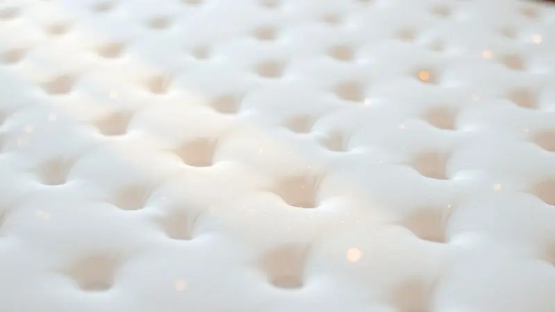

Cuidar de pacientes com mobilidade reduzida vai além das necessidades básicas. É sobre preservar a dignidade em cada detalhe.

Você provavelmente sabe que as úlceras de pressão, ou escaras, são um risco constante para quem precisa permanecer acamado, mas talvez não perceba como o equipamento certo pode fazer toda a diferença entre o desconforto e um repouso verdadeiramente terapêutico.

Neste guia, vamos além das especificações técnicas para mostrar como o colchão pneumático se torna um aliado silencioso na prevenção, transformando uma necessidade médica em um gesto de cuidado genuíno. Acompanhe conosco essa jornada.

<SummaryList products={frontmatter.top_products} />

## O que é um Colchão Pneumático e qual sua função?

Imagine um colchão que respira com o paciente. Esse é o colchão pneumático, uma solução inteligente que substitui a passividade de uma superfície comum por um suporte dinâmico e adaptativo.

Sua função principal não é apenas acomodar o corpo, mas trabalhar ativamente para prevenir as feridas que surgem da imobilidade prolongada. Ele age como uma segunda pele tecnológica, que compreende onde a pressão se acumula e oferece alívio exatamente nos pontos certos.

### Entendendo as Escaras (Úlceras de Pressão)

Para quem nunca as viu, as escaras podem parecer apenas pequenas manchas vermelhas na pele.

Na realidade, são feridas profundas que começam com a constante pressão sobre pontos ósseos como calcanhares, quadris e sacro, comprometendo a circulação sanguínea e, consequentemente, a nutrição dos tecidos.

A dor, o risco de infecção e o prolongamento do tempo de recuperação são consequências reais. É por isso que a prevenção, baseada em mudanças de posição e no uso de superfícies que aliviam essa pressão, não é um protocolo opcional.

É um ato de respeito ao corpo vulnerável. O colchão pneumático surge como o parceiro perfeito nessa missão, redistribuindo o peso de forma constante e inteligente.

## Como funciona o Sistema de Pressão Alternada?

O coração do colchão pneumático reside nesse mecanismo engenhoso. Enquanto algumas células de ar ficam firmes oferecendo suporte, outras adjacentes perdem um pouco de pressão, permitindo que a pele e os tecidos naquela área específica respirem e se recuperem.

Depois de alguns minutos, o ciclo se inverte. Esse movimento contínuo simula o que o corpo faria naturalmente se pudesse se virar sozinho na cama.

O resultado é uma melhora significativa na circulação sanguínea, que mantém os tecidos vivos e saudáveis, reduzindo drasticamente o terreno fértil para as escaras surgirem.

## Principais Benefícios do Colchão Pneumático Hospitalar

Pense em um paciente que precisa de meses de repouso. O benefício mais imediato é óbvio, a prevenção das úlceras, mas os ganhos vão muito além.

A distribuição uniforme do peso elimina aqueles pontos de pressão insuportáveis que transformam cada hora na cama em um martírio.

Os sistemas automáticos ajustam-se ao formato e à densidade corporal, oferecendo um conforto personalizado que favorece um sono mais reparador, crucial para qualquer recuperação.

Por fim, a facilidade de higienização com materiais impermeáveis proporciona mais do que limpeza: traz a segurança de um ambiente protegido contra bactérias, tranquilo para quem cuida e para quem é cuidado.

## Como escolher o modelo ideal: Critérios de Compra

Escolher o colchão certo é encontrar o equilíbrio perfeito entre as necessidades técnicas do paciente e a realidade prática de quem o maneja. Não basta ser eficaz: ele precisa se integrar à rotina da casa ou do quarto hospitalar sem criar novos problemas.

Os critérios a seguir o ajudarão a tomar essa decisão com segurança.

### Capacidade de Peso: Dos 130kg aos 135kg

Quando falamos em 130kg a 135kg de capacidade, estamos falando de inclusão. Esses limites oferecem segurança para uma ampla gama de pacientes, assegurando que o sistema de pressão alternada funcionará de forma otimizada, independentemente da compleição física.

É essa confiabilidade que permite a distribuição uniforme do peso, garantindo que a tecnologia de prevenção atue em seu máximo potencial para todos.

### Voltagem e Ciclo de Ar do Compressor

A voltagem (110V ou 220V) parece um detalhe técnico até você precisar usar o colchão em um ambiente diferente ou durante uma viagem. Verificar essa compatibilidade evita surpresas. Já o ciclo de ar, é o ritmo da prevenção.

Um compressor que mantém esse ciclo regular é a garantia de que o alívio da pressão será constante, sem intervalos que possam comprometer a eficácia do cuidado ao longo das 24 horas.

### Nível de Ruído: O silêncio é fundamental

Às 3 da manhã, em um quarto escuro, cada barulho é amplificado. Um compressor excessivamente ruidoso pode roubar o precioso sono do paciente e de quem está por perto.

Modelos com tecnologia mais avançada operam com um zumbido quase imperceptível, oferecendo o ajuste necessário sem perturbar a tranquilidade que é parte essencial do processo de cura. A paz, neste contexto, também é terapêutica.

## Melhores Marcas e Modelos de Colchão Pneumático

Marcas como Therapedic, Medline e Invacare construíram sua reputação em cima da confiança e da eficácia comprovada. Cada uma traz propostas distintas em termos de tecnologia embarcada, durabilidade do material e sofisticação dos sistemas de controle.

Conhecer os modelos específicos ajuda a traduzir essa reputação em benefícios concretos.

### Colchão Pneumático Dellamed Air Plus com Compressor

<ProductBox 
  title={frontmatter.top_products[0].title} 
  image={frontmatter.top_products[0].image} 
  link={frontmatter.top_products[0].link} 
/>

O Dellamed Air Plus é a escolha para quem busca uma solução robusta de tratamento e prevenção de escaras.

Seu sistema de pressão alternada é particularmente eficiente na redução de pontos críticos de pressão, proporcionando alívio significativo e melhorando a circulação.

Fabricado em vinil resistente, oferece impermeabilidade total, facilitando a limpeza e combatendo o surgimento de mofo. Suportando até 135 kg, é indicado para uso domiciliar e hospitalar contínuo.

Requer atenção na limpeza, evitando produtos agressivos, mas compensa com uma durabilidade notável.

### Colchão Pneumático MedLevensohn: Eficiência e Durabilidade

<ProductBox 
  title={frontmatter.top_products[1].title} 
  image={frontmatter.top_products[1].image} 
  link={frontmatter.top_products[1].link} 
/>

Se o que você procura é um equilíbrio entre eficácia comprovada e segurança, o MedLevensohn merece sua atenção. Seu sistema de ciclos regulares promove um alívio uniforme da pressão, priorizando o conforto e a saúde da pele.

Construído com materiais atóxicos como PVC e TPU (uma evolução do vinil, mais flexível e resistente), também suporta a marca dos 135 kg.

A dependência de energia elétrica é um ponto a observar, mas é contrabalançada por uma operação extremamente silenciosa e uma garantia estendida que reflete a confiança da fabricante: 6 meses para o colchão e 1 ano para o compressor.

### Colchão Pneumático Bio-Pillow: Custo-Benefício em Foco

<ProductBox 
  title={frontmatter.top_products[2].title} 
  image={frontmatter.top_products[2].image} 
  link={frontmatter.top_products[2].link} 
/>

Conhecido também como Bio Air, o Bio-Pillow é a prova de que tecnologia preventiva pode ser acessível.

Com aproximadamente 130 células que realizam ciclos de inflagem a cada 8 ou 9 minutos, ele cumpre efetivamente seu papel de estimular a circulação e reduzir os pontos de pressão.

É um equipamento auxiliar, utilizado sobre um colchão comum, e suporta pacientes de até 130 kg com seu material impermeável.

Pode levar cerca de 10 minutos para inflar completamente, mas, uma vez em operação, entrega conforto contínuo e uma proteção eficiente, representando um investimento inteligente para quem precisa começar a cuidar.

## Passo a Passo: Como instalar e usar seu colchão pneumático

A instalação é mais simples do que parece. Comece posicionando o colchão desenrolado sobre uma superfície plana, longe de bordas cortantes. Conecte as mangueiras da bomba (compressor) às saídas correspondentes no colchão, depois ligue o compressor na tomada.

Em poucos minutos, você verá as células ganharem forma. Não é preciso encher até ficar rígido; a consistência ideal é firme, mas com uma ligeira cedência ao toque. Ao deitar o paciente, centralize o corpo para que o peso se distribua igualmente.

A manutenção preventiva, como verificar conexões e limpar a superfície, garante que essa simplicidade de uso dure por muito tempo.

## Cuidados e Manutenção: Higienização e Longevidade

A longevidade do seu colchão depende de pequenos rituais de cuidado. Para a limpeza diária, um pano úmido com sabão neutro é suficiente. Evite alvejantes, álcool ou solventes, que podem ressecar e rachar o material à longo prazo.

Uma verificação semanal rápida por vazamentos, passando uma esponja com água e sabão nas costuras para observar se formam bolhas, pode prevenir problemas maiores.

O uso de uma capa protetora de algodão respirável é um investimento que vale a pena, protegendo contra manchas e facilitando a limpeza do conjunto. Guarde as instruções do fabricante.

Seguir seus conselhos específicos é o que transforma um produto durável em um companheiro por anos.

## Perguntas Frequentes (FAQ)

### O colchão pneumático deve ficar ligado 24 horas?

Sim, na grande maioria dos casos. A eficácia do sistema de pressão alternada depende de sua operação contínua para manter o ciclo constante de alívio da pressão.

Desligá-lo, mesmo por períodos curtos, pode criar janelas de risco onde a pressão se acumula em determinadas áreas.

Siga sempre a recomendação do fabricante do seu modelo específico, mas parta do princípio de que ele foi projetado para funcionar sem interrupções, garantindo proteção ininterrupta.

### Posso colocar lençol sobre o colchão pneumático?

Não só pode, como deve. Um lençol bem ajustado, preferencialmente elástico ou com cantos profundos, protege a superfície do colchão contra atrito, suor e derramamentos acidentais, além de ser muito mais confortável e aconchegante para o paciente.

Escolha materiais naturais e respiráveis, como algodão, que ajudam na termorregulação. O lençol se torna a camada lavável que mantém a higiene do sistema sem exigir a limpeza constante do colchão em si.

## Conclusão

No fim das contas, a escolha de um colchão pneumático vai muito além da análise técnica. É sobre escolher qualidade de vida para alguém que já enfrenta o desafio da imobilidade.

É optar por um equipamento que transforma horas passivas de repouso em uma experiência ativa de cuidado e prevenção. Cada sistema de pressão alternada, cada quilograma suportado, cada decibel silenciado representa um compromisso com o conforto, a dignidade e a saúde.

Ao fazer sua escolha, leve em consideração não apenas o diagnóstico, mas a pessoa que irá utilizar. Um bom colchão pneumático não cura doenças, mas ele cria as condições ideais para que o corpo se recupere, oferecendo segurança, alívio e, acima de tudo, respeito.

É um investimento que ressoa no bem-estar diário e na tranquilidade de quem cuida, fechando o ciclo do cuidado com atenção e tecnologia a serviço da vida.