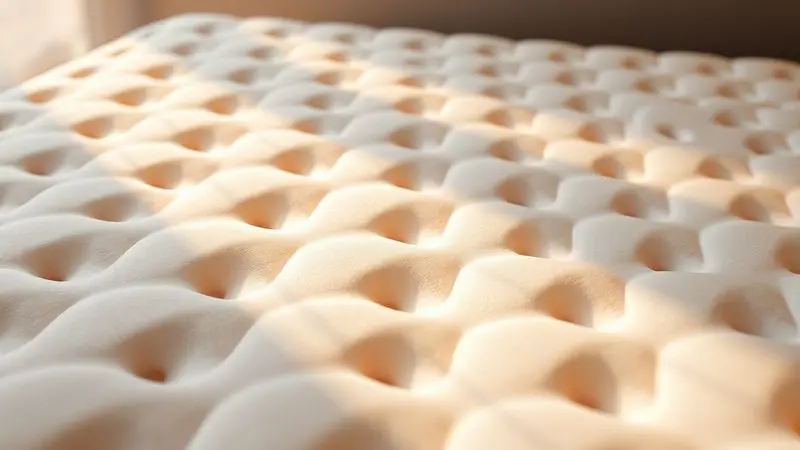
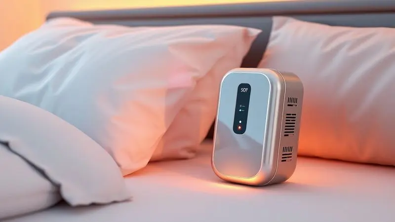
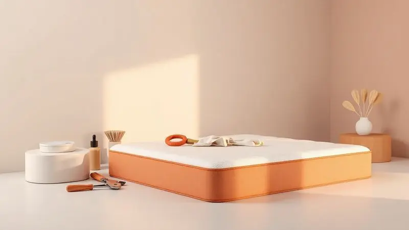

Escolher o colchão certo para alguém que passa horas, dias e até meses deitado é uma decisão que vai muito além do conforto. É sobre prevenir dor, preservar a dignidade e, muitas vezes, evitar complicações sérias de saúde.

Os colchões pneumáticos anti-escaras representam essa fronteira entre cuidado básico e cuidado especializado, usando tecnologia inteligente para proteger quem não pode se mover.

Neste guia de 2025, analisamos a fundo 13 modelos que realmente fazem diferença, desde marcas consagradas como Dellamed e Multi Saúde até opções com tecnologias específicas.

Mais do que um ranking, oferecemos o conhecimento necessário para você decifrar especificações técnicas como voltagem do compressor, capacidade de peso e sistemas de pressão, garantindo uma escolha segura, seja para um quarto em casa ou para um ambiente hospitalar.

Aqui, você encontrará informações para transformar uma necessidade em uma solução de verdade.

<SummaryList products={frontmatter.top_products} />

## Análise: Os 13 Melhores Colchões Pneumáticos

Vamos explorar uma seleção cuidadosa de modelos que se destacam no mercado. Esta não é apenas uma lista, mas uma análise detalhada de como cada opção responde a necessidades reais de pacientes e cuidadores.

Considere este espaço como seu ponto de partida para entender as nuances de cada produto.

### 1. Dellamed Kit Air Plus 127V (135Kg)

<ProductBox 
  title={frontmatter.top_products[0].title} 
  image={frontmatter.top_products[0].image} 
  link={frontmatter.top_products[0].link} 
/>

Desenvolvido com um propósito claro, o Kit Air Plus da Dellamen é um aliado na prevenção e tratamento de escaras.

O segredo está no seu sistema de alívio de pressão alternada: imagine células que se inflam e desinflam em ciclos de 5 a 6 minutos, como uma massagem suave e contínua que estimula a circulação e tira a pressão constante do corpo.

Além de eficaz, ele pensa no dia a dia: o compressor opera em silêncio e com baixíssimo consumo de energia, e o material em PVC resistente transforma a limpeza em uma tarefa simples.

A durabilidade aumentada em relação a colchões comuns e o kit de reparos incluído são o tipo de detalhe que prolonga a vida útil do investimento. A atenção vai para a voltagem: como não é bivolt, confirme se o seu padrão elétrico é 127V.

<CaixaProsContras>

**Prós:**

- Sistema de alívio de pressão eficiente para prevenção de escaras.

- Silencioso e com baixo consumo de energia.

- Fácil manutenção pelo material impermeável e kit de reparos.

- Durabilidade maior se comparado a colchões tradicionais.

**Contras:**

- Não é bivolt, exigindo atenção na voltagem correta.

- O tempo de inflagem inicial pode ser um pouco longo (15 a 25 minutos).

</CaixaProsContras>

### 2. Colchão Pneumático PREMIUM 220V com Kit Reparo

<ProductBox 
  title={frontmatter.top_products[1].title} 
  image={frontmatter.top_products[1].image} 
  link={frontmatter.top_products[1].link} 
/>

Também conhecido como Air Plus da Dellamed, este modelo PREMIUM 220V traz consigo a confiança de uma tecnologia testada. O sistema de pressão alternada trabalha para prevenir e tratar escaras, promovendo a circulação sanguínea de forma passiva.

Com suporte para até 135 kg distribuídos em cerca de 130 células de ar, ele oferece conforto que se adapta. O PVC resistente garante leveza e, principalmente, praticidade na hora da limpeza.

Uma limitação importante é o uso: projetado para camas, ele não deve ser usado em poltronas, pois isso pode bloquear a saída de ar e comprometer seu funcionamento.

<CaixaProsContras>

**Prós:**

- Sistema de pressão alternada para alívio da pressão.

- Suporta usuários de até 135 kg.

- Material resistente e impermeável, facilitando a limpeza.

- Inclui kit de reparo para manutenção.

**Contras:**

- Não é bivolt, exigindo atenção à voltagem do local.

- Uso restrito a camas, não recomendado para poltronas.

</CaixaProsContras>

### 3. Multi Saúde HC288 Anti Escaras 220V

<ProductBox 
  title={frontmatter.top_products[2].title} 
  image={frontmatter.top_products[2].image} 
  link={frontmatter.top_products[2].link} 
/>

A Multi Saúde entrega com o HC288 uma solução focada em um resultado: prevenir úlceras por pressão.

O sistema de alternância atua como um regulador inteligente, onde o compressor infla e desinfla células de ar para melhorar a circulação e reduzir a pressão nos pontos mais críticos do corpo. Suportando até 135 kg e feito de PVC resistente, ele promete durabilidade.

O funcionamento silencioso do compressor é um trunfo para ambientes de descanso. O ponto de atenção fica na alimentação: ele requer uma tomada 220V, o que pode restringir sua utilização em alguns cômodos ou locais com infraestrutura elétrica mais antiga.

<CaixaProsContras>

**Prós:**

- Sistema de alternância de pressão que melhora a circulação.

- Previne escaras e proporciona alívio ao paciente.

- Silencioso durante o funcionamento.

- Feito de material resistente e durável.

**Contras:**

- Necessita de uma tomada 220V, limitando a flexibilidade no uso.

- Capacidade máxima de peso pode não atender a todos os usuários.

</CaixaProsContras>

### 4. Dellamed Kit Air Plus 220V (135Kg)

<ProductBox 
  title={frontmatter.top_products[3].title} 
  image={frontmatter.top_products[3].image} 
  link={frontmatter.top_products[3].link} 
/>

Outra versão do consagrado Air Plus, agora em 220V, mantém o compromisso com a segurança e o conforto. O sistema de alívio de pressão com 130 células opera em ciclos de 5 a 6 minutos, criando um ambiente dinâmico que impede a formação de pontos fixos de pressão.

Suportando 135 kg, o material em PVC facilita a higienização, uma preocupação a menos para quem cuida. O motor se destaca por ser econômico e silencioso, com consumo mensal baixo, e é seguro até para quem usa marca-passos.

Lembre-se: esta também não é uma versão bivolt, então a compatibilidade com a voltagem da sua casa ou instituição é um passo essencial antes da compra.

<CaixaProsContras>

**Prós:**

- Sistema de alívio de pressão que ajuda a prevenir escaras.

- Material resistente e fácil de limpar.

- Motor silencioso e econômico.

- Suporta até 135 kg, adequado para a maioria dos usuários.

**Contras:**

- Não é bivolt, exigindo atenção na escolha da voltagem.

- O tempo de inflagem completo pode levar até 25 minutos.

</CaixaProsContras>

### 5. Dellamed Air Plus com Alívio de Pressão Alternada

<ProductBox 
  title={frontmatter.top_products[4].title} 
  image={frontmatter.top_products[4].image} 
  link={frontmatter.top_products[4].link} 
/>

Este modelo Dellamed foca em um ciclo de alívio um pouco mais amplo, entre 10 e 12 minutos, para uma atuação ainda mais suave e contínua.

Ao minimizar os pontos de pressão através da alternância de inflagem, ele estimula a circulação e proporciona uma sensação sutil de massagem, crucial para o bem-estar de quem não pode se virar sozinho.

Os materiais são escolhidos para combater odores e umidade, tornando a higienização simples, e o baixo consumo energético permite o uso ininterrupto. Com suporte a 135 kg e compatibilidade com marca-passos, é uma opção robusta.

É bom verificar se o pacote inclui o motor, pois algumas vendas podem oferecê-lo separadamente.

<CaixaProsContras>

**Prós:**

- Sistema de alívio de pressão eficaz.

- Facilita a circulação sanguínea.

- Fácil de limpar e manter.

- Alta durabilidade em comparação a colchões comuns.

**Contras:**

- Pode não acompanhar o motor em algumas versões.

- O investimento inicial pode ser considerado alto por alguns.

</CaixaProsContras>

### 6. Multi Saúde HC287 Anti Escaras 110V

<ProductBox 
  title={frontmatter.top_products[5].title} 
  image={frontmatter.top_products[5].image} 
  link={frontmatter.top_products[5].link} 
/>

Se a preocupação é a voltagem 110V, o HC287 da Multi Saúde surge como uma resposta direta. Alternando a pressão em suas células, ele trabalha para melhorar a circulação e aliviar os pontos de pressão na pele, uma função vital para pacientes com mobilidade reduzida.

Feito em PVC resistente para suportar até 135 kg, ele traz para o ambiente doméstico um compressor silencioso. A impermeabilidade do material e a inclusão de um kit para reparos são testes de que a preocupação vai além da função imediata, pensando também na longevidade.

O design pode não ser seu ponto mais chamativo, e o preço pode ficar acima de modelos mais simples, mas a eficácia na prevenção de escaras costuma justificar o investimento.

<CaixaProsContras>

**Prós:**

- Prevenção eficaz de escaras e lesões por pressão.

- Estimula a circulação sanguínea.

- Fácil instalação sobre colchões convencionais.

- Material impermeável e de fácil limpeza.

**Contras:**

- Não possui um design estético atraente.

- Pode ter um custo superior a modelos simples.

</CaixaProsContras>

### 7. Colchão Pneumático PREMIUM 110V com Kit Reparo

<ProductBox 
  title={frontmatter.top_products[6].title} 
  image={frontmatter.top_products[6].image} 
  link={frontmatter.top_products[6].link} 
/>

Aqui, a voltagem 110V se une a um sistema de pressão alternada que infla e desinfla células em ciclos, criando um alívio dinâmico da pressão e um estímulo positivo para a circulação.

Fabricado para durar, com material resistente e impermeável, ele suporta pesos de até 135 kg. O compressor compacto e de baixo ruído é perfeito para não interferir no descanso, seja em casa ou no hospital.

O kit de reparo incluso é um seguro contra pequenos imprevistos, estendendo a vida útil do produto. Importante: ele não tem função de massagem e deve ser usado sempre com um lençol entre o colchão e a pele do paciente.

<CaixaProsContras>

**Prós:**

- Sistema de pressão alternada melhora a circulação sanguínea.

- Material resistente e fácil de limpar.

- Inclui kit de reparo para maior durabilidade.

- Compressor silencioso e compacto.

**Contras:**

- Não deve ser utilizado em contato direto com a pele.

- Limitação de peso pode não atender todos os usuários.

</CaixaProsContras>

### 8. Kit Colchão Pneumático Anti Escaras Hidrolight

<ProductBox 
  title={frontmatter.top_products[7].title} 
  image={frontmatter.top_products[7].image} 
  link={frontmatter.top_products[7].link} 
/>

O Hidrolight se apresenta como uma opção versátil e eficaz na luta contra úlceras de pressão. Seu sistema de pressão alternada faz com que células infláveis se encham e esvaziem em sequência, aliviando a pressão de forma inteligente pelo corpo.

Confeccionado em PVC resistente e impermeável, ele garante segurança e facilidade de limpeza. Com suporte para até 130 kg, um grande diferencial é a bomba ultra silenciosa e bivolt, que elimina a dor de cabeça da compatibilidade elétrica.

A montagem é simples, mas requer atenção: ele deve ser posicionado sobre um colchão convencional, o que pode aumentar a altura total da cama.

<CaixaProsContras>

**Prós:**

- Sistema de pressão alternada eficaz na prevenção de escaras.

- Confortável e seguro para o paciente.

- Bomba bivolt e silenciosa.

- Fácil instalação e manutenção com kit para reparos.

**Contras:**

- Pode ser necessário usá-lo sobre outro colchão, o que pode ocupar mais espaço.

- O colchão deve ser coberto com lençol para não ter contato direto com a pele.

</CaixaProsContras>

### 9. Bic Arboll Comfort Plus 220V (135Kg)

<ProductBox 
  title={frontmatter.top_products[8].title} 
  image={frontmatter.top_products[8].image} 
  link={frontmatter.top_products[8].link} 
/>

A BIC traz para o mercado o Arboll Comfort Plus, um modelo que alia tecnologia a certificações de segurança. Seu sistema de pressão alternada utiliza 130 células que se alternam em ciclos de cerca de 6 minutos, promovendo uma leve massagem que estimula a circulação.

Disponível em 220V e com capacidade para 135 kg, é feito de PVC resistente e impermeável, simplificando a limpeza. O compressor opera abaixo de 30dB, um nível que praticamente desaparece no ambiente, e possui certificações ANVISA e INMETRO.

O preço pode ser superior ao de colchões tradicionais, mas a qualidade e os benefícios diretos para a saúde e o conforto do paciente apresentam um valor convincente.

<CaixaProsContras>

**Prós:**

- Sistema de pressão alternada que alivia a pressão.

- Reduz riscos de escaras e úlceras por pressão.

- Confeccionado em material leve e impermeável.

- Compressor silencioso que não atrapalha o descanso.

**Contras:**

- Preço mais alto que colchões comuns.

- A instalação do compressor pode exigir espaço adicional.

</CaixaProsContras>

### 10. Colchão de Ar Anti Escaras Supermedy 110V

<ProductBox 
  title={frontmatter.top_products[9].title} 
  image={frontmatter.top_products[9].image} 
  link={frontmatter.top_products[9].link} 
/>

Pensado para prevenir e tratar úlceras por pressão, o Supermedy 110V utiliza um sistema de pressão alternada que infla e desinfla células de ar, garantindo um alívio contínuo.

Uma de suas maiores virtudes é o baixo nível de ruído do compressor, criando um ambiente sereno para o paciente descansar. Confecionado em PVC vinil, ele é leve, resistente e impermeável, suportando pacientes entre 120 kg e 135 kg.

Embora possa não ser a opção de menor custo, o investimento se justifica pela qualidade construtiva e pela eficácia em oferecer conforto e, acima de tudo, segurança para quem está em situação de maior vulnerabilidade.

<CaixaProsContras>

**Prós:**

- Prevenção eficaz de escaras.

- Estimula a circulação sanguínea.

- Baixo nível de ruído do compressor.

- Fácil de instalar e manusear.

**Contras:**

- Pode ter um custo maior.

- Requer uma fonte elétrica para funcionamento.

</CaixaProsContras>

### 11. Colchão Pneumático Safe Medic Plus 130kg

<ProductBox 
  title={frontmatter.top_products[10].title} 
  image={frontmatter.top_products[10].image} 
  link={frontmatter.top_products[10].link} 
/>

O Safe Medic Plus 130kg tem como missão a redistribuição inteligente do peso. Seu sistema de pressão alternada atua em ciclos que variam de 5 a 12 minutos, estimulando a circulação e promovendo conforto.

Suportando até 130 kg, é feito de PVC resistente, leve e impermeável, características que se traduzem em facilidade de higienização. O compressor que o acompanha é silencioso e econômico, com a vantagem de estar disponível nas versões 110V ou 220V.

A contrapartida é que o modelo pode exigir um pouco mais de atenção na instalação e no ajuste inicial da pressão para cada paciente, um pequeno aprendizado que garante o suporte ideal a longo prazo.

<CaixaProsContras>

**Prós:**

- Sistema de pressão alternada eficaz na prevenção de escaras.

- Material resistente e fácil de limpar.

- Compressor silencioso e econômico.

- Suporta até 130 kg, adequado para a maioria dos pacientes.

**Contras:**

- A instalação pode exigir um aprendizado inicial.

- Menos indicado para pacientes acima do limite de peso especificado.

</CaixaProsContras>

### 12. Colchão Pneumático Air Tube Dellamed 220V

<ProductBox 
  title={frontmatter.top_products[11].title} 
  image={frontmatter.top_products[11].image} 
  link={frontmatter.top_products[11].link} 
/>

O Air Tube da Dellamed adota uma arquitetura diferente: 23 tubos independentes de ar que se inflacionam e desinflacionam de maneira intermitente.

Essa abordagem oferece um suporte mais individualizado, redistribuindo a pressão corporal e promovendo a circulação de forma específica, sendo crucial para reduzir o risco de ulcerações.

Fabricado em Nylon PVC resistente, suporta até 150 kg e possui um motor silencioso de baixo consumo, ideal para uso contínuo. A inflagem é rápida, entre 10 e 12 minutos.

É importante saber que ele é mais focado no tratamento de escaras de nível 1 e 2, podendo não ser a solução ideal para casos mais complexos, mas permanece uma ferramenta poderosa para a prevenção no dia a dia.

<CaixaProsContras>

**Prós:**

- Sistema eficiente que previne escaras.

- Tubos independentes oferecem suporte individualizado.

- Material resistente e fácil de higienizar.

- Baixo consumo de energia.

**Contras:**

- Pode não atender necessidades de pacientes com escaras em níveis mais avançados.

- Demora um pouco para inflar completamente.

</CaixaProsContras>

### 13. Colchão Pneumático Anti-Escaras Montserrat 127V

<ProductBox 
  title={frontmatter.top_products[12].title} 
  image={frontmatter.top_products[12].image} 
  link={frontmatter.top_products[12].link} 
/>

O Montserrat 127V firma sua posição pela eficácia comprovada na prevenção de escaras. Seu sistema de pressão alternada realiza um ciclo a cada 10 minutos nas células infláveis, aliviando a pressão contínua e melhorando a circulação.

O design em bolhas aumenta os pontos de contato, resultando em uma terapia de distribuição de peso mais eficaz. Com dimensões generosas (aproximadamente 280x90x6,5 cm) e suporte para até 130kg, ele acompanha uma bomba de ar silenciosa.

Alguns usuários mencionam que o motor poderia ser ainda mais silencioso, mas o consenso geral aponta para a qualidade e funcionalidade que ele entrega, muitas vezes com uma garantia inicial de um mês.

<CaixaProsContras>

**Prós:**

- Eficaz na prevenção de escaras.

- Design em bolhas para melhor distribuição da pressão.

- Acompanha bomba de ar silenciosa.

- Fácil de usar e instalar.

**Contras:**

- O motor poderia ser menos barulhento.

- Garantia limitada, geralmente de um mês.

</CaixaProsContras>

Agora que você já conhece as principais opções do mercado, é hora de entender os porquês por trás dessas tecnologias. Escolher entre tantos modelos exige mais do que comparar preços, demanda compreender os critérios que realmente impactam o conforto e a saúde.

Vamos destrinchar os conceitos fundamentais que vão guiar sua decisão final.

## Critérios Para Escolher o Colchão Pneumático Ideal

Uma escolha acertada começa pelos pilares certos. A capacidade de peso é o primeiro deles: não se trata apenas de um número, mas da garantia de que o colchão oferecerá suporte seguro e confiável, dia após dia.

Em seguida, a possibilidade de regular a firmeza transforma um equipamento padrão em uma solução personalizada, que se adapta às necessidades específicas de cada pessoa.

A durabilidade do material e a facilidade de manter tudo limpo e funcional são fatores que determinam por quanto tempo esse investimento continuará valendo a pena.

Por fim, observe características extras, como controle de temperatura ou sistemas especializados de prevenção de úlceras. Esses detalhes podem ser a linha entre o conforto básico e um cuidado verdadeiramente transformador.

## Pressão Alternada: Como Funciona na Prevenção de Escaras?

Imagine um sistema que nunca para de trabalhar a favor da pele do paciente. A tecnologia de pressão alternada é exatamente isso.

Ela funciona mudando constantemente a pressão em diferentes áreas do colchão, permitindo que a circulação sanguínea aconteça livremente nas regiões que momentaneamente estão "em descanso".

Quando a pressão cede em um ponto, o sangue flui novamente, nutrindo os tecidos e reduzindo drasticamente o risco de úlceras dolorosas.

Mais do que um alívio mecânico, esse suporte dinâmico é uma medida preventiva ativa, uma vigilância silenciosa contra um dos maiores inimigos de quem está acamado. É a tecnologia assumindo um papel fundamental no cuidado humano.

## Compressor de Ar: Voltagem, Ruído e Ajustes

O compressor é o coração do sistema, e escolhê-lo bem faz toda a diferença na experiência. A voltagem é a primeira conexão: um modelo bivolt oferece flexibilidade imediata, enquanto versões fixas (110V, 127V, 220V) exigem que você cheque a instalação elétrica do local.

O nível de ruído, por sua vez, interfere diretamente na qualidade do repouso. Compressores mais silenciosos (muitos abaixo de 30dB) preservam a tranquilidade do ambiente, essencial para o sono do paciente e a paz de espírito de quem compartilha o espaço.

Por fim, a capacidade de ajustar a firmeza permite que você personalize o suporte, encontrando o ponto ideal de conforto que varia de pessoa para pessoa. Um bom compressor garante não só que o colchão funcione, mas que funcione bem, por muito tempo.

## Capacidade de Peso e Material: O Que Avaliar?

Dois aspectos tangíveis, com impacto direto no conforto e na durabilidade. A capacidade de peso é uma questão de segurança: ultrapassar o limite indicado pelo fabricante compromete a eficácia do sistema de pressão alternada e pode danificar o produto.

Escolha um modelo com uma margem confortável acima do peso do usuário. Já o material define como o colchão vai se comportar no dia a dia. O PVC é um campeão pela resistência, impermeabilidade e facilidade de limpeza, sendo uma barreira eficaz contra umidade e acidentes.

Alguns modelos agregam camadas de espuma para maior conforto e suporte ergonômico. Avaliar essa combinação é garantir que o colchão será um aliado durável e adaptado às necessidades reais de quem vai usá-lo.

## Manutenção e Reparo

Um colchão pneumático é um investimento que merece cuidados simples para prolongar sua vida útil e garantir a segurança contínua.

A limpeza regular é fundamental: um pano úmido com detergente neutro resolve a maioria das situações, sempre evitando produtos abrasivos que possam danificar o material delicado. Periodicamente, teste a pressão do colchão para verificar se há vazamentos sutis.

Se encontrar um furo ou rasgo, não entre em pânico: a maioria dos modelos inclui ou vende separadamente kits de reparo específicos, com adesivos que resolvem o problema de maneira rápida e eficaz.

Essas práticas não são apenas sobre conservação, são sobre manter um ambiente saudável e digno para quem precisa do colchão para viver melhor.

## Perguntas Frequentes

Diante de tantas informações, dúvidas são naturais. Reunimos as questões mais comuns para ajudar a clarear os pontos que podem ficar em aberto após analisar modelos e especificações.

Lembre-se, para necessidades muito específicas, a orientação de um profissional de saúde é sempre o melhor caminho.

### Como funciona o colchão pneumático?

A mágica acontece na adaptabilidade. Diferente de um colchão comum, ele é composto por câmaras ou células de ar que podem ser infladas ou desinfladas conforme a necessidade.

Isso permite personalizar a firmeza e, principalmente, distribuir a pressão do corpo de forma inteligente. Em muitos modelos, como os anti-escaras, sistemas automáticos alternam a pressão entre essas câmaras.

Essa alternância é a chave: ela alivia os pontos de pressão constante, estimula a circulação sanguínea e previne lesões, promovendo um descanso que é também terapêutico.

### Para que serve um colchão pneumático?

Sua principal função é oferecer conforto e suporte adaptável para pessoas que permanecem longos períodos na mesma posição, como pacientes acamados ou em recuperação pós-cirúrgica. Ao ser inflado com ar, ele permite ajustes precisos na altura e na firmeza.

Essa capacidade de ajuste é crucial para aliviar a pressão em áreas específicas do corpo (como calcanhares, quadris e ombros) que são mais suscetíveis a desenvolver feridas de pressão (escaras).

Portanto, ele serve tanto para aumentar o conforto quanto para atuar como uma importante ferramenta preventiva na manutenção da saúde da pele e no combate às complicações da imobilidade.

### Qual o melhor colchão para evitar escaras?

Para a prevenção de escaras, os colchões pneumáticos com sistema de pressão alternada costumam ser a escolha mais indicada e eficaz.

Eles oferecem suporte adaptável e mudam ativamente os pontos de pressão, impedindo que áreas específicas fiquem sob estresse contínuo, que é a principal causa das escaras.

Colchões de espuma viscoelástica de alta densidade também são boas opções, pois se moldam ao corpo e distribuem o peso de maneira mais uniforme do que espumas comuns.

A escolha do "melhor" depende da avaliação do paciente (peso, nível de mobilidade, risco de escaras), do ambiente de uso e, claro, do orçamento. O foco deve estar na combinação de conforto, capacidade de alívio de pressão e facilidade de manutenção.

## Conclusão

Escolher um colchão pneumático para alguém acamado é muito mais que uma compra, é um ato de cuidado que reverbera no bem-estar diário.

Como vimos, os modelos modernos vão além do simples conforto, incorporando tecnologias como a pressão alternada que trabalham ativamente para prevenir um sofrimento evitável.

Desde a atenção à voltagem do compressor até a avaliação da capacidade de peso e do material, cada critério é uma peça no quebra-cabeça da segurança.

A jornada passa por entender que um compressor silencioso preserva o sono, que um material impermeável salva horas de stress na limpeza, e que um sistema de alívio de pressão pode ser a diferença entre um dia sem dor e o início de uma complicação.

Entre as 13 opções analisadas, de marcas consagradas como Dellamed e Multi Saúde a soluções versáteis como o Hidrolight bivolt, há um caminho para quase toda necessidade e contexto.

Leve estas informações como seu guia.

Converse com profissionais de saúde, considere a realidade do ambiente onde o colchão será usado e pondere o investimento não como um gasto, mas como uma contribuição tangível para a qualidade de vida de quem você quer ver confortável e protegido.

A escolha certa oferece algo inestimável: paz de espírito para quem cuida e dignidade para quem recebe o cuidado.