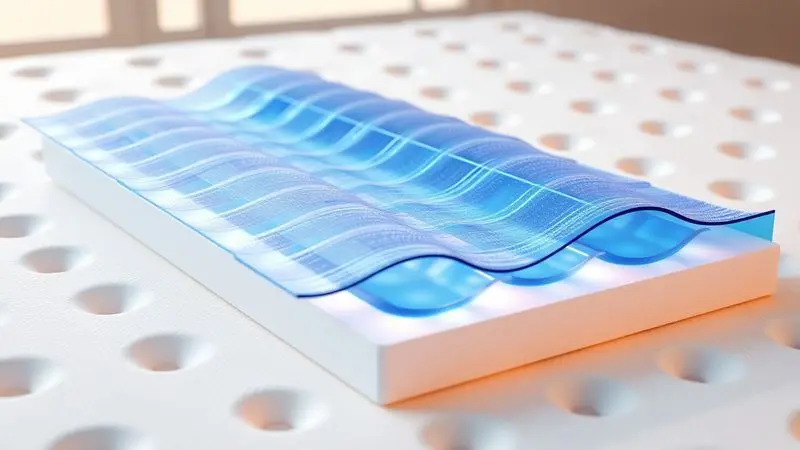

Cuidar de uma pessoa com mobilidade reduzida ou acamada envolve muito mais do que assistência física - é sobre preservar a dignidade através do conforto e saúde.

Se você já se perguntou se o colchão pneumático realmente vale a pena ou se uma espuma tradicional seria suficiente, respire fundo.

Este guia vai transformar suas dúvidas em clareza, mostrando como essa tecnologia não apenas previne lesões graves, mas resgata qualidade de vida dia após dia.

<SummaryList products={frontmatter.top_products} />

## O que é um Colchão Pneumático e Como Ele Funciona?

Imagine um colchão que respira com seu corpo. Essa é a essência do colchão pneumático: células de ar que se enchem e esvaziam em ciclos programados, criando um suporte que nunca fica estático.

É como ter uma massagem suave e constante que redistribui seu peso automaticamente, evitando que qualquer área específica da pele sofra pressão prolongada.

O sistema não apenas previne escaras, mas também estimula naturalmente a circulação sanguínea, como se gentilmente lembrasse seu corpo para manter o fluxo vital mesmo na imobilidade.

## Para Que Serve o Colchão Pneumático: Principais Indicações

O propósito vai além do equipamento médico - trata-se de transformar dias na cama em conforto real. Enquanto colchões comuns apenas suportam, o pneumático ativamente protege.

É especialmente crucial para quem passa longos períodos imobilizado, onde cada hora na mesma posição representa risco crescente para a saúde da pele.

### Prevenção e Tratamento de Escaras (Lesões por Pressão)

Quando você vê a pele intacta de quem está acamado há semanas, compreende o verdadeiro valor da prevenção. Escaras surgem silenciosamente, começando como um simples desconforto e evoluindo para lesões profundas que comprometem seriamente a recuperação.

A pressão alternada do colchão pneumático age como um cuidador invisível, mudando constantemente os pontos de apoio antes que o problema sequer comece.

Combinado com higiene adequada e observação atenta da pele, ele se torna seu aliado mais confiável na proteção contra essas complicações.

### Estímulo à Circulação Sanguínea e Drenagem Linfática

O movimento suave das células de ar faz mais do que prevenir lesões. Ele imita discretamente os micro-ajustes que nosso corpo faria naturalmente durante o sono, promovendo a circulação sanguínea mesmo na imobilidade total.

Esse fluxo melhorado significa mais oxigênio chegando aos tecidos e mais nutrientes sendo distribuídos onde são mais necessários. Paralelamente, ajuda na drenagem linfática, auxiliando na remoção de toxinas que podem se acumular durante períodos prolongados de repouso.

## Colchão Pneumático de Bolhas: Ideal para Prevenção Leve

<ProductBox 
  title={frontmatter.top_products[0].title} 
  image={frontmatter.top_products[0].image} 
  link={frontmatter.top_products[0].link} 
/>

Para situações onde o risco de escaras é moderado mas o conforto precisa ser excepcional, a tecnologia de bolhas oferece um equilíbrio perfeito.

As células maiores inflam e desinflam em ciclos tranquilos, proporcionando aquela redistribuição de pressão essencial sem tornar o ambiente hospitalar.

Você encontrará essa opção especialmente útil quando precisa de proteção robusta mas sem a complexidade de sistemas mais avançados. Alguns modelos necessitam de um compressor, então considere um canto discreto para ele que mantenha a tranquilidade do ambiente.

## Colchão Pneumático de Células: Suporte Avançado para Lesões Graves

<ProductBox 
  title={frontmatter.top_products[1].title} 
  image={frontmatter.top_products[1].image} 
  link={frontmatter.top_products[1].link} 
/>

Quando a situação exige máxima proteção, as células menores entram em cena. Sua configuração mais densa permite uma alternância mais precisa da pressão, atingindo áreas específicas com eficiência cirúrgica.

É a escolha certeira para pacientes com lesões já estabelecidas ou risco muito elevado, onde cada centímetro quadrado de pele precisa de atenção individualizada. A sensação é de flutuar suavemente, com o suporte se adaptando milimetricamente ao seu corpo a cada ciclo.

## Colchão Pneumático vs. Colchão Casca-de-Ovo: Qual Escolher?

<ProductBox 
  title={frontmatter.top_products[2].title} 
  image={frontmatter.top_products[2].image} 
  link={frontmatter.top_products[2].link} 
/>

Essa decisão reflete diferentes filosofias de cuidado. O casca-de-ovo, com seus relevos característicos, oferece conforto imediato através da distribuição estática de peso - excelente para melhorar uma cama existente ou situações de menor risco.

Já o pneumático leva o conceito adiante, criando um ambiente dinâmico que ativamente trabalha para prevenir problemas. Enquanto um depende da passividade do material, o outro incorpora a prevenção em seu funcionamento básico.

Considere: o casca-de-ovo é como ter um bom travesseiro; o pneumático é ter alguém ajustando sua posição a cada hora sem que você precise pedir.

## Vantagens e Desvantagens do Uso Contínuo

Ver alguém confortável o dia inteiro na mesma cama tem um valor emocional imensurável.

A proteção ativa contra escaras, a melhora na qualidade do sono pelo conforto adaptativo e a tranquilidade de saber que a saúde da pele está sendo preservada são vantagens que transcendem especificações técnicas.

Sim, você precisará de manutenção periódica - verificar a pressão, limpar as superfícies, assegurar que o compressor funcione silenciosamente. E sim, alguns pacientes levam algumas noites para se adaptar completamente ao novo padrão de movimento.

Mas quando você compara esse ajuste inicial com o risco evitado, a balança sempre pende para o cuidado preventivo.

## Como Usar e Instalar o Colchão Pneumático Passo a Passo

Coloque o colchão desenrolado sobre a superfície da cama, garantindo que esteja plano e alinhado. Conecte o tubo da bomba à entrada correspondente, depois ligue o aparelho na tomada.

Enquanto as células se enchem, você ouvirá um sussurro suave - é a tranquilidade entrando no quarto. Ajuste a pressura conforme a preferência do paciente, usualmente começando num nível médio.

Nas primeiras 24 horas, observe como a pele responde e faça pequenos ajustes até encontrar o equilíbrio ideal entre suporte e conforto.

## Higienização e Cuidados com o Motor: Como Fazer Durar Mais

Limpar com um pano úmido e sabão neutro após qualquer derramamento mantém o material em perfeitas condições. Para o compressor, uma aspiração suave das entradas de ar a cada quinze dias previne o acúmulo de poeira.

Verifique periodicamente se todas as células mantêm sua pressura - uma pequena queda pode indicar necessidade de ajuste.

Quando não estiver em uso, armazene em local seco, preferencialmente na posição original da embalagem para evitar vincos ou tensões desnecessárias no material.

## O que Observar Antes de Comprar: Nível de Ruído e Capacidade de Peso

Pergunte-se: este som será reconfortante ou perturbador às 3 da manhã? Teste o compressor pessoalmente se possível, ou confie em avaliações que mencionem especificamente o ruído.

Quanto à capacidade, adicione uma margem de segurança ao peso do paciente - a sobrecarga ocasional de uma mudança de posição ou ajuste de roupas deve estar dentro dos limites do equipamento.

Estas não são apenas especificações técnicas, são promessas de tranquilidade e segurança.

## Conclusão

Escolher um colchão pneumático é decidir priorizar a prevenção sobre a correção, o conforto ativo sobre a passividade. Enquanto muitos produtos de saúde reagem a problemas, esta tecnologia trabalha silenciosamente para evitar que eles sequer surjam.

Cada ciclo de inflação é um lembrete de que o cuidado com quem amamos pode ser tanto científico quanto gentil, tanto técnico quanto humano. O investimento não é apenas no equipamento, mas na paz de espírito de ver a integridade física preservada dia após dia.

Comece observando as necessidades específicas da pessoa sob seus cuidados - o nível de mobilidade, a condição atual da pele, o tempo estimado de repouso - e deixe essas informações guiarem sua escolha em direção ao conforto verdadeiro.

## FAQ: Perguntas Frequentes sobre Colchões Hospitalares

Quanto tempo dura um colchão pneumático? Com manutenção adequada, de 3 a 5 anos de uso contínuo. Posso usar sobre meu colchão comum? Sim, mas garanta que a superfície seja firme e plana para otimizar a distribuição de pressão. E se faltar energia?

Modelos com bateria de reserva mantêm a funcionalidade por horas críticas. A limpeza hospitalar padrão danifica o material? Utilize desinfetantes suaves e evite alvejantes diretos sobre as células de ar.