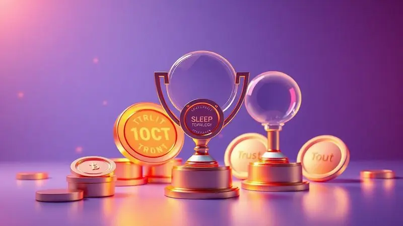

Procurar pelo colchão certo pode parecer uma missão complexa, especialmente quando sua coluna pede um cuidado especial. A linha Pro Saúde da Ortobom entende isso: ela nasceu da fusão entre tradição e inovação, oferecendo opções que vão além do simples conforto.

Se você é daqueles que precisa de uma firmeza que abrace cada curva da sua coluna, ou busca uma tecnologia que respeite o sono do seu parceiro, entender o que cada modelo traz de especial é o primeiro passo para transformar suas noites.

Vamos explorar o que faz dessa linha uma das mais procuradas do Brasil, desde a firmeza acolhedora até as certificações que garantem sua tranquilidade.

<SummaryList products={frontmatter.top_products} />

## Conheça o Colchão Pro Saude Extra

<ProductBox 
  title={frontmatter.top_products[0].title} 
  image={frontmatter.top_products[0].image} 
  link={frontmatter.top_products[0].link} 
/>

Imagine acordar sentindo que sua coluna agradece cada hora de descanso. É essa sensação que o Pro Saúde Extra entrega, combinando uma estrutura robusta com o equilíbrio perfeito entre firmeza e conforto.

A espuma Extra Firme Selada (D33) é o coração desse modelo, criando uma base que previne dores posturais sem sacrificar o aconchego.

Seu revestimento em tecido malha de poliéster adiciona uma camada de maciez que acolhe sua pele, enquanto o bordado em Matelassê não só embeleza o design, mas também permite que o colchão respire melhor durante a noite.

Para quem sempre priorizou a saúde da coluna, essa firmeza é um abraço reconfortante.

Pode ser que nos primeiros dias você sinta uma diferença marcante se está acostumado com superfícies mais macias, mas é justamente essa adaptação que seu corpo precisa para encontrar sua posição ideal de descanso.

É o tipo de investimento que se paga todas as manhãs, quando você se levanta revigorado.

<CaixaProsContras>

**Prós:**

- Suporte firme que ajuda na prevenção de dores posturais.

- Revestimento em tecido malha que proporciona conforto.

- Design elegante com bordado em Matelassê.

- Alta durabilidade devido à qualidade dos materiais.

**Contras:**

- Firmeza excessiva pode não agradar a todos.

- Pode exigir um período de adaptação para alguns usuários.

</CaixaProsContras>

### Certificações Inmetro do Modelo Extra

Quando você escolhe um colchão, está confiando sua saúde a ele por anos. É por isso que o selo do Inmetro no modelo Extra não é apenas um adesivo, mas um compromisso.

Essa certificação assegura que cada centímetro do colchão passou por testes rigorosos de qualidade, durabilidade e segurança.

Pense nisso como um parceiro silencioso que trabalha enquanto você descansa, garantindo que o apoio que você recebe hoje será o mesmo daqui a cinco anos.

A tradição da Ortobom se reflete nesse cuidado com os detalhes, transformando normas técnicas em tranquilidade para seu sono.

## Conheça o Colchão Pró Saúde Ortopédico

<ProductBox 
  title={frontmatter.top_products[1].title} 
  image={frontmatter.top_products[1].image} 
  link={frontmatter.top_products[1].link} 
/>

Se o Extra é a firmeza que acolhe, o modelo Ortopédico é o cuidado que corrige. Desenvolvido especificamente para quem busca não apenas conforto, mas um verdadeiro realinhamento postural, ele atua como um terapeuta noturno para sua coluna.

A camada adicional de espuma firme cria uma base inteligente que se adapta aos seus pontos de pressão, oferecendo suporte onde você mais precisa e maciez onde seu corpo pede alívio.

O tratamento antibacteriano integrado ao tecido é como ter um guardião invisível trabalhando a seu favor, protegendo seu sono contra agentes que poderiam comprometer a higiene e durabilidade do colchão. E aqui está o melhor: essa linha oferece uma jornada personalizada.

Se após experimentar a firmeza ortopédica você sentir que precisa de algo diferente, há opções que vão desde o ultra firme até tecnologias viscoelásticas que abraçam seu corpo de forma única.

<CaixaProsContras>

**Prós:**

- Suporte ortopédico que melhora o alinhamento da coluna.

- Diversidade de modelos para atender diferentes preferências.

- Tratamentos antibacterianos que garantem maior higiene.

- Molas ensacadas em alguns modelos que minizam a transferência de movimento.

**Contras:**

- A variedade pode ser confusa para quem não tem certeza do que precisa.

- Alguns modelos podem ser mais firmes do que o esperado para quem prefere colchões mais macios.

</CaixaProsContras>

## Conheça o Colchão Pró Saúde Superpocket

<ProductBox 
  title={frontmatter.top_products[2].title} 
  image={frontmatter.top_products[2].image} 
  link={frontmatter.top_products[2].link} 
/>

Você já acordou porque seu parceiro se virou na cama? Essa pequena interrupção do sono tem fim com o Superpocket.

Sua tecnologia de molas ensacadas individualmente é um milagre da engenharia do descanso: cada mola trabalha de forma independente, contornando seu corpo com precisão enquanto isola completamente os movimentos ao seu lado.

É a solução perfeita para casais com ritmos de sono diferentes, ou para quem simplesmente se mexe muito durante a noite.

Mas o Superpocket vai além da paz conjugal. Seu tratamento antimicrobiano e antiácaro cria uma barreira protetora invisível, enquanto o sistema de ventilação interna mantém o colchão respirando frescor a noite toda.

As espumas de alta densidade garantem que, mesmo com toda essa tecnologia, o suporte para sua coluna permanece impecável. Uma observação importante: ele vem com a tecnologia "No Turn", o que significa que você nunca precisará virá-lo.

Para alguns, isso é praticidade; para outros que gostam de rotacionar regularmente, pode ser uma adaptação a considerar.

<CaixaProsContras>

**Prós:**

- Molas ensacadas que reduzem a transferência de movimento

- Tratamento antimicrobiano para maior higiene

- Ventilação interna mantendo o colchão fresco

- Suporte adequado para o alinhamento da coluna

**Contras:**

- Não é possível rotacionar, limitando opções de cuidado

- Pode exigir um investimento inicial maior devido à tecnologia

</CaixaProsContras>

## Prêmios e certificações recebidas pela Ortobom

Escolher uma marca com história não é sobre nostalgia, é sobre confiança construída ano após ano. A Ortobom carrega essa tradição não apenas em seu nome, mas em cada prêmio e certificação que acumulou.

O selo do Inmetro que você viu nos modelos específicos é parte de um compromisso maior que permeia toda a linha. Essas conquistas não são apenas troféus em uma estante, são testemunhos de inovação que surgiu da escuta atenta às necessidades reais das pessoas.

Quando uma marca é reconhecida repetidamente pela satisfação do cliente e pela qualidade de seus produtos, ela está fazendo mais do que vender colchões, está cultivando relacionamentos baseados em resultados tangíveis.

Cada certificação é uma promessa cumprida, cada prêmio é um feedback transformado em melhoria. É essa filosofia que faz com que, ao optar por um Pro Saúde, você esteja escolhendo não apenas um produto, mas todo um ecossistema de cuidado com seu descanso.

## Conclusão

A busca pelo colchão ideal sempre começa com uma pergunta: o que minha coluna realmente precisa? A linha Pro Saúde da Ortobom transforma essa pergunta em um leque de respostas personalizadas.

Seja a firmeza terapêutica do Extra, o cuidado ortopédico especializado ou a tecnologia inteligente do Superpocket, cada modelo foi pensado para resolver uma necessidade específica do seu descanso.

O que une todos eles, porém, vai além das especificações técnicas. É a tradição de uma marca que entende que dormir bem não é luxo, é necessidade. São as certificações que garantem que seu investimento terá retorno todas as manhãs.

É a segurança de saber que, por trás do tecido e das espumas, há décadas de experiência ouvindo o que os corpos brasileiros precisam para descansar melhor.

Sua próxima noite de sono não precisa ser mais uma adaptação. Pode ser a descoberta do apoio perfeito, da firmeza que acolhe, da tecnologia que respeita seu ritmo.

Conhecer a linha Pro Saúde é o primeiro passo para transformar seu quarto em um santuário do descanso verdadeiro, onde cada detalhe trabalha harmoniosamente para que você acorde renovado, todos os dias.