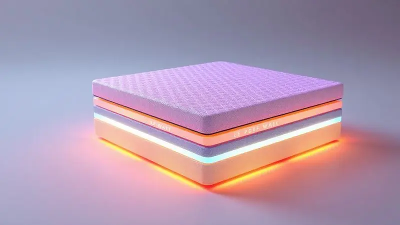

A escolha de um novo colchão é uma decisão que impacta diretamente na sua saúde e disposição diária.

Entre tantas opções no mercado brasileiro, a Prorelax se destaca como uma alternativa frequente em lojas físicas e e-commerces, mas será que o colchão Prorelax é bom de fato?

Imagine acordar sem aquela dor nas costas que persegue você há meses, ou encontrar o equilíbrio perfeito entre firmeza e aconchego.

Nesta análise detalhada, mergulhamos no portfólio da marca, avaliando desde as tecnologias exclusivas de molas Megacoil até a densidade das espumas.

Se você está em dúvida entre um modelo Jade, Bali ou Mediterrâneo, ou quer saber se a Prorelax supera a Ortobom, preparamos este guia completo para responder a todas as suas perguntas e ajudar você a dormir melhor em 2025.

<SummaryList products={frontmatter.top_products} />

## Conheça a Marca Prorelax

Quando você fecha os olhos à noite, confia que o que está sob você realmente importa? A Prorelax entende que sim. Mais do que uma marca de colchões, é uma empresa que transformou a ciência do sono em soluções palpáveis.

Ela nasceu com um propósito claro: oferecer não apenas um lugar para deitar, mas um santuário para se recuperar.

Com uma gama que vai desde colchões ortopédicos que abraçam sua coluna até modelos de espuma que se moldam às suas curvas, a Prorelax fala diretamente com quem valoriza o amanhecer sem dores.

Cresceu ouvindo os consumidores, priorizando a durabilidade que resiste aos anos e o desempenho que não decepciona na segunda, terceira ou décima milésima noite.

## Como escolhemos os melhores colchões Prorelax?

Para transformar essa jornada em algo mais que uma lista de especificações, adotamos uma abordagem que mistura técnica com experiência real.

Primeiro, investigamos os materiais como um detetive: não apenas o que está escrito na etiqueta, mas como cada espuma responde ao corpo, como cada mola conversa com sua postura.

Depois, ouvimos histórias: mergulhamos em avaliações de pessoas que já dormem (ou não dormem) sobre esses colchões há meses ou anos, buscando a verdade além do marketing.

Também consideramos como cada modelo se adapta ao seu ritual noturno: se você dorme de lado como um feto, de barriga como um mergulhador ou de costas como um soldado em descanso.

Por fim, analisamos as garantias e políticas como um advogado do seu sono, garantindo que você tenha tempo para realmente se apaixonar pelo colchão antes do compromisso final.

## Tecnologias e Diferenciais da Prorelax

Antes de conhecer os modelos, é essencial entender a língua que a Prorelax fala. Esta marca não apenas fabrica colchões, mas constrói ecossistemas de descanso com tecnologias pensadas para o corpo humano.

### Espuma Prorelax e Densidades

Pense na densidade como a personalidade do colchão. As espumas da Prorelax variam de D18 a D45, e cada número conta uma história diferente.

Densidades mais altas, como a D45, são como aqueles amigos firmes que não deixam você afundar - ideais para quem precisa de apoio sólido para a coluna ou tem um peso mais elevado.

Densidades médias, como a D33, são o equilíbrio perfeito: acolhem sem engolir, oferecendo suporte sem sacrificar o conforto.

E o segredo não está apenas na firmeza, mas na inteligência desses materiais que permitem a ventilação, mantendo você fresco mesmo nas noites mais quentes.

### Tipos de Molas: Ensacadas, Bonnel e Megacoil

As molas são o esqueleto do seu colchão, e a Prorelax domina essa anatomia.

As ensacadas individuais são como células independentes: cada uma responde ao peso exatamente sobre ela, oferecendo suporte personalizado e reduzindo aquele incômodo balanço quando seu parceiro se vira na cama.

As tradicionais Bonnel oferecem firmeza consistente, como uma base sólida que nunca vacila.

Já as Megacoil representam a evolução: combinam a adaptabilidade das ensacadas com a robustez das Bonnel, criando uma experiência híbrida que se ajusta ao seu corpo enquanto mantém a integridade estrutural.

### Revestimentos e Pillow Top

Enquanto as espumas e molas trabalham internamente, o toque final vem das camadas que você sente.

Os revestimentos da Prorelax são pensados para ser mais do que bonitos - são respiráveis, permitindo que o ar circule e evitando aquela sensação abafada que arruína um sono profundo.

O pillow top é como o beijo de boa noite: uma camada extra de maciez que envolve os pontos de pressão do seu corpo - quadris, ombros, joelhos - distribuindo o peso como um abraço perfeito. Não é apenas conforto, é carinho materializado.

## Análise Detalhada dos Melhores Modelos de Colchão Prorelax

Com esse entendimento técnico, vamos aos personagens principais: os modelos que realmente farão parte das suas noites. Cada um tem uma personalidade única, projetada para conversar com necessidades específicas.

### 1. Colchão Queen Size Jade Prorelax

<ProductBox 
  title={frontmatter.top_products[0].title} 
  image={frontmatter.top_products[0].image} 
  link={frontmatter.top_products[0].link} 
/>

Para quem busca a solidez de um abraço firme que dura anos, o Jade Queen Size é como aquele amigo confiável que nunca falha.

Com sua densidade D-45, ele suporta até 130 kg por pessoa sem perder a postura, oferecendo uma base sólida ideal para quem acorda com dores nas costas e precisa de apoio consistente. Com 20 cm de altura e acabamento bordado, entrega elegância sem fazer alarde.

O que você precisa saber é que este modelo foca em firmeza pura: não possui pillow top nem tratamentos especiais. É para quem prefere a sensação direta do suporte, sem camadas intermediárias.

Imagine sair da cama sentindo sua coluna alinhada como após uma sessão de fisioterapia.

<CaixaProsContras>

**Prós:**

- Alta densidade e resistência (D-45).

- Suporta até 130 kg por pessoa.

- Nível de conforto firme.

- Certificado pelo Inmetro.

**Contras:**

- Não possui pillow top.

- Não é ortopédico, antialérgico ou antifungo.

</CaixaProsContras>

### 2. Colchão Solteiro Jade Bordado Preto D45

<ProductBox 
  title={frontmatter.top_products[1].title} 
  image={frontmatter.top_products[1].image} 
  link={frontmatter.top_products[1].link} 
/>

A versão solteiro mantém a essência firme do Jade, mas com um charme adicional: o acabamento bordado em preto que transforma o colchão em peça de decoração.

Com 18 cm de altura e medidas de 88x188 cm, é o companheiro perfeito para quartos compactos ou quem valoriza a privacidade do sono individual.

A espuma D-45 garante que, mesmo com dimensões reduzidas, o suporte não seja negociado - suporta até 120 kg. A firmeza é presente, então se você sonha com a sensação de afundar em uma nuvem, este não será seu modelo.

Mas se busca estabilidade que dura anos sem deformar, ele será seu aliado noturno.

<CaixaProsContras>

**Prós:**

- Conforto firme ideal para suporte do corpo.

- Alta resistência e durabilidade.

- Estética agradável com acabamento bordado.

- Certificação do Inmetro em alguns modelos, garantindo qualidade.

**Contras:**

- Firmeza pode não agradar todos os gostos.

- Pode ser menos confortável para quem prefere colchões mais macios.

</CaixaProsContras>

### 3. Colchão Prorelax Mediterrâneo

<ProductBox 
  title={frontmatter.top_products[2].title} 
  image={frontmatter.top_products[2].image} 
  link={frontmatter.top_products[2].link} 
/>

Este é para quem acredita que sono de qualidade merece tecnologia avançada.

As molas ensacadas individualmente são o grande diferencial: cada uma trabalha independentemente, adaptando-se ao seu formato específico e minimizando a transferência de movimento - perfeito para casais com ritmos diferentes de sono.

Com altura entre 32 cm e 36 cm, ele impõe presença no quarto, e sua espuma D-45 suporta até 140 kg por lado.

O verdadeiro luxo está nos detalhes: tratamentos antimofo, antifungos e antiácaros que criam um ambiente saudável, e a praticidade do sistema Euro Pillow Turn Free - você só precisa girá-lo ocasionalmente, nunca virá-lo completamente.

<CaixaProsContras>

**Prós:**

- Estrutura de molas ensacadas para maior conforto.

- Espuma D-45 oferece excelente firmeza.

- Tratamentos antialérgicos garantem um sono saudável.

- Não precisa ser virado, apenas girado, facilitando os cuidados.

**Contras:**

- Pode ser alto para espaços pequenos.

- É uma opção que pode não agradar quem prefere colchões mais macios.

</CaixaProsContras>

### 4. Colchão Prorelax Bali

<ProductBox 
  title={frontmatter.top_products[3].title} 
  image={frontmatter.top_products[3].image} 
  link={frontmatter.top_products[3].link} 
/>

Imagine um colchão que entende que duas pessoas dividem a cama, mas não necessariamente o mesmo tipo de sono.

O Bali resolve isso com maestria: suas molas ensacadas oferecem suporte personalizado para cada lado, enquanto o pillow top duplo adiciona uma camada extra de aconchego que dura anos sem aplainar.

O revestimento em malha é uma carícia para a pele - macio e respirável, evitando aquela sensação pegajosa nas noites quentes.

Com conforto intermediário, ele funciona como um diplomata do descanso: agrada quem gosta de firmeza e quem prefere maciez em doses equilibradas.

<CaixaProsContras>

**Prós:**

- Conforto personalizado com molas ensacadas.

- Pillow top duplo aumenta a durabilidade.

- Revestimento em malha macio e respirável.

- Disponível em várias medidas e suportes de peso.

**Contras:**

- Preço pode ser mais alto comparado a outras marcas.

- Conforto intermediário pode não agradar a todos.

</CaixaProsContras>

### 5. Colchão Prorelax D33

<ProductBox 
  title={frontmatter.top_products[4].title} 
  image={frontmatter.top_products[4].image} 
  link={frontmatter.top_products[4].link} 
/>

O equilíbrio perfeito entre investimento e qualidade, o D33 é a escolha inteligente para quem não quer comprometer o orçamento nem o sono.

Com densidade D33, oferece firmeza suficiente para apoiar sua coluna (suporta até 100-120 kg por pessoa) sem ser excessivamente rígido.

Sua vida útil de 5 a 7 anos (podendo chegar a 10 com cuidados) fala sobre a qualidade dos materiais de alta densidade. O revestimento em poliéster com proteção contra ácaros e fungos cria uma barreira invisível de saúde.

É o colchão que entrega o que promete, sem surpresas desagradáveis.

<CaixaProsContras>

**Prós:**

- Bom equilíbrio entre conforto e suporte.

- Durabilidade de até 10 anos.

- Ideal para quem prefere colchões mais firmes.

- Proteção contra ácaros e fungos.

**Contras:**

- Pode perder um pouco da firmeza com o tempo.

- Respostas às reclamações no Reclame Aqui nem sempre são rápidas.

</CaixaProsContras>

### 6. Colchão para Berço Liso Branco Prorelax

<ProductBox 
  title={frontmatter.top_products[5].title} 
  image={frontmatter.top_products[5].image} 
  link={frontmatter.top_products[5].link} 
/>

Quando o assunto é o sono do seu bebê, cada detalhe importa. Este modelo traduz cuidado em espuma: densidade D18 que equilibra firmeza necessária para o desenvolvimento ósseo com a maciez que aconchega.

O tratamento triplo (anti-ácaro, anti-mofo e anti-alérgico) transforma o berço em uma bolha de proteção.

A impermeabilidade de um lado é o salva-vidas para os acidentes inevitáveis da infância, enquanto as medidas padrão (130x60 cm ou 130x70 cm) garantem encaixe perfeito na maioria dos berços. É a segurança materializada para as noites do seu maior tesouro.

<CaixaProsContras>

**Prós:**

- Conforto balanceado entre firmeza e suavidade.

- Tratamento anti-ácaro, anti-mofo e anti-alérgico.

- Fácil manutenção com proteção impermeável.

- Disponível em dimensões padrão para berços.

**Contras:**

- Variação nas especificações de peso suportado.

- Pode exigir cuidados na escolha do modelo ideal.

</CaixaProsContras>

### 7. Colchão Solteiro Prorelax D20

<ProductBox 
  title={frontmatter.top_products[6].title} 
  image={frontmatter.top_products[6].image} 
  link={frontmatter.top_products[6].link} 
/>

Economia sem sacrificar o conforto essencial: assim é o D20. Com densidade que oferece maciez acolhedora, é ideal para camas de visita, quartos de adolescentes ou quem tem peso mais leve (até 60 kg).

O sistema de girar e virar aumenta a durabilidade, estendendo sua vida útil.

A Prorelax usa espumas fabricadas internamente, garantindo controle de qualidade em cada etapa. Apenas atenção às dimensões: alguns modelos como o Violeta têm 78 cm de largura, ligeiramente abaixo do padrão.

Mas para uso ocasional ou específico, representa valor inteligente.

<CaixaProsContras>

**Prós:**

- Confortável e econômico, ideal para uso ocasional.

- Sistema que aumenta a durabilidade do colchão.

- Boa reputação da marca.

- Variedade de opções de espuma.

**Contras:**

- Densidade D20 pode não suportar bem adultos mais pesados.

- Dimensões menores em alguns modelos podem não atender ao padrão esperado.

</CaixaProsContras>

## Qual a reputação da Prorelax no Reclame Aqui?

Antes de investir, você quer saber: a marca cumpre o que promete? No Reclame Aqui, a Prorelax mostra um compromisso com a resolução: a maioria das reclamações recebe respostas satisfatórias, indicando uma empresa que não foge do diálogo.

As notas variam, mas o padrão é de atendimento eficaz quando problemas surgem. Como qualquer relação de longo prazo, há altos e baixos, mas a tendência aponta para uma marca que ouve seus clientes e ajusta a rota quando necessário. A lição?

Consulte as avaliações recentes para ter uma fotografia atual do relacionamento entre a empresa e quem realmente dorme sobre seus produtos.

## FAQ: Principais dúvidas sobre a marca

No momento da decisão, perguntas específicas surgem. Vamos esclarecer as mais frequentes, transformando dúvidas em certezas.

### Prorelax ou Ortobom: qual a melhor escolha?

Esta comparação é como escolher entre dois bons amigos: ambos têm qualidades, mas um conversa melhor com sua personalidade.

A Prorelax brilha no custo-benefício e nas tecnologias modernas de alívio de pressão - é a escolha contemporânea, focada em inovação e adaptação ao corpo. A Ortobom traz a tradição e a variedade consolidada - é a segurança do conhecido, com opções testadas pelo tempo.

A decisão final mora nas suas necessidades pessoais: se você valoriza tecnologias recentes e uma abordagem mais anatômica do sono, a Prorelax sussurra seu nome. Se prefere a solidez de uma marca histórica com variedade ampla, a Ortobom acena.

Ambas respeitam seu descanso, apenas com sotaques diferentes.

### A Prorelax Colchões é confiável?

Confiança se constrói com consistência, e a Prorelax vem tecendo essa reputação linha por linha. A marca investe em materiais que duram, tecnologias que realmente funcionam e uma variedade que reconhece que corpos são únicos.

Avaliações de usuários frequentemente destacam a experiência positiva não apenas com o produto inicial, mas com o desempenho ao longo dos anos.

É a confiabilidade que vem da transparência: sabendo exatamente quais tecnologias estão no seu colchão, qual densidade o sustenta, quais tratamentos o protegem.

Quando uma empresa te dá essas informações claramente, está dizendo "confie em nós, sabemos o que estamos fazendo".

## Conclusão

Deitar-se em um colchão Prorelax é mais que descansar - é permitir que sua coluna respire aliviada, que seus ombros soltem tensões acumuladas, que seu corpo encontre o equilíbrio que busca inconscientemente a cada noite.

Ao longo desta análise, descobrimos que a marca não vende apenas espuma e molas; vende noites transformadas em manhãs revigoradas.

Seja no Jade firme que sustenta com determinação, no Mediterrâneo tecnológico que abraça com inteligência, ou no Bali diplomata que equilibra necessidades distintas, há um Prorelax conversando com sua forma única de dormir.

A questão inicial "será que o colchão Prorelax é bom?" se transforma em outra pergunta mais profunda: qual modelo fala a linguagem do seu corpo?

O valor real não está apenas no preço ou nas especificações técnicas, mas na promessa cumprida de acordar renovado. A Prorelax entrega essa promessa com consistência, oferecendo não um produto, mas um parceiro de descanso para os próximos anos.

Agora, com todas as informações em mãos, você pode fechar os olhos e escolher com a certeza de que, qualquer que seja a opção, estará investindo em noites que realmente importam. Seu próximo amanhecer sem dores começa com esta decisão.