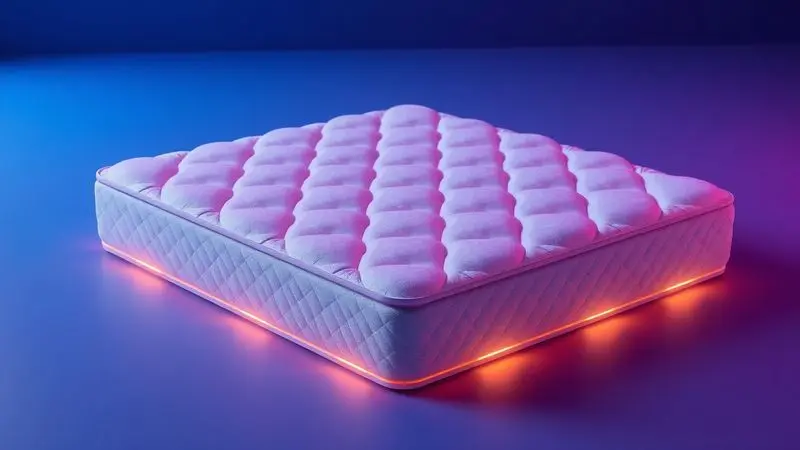
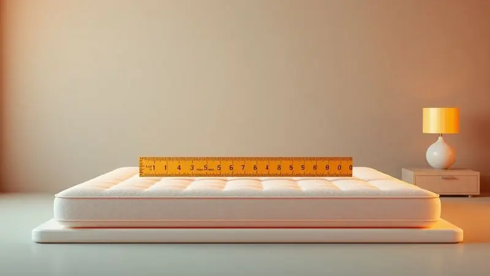
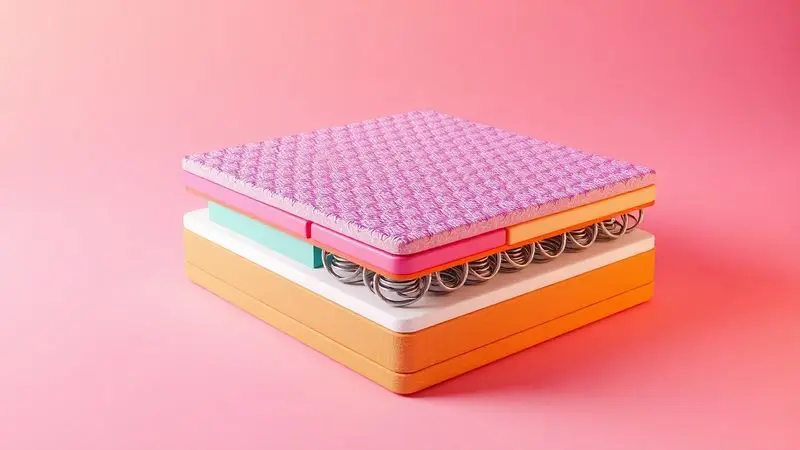

Você sabia que passamos cerca de um terço da nossa vida sobre um colchão? Essa estatística ganha vida quando você acorda com dores nas costas, espirra sem parar ou simplesmente sente que o descanso não vem.

O culpado pode estar exatamente debaixo de você, mudo, mas falando alto através do seu cansaço.

Neste guia, você vai descobrir os 7 sinais silenciosos de que seu santuário do sono virou um problema, aprender testes instantâneos para diagnóstico caseiro e escolher o substituto ideal para transformar suas noites em verdadeiros banhos de energia para sua coluna.

<SummaryList products={frontmatter.top_products} />

## Por que a vida útil do colchão e travesseiro é limitada?

Imagine um atleta de alta performance. Com o tempo, seus músculos perdem tonicidade, suas articulações desgastam. Seu colchão e travesseiro passam por algo parecido: são atletas silenciosos que trabalham 8 horas por noite, ano após ano.

Os materiais que um dia abraçaram sua coluna perdem elasticidade, as camadas de conforto se compactam, e o que era suporte torna-se uma superfície sem alma. Mas não é apenas o desgaste físico.

Com os anos, esses companheiros noturnos acumulam histórias invisíveis: umidade, ácaros, bactérias que transformam seu refúgio em um ambiente hostil para suas vias respiratórias.

A média técnica recomenda trocar o colchão a cada 7 a 10 anos e o travesseiro a cada 2 a 3 anos, mas seu corpo pode estar pedindo socorro muito antes disso.

## 7 Sinais de alerta: Como saber se está na hora de trocar o colchão?

Seu corpo é o melhor detector de problemas do mundo. Ele não usa manuais técnicos, nem datas de validade. Ele simplesmente sinaliza, através de desconfortos sutis ou gritantes, que algo está errado. Esses sinais falam uma linguagem simples: dor, cansaço, irritação.

E eles estão aqui, agora, esperando que você pare de ignorá-los.

### 1. Afundamentos, buracos ou deformidades visíveis

Coloque um copo d'água na superfície da sua cama. Ele rola para o lado ou fica estável? Um colchão saudável é como um lago tranquilo na manhã sem vento.

Quando aparecem valas onde seu quadril repousa, ou montanhas onde não deveria haver elevação, o material interno já capitulou. Essas deformidades não são apenas estéticas.

Elas obrigam sua coluna a se contorcer em posições antinaturais durante horas, como dormir em uma rede mal esticada. O resultado você sente ao tentar se levantar, com aquela rigidez que parece grudada nos ossos.

### 2. Dores matinais na lombar, pescoço ou ombros

Acordar deveria ser um renascimento suave, não uma sessão de fisioterapia improvisada. Quando sua lombar protesta, seu pescoço parece travado, ou seus ombros carregam peso invisível, seu sistema de suporte falhou.

Um colchão muito firme empurra seus pontos de pressão como pedras. Um excessivamente macio deixa sua coluna sem referência, como nadar sem ver o fundo. E o travesseiro? Se ele não abraça seu pescoço no ângulo certo, você passa a noite lutando contra a gravidade.

Essas dores são cartas de resgate do seu corpo, dizendo que a arquitetura do seu sono está comprometida.

### 3. Alergias, rinites e crises respiratórias ao deitar

O momento de deitar na cama deveria trazer alívio, não um concerto de espirros. Se seu nariz coça, seus olhos ardem ou sua respiração fica pesada assim que a cabeça encosta no travesseiro, você não está apenas enfrentando alergias sazonais.

Seu colchão e travesseiro podem ter se transformado em ecossistemas microscópicos, com milhões de ácaros fazendo festa nos restos de pele, suor e umidade acumulados ao longo dos anos.

Trocar para opções hipoalergênicas não é apenas uma questão de conforto, mas de respirar liberdade novamente.

### 4. Ruídos metálicos e sensação de "molas soltas"

Seu colchão não deveria ter trilha sonora. Aqueles estalos metálicos ao virar, aquela sensação de que algo se move dentro quando você se acomoda, são os gemidos de um esqueleto cansado.

As molas que um dia dançavam em sincronia perfeita agora rangem sem ritmo, perdendo a capacidade de distribuir peso uniformemente. Dormir sobre isso é como tentar descansar em um barco com remos quebrados, balançando sem direção a cada movimento.

### 5. Você sente os movimentos da pessoa ao lado mais do que antes

Lembra quando você podia dormir ao lado de alguém e nem perceber quando ela saía da cama? Se hoje cada virada do parceiro parece um pequeno terremoto, seu colchão perdeu sua capacidade de amortecimento.

Ele não absorve mais os movimentos, transmitindo cada agitação diretamente para seu lado. Isso fragmenta seu sono em pedacinhos, fazendo você acordar múltiplas vezes sem nem entender por quê. A intimidade do compartilhar a cama não deveria incluir compartilhar insônia.

### 6. Fadiga e sono fragmentado sem causa aparente

Você dorme 8 horas, mas acorda como se tivesse corrido uma maratona noturna. Seu sono é cheio de brechas, acordadas rápidas, posições que você muda constantemente buscando conforto que nunca vem. Isso não é cansaço normal.

É seu corpo tentando se adaptar a uma superfície que não colabora mais. Um colchão desgastado não permite que você entre nas fases profundas do sono, aquelas que realmente reparam tecidos, consolidam memórias e recarregam energia.

Você passa a noite na superfície do descanso, sem jamais mergulhar nele.

### 7. O prazo de validade técnica expirou

Alguns produtos têm data de validade estampada. Seu colchão tem uma silenciosa, marcada não em embalagem, mas na experiência de quem dorme sobre ele.

Mesmo que não mostre sinais visíveis, depois de 7 a 10 anos (ou 1 a 3 para travesseiros), os materiais perdem até 75% de suas propriedades originais.

É como usar um tênis de corrida com a entressola completamente compactada: ainda parece um tênis, mas não cumpre mais sua função. Além do desgaste estrutural, o acúmulo de alérgenos atinge níveis que nenhuma aspiração doméstica consegue reverter.

## Teste Prático: O "Teste da Régua" e do Alinhamento em 5 minutos

Mas como ter certeza além das suspeitas? Dois testes simples, feitos em menos de 5 minutos, podem dar clareza científica ao seu palpite. Primeiro, o teste da régua: pegue qualquer objeto reto (uma régua, uma revista, até uma tábua de corte) e coloque sobre o colchão.

Se ele não toca toda a superfície, se há espaços onde a luz passa por baixo, você tem um mapa topográfico do desgaste. Agora, deite-se em sua posição preferida. Peça para alguém observar: sua coluna forma uma linha suave, ou há quedas bruscas nos quadris e ombros?

Esse alinhamento não é apenas estética corporal. É a diferença entre acordar renovado ou desmontado.

## Qual a validade média de cada tipo de colchão?

<ProductBox 
  title={frontmatter.top_products[0].title} 
  image={frontmatter.top_products[0].image} 
  link={frontmatter.top_products[0].link} 
/>

Nem todos os colchões envelhecem da mesma forma. É como comparar um carro esportivo com um SUV: ambos são veículos, mas suas trajetórias de desgaste são diferentes. Os de espuma tradicional têm uma vida entre 5 a 10 anos, com os mais densos (D45) resistindo mais tempo.

Já os de molas, especialmente as Bonnel, podem durar de 8 a 12 anos, oferecendo uma firmeza que se mantém, mas com uma transferência de movimento que aumenta com o tempo.

Os verdadeiros campeões da longevidade são os colchões de látex, que mantêm sua resiliência por 10 a 15 anos, alguns chegando a ultrapassar duas décadas de serviço fiel.

Os viscoelásticos, esses adaptáveis por excelência, seguem uma média similar aos de espuma, de 7 a 10 anos. Mas lembre-se: essas são expectativas técnicas. Seu corpo, seu peso, seus hábitos de sono escrevem a história real do seu colchão.

### Colchões de Espuma (D28, D33, D45)

<ProductBox 
  title={frontmatter.top_products[1].title} 
  image={frontmatter.top_products[1].image} 
  link={frontmatter.top_products[1].link} 
/>

Esses números não são apenas especificações técnicas. São níveis diferentes de abraço para sua coluna. O D28 (28 kg/m³) é o abraço aconchegante, ideal para quem busca equilíbrio sem extremos.

O D33 (33 kg/m³) é o abraço firme, que segura com convicção, mantendo sua postura ano após ano. Já o D45 (45 kg/m³) é o abraço terapêutico, para quem precisa de suporte extra porque sua coluna já enfrentou batalhas.

Colchões mais densos podem parecer menos acolhedores no primeiro contato, mas são aqueles amigos que não te deixam na mão quando você mais precisa.

### Colchões de Molas Ensacadas e Bonnel

<ProductBox 
  title={frontmatter.top_products[2].title} 
  image={frontmatter.top_products[2].image} 
  link={frontmatter.top_products[2].link} 
/>

Aqui está a diferença entre sentir cada movimento do parceiro e dormir como se estivesse em uma nuvem isolada. As molas Bonnel são como uma rede de amigos que conversam entre si: quando um se move, todos sentem. São duráveis, econômicas, mas compartilham inquietações.

Já as molas ensacadas (pocket) são individualistas no melhor sentido: cada uma trabalha independentemente, abraçando seus contornos sem perturbar quem está ao lado.

Sim, essa tecnologia custa mais, mas o que você economiza em noites de sono ininterruptas vale cada centavo a mais.

## Não esqueça do travesseiro: Sinais de que ele virou um vilão

<ProductBox 
  title={frontmatter.top_products[3].title} 
  image={frontmatter.top_products[3].image} 
  link={frontmatter.top_products[3].link} 
/>

Seu travesseiro deveria ser o abraço final antes do sono, não o inimigo sorrateiro que mina seu descanso. O primeiro sinal de traição? Um cheiro persistente que sobrevive a lavagens, o perfume da decomposição de bactérias e ácaros.

Depois, a forma: se ele não mantém a postura, se forma caroços como terrenos acidentados, perdeu a capacidade de sustentar sua cabeça no ângulo certo.

Alergias que surgem do nada, pele que coça ao deitar, aquela dor no pescoço que parece brotar do travesseiro. Especialistas recomendam troca a cada 1 a 2 anos (travesseiros de viscoelástica podem ir um pouco além), mas seu pescoço é o cronômetro mais preciso que existe.

### O teste da dobra para travesseiros de espuma e fibra

<ProductBox 
  title={frontmatter.top_products[4].title} 
  image={frontmatter.top_products[4].image} 
  link={frontmatter.top_products[4].link} 
/>

Um teste de 10 segundos que pode economizar meses de desconforto. Dobre seu travesseiro ao meio como se fosse fechar um livro. Solte. Ele deve voltar ao formato original com a velocidade de uma memória feliz.

Se ele hesita, se fica marcado pela dobra, se demora a se recompor, perdeu a resiliência que seu pescoço precisa. Mesmo os travesseiros de fibra siliconada, que mantêm a maciez por mais tempo, eventualmente entregam os pontos.

A National Sleep Foundation não recomenda a troca periódica por acaso, mas porque sabe que um travesseiro cansado é uma sentença para pescoços doloridos.

## 5 Dicas de especialista para fazer seu colchão durar mais

<ProductBox 
  title={frontmatter.top_products[5].title} 
  image={frontmatter.top_products[5].image} 
  link={frontmatter.top_products[5].link} 
/>

Seu colchão é um investimento em saúde. Tratá-lo bem é garantir que esse investimento renda juros de conforto. Primeiro: gire e vire ele a cada 3 a 6 meses. É como alternar os pneus do carro, distribuindo o desgaste. Segundo: vista-o com um protetor de qualidade.

Essa capa não é apenas contra manchas. É um escudo contra ácaros, umidade e desgaste prematuro.

Terceiro: aspire-o regularmente. Não espere ver poeira. Quarto: deixe-o respirar. Ao trocar os lençóis, deixe-o descoberto por algumas horas. É o banho de sol interno. Quinto e crucial: verifique sua base ou cama box.

Uma base comprometida deforma até o melhor colchão, como sapatos ruins estragam os pés mais bem cuidados.

## Como escolher o colchão substituto: Guia de Densidade e Estrutura

Escolher um novo colchão não é sobre preferência superficial. É sobre entender a linguagem do seu corpo. Densidade (kg/m³) é firmeza em números, mas você precisa traduzi-la para sensação.

Pessoas mais pesadas geralmente precisam de mais densidade para evitar afundamentos. Pessoas com dores podem buscar os adaptativos viscoelásticos.

Pense em como você dorme: de lado precisa de mais adaptabilidade nos ombros e quadris. De barriga para cima precisa de firmeza média para manter a coluna neutra. De bruços (raros corajosos) precisa de algo muito firme para evitar hiperextensão lombar.

E não subestime o fator calor: alguns materiais retêm mais calor que outros. Seu novo colchão não deve apenas suportar, mas dialogar com suas noites inteiras.

## Onde e como descartar seu colchão velho de forma ecológica?

Trocar o colchão é um ato de autocuidado. Descartá-lo corretamente é um ato de cuidado coletivo. Verifique se sua cidade tem programas de coleta seletiva para colchões. Algumas empresas de reciclagem transformam espumas e molas em novos produtos.

Se estiver em condições razoáveis, considere doação para abrigos ou instituições.

Jamais o abandone na rua ou no lixo comum. Um colchão em aterro sanitário pode levar décadas para decompor, liberando químicos no solo. Seu descanso renovado não precisa custar o descanso do planeta.

## Perguntas Frequentes (FAQ) sobre Troca de Colchão

Trocar de colchão gera dúvidas naturais. A frequência ideal, os sinais que não devemos ignorar, como escolher entre tantas opções.

Manter-se informado transforma uma compra necessária em um investimento em qualidade de vida que reverbera em todos os seus dias (e noites).

### Posso usar um pillow top para "consertar" um colchão afundado?

Um pillow top é como maquiagem para um colchão cansado: disfarça temporariamente, mas não reconstrói a estrutura. Ele pode adicionar uma camada de conforto superficial, aliviando a sensação imediata de dormir sobre um buraco. Mas não engane-se.

O problema de suporte persiste por baixo da camada extra. É como colocar um colchonete fino sobre o chão duro: ajuda um pouco, mas não substitui uma cama verdadeira. Se seu colchão já formou valas significativas, o pillow top é um adiamento caro do inevitável.

### Qual o risco de dormir em um colchão vencido?

Dormir em um colchão vencido é como dirigir com pneus carecas: funciona até o dia em que não funciona mais, e as consequências podem ser graves.

Além das dores musculoesqueléticas crônicas (que podem evoluir para problemas posturais permanentes), você expõe seu sistema respiratório a uma carga crescente de alérgenos.

Estudos mostram que um colchão antigo pode abrigar milhões de ácaros, e seus excrementos são potentes desencadeadores de asma e rinite.

Mas o risco mais silencioso é a fragmentação do sono profundo. Seu corpo não consegue alcançar as fases reparadoras quando está constantemente se ajustando a uma superfície desnivelada.

O resultado é um cansaço acumulativo que mina sua imunidade, sua concentração, seu humor. Um colchão vencido não tira apenas seu conforto noturno. Ele rouba pedaços da sua vitalidade diária, gota a gota, noite após noite.

## Conclusão

Seu colchão e travesseiro são mais que móveis. São aliados noturnos, guardiões do seu descanso, arquitetos do seu rejuvenescimento diário. Quando eles envelhecem, não apenas perdem conforto.

Perdem a capacidade de cumprir sua missão essencial: transformar horas de imobilidade em reparação profunda.

Os sinais estão aí, falando através de dores matinais, cansaço persistente, alergias inexplicáveis. Eles não pedem diagnósticos complexos, apenas atenção honesta.

Fazer os testes simples, reconhecer quando o prazo técnico se esgotou, entender que materiais diferentes têm ritmos de envelhecimento distintos.

Trocar não é gasto. É investimento na qualidade fundamental do seu existir: a capacidade de recomeçar cada dia com energia plena, coluna alinhada, respiração livre. É devolver ao seu corpo o santuário que ele merece para se recompor das batalhas diárias.

Seu próximo colchão não será apenas um lugar para dormir. Será o palco onde suas melhores energias renascem a cada noite. Escute os sinais. Honre seu descanso. Transforme seu sono de obrigação em fonte de potência.