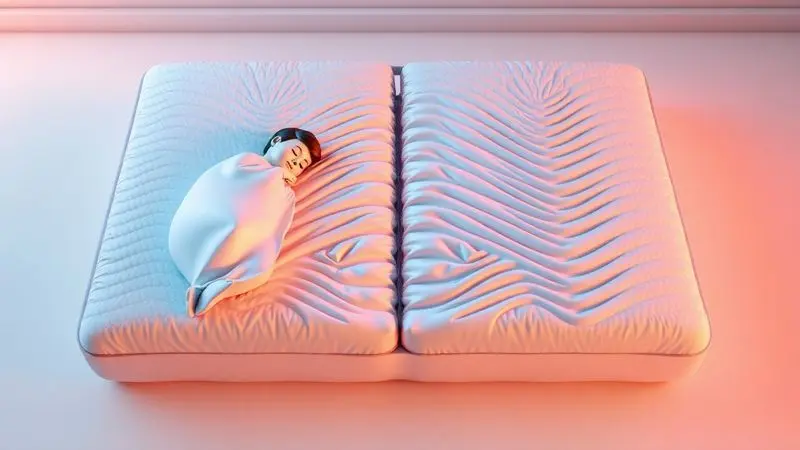
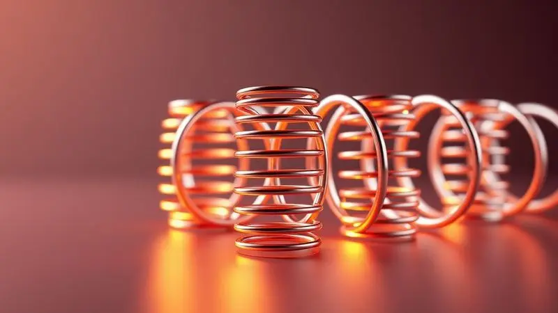

Você já acordou no meio da noite porque seu parceiro se mexeu na cama ou se levantou? Aquele leve tremor que percorre o colchão, perturbando seu sono justo quando você mais precisa descansar, é um desafio familiar para muitos casais.

O que poucos percebem é que essa transferência de movimento não é apenas um incômodo passageiro, mas uma ameaça silenciosa à qualidade do sono e, por consequência, à harmonia do relacionamento.

A boa notícia é que você não precisa mais escolher entre o conforto individual e a paz compartilhada. A tecnologia do sono evoluiu para criar soluções que anulam esse efeito, transformando sua cama em um santuário onde cada movimento permanece pessoal.

Neste guia, você vai descobrir como diferentes tecnologias funcionam para proteger seu descanso e aprenderá a escolher o colchão perfeito que mantém o movimento exatamente onde ele começou: com quem se mexeu.

<SummaryList products={frontmatter.top_products} />

## O que é a transferência de movimento e por que ela atrapalha o sono?

Imagine que seu parceiro precisa se virar durante a noite, talvez por um desconforto momentâneo ou simplesmente para encontrar uma posição mais confortável.

Em um colchão convencional, esse movimento cria ondas que se propagam por toda a superfície, chegando até seu lado da cama e interrompendo seu sono profundo. Você acorda, mesmo que por apenas alguns segundos, e o ciclo de descanso é quebrado.

Esse fenômeno é a transferência de movimento: a capacidade de um colchão de transmitir as movimentações de uma pessoa para a outra. O impacto vai além do desconforto imediato.

Noites fragmentadas acumulam-se em cansaço crônico, irritabilidade e, em muitos casos, discussões desnecessárias.

Quando dois corpos dividem o mesmo espaço, a tecnologia precisa funcionar como um mediador silencioso, absorvendo as individualidades sem prejudicar o conjunto.

## Colchão de Molas Ensacadas: A tecnologia líder em isolamento de movimento

<ProductBox 
  title={frontmatter.top_products[0].title} 
  image={frontmatter.top_products[0].image} 
  link={frontmatter.top_products[0].link} 
/>

Pense nas molas ensacadas como vizinhos bem-educados: cada uma vive em seu próprio espaço, respeitando os limites do outro. Ao contrário dos sistemas tradicionais onde todas as molas estão conectadas, aqui cada unidade é envolvida em um saco individual de tecido.

Quando uma mola é comprimida pelo peso ou movimento do seu parceiro, as demais permanecem estáveis, contendo a perturbação em seu ponto de origem.

O resultado é uma sensação de independência dentro da intimidade compartilhada. Você pode mudar de posição, levantar para beber água ou simplesmente se ajustar sem aquele sentimento de culpa por estar perturbando quem está ao seu lado.

Além do isolamento excepcional, essas molas oferecem um suporte que se adapta às curvas específicas do seu corpo, aliviando pontos de pressão que muitas vezes são a causa real da inquietação noturna.

Sim, esses colchões tendem a ser mais pesados, mas essa característica vem acompanhada de uma durabilidade impressionante e uma ventilação natural que mantém o ambiente fresco durante toda a noite.

## Espuma de Memória (Viscoelástico): O fim do "efeito trampolim"

<ProductBox 
  title={frontmatter.top_products[1].title} 
  image={frontmatter.top_products[1].image} 
  link={frontmatter.top_products[1].link} 
/>

Se as molas ensacadas são vizinhos discretos, a espuma de memória é um abraço que acalma.

Esta tecnologia possui uma propriedade fascinante: ela responde ao calor e à pressão do corpo, moldando-se perfeitamente às suas formas e, ao mesmo tempo, criando uma barreira física que impede que movimentos se propaguem.

Quando seu parceiro se vira, a espuma ao redor dele absorve a energia do movimento, como areia molhada que engole uma pedra sem fazer ondas. Você permanece em sua própria bolha de conforto, isolado das perturbações que acontecem do outro lado.

Esse molde personalizado é especialmente benéfico para quem dorme de lado, pois alivia a pressão em ombros e quadris que muitas vezes levam àquela necessidade constante de se reposicionar.

Um ponto de atenção: algumas espumas de memória tradicionais podem reter calor. Mas a indústria evoluiu, e hoje você encontra versões com infusão de gel ou sistemas de ventilação que mantêm a temperatura ideal durante toda a noite.

## Colchões de Látex: Durabilidade e resiliência sem balanços

<ProductBox 
  title={frontmatter.top_products[2].title} 
  image={frontmatter.top_products[2].image} 
  link={frontmatter.top_products[2].link} 
/>

O látex oferece uma experiência diferente: é como descansar sobre uma nuvem com estrutura interna. Sua característica mais notável é a resiliência, a capacidade de retornar rapidamente à forma original após ser pressionado.

Isso cria um suporte firme e responsivo que evita aquela sensação de "afundamento" que pode fazer com que parceiros rolem um em direção ao outro durante a noite.

Essa estabilidade dinâmica significa que, mesmo quando um de vocês se move, o colchão não cria uma depressão que puxa ou perturba o outro. Ele se ajusta localmente e se recupera instantaneamente, mantendo a superfície plana e convidativa para ambos.

A estrutura celular aberta do látex natural também promove uma ventilação excelente, criando um microclima fresco que combate a umidade e o calor excessivo.

Com uma vida útil que frequentemente ultrapassa uma década, especialmente nas versões de látex natural, você está investindo em anos de noites tranquilas. O peso maior é apenas o preço dessa robustez que protege seu sono ano após ano.

## Como escolher o colchão de casal ideal: 5 critérios essenciais além do movimento

Encontrar o colchão perfeito vai além de escolher a tecnologia certa. É sobre harmonizar duas individualidades em um único espaço de descanso.

Estes cinco critérios ajudam a garantir que sua escolha atenda não apenas às necessidades técnicas, mas às experiências emocionais que vocês buscam compartilhar.

### 1. Suporte de peso e biotipo dos parceiros

Seu colchão precisa ser um diplomata entre dois corpos potencialmente diferentes. Casais com diferenças significativas de peso ou biotipos distintos (um mais atlético, outro mais delicado, por exemplo) beneficiam-se de tecnologias que oferecem suporte localizado.

Molas ensacadas e espumas de alta densidade distribuem o peso de maneira inteligente, evitando que o parceiro mais pesado "afunde" o colchão de maneira desigual.

A firmeza ideal não é um número absoluto, mas um equilíbrio negociado. Muitos fabricantes oferecem modelos com firmezas diferentes em cada lado, ou tecnologias que se adaptam independentemente a cada corpo.

O objetivo final é simples: ambos devem acordar sentindo que dormiram em seu colchão pessoal, não em um compromisso desconfortável.

### 2. Nível de firmeza: Macio, médio ou firme?

Essa escolha frequentemente revela diferenças fundamentais na forma como cada pessoa se relaciona com o descanso.

Colchões macios oferecem aquele abraço reconfortante que muitas pessoas associam ao relaxamento profundo, mas podem não fornecer o suporte necessário para alinhamento postural adequado.

Os firmes agem como uma fundação sólida, ideal para quem busca estabilidade espinhal, especialmente para quem dorme de barriga para cima.

A maioria dos casais encontra seu ponto ideal nos modelos de firmeza média, que equilibram conforto e suporte. Mas o verdadeiro segredo está em testar juntos: deitem-se lado a lado, conversem sobre as sensações, percebam como o colchão responde aos movimentos de ambos.

Essa experiência compartilhada revela mais do que qualquer especificação técnica.

### 3. Densidade da espuma e durabilidade comprovada

Pense na densidade como a solidez das promessas que o colchão faz. Uma espuma de baixa densidade pode parecer confortável inicialmente, mas tende a ceder com o tempo, criando depressões que não só comprometem o suporte como podem aumentar a transferência de movimento.

Espumas com densidade acima de 40kg/m³ geralmente indicam maior resistência e capacidade de manter suas propriedades isolantes por anos.

Essa durabilidade não é apenas econômica, é emocional: saber que seu investimento protegerá suas noites por uma década ou mais cria uma sensação de segurança que contribui para o relaxamento.

Um colchão que mantém sua forma é um colchão que mantém sua promessa de isolamento, noite após noite.

### 4. Certificações de qualidade e reputação da marca

Os selos de certificação são testemunhas silenciosas da seriedade por trás do produto. No Brasil, o selo do INMETRO garante que o colchão passou por testes rigorosos de segurança e durabilidade.

Certificações internacionais, como CertiPUR-US para espumas, atestam a ausência de substâncias nocivas e a qualidade dos materiais.

A reputação da marca conta a história do compromisso com o consumidor. Empresas estabelecidas investem continuamente em pesquisa porque entendem que um colchão não é um móvel, é um parceiro diário no seu bem-estar.

Essa trajetória de inovação geralmente se traduz em produtos que antecipam necessidades que você nem sabia que tinha.

### 5. Garantia e período de teste em casa

A verdadeira relação com um colchão começa depois que ele chega em sua casa. Por isso, o período de teste é seu aliado mais valioso.

Entre 30 e 100 noites, você tem a oportunidade de viver com o produto, perceber como ele responde às variações do seu sono, às diferentes estações do ano, aos estados físicos e emocionais de cada dia.

Uma garantia robusta (geralmente entre 5 e 10 anos para colchões de qualidade) é o abraço da fabricante dizendo "confiamos no que criamos". Ela cobre defeitos de fabricação, mas mais importante, demonstra a expectativa de que o produto durará.

Essas políticas revelam uma empresa que se coloca no lugar de quem vai dividir décadas de noites com aquele colchão.

### A função do Pillow Top no conforto e na estabilidade do colchão

<ProductBox 
  title={frontmatter.top_products[3].title} 
  image={frontmatter.top_products[3].image} 
  link={frontmatter.top_products[3].link} 
/>

Imagine acrescentar uma camada extra de aconchego sem comprometer a estrutura fundamental do colchão.

O Pillow Top cumpre exatamente esse papel: uma camada adicional de acolchoamento costurada na parte superior que oferece uma sensação inicial de maciez premium, como dormir em uma nuvem que ainda mantém o suporte necessário.

Essa camada não é apenas sobre conforto superficial. Ela ajuda a distribuir o peso de maneira mais uniforme, especialmente para quem dorme de lado, aliviando pontos de pressão que muitas vezes são a causa da inquietação noturna.

O resultado é menos movimento porque há menos desconforto incentivando mudanças de posição.

Para casais com preferências diferentes de firmeza, alguns modelos oferecem Pillow Tops removíveis ou ajustáveis, criando uma solução personalizada dentro de um produto compartilhado.

## Dica de Especialista: A influência da base da cama na estabilidade do colchão

<ProductBox 
  title={frontmatter.top_products[4].title} 
  image={frontmatter.top_products[4].image} 
  link={frontmatter.top_products[4].link} 
/>

Seu colchão é um instrumento musical, e a base da cama é a caixa de ressonância que define sua performance. Uma base inadequada pode sabotar até o melhor dos colchões, criando pontos de tensão que aumentam a transferência de movimento e reduzem a vida útil do produto.

Bases com ripados sólidos e bem distribuídos fornecem um suporte uniforme que permite ao colchão trabalhar como foi projetado. Elas absorvem parte da energia dos movimentos antes que ela chegue ao parceiro, funcionando como uma primeira linha de defesa.

Além disso, uma boa ventilação entre a base e o colchão previne a acumulação de umidade, mantendo os materiais em condições ideais por mais tempo.

Investir em uma base adequada não é um extra, é parte fundamental da equação que transforma um bom colchão em uma experiência excepcional de sono compartilhado.

## Erros comuns ao comprar um colchão para casal que você deve evitar

O processo de escolha pode ser repleto de armadilhas que comprometem o resultado final.

O primeiro e mais comum erro é a tirania da maioria silenciosa: um parceiro cede às preferências do outro sem expressar suas próprias necessidades, resultando em anos de desconforto disfarçado de harmonia.

Ignorar as dimensões reais do seu espaço e hábitos é outro equívoco frequente. Um colchão muito pequeno para dois corpos que precisam de liberdade de movimento transforma cada noite em uma negociação espacial exaustiva.

Por outro lado, um colchão excessivamente grande em um quarto pequeno pode criar uma sensação claustrofóbica que contradiz o propósito do descanso.

A pressa é inimiga do sono tranquilo. Não testar o colchão adequadamente, preferindo a comodidade da compra online sem experimentar, é como escolher um parceiro de dança sem nunca ter dançado juntos.

Reserve tempo para deitar-se lado a lado, em silêncio, percebendo como o colchão responde à presença de ambos.

## Perguntas Frequentes (FAQ) sobre colchões que não mexem

### Qual a diferença entre molas ensacadas e molas bonnel?

Imagine uma sala cheia de balões individuais (molas ensacadas) versus uma rede interligada (molas bonnel). No primeiro caso, quando você pressiona um balão, os demais permanecem intactos. No segundo, a pressão em um ponto se distribui por toda a rede.

As molas ensacadas oferecem isolamento quase completo porque cada unidade trabalha independentemente. As molas bonnel proporcionam uma firmeza uniforme, mas transmitem movimento com facilidade.

Para casais, a escolha geralmente recai sobre as ensacadas, que transformam a cama em dois territórios de descanso conectados, mas independentes.

### Colchão de espuma é melhor que o de mola para quem se mexe muito?

Geralmente, sim. A espuma, especialmente a de memória e as de alta densidade, absorve o movimento como um amortecedor, contendo a energia antes que ela se propague. É como a diferença entre pular em um trampolim (molas) versus pular em um colchão de ginástica (espuma).

No primeiro, a energia se transfere; no segundo, ela é dissipada no ponto de impacto. Para casais onde um ou ambos são dorminhocos ativos, a espuma oferece um isolamento superior que protege o sono do parceiro mais tranquilo.

## Conclusão

Escolher um colchão que não transmite movimento é um ato de cuidado que transcende o mobiliário. É um investimento na qualidade das suas noites e, por extensão, na qualidade dos seus dias e do seu relacionamento.

Cada tecnologia que exploramos, das molas ensacadas que trabalham em silêncio independente à espuma de memória que abraça sem sufocar, oferece um caminho para transformar sua cama de um campo de batalha noturno em um santuário de descanso compartilhado.

Lembre-se: o colchão perfeito não é aquele com mais especificações técnicas, mas aquele que desaparece na experiência. É aquele que, após algumas noites, você para de pensar em molas, densidades ou tecnologias e simplesmente experimenta o sono reparador que merece.

Ele se torna o pano de fundo invisível para conversas aconchegantes antes de dormir, para aquele momento de tranquilidade ao acordar, para a intimidade tranquila que não precisa de palavras.

Seu próximo passo não é comprar um colchão. É agendar um teste. É deitar-se ao lado de quem você ama, fechar os olhos e perguntar-se: "Aqui, juntos, conseguimos descansar?" A resposta, quando encontrada no colchão certo, é sempre um silêncio profundo e satisfeito.