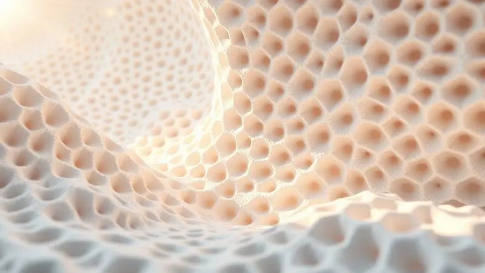
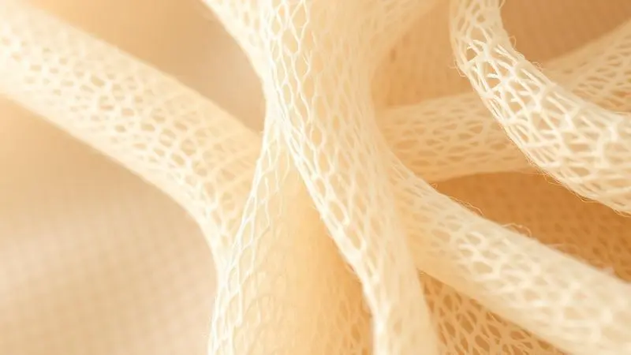

Investir em um novo colchão é uma decisão que impacta diretamente sua saúde e disposição diária. Se você chegou até aqui, provavelmente está se perguntando: o colchão Restonic é bom?

A marca, com presença global e décadas de tradição, promete transformar suas noites com tecnologias exclusivas, como o molejo Posture Spiral e espumas de alto desempenho.

No entanto, com tantas opções e termos técnicos como Gel Kulkote e Látex Dunlop, é fácil se sentir perdido.

Neste artigo, realizamos uma análise profunda dos principais modelos, como o Ergo Ultra e o Imattress DSS 38, além de desbravar cada componente tecnológico da marca.

Prepare-se para descobrir se a Restonic é a escolha certa para o seu descanso antes de finalizar sua compra.

<SummaryList products={frontmatter.top_products} />

## Colchão Restonic é bom?

A resposta curta é: sim, mas com nuances que você precisa entender. Imagine comprar um carro: todos têm motor, mas alguns oferecem conforto silencioso enquanto outros entregam performance esportiva. A Restonic opera no mesmo princípio.

Não é uma marca de "colchão básico", mas de soluções especializadas que conversam diretamente com seu tipo de corpo, suas preferências de firmeza e até seus hábitos térmicos durante o sono.

O que define sua experiência não são apenas os materiais de qualidade ou a durabilidade reconhecida.

É como essas tecnologias se combinam para criar algo único: um suporte que parece entender suas curvaturas, uma ventilação que mantém você fresco mesmo no verão e uma adaptabilidade que transforma sua cama em um refúgio personalizado.

A variedade de firmezas não é apenas uma lista de opções, mas um caminho para encontrar aquela sensação perfeita que faz você dormir profundamente sem aquela dor no ombro de manhã.

## Avaliação do Colchão Ergo Ultra Restonic Premium

<ProductBox 
  title={frontmatter.top_products[0].title} 
  image={frontmatter.top_products[0].image} 
  link={frontmatter.top_products[0].link} 
/>

Você sabe aquela sensação de entrar em uma loja, experimentar um colchão e pensar "isso é perfeito"? O Ergo Ultra transforma esse momento em sua rotina diária.

Seu núcleo de Látex 100% natural da Bélgica funciona como um abraço inteligente: oferece suporte onde você precisa, mas sem aquela pressão que faz você se sentir "presa" na cama.

A camada superior com espuma Ultracel com gel é o verdadeiro diferencial. Não apenas macia, ela traz aquela agradável sensação de frescor que faz você abandonar o ventilador no meio da noite.

Imagine dormir em um ambiente que parece sempre estar na temperatura ideal, sem aquelas oscilações que interrompem seu sono.

Com altura total de 20 cm e capacidade para até 165 kg por pessoa, ele se adapta a diferentes biotipos enquanto mantém ventilação adequada e propriedades anti-fúngicas.

Uma observação importante: alguns clientes relatam que a firmeza sentida em casa pode ser diferente da experiência na loja. Isso não significa qualidade inferior, mas a adaptação natural dos materiais ao seu ambiente e peso.

Para muitos, essa adaptação resulta em uma experiência descrita como "excepcional" - aquele tipo de conforto que faz você acordar renovado.

<CaixaProsContras>

**Prós:**

- Conforto excepcional com espuma Ultracel e látex.

- Alta durabilidade e suporte ideal.

- Ventilação adequada e propriedades anti-fúngicas.

- Adequado para camas articuladas.

**Contras:**

- A firmeza pode ser um pouco diferente do esperado.

- Pode não ser ideal para quem prefere um colchão mais firme.

</CaixaProsContras>

## Colchão King Size Restonic Imattress DSS 38

<ProductBox 
  title={frontmatter.top_products[1].title} 
  image={frontmatter.top_products[1].image} 
  link={frontmatter.top_products[1].link} 
/>

Se o Ergo Ultra é o abraço inteligente, o Imattress DSS 38 é o tapete de luxo. Com 38 cm de altura e sistema de molas ensacadas DSS (Dual Support System), ele cria uma experiência onde cada movimento do seu corpo recebe resposta individualizada.

Isso significa que você pode se virar à noite sem que seu parceiro sinta qualquer transferência de movimento - o silêncio perfeito para o sono de ambos.

A camada de conforto combina Látex Natural e espuma Ultracel, enquanto o tecido em malha de Alta Definição não apenas oferece um toque suave, mas também propriedades bactericidas que mantêm seu ambiente de sono mais saudável.

Para quem busca aquela sensação "extra macio" que parece envolver você completamente, este modelo é uma experiência quase luxuosa.

É importante considerar: essa maciez intensa pode não ser ideal para quem prefere firmeza estrutural. A sensação de "flutuar" na cama é deliciosa para alguns, mas outros podem buscar apoio mais definido.

Sua certificação pelo Inmetro garante segurança e qualidade, transformando seu investimento em uma garantia de sono reparador.

<CaixaProsContras>

**Prós:**

- Conforto extra macio ideal para quem gosta desse tipo de sensação.

- Sistema de molas ensacadas que oferece suporte individualizado.

- Camada de conforto com materiais de alta qualidade como látex natural.

- Certificado pelo Inmetro, garantindo segurança e qualidade.

**Contras:**

- Pode ser considerado muito macio para quem prefere colchões firmes.

- Limitação de peso suportado pode não atender a todos os biotipos.

</CaixaProsContras>

## Tecnologias de Molejo: Posture Spiral, Stable Edge e Micromolejo Ensacado

O que acontece quando você se deita? Sua coluna busca alinhamento, suas curvas naturais precisam de apoio e seus movimentos precisam de isolamento. As tecnologias de molejo da Restonic são respostas específicas para cada uma dessas necessidades.

O Posture Spiral utiliza molas de aço temperado que não apenas sustentam, mas se adaptam ao contorno do seu corpo como um mapa personalizado. Imagine cada curva da sua coluna recebendo apoio preciso, reduzindo aquela tensão que acumula durante o dia.

O Stable Edge é o guardião das bordas. Ele reforça as laterais do colchão, aumentando a área útil e evitando aqueles afundamentos que fazem você sentir que está "escapando" da cama quando se aproxima do edge.

E o Micromolejo Ensacado? É a tecnologia do silêncio. Pequenas molas individuais respondem somente ao seu movimento, criando uma isolação tão eficiente que você pode mudar de posição sem perturbar o sono do seu parceiro.

É a harmonia que transforma sua cama em um espaço compartilhado sem conflitos.

## Diferenciais de Espuma: Reticulada, Ultracel, Viscoelástica e HR

As espumas são a pele do colchão - a interface que traduz tecnologia em sensação física. Cada tipo na Restonic oferece uma conversa diferente com seu corpo.

A espuma reticulada é a respirável. Sua estrutura aberta promove ventilação constante, criando aquela sensação fresca que persiste mesmo nas noites mais quentes. Ideal para quem busca alívio de pressão sem aquela "cobertura" pesada.

A Ultracel é a equilibrada. Combina firmeza estrutural com adaptabilidade inteligente, oferecendo suporte onde você precisa enquanto se molda às suas formas. É o meio-termo perfeito entre conforto e sustentação.

A viscoelástica é a moldável. Famosa por reduzir pontos de pressão, ela funciona como uma memória do seu corpo - adapta-se às suas curvaturas e distribui peso de forma inteligente.

Para quem sente dores específicas, essa espuma pode ser a resposta para um sono sem interrupções.

A espuma HR (alta resiliência) é a robusta. Oferece durabilidade excepcional e um suporte firme que mantiene sua estrutura ao longo dos anos. Para quem prefere um toque mais definido e uma sensação de "fundação sólida", esta é a escolha.

## Variedades de Látex: Dunlop, Pulse e Grafite em Manta

O látex é a alma natural dos colchões Restonic - um material que combina sustentação com elasticidade em três variações distintas.

O látex Dunlop é o estabilizador. Com densidade e firmeza características, oferece suporte consistente para quem busca uma superfície mais estável e previsível. Imagine uma base que não "ceda" com o tempo, mantendo sua forma original.

O látex Pulse é o elástico. Mais macio e adaptável, ele oferece um toque de suavidade que não sacrifica sustentação. É a versão que parece "dançar" com seus movimentos, oferecendo resposta dinâmica sem perder apoio.

O látex grafite em manta é o regulador térmico. Combina as propriedades naturais do látex com tecnologia de grafite, criando um efeito que ajuda a equilibrar sua temperatura durante o sono.

Para quem oscila entre calor e frio durante a noite, essa variação pode ser o equilíbrio perfeito.

## Conforto Térmico: Gel Kulkote e Gel Infused

Você já acordou no meio da noite porque estava com calor? O conforto térmico não é apenas uma característica adicional - é um elemento fundamental para sono continuado. As tecnologias Gel Kulkote e Gel Infused da Restonic transformam essa preocupação em solução.

O Gel Kulkote funciona como uma camada reguladora inteligente. Ele não apenas absorve calor, mas distribui temperatura de forma equilibrada, evitando aqueles pontos "quentes" que interrompem seu descanso.

Imagine uma superfície que mantiene frescor constante, independente das variações do seu corpo.

O Gel Infused é incorporado diretamente à espuma, oferecendo sensação refrescante desde o primeiro contato. Não é um "efeito inicial" que desaparece, mas uma propriedade integrada que persiste ao longo do tempo.

Para quem tende a sentir calor intenso, essa tecnologia pode significar abandonar aquelas noites de sono interrompido por desconforto térmico.

## Acabamentos e Tecidos: Malha em Microtencel e Algodão Orgânico

O que você sente quando toca seu colchão? Os acabamentos são a primeira interface, o contato inicial que define sua experiência sensorial antes mesmo do apoio estrutural.

A malha em Microtencel é a respirável e protetora. Leve e com propriedades antimicrobianas, ela mantiene seu colchão fresco e livre de ácaros não apenas por tecnologia, mas por design inteligente.

Imagine um tecido que não apenas cobre, mas protege e refresca simultaneamente.

O algodão orgânico é a escolha sustentável e confortável. Além de oferecer uma experiência de toque superior, ele representa um compromisso com o meio ambiente que se traduz em qualidade perceptível.

Para quem valoriza não apenas conforto pessoal, mas responsabilidade ambiental, esse acabamento é a conexão entre cuidado individual e coletivo.

## Características Gerais dos Produtos Restonic

Quando você une todas essas tecnologias, o que emerge não é apenas um "colchão bom", mas um sistema de descanso personalizado. Os produtos Restonic combinam conforto e suporte através de uma filosofia que entende que sono ideal não é padrão, mas individual.

As camadas adaptáveis não apenas se moldam ao seu corpo, mas criam alívio de pressão que transforma horas de repouso em verdadeira recuperação. Os tratamentos antiácaro e antialérgico garantem que seu ambiente de descanso seja saudável, não apenas confortável.

A durabilidade reconhecida não é apenas sobre resistência ao desgaste, mas sobre manter qualidade consistente ao longo dos anos. Isso significa que seu investimento não diminui com o tempo, mas persiste como garantia de renovação diária.

Para quem busca equilíbrio entre conforto estrutural e adaptabilidade pessoal, a Restonic oferece não uma resposta única, mas um espectro de soluções onde cada tecnologia conversa com sua necessidade específica.

## Conclusão

Decidir sobre um colchão Restonic não é apenas escolher um produto, mas selecionar uma experiência de sono construída sobre décadas de pesquisa e tecnologia especializada.

Desde o abraço inteligente do látex natural até o silêncio isolante das molas ensacadas, cada componente foi desenvolvido para traduzir engenharia em conforto pessoal.

O que define essa marca não é a lista de tecnologias, mas como elas se integram para criar algo que parece entender seu corpo.

Se você busca aquela sensação de frescor constante que elimina interrupções térmicas, ou o apoio progressivo que adapta às suas curvaturas sem pressionar, ou mesmo o isolamento de movimento que transforma sua cama em um espaço compartilhado harmonioso - a Restonic oferece respostas específicas.

Antes de finalizar sua compra, considere não apenas "qual colchão", mas "qual experiência" você deseja construir para suas próximas milhares de horas de descanso.

A combinação certa de firmeza, adaptabilidade e características térmicas pode transformar sua rotina de sono de uma necessidade básica para um ritual de renovação pessoal.

Escolha a tecnologia que conversa com seu corpo, e transforme seu investimento em garantia de bem-estar diário.