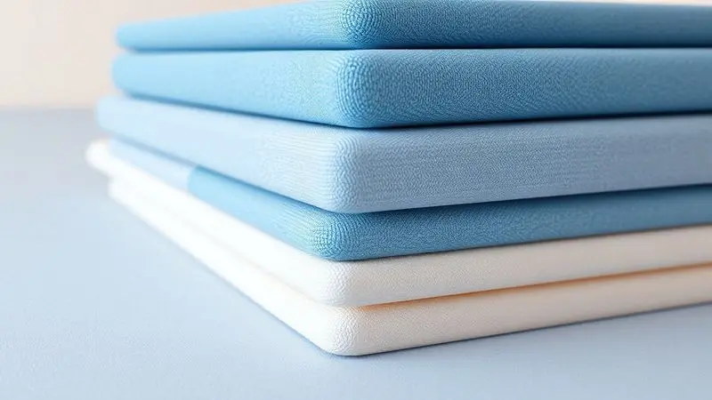
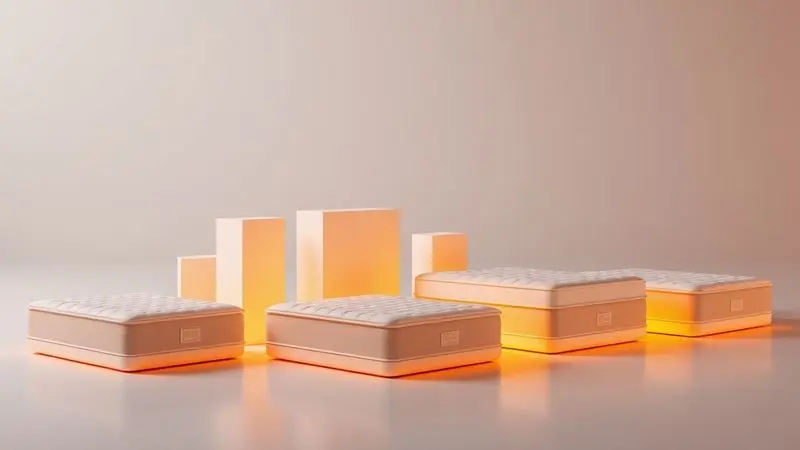

A Sealy é sinônimo de inovação no mundo do sono, mas quando você está diante de tantas opções - molas ensacadas, espumas especiais, Pillow Tops - como saber qual delas realmente merece seu investimento?

A verdadeira pergunta não é se a Sealy é boa (ela é), mas qual modelo transformará suas noites em descanso genuíno.

Nesta análise, exploramos os detalhes que fazem do Boston, Comfort Gel e outros modelos da marca mais do que simples colchões: são soluções para noites realmente reparadoras.

<SummaryList products={frontmatter.top_products} />

## O Colchão Sealy é bom?

Imagine acordar após uma noite inteira de sono sem se lembrar de ter se virado sequer uma vez. Essa é a promessa que os colchões Sealy fazem, especialmente os modelos com molas ensacadas.

Eles não apenas oferecem suporte preciso para cada curva do seu corpo, mas criam um sistema de isolamento tão eficiente que você praticamente dorme sozinho, mesmo ao lado de alguém.

A ventilação natural que essas molas proporcionam significa dizer adeus às noites quentes e suadas. Claro, o conceito de 'bom' é pessoal: algumas pessoas preferem a sensação de abraço de um colchão mais macio, outras precisam da firmeza que mantém a coluna alinhada.

Por isso, experimentar continua sendo o conselho de ouro, mas agora você já sabe exatamente o que procurar.

## Colchão Brooklyn Sealy Pocket

<ProductBox 
  title={frontmatter.top_products[0].title} 
  image={frontmatter.top_products[0].image} 
  link={frontmatter.top_products[0].link} 
/>

Se você já se cansou de negociar espaço na cama ou acorda sempre que seu parceiro se mexe, o Brooklyn pode ser a solução que faltava.

Suas molas ensacadas atuam como pequenos amortecedores independentes, criando zonas de conforto personalizadas para cada lado do colchão. Pense nelas como dedos que se moldam ao seu corpo, oferecendo suporte exatamente onde você precisa.

O diferencial que transforma este modelo em algo especial está na camada de látex natural. Além de ser hipoalergênica (um alívio para quem acorda com espirros), ela oferece uma resiliência que mantém o colchão como novo por anos.

Com mais de 140 anos de história, a Sealy depositou neste modelo toda sua expertise - e isso se sente desde o primeiro instante em que você deita.

Sim, ele pede um investimento maior do que modelos básicos, mas quando você calcula o custo por noite de sono reparador ao longo de dez anos (tempo da garantia), o valor se justifica completamente.

As 90 noites de teste são seu período para confirmar se esta será a melhor relação que você já teve com uma cama.

<CaixaProsContras>

**Prós:**

- Molas ensacadas que oferecem suporte individualizado.

- Redução da transferência de movimento entre os lados do colchão.

- Camada de látex natural, hipoalergênica e resistente.

- Garantia de 10 anos e período de teste de 90 noites.

**Contras:**

- Preço pode ser mais alto do que modelos convencionais.

- Pode ser pesado para mover e ajustar na cama.

</CaixaProsContras>

## Colchão Comfort Gel Sealy

<ProductBox 
  title={frontmatter.top_products[1].title} 
  image={frontmatter.top_products[1].image} 
  link={frontmatter.top_products[1].link} 
/>

Para quem sente que dorme em uma sauna noturna, o Comfort Gel apresenta uma proposta refrescante.

A tecnologia aqui vai além das molas ensacadas (que continuam fazendo seu trabalho de isolar movimentos) e incorpora espumas com gel que atuam como verdadeiros dissipadores de calor.

Enquanto as molas se adaptam às suas curvas, aliviando pontos de pressão nos ombros e quadris, o gel mantém a temperatura agradável durante toda a noite.

A combinação resulta em uma experiência de sono que lembra aquela sensação de deitar em lençóis recém-trocados em uma noite fresca.

A durabilidade é outro ponto forte - os materiais escolhidos pela Sealy garantem que essa frescura não seja passageira, mas uma característica que permanece ano após ano. A garantia de 10 anos é seu seguro de que o investimento está protegido.

A única consideração prática é o peso: este colchão tem presença. Mas pense nisso como um sinal de qualidade - materiais premium pesam mais, e você provavelmente só precisará movê-lo uma vez, no dia da entrega.

<CaixaProsContras>

**Prós:**

- Conforto superior com molas ensacadas que se adaptam ao corpo.

- Camadas de espuma com gel para frescor e alívio de pressão.

- Materiais de alta qualidade e durabilidade.

- Garantia extensa que traz segurança ao investimento.

**Contras:**

- Peso maior, o que pode dificultar sua movimentação.

- Pode não ser a melhor opção para quem prefere colchões mais firmes.

</CaixaProsContras>

## Colchão Sealy Starck

<ProductBox 
  title={frontmatter.top_products[2].title} 
  image={frontmatter.top_products[2].image} 
  link={frontmatter.top_products[2].link} 
/>

Quando o orçamento permite e o objetivo é o máximo em tecnologia de sono, o Starck entra em cena.

Suas molas Posturepedic são meticulosamente projetadas para oferecer suporte personalizado que vai além do conforto básico - estamos falando de uma assistência ativa para sua postura durante o sono.

Elas trabalham para manter sua coluna em posição ideal, independentemente de como você dorme.

As camadas de espuma D28 e Pillow Top Plus criam uma experiência de afundamento controlado: você sente o abraço do colchão sem perder o suporte. Para quem sofre com alergias, os tratamentos contra ácaros e alérgenos transformam o ambiente de sono em uma zona protegida.

E com capacidade para suportar até 120kg, ele oferece estabilidade robusta sem comprometer a delicadeza do conforto.

Este é, sem dúvida, um modelo premium. Mas quando você considera que passamos um terço de nossas vidas dormindo, investir na qualidade desse terço pode transformar completamente os outros dois terços.

<CaixaProsContras>

**Prós:**

- Tecnologia de molas ensacadas que se adapta ao corpo.

- Camadas adicionais de conforto para uma experiência superior.

- Tratamentos antiácaro e antialérgico.

- Capacidade de suporte para pessoas acima do peso médio.

**Contras:**

- Modelo premium que pode não caber em orçamentos mais apertados.

- Pode ser excessivamente macio para quem prefere colchões mais firmes.

</CaixaProsContras>

## Colchão Joy Sealy

<ProductBox 
  title={frontmatter.top_products[3].title} 
  image={frontmatter.top_products[3].image} 
  link={frontmatter.top_products[3].link} 
/>

Às vezes, a simplicidade esconde a excelência. O Joy Sealy demonstra que tecnologia avançada pode vir em uma proposta direta: molas ensacadas que isolam movimentos, firmeza média que oferece suporte ideal para a coluna e um design que entrega luxo sem exageros.

Ele é para quem busca o essencial, mas feito com maestria.

O segredo está no equilíbrio. Enquanto as molas trabalham para que você e seu parceiro durmam como em ilhas separadas, a firmeza média mantém sua coluna alinhada sem a rigidez desconfortável de colchões muito duros.

Os tecidos de alta qualidade não são apenas estéticos - eles respiram melhor e duram mais. E quando opções antiácaro e antibacteriana estão disponíveis, você ganha a paz de espírito de dormir em um ambiente verdadeiramente saudável.

A única atenção necessária é com a altura (cerca de 26cm), que pode exigir um ajuste na sua cama atual. Mas considere isso um pequeno detalhe técnico diante do grande benefício: noites de sono que realmente restauram.

<CaixaProsContras>

**Prós:**

- Molas ensacadas para melhor suporte e isolamento de movimento.

- Nível de conforto ideal para suportar a coluna.

- Design luxuoso com tecidos de alta qualidade.

- Tecnologia antiácaro e antibacteriana disponível em alguns modelos.

**Contras:**

- Algumas versões podem ser consideradas mais altas, exigindo atenção na escolha da cama.

- O modelo premium foi descontinuado, mas alternativas estão disponíveis.

</CaixaProsContras>

## Colchão Casal Molas Ensacadas Boston Sealy 138x188

<ProductBox 
  title={frontmatter.top_products[4].title} 
  image={frontmatter.top_products[4].image} 
  link={frontmatter.top_products[4].link} 
/>

Especificamente desenhado para camas de casal, o Boston entende que relacionamentos prosperam com individualidade respeitada. Suas molas ensacadas criam uma fronteira invisível de conforto: cada um tem seu território de sono, sem invasões noturnas.

As dimensões de 138x188cm oferecem espaço real para dois adultos dormirem sem a sensação de estarem disputando território.

O Pillow Top Pastel é aquele toque extra que transforma um colchão bom em excepcional. Ele não apenas acrescenta maciez, mas o faz de maneira inteligente, mantendo o suporte estrutural.

Os tratamentos antibacteriano e antiácaro são especialmente valiosos em um colchão de casal, onde duas pessoas compartilham o mesmo ambiente por horas todas as noites.

A praticidade de não precisar virar o colchão é um detalhe que você só valoriza quando não precisa mais fazê-lo. Já o limite de 150kg é importante verificar, mas para a maioria dos casais, está mais do que adequado.

No final, o Boston entrega exatamente o que promete: um sono reparador feito a dois, mas vivido individualmente.

<CaixaProsContras>

**Prós:**

- Tecnologia de molas ensacadas que reduz a transferência de movimento.

- Conforto adicional com Pillow Top Pastel.

- Tratamento antibacteriano e antiácaro.

- Design prático que não precisa ser virado.

**Contras:**

- Peso máximo suportado de 150 kg pode limitar alguns usuários.

- Não é um modelo reversível.

</CaixaProsContras>

## Qual o melhor colchão da Sealy?

A resposta honesta é: depende de qual sono você está procurando. Se você prioriza isolamento de movimento quase perfeito e um toque de luxo natural, o Brooklyn com seu látex é irresistível.

Se o calor noturno é seu inimigo, o Comfort Gel com sua tecnologia refrescante muda completamente o jogo. Para quem busca o ápice tecnológico com suporte postural ativo, o Starck é o investimento premium que justifica cada centavo.

O Joy atende quem valoriza equilíbrio e essencialidade bem executada, enquanto o Boston foi literalmente medido e cortado para a vida a dois. O fio condutor entre todos?

A tecnologia de molas ensacadas que a Sealy domina como poucas, transformando características técnicas em benefícios que você sente na pele - ou melhor, no descanso.

## Conclusão

Escolher um colchão Sealy não é sobre comprar um produto, mas sobre investir em um terço da sua vida que define a qualidade dos outros dois terços.

Cada modelo que analisamos oferece uma conversa diferente com seu corpo: alguns sussurram conforto com frescor, outros falam firme sobre suporte postural, todos garantem que você e seu parceiro possam ter diálogos noturnos sem interferências.

O verdadeiro valor desses colchões se revela nos detalhes que vão além do catálogo: no silêncio de uma noite ininterrupta, na ausência de dores ao acordar, na sensação de renovação que acompanha suas manhãs.

As garantias extensas e períodos de teste não são apenas políticas comerciais - são convites para experimentar o que significa dormir bem de verdade.

Antes de decidir, pergunte-se: que tipo de sono mereço? A resposta está em algum destes modelos, esperando para transformar suas noites em verdadeiro descanso. Sua próxima manhã perfeita começa com a escolha certa hoje.