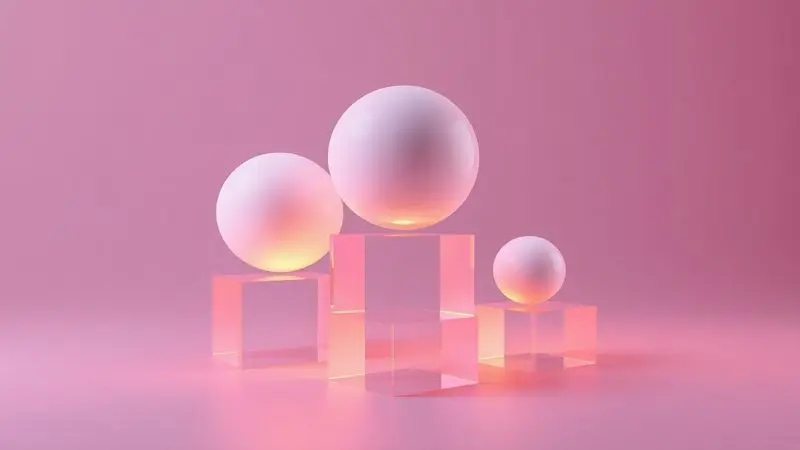
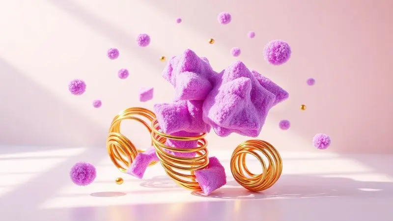
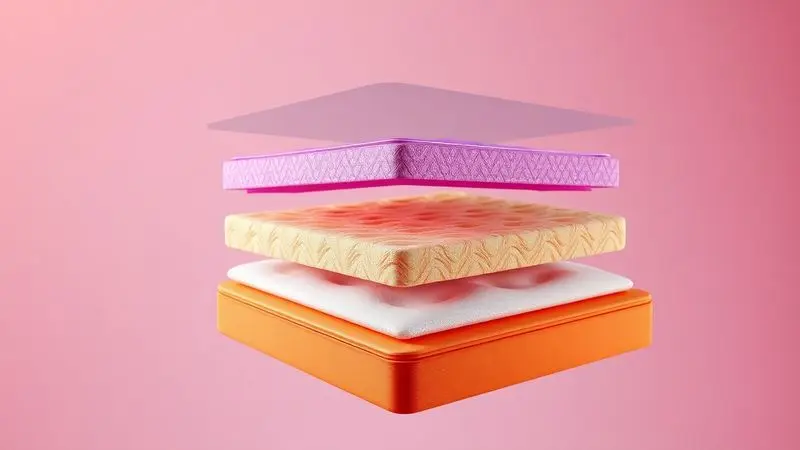

Na hora de renovar o quarto, uma dúvida é quase universal: é melhor um colchão de espuma ou de molas? Essa escolha vai muito além do preço, impactando diretamente a qualidade do seu sono, o alinhamento da coluna e até a temperatura do corpo durante a noite.

Com tantas tecnologias disponíveis, desde as molas ensacadas até as espumas de alta densidade, entender o que cada uma oferece é essencial para um descanso reparador.

Neste guia, analisamos as principais características de cada suporte para que você descubra qual tecnologia se adapta melhor ao seu biotipo e necessidades. Vale a pena investir em molas ou a espuma é o caminho ideal? Vamos descobrir agora.

<SummaryList products={frontmatter.top_products} />

## O que implica um bom suporte?

Imagine acordar e se levantar da cama sem aquela rigidez nas costas que te faz andar curvado pelos primeiros minutos. Esse é o verdadeiro significado de um suporte eficaz.

Um bom colchão não apenas distribui seu peso uniformemente, mas cria uma base que mantém sua coluna alinhada naturalmente, eliminando aqueles pontos de pressão que transformam uma noite de descanso em um verdadeiro martírio.

Para quem já lida com dores ortopédicas ou simplesmente passa horas na cama, essa sensação de leveza ao despertar faz toda diferença na qualidade de vida.

A durabilidade do produto também é afetada, garantindo que ele mantenha essa sensação de acolhimento perfeito ano após ano, sem afundar onde você mais precisa de firmeza.

## Molas vs. Espuma

Se você busca a sensação clássica de firmeza com ventilação que refresca as noites de verão, as molas podem ser sua escolha ideal.

Elas oferecem uma base mais rígida que mantém o corpo elevado, facilitando a circulação de ar e proporcionando uma sensação de frescor persistente.

Já se você prefere aquele abraço confortável que parece entender exatamente onde estão suas dores, a espuma viscoelástica se molda ao seu contorno, aliviando a pressão em áreas sensíveis como ombros e quadris.

A decisão vai além da tecnologia, é sobre como você quer se sentir ao deitar: suspenso e arejado ou envolvido e protegido? Testar ambos pode revelar qual experiência se harmoniza com seu estilo único de dormir.

## As camadas abençoadas

Dentro de cada colchão existe um universo de camadas que trabalham em conjunto para criar sua experiência de descanso.

A magia da espuma está em suas múltiplas camadas que se adaptam ao seu corpo como uma segunda pele, distribuindo o peso de maneira inteligente para que você quase flutue sobre a superfície.

As molas, por sua vez, constroem uma estrutura resiliente que respira com você, mantendo a firmeza sem sacrificar o conforto.

Quando essas camadas se combinam, com materiais como látex ou viscoelástica na superfície, criam um equilíbrio perfeito que atende desde quem dorme de lado até quem prefere ficar de barriga para cima.

Entender essa arquitetura interna é a chave para encontrar o colchão que não apenas suporta seu corpo, mas também sua maneira única de descansar.

## Colchão Calm Elemental

<ProductBox 
  title={frontmatter.top_products[0].title} 
  image={frontmatter.top_products[0].image} 
  link={frontmatter.top_products[0].link} 
/>

Entre as opções de espuma que chegam até sua casa em uma caixa compacta, o Calm Elemental se destaca como um equilíbrio inteligente entre qualidade e acessibilidade.

Suas duas camadas trabalham em harmonia: a primeira, de espuma ERGO® de alta densidade, mantém sua postura correta durante a noite toda, enquanto a camada EQUO® mais espessa se ajusta ao seu corpo, promovendo um alinhamento natural que previne aquelas dores matinais.

Imagine ter a tranquilidade de saber que o colchão suporta até 120 kg por lado sem ceder, enquanto a garantia de 10 anos protege seu investimento a longo prazo.

E o melhor, você pode testá-lo por 100 noites no conforto do seu quarto, sentindo na prática como ele se adapta ao seu ritmo de sono.

<CaixaProsContras>

**Prós:**

- Bom custo-benefício em relação à qualidade oferecida.

- Suporte para até 120 kg por lado, adequado para muitos usuários.

- Garantia longa de 10 anos e período de teste de 100 noites.

- Fácil transporte e instalação por vir embalado a vácuo.

**Contras:**

- Firmeza média que pode não agradar a todos.

- Não é tão versátil quanto colchões de molas em termos de conforto personalizado.

</CaixaProsContras>

## Colchão Calm Original

<ProductBox 
  title={frontmatter.top_products[1].title} 
  image={frontmatter.top_products[1].image} 
  link={frontmatter.top_products[1].link} 
/>

Para quem busca o abraço perfeito da espuma viscoelástica combinado com a firmeza essencial de uma base de alta resiliência, o Calm Original oferece o melhor dos dois mundos.

Ele se adapta ao seu corpo como se fosse feito sob medida, aliviando pontos de pressão enquanto mantém sua coluna alinhada naturalmente.

Cada movimento noturno do seu parceiro fica contido dentro da própria superfície, permitindo que ambos durmam profundamente sem interrupções.

Os materiais hipoalergênicos criam um ambiente saudável onde você pode respirar livremente, sem preocupações com ácaros ou alergias. E a praticidade de recebê-lo compactado em uma caixa significa que a renovação do seu sono começa no mesmo dia da compra.

<CaixaProsContras>

**Prós:**

- Conforto equilibrado entre firmeza e acolhimento.

- Minimização da transferência de movimento, ideal para casais.

- Materiais hipoalergênicos e certificados.

- Facilita o transporte com embalagem compacta.

**Contras:**

- Pode parecer um pouco duro nos primeiros dias.

- A adaptação pode levar alguns dias para alguns usuários.

</CaixaProsContras>

## Colchão Calm Plus

<ProductBox 
  title={frontmatter.top_products[2].title} 
  image={frontmatter.top_products[2].image} 
  link={frontmatter.top_products[2].link} 
/>

Quando você quer personalizar completamente sua experiência de descanso, o Calm Plus oferece versatilidade nas versões de espuma ou híbrida com molas.

Ele se ajusta ao seu corpo de maneira inteligente, distribuindo a pressão de forma que você acorda revigorado, sem aquela dor nas costas que persiste durante o dia.

A tecnologia antiácaros transforma seu espaço de descanso em um santuário de higiene, enquanto as capas removíveis facilitam a limpeza regular, mantendo tudo fresco e convidativo.

Com a comodidade da embalagem a vácuo e a segurança do período de teste, você pode experimentar na prática como cada versão se adapta ao seu estilo de dormir específico.

<CaixaProsContras>

**Prós:**

- Conforto adaptável ao corpo

- Tecnologia antiácaros para maior higiene

- Capas removíveis para fácil limpeza

- Período de teste que garante satisfação

**Contras:**

- Algumas versões podem ser mais firmes do que o esperado

- Variedade de preços dependendo do modelo escolhido

</CaixaProsContras>

## Conclusão

Escolher entre espuma ou molas vai além de comparar características técnicas, é sobre encontrar o colchão que conversa com seu corpo e suas necessidades específicas.

Se você valoriza a adaptabilidade suave que alivia cada ponto de pressão, a espuma oferece um abraço personalizado que parece feito sob medida. Se prefere a firmeza clássica com ventilação natural, as molas mantêm seu sono fresco e arejado.

Os modelos Calm demonstram como a evolução tecnológica transformou ambas as opções em soluções inteligentes que chegam até você com garantias robustas e períodos de teste generosos.

A verdadeira resposta está em como você quer acordar todas as manhãs, renovado e sem dores, pronto para enfrentar o dia com energia. Experimente, sinta na prática e descubra qual tecnologia se torna sua aliada para noites verdadeiramente reparadoras.

Seu corpo sabe qual escolha é a certa, basta dar a ele a oportunidade de decidir.