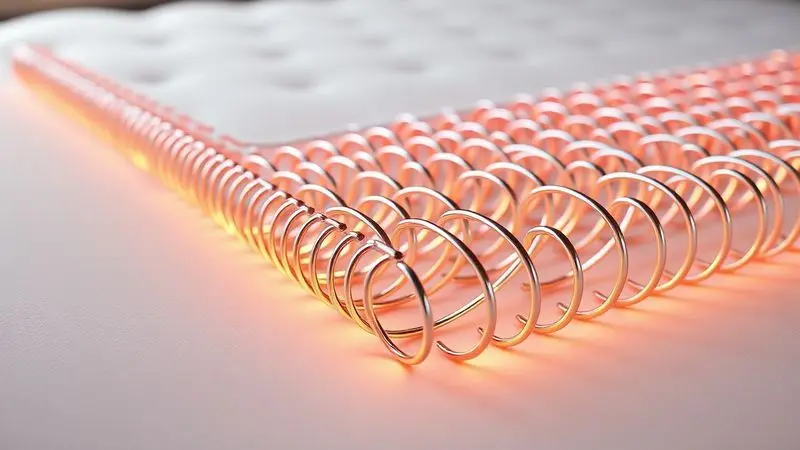

Já parou para calcular quantas horas da sua vida você passa dormindo? Dá quase um terço de toda sua existência. Essa simples conta mostra por que escolher o colchão certo é mais do que uma compra, é um investimento direto em sua saúde, disposição e bem-estar diário.

Diante de tantas opções, a Sonos Colchões surge prometendo unir tecnologia e conforto de ponta. Mas será que seus produtos entregam essa experiência transformadora na prática?

Para descobrir, mergulhamos nos dois modelos mais procurados da marca, desvendando desde suas inovações técnicas até o impacto real que elas têm na sua rotina de descanso.

<SummaryList products={frontmatter.top_products} />

## Características do Colchão Queen Size Mola Ensacada Sonos 158x198

<ProductBox 
  title={frontmatter.top_products[0].title} 
  image={frontmatter.top_products[0].image} 
  link={frontmatter.top_products[0].link} 
/>

Imagine deitar em uma superfície que parece se moldar exatamente para o seu corpo, oferecendo suporte firme onde você precisa, mas sem aquela rigidez desconfortável que te deixa revirando a noite toda.

É essa sensação que o colchão Queen Size Mola Ensacada Sonos busca proporcionar.

Seu segredo mora nas molas ensacadas High Core, que funcionam como uma equipe de apoio minuciosa: cada mola trabalha independentemente, garantindo que o quadril receba o suporte que merece, enquanto os ombros afundam o suficiente para relaxar completamente.

Com altura que varia entre 30 e 34 centímetros, ele oferece uma firmeza classificada como média a firme, ideal para quem sente dores nas costas ou simplesmente prefere a sensação de estar apoiado, não 'engolido' pelo colchão.

As camadas de espuma D33 adicionam durabilidade e uma camada extra de conforto, enquanto a tecnologia Purotex atua nos bastidores, criando um ambiente interno menos propício para ácaros e mais agradável para seu sono.

Sua capacidade de suporte chega a impressionantes 165 kg por pessoa, garantindo que a qualidade do suporte se mantenha constante ao longo dos anos.

<CaixaProsContras>

**Prós:**

- Molas ensacadas que reduzem a transferência de movimento.

- Boa altura e suporte firme para diversas posturas de sono.

- Camadas adicionais de espuma oferecem conforto extra.

- Tecnologia Purotex que mantém o colchão saudável e fresco.

**Contras:**

- A firmeza pode não ser ideal para todos os usuários.

- Algumas pessoas podem preferir um modelo mais macio.

</CaixaProsContras>

### Benefícios das Molas Ensacadas High Core

Você já acordou porque seu parceiro se virou para o outro lado? Com as molas ensacadas High Core, esse incômodo tende a desaparecer. Como cada mola é individualmente embalada, o movimento acontece de forma localizada.

Quando uma pessoa se mexe, apenas as molas sob ela respondem, deixando o resto da superfície praticamente inalterada. O resultado é um sono mais contínuo para casais, mas os benefícios vão além.

Essa estrutura independente também significa que seu corpo recebe um suporte preciso, alinhando a coluna de forma natural e aliviando pontos de pressão nos ombros e quadris.

E tem mais: o espaço entre as molas permite uma ventilação interna superior, ajudando a dissipar o calor do corpo e mantendo uma temperatura agradável durante toda a noite. É tecnologia trabalhando para que você simplesmente desligue e descanse.

### Mais Conforto e Luxo no Seu Descanso: Especificações Técnicas

Olhando além do conforto imediato, o que garante que esse colchão continue sendo um aliado do seu sono pelos próximos anos? A resposta está na combinação de materiais. As molas ensacadas já mencionadas são apenas o primeiro ato.

Sobre elas, camadas de espuma de alta densidade aumentam a vida útil do produto e amortecem o contato, evitando que você sinta as molas. O tecido que o envolve é tratado com agentes antimicrobianos, criando uma barreira extra contra ácaros e fungos.

Juntos, esses elementos formam um colchão que não apenas proporciona uma noite de sono melhor hoje, mas que se compromete a manter essa qualidade.

É o tipo de investimento que para de ser percebido como um móvel e começa a ser sentido como parte essencial do seu ritual de recuperação diária.

## Colchão Queen Fit 45 D45 Sonos Colchões

<ProductBox 
  title={frontmatter.top_products[1].title} 
  image={frontmatter.top_products[1].image} 
  link={frontmatter.top_products[1].link} 
/>

Se sua prioridade é um suporte ortopédico firme e consistente, sem margem para 'afundamentos' que desalinharem sua postura, o Fit 45 D45 pode ser sua resposta. A classificação D45 refere-se à densidade de sua espuma, um indicador de durabilidade e firmeza.

Em linguagem do dia a dia, significa que o colchão mantém seu formato e propriedades de suporte por muito mais tempo, oferecendo uma sensação de abraço firme que não murcha com os anos de uso.

Ele suporta até 150 kg por pessoa, uma característica importante para garantir que o suporte seja eficiente independentemente do biótipo.

A tecnologia NO FLIP é um diferencial prático, eliminando a necessidade de virar o colchão periodicamente, o que simplifica drasticamente a manutenção.

Já o tratamento antialérgico integrado age como um guardião silencioso, protegendo seu espaço de descanso contra agentes que podem comprometer a qualidade do seu sono e sua saúde respiratória.

Uma observação importante: para extrair o máximo desse modelo, ele precisa de uma base de apoio rígida e não flexível.

<CaixaProsContras>

**Prós:**

- Alta densidade D45, garantindo firmeza.

- Suporte ortopédico que auxilia na postura.

- Tratamento antialérgico eficaz.

- Tecnologia NO FLIP facilita a manutenção.

**Contras:**

- Necessita de base rígida não flexível.

- Pode não ser a opção mais macia para quem prefere colchões mais suaves.

</CaixaProsContras>

## Diferenciais Sonos: Por que o seu sono merece o melhor?

O que realmente separa uma boa noite de sono de uma noite transformadora? Muitas vezes, são os detalhes que você nem percebe. A Sonos foca exatamente nisso: em inovações que trabalham nos bastidores para que sua experiência seja simplesmente perfeita.

A filosofia vai além de vender colchões; é sobre oferecer soluções personalizadas de descanso.

Seja através do suporte individualizado das molas ensacadas que respeitam as curvas do seu corpo, seja pela durabilidade das espumas de alta densidade que garantem consistência, cada tecnologia tem um propósito claro: melhorar sua qualidade de vida.

É essa obsessão pelo detalhe que permite que os colchões Sonos atendam desde quem precisa de firmeza ortopédica até quem busca o conforto adaptativo perfeito. Seu sono não é uma necessidade uniforme, e os produtos da marca parecem entender essa individualidade.

## Perguntas Frequentes sobre os Colchões Sonos

Os colchões Sonos realmente evitam que eu sinta os movimentos do meu parceiro? Sim, esta é uma das maiores vantagens das molas ensacadas. Como funcionam de forma independente, o movimento fica concentrado na área onde ele ocorre.

Na prática, você pode mudar de posição várias vezes sem que a pessoa ao seu lado seja perturbada.

Quanto tempo dura um colchão Sonos? A durabilidade depende do modelo e dos cuidados, mas a construção com materiais como espumas D45 e molas High Core é projetada para manter o desempenho por muitos anos.

A tecnologia contribui para que o colchão não deforme nem perca suas propriedades de suporte rapidamente.

Vou demorar para me acostumar com um colchão novo da Sonos? É comum levar alguns dias para que seu corpo se adapte completamente a um novo suporte, especialmente se você vinha de um colchão muito diferente.

A maioria das pessoas relata que, após esse período de adaptação, percebe uma melhora significativa na qualidade do sono e no conforto geral.

Qual a diferença principal entre os modelos de mola ensacada e os de espuma (como o Fit 45)? As molas ensacadas oferecem suporte pontual e excelente ventilação, ideais para quem esquenta muito à noite ou busca maior independência de movimento.

Já os modelos em espuma de alta densidade, como o Fit 45 D45, proporcionam um suporte firme e uniforme, com sensação mais envolvente, sendo frequentemente preferidos por quem prioriza suporte ortopédico.

## Conclusão

Escolher um colchão é decidir como você vai recarregar suas energias para encarar cada novo dia.

Entre as opções da Sonos, você encontra desde a sofisticação adaptativa das molas ensacadas High Core, que trazem independência de movimento e frescor, até a firmeza confiável das espumas D45, que oferecem suporte ortopédico consistente.

Mais do que especificações técnicas, o que esses modelos entregam é a promessa de noites inteiras de descanso ininterrupto, acordar sem dores e a tranquilidade de um investimento que realmente cuida de você a longo prazo.

Avalie suas prioridades pessoais, considere as características de cada modelo e dê o próximo passo em direção a um sono que realmente renova. Seu futuro bem descansado agradece.