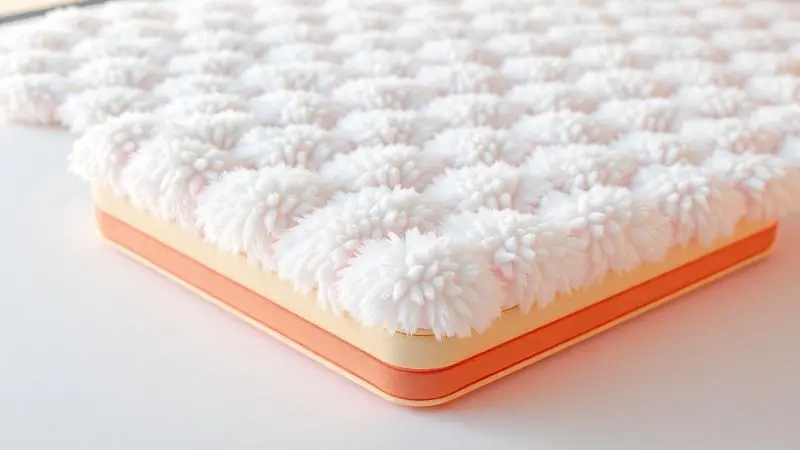
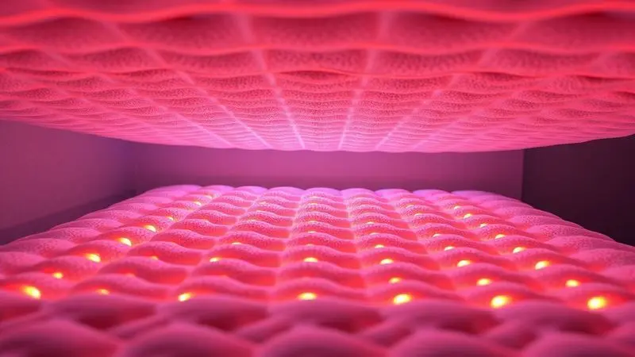
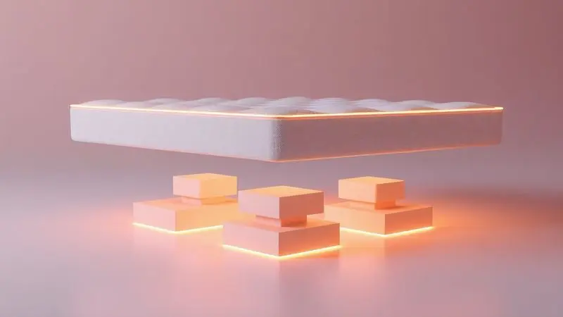

Escolher o colchão ideal é fundamental para garantir uma rotina produtiva e livre de dores nas costas.

Entre as diversas opções no mercado, o Colchão Topázio, especialmente os modelos da Prorelax e versões de molas ensacadas, desperta curiosidade pelo seu equilíbrio entre conforto e custo-benefício. Mas será que ele é realmente bom e resistente para o uso diário?

Neste artigo, vamos analisar profundamente as versões em espuma D23 e molas pocket, explorando desde o suporte de peso até os tratamentos antialérgicos do tecido.

Se você está em dúvida se o colchão Topázio vale a pena, continue lendo para descobrir todos os detalhes técnicos antes de comprar.

<SummaryList products={frontmatter.top_products} />

## Conheça o Colchão Topázio

Imagine deitar em uma superfície que parece abraçar cada curva do seu corpo, aliviando aquela pressão nos ombros e quadris que sempre incomoda. É exatamente essa sensação que o Colchão Topázio da Prorelax busca oferecer.

Ele combina camadas de espuma inteligentes que se adaptam ao seu formato, como se fosse feito sob medida para você.

Aqui não se trata apenas de conforto, mas de uma tecnologia pensada para durar. Enquanto outros colchões perdem a forma depois de alguns meses, o Topázio mantém suas características mesmo com uso intenso.

E o melhor, muitos usuários descobriram que suas noites não apenas ficaram mais confortáveis, mas também mais reparadoras. Acordar renovado pode começar com essa escolha.

## Melhores Modelos de Colchão Topázio para sua Casa

Mas qual modelo se encaixa melhor no seu quarto e no seu estilo de sono? A linha Prorelax oferece opções que vão desde a firmeza que sua coluna precisa até o aconchego que seu corpo deseja.

Cada versão foi desenvolvida pensando em necessidades específicas, garantindo que você encontre o parceiro perfeito para suas noites.

### Colchão Solteiro Espuma D23 Topázio Prorelax

<ProductBox 
  title={frontmatter.top_products[0].title} 
  image={frontmatter.top_products[0].image} 
  link={frontmatter.top_products[0].link} 
/>

Se você busca uma solução prática que não faça concessões ao conforto, este modelo em espuma D23 é sua resposta. Com um suporte firme que mantém sua coluna perfeitamente alinhada, ele é ideal para quem passa o dia sentado e precisa acordar sem aquela rigidez matinal.

O revestimento em tecido Stretch suaviza o toque enquanto facilita a limpeza, perfeito para quem tem animais de estimação ou apenas prefere manter tudo impecável.

Com dimensões de 88x188x12cm, ele é leve o suficiente para se adaptar a diferentes espaços, desde seu quarto principal até aquele canto especial na casa de praia.

Porém, se você é daqueles que adora afundar no colchão como em uma nuvem, essa firmeza pode não ser exatamente o que procura. E com limite de 60 kg, talvez não seja ideal para todos os perfis.

<CaixaProsContras>

**Prós:**

- Conforto firme ideal para alinhamento da coluna

- Revestimento em tecido Stretch facilita a limpeza

- Leve e versátil para diferentes ambientes

- Boa avaliação geral dos usuários

**Contras:**

- Firmeza pode não agradar a todos

- Limite de peso pode ser restritivo para alguns usuários

</CaixaProsContras>

### Colchão Casal Prorelax D23 Topázio

<ProductBox 
  title={frontmatter.top_products[1].title} 
  image={frontmatter.top_products[1].image} 
  link={frontmatter.top_products[1].link} 
/>

Para casais que valorizam a praticidade sem abrir mão do conforto, esta versão oferece o mesmo suporte firme em dimensões que acomodam duas pessoas.

A espuma de poliuretano D23 trabalha para distribuir o peso de forma equilibrada, enquanto o tecido stretch cria uma superfície suave ao toque que convida ao descanso.

Uma das melhores características é sua versatilidade, você pode usar ambos os lados, praticamente dobrando sua vida útil. Os clientes têm demonstrado satisfação consistente, com avaliações que reforçam a qualidade da experiência.

A única ressalta fica por conta da garantia de 6 meses, que pode parecer curta para quem busca maior tranquilidade no investimento.

<CaixaProsContras>

**Prós:**

- Confeccionado com espuma de poliuretano durável.

- Revestimento em tecido stretch para maior conforto.

- Permite uso em ambos os lados.

- Alta satisfação nas avaliações de clientes.

**Contras:**

- Garantia de apenas 6 meses.

- Limitação de peso individual de até 60 kg.

</CaixaProsContras>

### Colchão Casal Topázio Supreme Molas Ensacadas D26

<ProductBox 
  title={frontmatter.top_products[2].title} 
  image={frontmatter.top_products[2].image} 
  link={frontmatter.top_products[2].link} 
/>

Aqui está o segredo para noites tranquilas a dois, mesmo quando seu parceiro se mexe constantemente. As molas ensacadas atuam individualmente, absorvendo movimentos sem transmiti-los para o outro lado da cama.

Você finalmente pode se virar quando quiser sem recear interromper o sono de quem está ao seu lado.

Combinadas com a espuma D26, elas criam um suporte firme que mantém sua coluna em posição ideal durante toda a noite. Os revestimentos variam entre malha fria e suede, cada um com seu toque característico.

Para quem sofre com alergias, a presença de tratamentos antiácaros e antifúngicos transforma o sono em uma experiência mais saudável.

Se você prefere a sensação de afundar em um colchão extremamente macio, essa firmeza pode exigir um período de adaptação.

<CaixaProsContras>

**Prós:**

- Redução da transferência de movimento, ideal para casais.

- Suporte firme com a espuma D26.

- Variedade de tecidos e tratamentos disponíveis.

- Boa durabilidade e resistência.

**Contras:**

- Nível de firmeza pode não agradar a todos.

- Pode ser considerado um pouco mais pesado para manuseio.

</CaixaProsContras>

### Cama Box Casal Itália (Colchão + Base) Topázio

<ProductBox 
  title={frontmatter.top_products[3].title} 
  image={frontmatter.top_products[3].image} 
  link={frontmatter.top_products[3].link} 
/>

Para quem busca uma solução completa que una elegância e conforto em um único pacote, este conjunto oferece exatamente isso.

O sistema de molas ensacadas proporciona suporte individualizado enquanto minimiza a transferência de movimento, e o tecido em malha cria uma superfície respirável e agradável ao toque.

A camada adicional de espuma D28 eleva o conforto a outro nível, perfeito para quem deseja transformar seu quarto em um verdadeiro refúgio. O design pensado para harmonia visual se adapta a diversos ambientes.

Alguns usuários relataram que as tábuas inferiores podem apresentar fragilidade com o tempo, e em certos casos ocorrem barulhos, pontos a considerar se você busca silêncio absoluto.

<CaixaProsContras>

**Prós:**

- Conforto com sistema de molas ensacadas.

- Design elegante que se adapta a diversos ambientes.

- Tecido suave e agradável ao toque.

- Boa relação custo-benefício para quartos de visita.

**Contras:**

- Possibilidade de fragilidade nas tábuas inferiores.

- Barulho excessivo após um período de uso.

</CaixaProsContras>

## Características Principais e Diferenciais do Produto

O que realmente separa o Topázio de outros colchões no mercado? Vamos além das especificações técnicas para entender como cada detalhe transforma suas noites.

### Sistema de Molas Pocket System e Conforto Individualizado

Pare de imaginar que precisa ficar parado para não incomodar quem divide a cama. Com o sistema Pocket System, cada mola trabalha de forma independente, adaptando-se exclusivamente à pressão que recebe.

Seu quadril recebe suporte personalizado, seus ombros afundam na medida certa, e seu parceiro nem percebe quando você muda de posição.

Isso não é apenas tecnologia, é a liberdade de dormir como quiser, sem restrições. E quando seu corpo encontra esse equilíbrio perfeito, o sono se torna mais profundo, mais reparador. Você acorda realmente descansado, não apenas menos cansado.

### Tratamento Antiácaro, Antialérgico e Revestimento em Malha

Se você acorda com espirros ou coceira nos olhos, sabe como esses pequenos incômodos podem arruinar uma noite inteira.

O tratamento antiácaro e antialérgico dos colchões Topázio cria uma barreira invisível contra esses agentes, permitindo que você respire facilmente durante todo o sono.

Junte isso ao revestimento em malha, que permite a circulação de ar enquanto mantém a temperatura agradável, e você tem a combinação perfeita para noites frescas mesmo nos dias mais quentes. Dormir bem também é dormir com saúde.

## Ficha Técnica: Especificações e Dimensões do Produto

Vamos aos números que importam. A espuma de alta densidade não é apenas um termo técnico, é a garantia de que o colchão manterá sua forma mesmo após anos de uso. Disponível em tamanhos que vão do solteiro ao queen size, há uma versão para cada necessidade de espaço.

O tratamento antialérgico funciona como um escudo silencioso, protegendo seu sono sem que você precise pensar nisso. E quando falamos em durabilidade, estamos mencionando um investimento que continuará trazendo retorno em noites bem dormidas por muito tempo.

## Suporte de Peso e Durabilidade do Colchão

Você já teve medo de quebrar um móvel ou afundar um colchão? Com a combinação de espuma de alta densidade e molas ensacadas, o Topázio distribui o peso de forma inteligente, como se cada parte do seu corpo fosse apoiada individualmente.

Essa não é apenas uma questão de resistência, mas de como o colchão preserva suas características ao longo dos anos. Com cuidados simples, como usar um protetor e rotacioná-lo periodicamente, você estende ainda mais sua vida útil.

Pense nisso como um parceiro de sono que envelhece bem, mantendo-se confiável e confortável.

## Sobre a Marca Prorelax e Qualidade do Colchão Topázio

Por trás do Topázio está a Prorelax, uma marca que entende que dormir bem vai além de simplesmente descansar. É sobre acordar preparado para o dia, com energia e sem dores.

A tecnologia de espuma de alta resiliência utilizada nos colchões reflete essa filosofia, oferecendo não apenas conforto imediato, mas durabilidade a longo prazo.

Cada processo de produção é pensado para garantir que seu sono seja não apenas tranquilo, mas verdadeiramente reparador. Quando você escolhe um Topázio, está escolhendo o resultado de anos de pesquisa em ergonomia e conforto.

## Conclusão

Então, o Colchão Topázio realmente vale a pena? Se você busca um equilíbrio inteligente entre conforto e suporte, a resposta parece clara.

Com tecnologia que alivia pontos de pressão enquanto mantém a coluna alinhada, ele atende diversas necessidades de sono de forma eficiente.

Sua durabilidade reforça que este é um investimento que continuará trazendo retorno em noites bem dormidas. No entanto, o fator decisivo sempre será sua experiência pessoal. O conforto é íntimo, subjetivo.

Se possível, experimente antes de comprar, sinta como seu corpo responde à firmeza e ao apoio oferecidos.

Para quem sofre com dores nas costas ou simplesmente deseja transformar as noites em momentos verdadeiramente reparadores, o Topázio se apresenta como uma opção sólida, com tecnologia que conversa diretamente com as necessidades do corpo.

Durma melhor, acorde renovado e descubra como a escolha certa de colchão pode redefinir sua qualidade de vida, uma noite de cada vez.