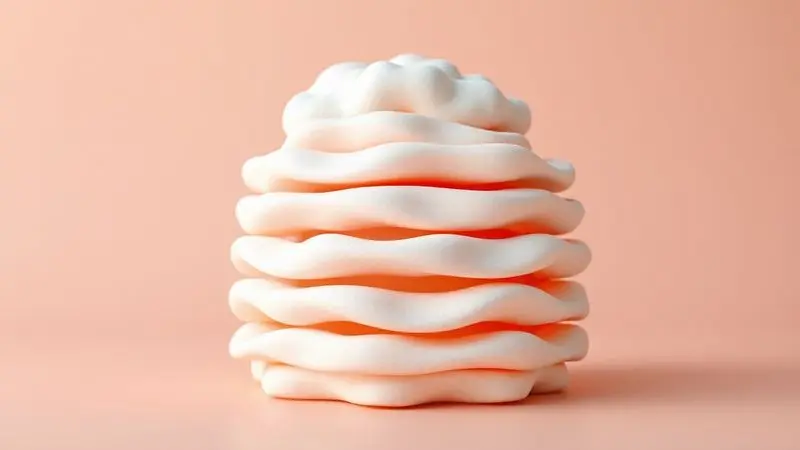

Escolher o colchão de casal perfeito nunca foi apenas sobre medidas ou especificações técnicas. É sobre transformar seu quarto em um refúgio onde cada noite se torna um recomeço.

O Colchão Probel Turim, com sua tecnologia de molas ensacadas e medidas generosas de 138x188x28cm, surge como um dos candidatos mais fortes para essa missão. Mas será que ele realmente entende a intimidade do seu relacionamento?

Entende como dois corpos diferentes precisam descansar juntos sem se atrapalhar? Nesta análise, vamos além das folhas técnicas para descobrir se este produto da Probel Colchões realmente merece compartilhar seus momentos mais íntimos.

<SummaryList products={frontmatter.top_products} />

## Destaques do Colchão Probel Turim

<ProductBox 
  title={frontmatter.top_products[0].title} 
  image={frontmatter.top_products[0].image} 
  link={frontmatter.top_products[0].link} 
/>

Imagine acordar sentindo que dormiu sozinho, mesmo com seu parceiro ao lado. Essa é a promessa do Probel Turim, um colchão de casal que domina a arte do equilíbrio.

Sua alma está nas molas ensacadas individualmente, criando pequenas ilhas de conforto que se adaptam ao seu corpo enquanto ignoram os movimentos alheios. Perfeito para aqueles momentos em que um de vocês vira, levanta ou simplesmente busca posição.

A firmeza é intermediária, como um abraço que sustenta sem apertar. Acima disso, um Pillow Euro acolchoado espera por você, uma camada extra que parece dizer 'bem-vindo' sempre que você se deita.

As espumas de alta densidade (D28 e D33) trabalham silenciosamente para garantir que essa experiência dure anos, não meses.

Para quem se preocupa com limpeza, o tratamento antiácaro e antifungo transforma o cuidado em tranquilidade. E se você odeia a obrigação de virar colchão, respire aliviado: ele suporta até 110 kg por pessoa sem precisar dessa rotina tediosa.

<CaixaProsContras>

**Prós:**

- Conforto excelente com molas ensacadas.

- Minimiza a transferência de movimento.

- Camada extra de conforto com Pillow Euro.

- Material durável e tratamento contra ácaros.

**Contras:**

- O nível de firmeza pode não agradar a todos.

- Não é indicado para quem prefere colchões extremamente macios.

</CaixaProsContras>

### Sistema de molejo ensacado

Você já se perguntou por que alguns colchões parecem sentir cada movimento seu, enquanto outros ignoram completamente quando seu parceiro se vira? A resposta está na tecnologia de molas ensacadas.

Cada mola vive dentro de seu próprio casulo de tecido, trabalhando independentemente como pequenos atletas especializados em sustentar apenas o que tocam.

Isso significa que quando você se mexe, apenas as molas sob seu corpo reagem. As do lado do seu parceiro continuam em paz. Resultado? Você pode levantar para beber água às 3 da manhã sem despertar ninguém.

O fluxo de ar entre essas cápsulas individuais ainda regula a temperatura, mantendo o frescor mesmo nas noites mais quentes. É como ter controle climático pessoal para seu lado da cama.

### Nível de firmeza e conforto

Encontrar a firmeza ideal é como acertar o ponto do café: muito forte cansa, muito fraco não satisfaz. O Turim acerta nesse equilíbrio dourado. As molas ensacadas não apenas sustentam, elas conversam com seu corpo.

Apoiam seus quadris sem pressionar seus ombros, acolhem sua curva lombar sem deixar suas pernas suspensas.

Para quem sempre buscou um colchão que não afunda demais, mas também não parece uma tábua, essa é a resposta. Se você adora afundar em nuvens de maciez, talvez perceba que ele mantém um certo caráter estruturado.

A verdade é que ele não tenta ser tudo para todos, mas sim o ideal para quem valoriza suporte inteligente sobre puro amolecimento.

### Camada de Pillow

Deitar no Turim é como chegar em casa depois de um dia longo e encontrar seu lugar favorito no sofá já preparado. A camada de pillow não é apenas espuma adicional, é um convite.

Ela se molda suavemente aos seus contornos, dissipando a pressão dos pontos onde seu corpo mais pesa.

Essa camada faz mais do que confortar, ela regula. Em noites quentes, permite que o calor escape. Em noites frias, retém o aconchego sem superaquecer.

É a diferença entre dormir 'em' um colchão e dormir 'com' um colchão que parece entender suas necessidades antes mesmo que você as expresse.

### Suporte de peso por pessoa

Cada corpo tem sua história, seu peso, sua forma de se acomodar. O Turim entende isso com sua capacidade de suportar até 110 kg por pessoa, não como um limite, mas como uma garantia. As molas ensacadas transformam diferenças de peso em oportunidades de personalização.

Imagine um casal onde um pesa 90 kg e outro 60 kg. Em colchões comuns, o mais pesado dominaria o espaço, criando um declive. Aqui, cada lado mantém sua independência.

As molas sob o corpo mais pesado trabalham mais intensamente, enquanto as do lado mais leve oferecem apoio proporcional. É justiça física, garantindo que ambos tenham exatamente o suporte que precisam, nem mais, nem menos.

### Espuma do Estofamento

Por trás do conforto imediato, existe uma estrutura que pensa no longo prazo. As espumas de alta densidade do Turim são como a fundação de um edifício: você não as vê, mas sente sua estabilidade todos os dias.

Elas distribuem seu peso de maneira inteligente, evitando que certas áreas sofram mais pressão do que outras.

Essa estratégia de distribuição não apenas prolonga a vida do colchão, como protege seu corpo de pontos de dor matinais. A ventilação integrada funciona como um sistema de respiração, expirando o calor acumulado e mantendo a superfície sempre pronta para recebê-lo.

É tecnologia trabalhando para que você nem precise pensar nela.

### Indicação para biotipos de casais

Cada casal é um universo particular de necessidades e preferências. O Turim brilha exatamente nesse reconhecimento. Ele não tenta criar um padrão único, mas oferece plataformas independentes para que cada pessoa encontre seu equilíbrio.

Para casais com diferenças significativas de peso ou preferências opostas de firmeza, ele atua como mediador silencioso.

A espessura de 28 cm não é apenas medida, é profundidade de adaptação, espaço suficiente para que diferentes corpos criem seus próprios nichos de conforto sem invadir o território alheio. É a diplomacia aplicada ao descanso.

## Sobre o Colchão Turim (138x188x28cm)

Quando você fecha os olhos à noite, não pensa em centímetros ou tecnologias. Pensa em descanso, em renovação, em conexão. O Turim compreende isso.

Suas medidas de 138x188x28cm não são números aleatórios, são o palco perfeito para a intimidade do casal: espaço suficiente para abraçar, mas também para respeitar momentos de solidão compartilhada.

O sistema de molas ensacadas não é apenas uma característica técnica, é a promessa de que seu sono será seu, independentemente do que aconteça do outro lado. A camada de espuma não é simples material, é o carinho que acolhe suas costas cansadas.

Mas a verdadeira magia acontece quando todas essas peças trabalham juntas para criar algo maior que a soma das partes: noites que realmente reparam.

## Ficha técnica detalhada

As especificações do Turim contam uma história de cuidado meticuloso. Com 138x188x28 cm, ele se adapta à maioria das estruturas de cama de casal sem exigir ajustes.

O tecido do revestimento foi escolhido não apenas por sua durabilidade, mas por sua capacidade de respirar com sua pele, mantendo o frescor natural.

O design curvilíneo não é acidente estético, é ergonomia aplicada. Ele segue as linhas naturais do corpo humano, apoiando a coluna na posição que ela busca instintivamente.

Cada detalhe, da costura ao acabamento, foi pensado para desaparecer durante o uso, deixando apenas a experiência pura do descanso.

## Manual e orientações de uso

Para que o Turim continue sendo seu aliado por anos, alguns cuidados simples fazem toda diferença. Girá-lo a cada três meses é como alongar depois do exercício: previne desgastes desiguais e garante longevidade.

Um protetor de colchão funciona como escudo invisível contra imprevistos, preservando a integridade dos materiais.

Na limpeza, prefira um pano úmido e produtos neutros, evitando químicos agressivos que possam comprometer os tratamentos especiais. Deixar o colchão arejar periodicamente não é apenas higiene, é renovação, como abrir as janelas da alma do produto.

Com esse cuidado recíproco, ele retribuirá com noites tranquilas que se multiplicam em bem-estar.

## Conclusão

O Colchão Probel Turim não é apenas um produto, é uma proposta de convivência noturna. Para casais que valorizam independência dentro da intimidade, que buscam suporte sem rigidez e conforto sem excessos, ele representa uma escolha inteligente.

Sua tecnologia de molas ensacadas resolve dilemas antigos da vida a dois, enquanto o equilíbrio de firmeza atende à maioria sem tentar agradar a todos.

Se você está cansado de negociar posições, de acordar com dores inexplicáveis ou de sentir cada movimento do parceiro, o Turim oferece uma trégua elegante.

Ele não promete milagres, mas sim consistência, durabilidade e um entendimento profundo do que significa dormir bem junto.

A decisão final, claro, sempre será sua, mas se suas prioridades incluem equilíbrio, tecnologia inteligente e respeito às individualidades, este colchão merece pelo menos o teste do seu descanso.

Porque no final, o melhor colchão não é o mais tecnológico, mas aquele que deixa de ser notado para que apenas o sono importe.