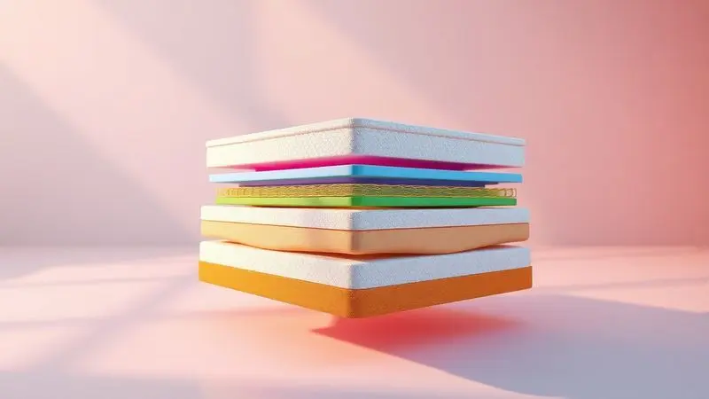
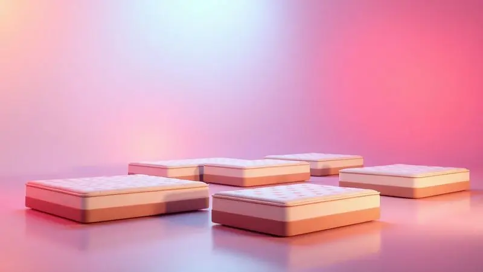

Na hora de escolher um colchão novo, a dúvida pode ser tão incômoda quanto uma noite mal dormida. Entre tantas opções no mercado, você já se perguntou se vale a pena confiar em uma marca nacional como a Umaflex?

Com preços acessíveis e uma linha que vai do infantil ao premium, a questão central é: esses colchões entregam o descanso profundo que prometem?

Analisamos a fundo a marca, suas tecnologias e os oito modelos mais vendidos para descobrir se o investimento em um Umaflex vai trazer paz para suas noites em 2025.

<SummaryList products={frontmatter.top_products} />

## História e Destaques da Marca Umaflex

A jornada da Umaflex começa com uma missão simples: garantir que todo brasileiro tenha acesso a noites de sono realmente reparadoras.

Ao longo dos anos, essa marca nacional construiu sua reputação não apenas com preços acessíveis, mas com um compromisso genuíno em desenvolver tecnologias que entendem o corpo humano.

O que começou como uma aposta no mercado doméstico se transformou em um catálogo diversificado, onde cada modelo carrega décadas de aprendizado sobre como diferentes pessoas dormem.

Essa experiência acumulada é o que permite à marca oferecer desde colchões infantis com proteção antialérgica até sistemas premium de molas que parecem feitos sob medida.

## Principais características dos colchões Umaflex

Se você está cansado de promessas vazias, conheça as três tecnologias que fazem dos colchões Umaflex uma escolha inteligente. Não se trata apenas de materiais, mas de soluções reais para problemas comuns na hora de dormir.

### Molas ensacadas e espuma de fabricação própria

Imagine poder se virar na cama sem que seu parceiro sequer perceba. É exatamente isso que as molas ensacadas individualmente proporcionam: cada uma trabalha de forma independente, absorvendo o movimento exatamente onde ele acontece.

Para casais, isso significa noites inteiras de sono ininterrupto, onde o descanso de um não depende da imobilidade do outro.

A espuma de fabricação própria completa essa experiência, moldando-se ao seu corpo com uma precisão que só quem conhece cada etapa da produção poderia oferecer. Juntas, elas criam a combinação perfeita entre suporte que corrige e conforto que acolhe.

### O Sistema Polyframe

Você já acordou com aquela dor nas costas que parece ter se instalado durante a noite? O Sistema Polyframe foi desenvolvido para acabar com essa sensação.

Mais do que uma estrutura de molas, é uma rede inteligente que se adapta às curvas da sua coluna, distribuindo o peso de forma tão natural que você esquece que está deitado em algo firme.

As camadas superiores de espuma de alta densidade atuam como amortecedores para áreas sensíveis como quadril e ombros, garantindo que a pressão nunca se acumule em um só ponto.

O resultado é um alinhamento postural que continua trabalhando a seu favor mesmo durante as horas mais profundas do sono.

### Madeira de reflorestamento e sustentabilidade

Quando você investe em um colchão Umaflex, está escolhendo mais do que conforto para seu sono.

A madeira de reflorestamento utilizada na estrutura não é apenas uma escolha ecológica, mas um compromisso com durabilidade que vem de árvores cultivadas especificamente para esse fim.

Essa prática significa que seu colchão tem uma base robusta que vem de um ciclo renovável, onde cada produto comprado ajuda a manter florestas nativas intactas.

Para você, isso se traduz em uma estrutura que não cede com o tempo e a tranquilidade de saber que seu descanso não custou o equilíbrio do meio ambiente.

## Umaflex no Reclame Aqui: A marca é confiável?

Antes de levar qualquer produto para casa, é natural checar o que outros consumidores estão falando. No Reclame Aqui, a Umaflex mostra um padrão consistente: responde à maioria das reclamações e busca soluções práticas.

Clientes frequentemente elogiam a durabilidade dos produtos e o conforto que persiste após anos de uso.

Como qualquer marca de grande porte, existem casos pontuais de insatisfação, mas o índice de resolução e o volume de feedback positivo sugerem uma empresa que leva a relação com o consumidor a sério.

Para tomar uma decisão ainda mais segura, vale complementar essa pesquisa lendo avaliações específicas sobre o modelo que mais chama sua atenção.

## TOP Modelos: Qual o melhor colchão Umaflex para comprar em 2025?

A verdade é que não existe 'melhor colchão', existe o melhor colchão PARA VOCÊ. Conhecer suas prioridades é o primeiro passo para acertar na escolha. Separamos os oito modelos Umaflex mais procurados, cada um com sua personalidade única.

### 1. Colchão Queen Molas Ensacadas Ferrara

<ProductBox 
  title={frontmatter.top_products[0].title} 
  image={frontmatter.top_products[0].image} 
  link={frontmatter.top_products[0].link} 
/>

Para casais que já perderam a conta de quantas vezes acordaram um ao outro durante a noite, o Ferrara é a resposta.

Suas 202 molas por metro quadrado trabalham como uma equipe sincronizada: enquanto uma se comprime sob seu quadril, a do lado permanece firme para não perturbar quem está ao seu lado.

Os 30 cm de altura não são apenas uma medida, são a profundidade necessária para camadas de conforto que incluem a tecnologia Euro Top, uma espécie de travesseiro integrado que torna o deitar uma experiência imediatamente reconfortante.

A única ressalva fica por conta da impossibilidade de virá-lo, mas a construção unidirecional é justamente o que garante tanta precisão no suporte.

<CaixaProsContras>

**Prós:**

- Molas ensacadas oferecem ótimo suporte e conforto.

- Redução da transferência de movimento entre parceiros.

- Design moderno e elegante.

- Bom nível de durabilidade e resistência.

**Contras:**

- Não é possível virar o colchão, limitando a manutenção.

- Garantia de apenas 3 meses pode ser considerada curta.

</CaixaProsContras>

#### Detalhes do Colchão Queen Ferrara

O segredo do Ferrara está na maneira como ele conversa com seu corpo. A camada de espuma não apenas cede à sua forma, mas responde com uma pressão suave que alivia pontos de tensão naturalmente.

O material respirável age como um climatizador pessoal, evitando aquela sensação abafada que faz você se revirar em noites quentes. E a durabilidade?

É aquele tipo de característica que você só percebe anos depois, quando o colchão continua oferecendo o mesmo abraço firme do primeiro dia.

### 2. Colchão Casal Espuma Bronze

<ProductBox 
  title={frontmatter.top_products[1].title} 
  image={frontmatter.top_products[1].image} 
  link={frontmatter.top_products[1].link} 
/>

Se seu orçamento é apertado mas sua coluna não negocia conforto, o Bronze encontra o ponto ideal. Com densidade D23, ele oferece a firmeza necessária para manter suas costas alinhadas sem a rigidez que cansa.

O tecido 100% poliéster não é apenas uma escolha econômica: é resistente, fácil de limpar e mantém a aparência nova por mais tempo. A certificação INMETRO é seu selo de qualidade, garantindo que cada centímetro cúbico de espuma passou por testes rigorosos.

Perfeito para quem pesa até 60 kg e busca um investimento consciente que não pesa no bolso nem nas costas.

<CaixaProsContras>

**Prós:**

- Conforto com suporte firme e equilibrado.

- Boa adaptação ao corpo, reduzindo pontos de pressão.

- Materiais de qualidade e durabilidade.

- Certificado pelo INMETRO.

**Contras:**

- Limitação de peso suportado (até 60 kg por pessoa).

- Altura pode não ser suficiente para todos os gostos.

</CaixaProsContras>

#### Detalhes do Colchão Casal Espuma Bronze

Deitar no Bronze é como encontrar o ponto exato entre afundar e flutuar. A espuma de alta densidade se adapta sem engolir seu corpo, criando um suporte ativo que trabalha enquanto você descansa.

A ventilação interna funciona como um sistema de respiração que regula a temperatura, ideal para quem tende a esquentar durante a noite. E o acabamento?

É feito para durar, com costuras reforçadas que resistem ao movimento constante de quem busca a posição perfeita para dormir.

### 3. Colchão Umaflex Duo Flex D45

<ProductBox 
  title={frontmatter.top_products[2].title} 
  image={frontmatter.top_products[2].image} 
  link={frontmatter.top_products[2].link} 
/>

Algumas pessoas não procuram um colchão, procuram uma tábua inteligente. Se você faz parte desse time que acredita que firmeza é sinônimo de qualidade, o Duo Flex D45 é sua alma gêmea.

As duas camadas de espuma D45 criam uma base tão sólida que parece desafiar as leis da física: como algo tão firme pode ser tão confortável? A resposta está na distribuição precisa do peso, que evita pontos de pressão mesmo com densidade máxima.

Com tratamento antiácaro e antialérgico, ele é especialmente indicado para quem sofre com alergias respiratórias. Apenas aviso: se você gosta da sensação de afundar na cama, esse não é seu modelo.

<CaixaProsContras>

**Prós:**

- Firmeza ideal para suporte robusto

- Densidade elevada (D45) certificada

- Altura confortável de aproximadamente 30 cm

- Possíveis tratamentos antiácaro e antialérgico

**Contras:**

- Pode ser muito firme para quem prefere colchões mais macios

- Ausência de um período de teste com possibilidade de troca

</CaixaProsContras>

### 4. Colchão Ouro Umaflex Espuma D33

<ProductBox 
  title={frontmatter.top_products[3].title} 
  image={frontmatter.top_products[3].image} 
  link={frontmatter.top_products[3].link} 
/>

Encontrar o meio-termo perfeito entre maciez e firmeza é uma arte, e o modelo Ouro D33 domina essa técnica. Com densidade D33, ele oferece um abraço que acolhe sem afrouxar, ideal para quem pesa até 90 kg e busca suporte sem rigidez excessiva.

O revestimento em poliéster tem um toque surpreendentemente agradável, longe daquela sensação plástica de tecidos baratos. A variedade de alturas (de 14 a 25 cm) permite que você escolha não apenas o tamanho, mas a profundidade do seu conforto.

Alguns modelos ainda oferecem dupla face, dobrando a vida útil com um simples virada.

<CaixaProsContras>

**Prós:**

- Boa densidade (D33) ideal para suporte.

- Revestimento resistente e agradável ao toque.

- Disponível em diferentes tamanhos e alturas.

- Tratamentos antiácaro e antialérgico garantem conforto.

**Contras:**

- A variedade de opções pode gerar confusão.

- Suporta até 90 kg por pessoa, o que pode ser limitante para alguns usuários.

</CaixaProsContras>

### 5. Colchão Solteiro Espuma D23 Umaflex

<ProductBox 
  title={frontmatter.top_products[4].title} 
  image={frontmatter.top_products[4].image} 
  link={frontmatter.top_products[4].link} 
/>

Para quem dorme sozinho mas não abre mão de qualidade, o Solteiro Bronze é a prova de que tamanho não é documento.

Com dimensões compactas (88x188 cm ou 78x188 cm) e apenas 14 cm de altura, ele oferece tudo que uma pessoa de até 60 kg precisa: suporte correto, conforto imediato e durabilidade certificada pelo INMETRO.

A espuma D23 é a dose certa para corpos mais leves, evitando aquela firmeza excessiva que pode causar desconforto. Leve, fácil de manusear e com um custo-benefício que faz sorrir, é a escolha inteligente para quartos individuais.

<CaixaProsContras>

**Prós:**

- Boa qualidade e conforto

- Durabilidade com certificação do INMETRO

- Custo-benefício atraente

- Leve e fácil de manusear

**Contras:**

- Indicado apenas para biótipos de até 60 kg

- Garantia relativamente curta de 3 meses

</CaixaProsContras>

### 6. Colchão de Espuma Nana Nenê Infantil

<ProductBox 
  title={frontmatter.top_products[5].title} 
  image={frontmatter.top_products[5].image} 
  link={frontmatter.top_products[5].link} 
/>

O sono do seu bebê merece uma proteção especial, e o Nana Nenê entrega exatamente isso. Desenvolvido com espuma D18 aprovada pelo INMETRO, ele oferece a firmeza segura que a coluna em desenvolvimento precisa, sem a rigidez que incomoda.

O tecido antialérgico cria uma barreira contra ácaros e mofos, transformando o berço em um santuário contra alergias. A manutenção é simples: ventilação regular e rodízio ocasional mantêm o colchão como novo.

A única limitação é o peso suportado (até 40 kg), mas isso garante que o produto foi testado especificamente para a segurança infantil.

<CaixaProsContras>

**Prós:**

- Material de qualidade e durável.

- Espuma com densidade D18 oferece bom suporte.

- Tratamentos antiácaro e antialérgico.

- Fácil manutenção e limpeza.

**Contras:**

- Suporta apenas até 40 kg.

- Dimensões podem ser limitadas para alguns berços.

</CaixaProsContras>

### 7. Colchão Umaflex Mocaccino

<ProductBox 
  title={frontmatter.top_products[6].title} 
  image={frontmatter.top_products[6].image} 
  link={frontmatter.top_products[6].link} 
/>

Se você sonha com uma cama que parece um abraço de nuvem, o Mocaccino transforma essa fantasia em realidade. As molas ensacadas trabalham em silêncio, garantindo que cada movimento seu seja absorvido sem ecoar para o outro lado.

A camada Euro Pillow é o segredo: uma espessura extra de maciez que faz você afundar apenas o suficiente para se sentir envolvido.

Com espuma D-26kg/m³ certificada e sistema Polyframe que fortalece as bordas, ele é a escolha premium para quem prioriza conforto acima de tudo. Apenas prepare-se: se firmeza é sua linguagem do amor, esse colchão fala outro idioma.

<CaixaProsContras>

**Prós:**

- Molas ensacadas proporcionam movimento independente.

- Euro Pillow oferece conforto adicional.

- Boa qualidade de materiais com espuma certificada.

- Disponível em tamanhos variados para atender diferentes necessidades.

**Contras:**

- Percepção de maciez excessiva para quem prefere firmeza.

- Limitação de peso para biótipos acima de 120 kg.

</CaixaProsContras>

### 8. Colchão Casal Umaflex Lisboa

<ProductBox 
  title={frontmatter.top_products[7].title} 
  image={frontmatter.top_products[7].image} 
  link={frontmatter.top_products[7].link} 
/>

Para casais que buscam sofisticação sem complicação, o Lisboa é o equilíbrio em forma de colchão. As molas ensacadas dançam conforme a música do seu corpo, reduzindo a transferência de movimento a níveis quase imperceptíveis.

A espuma D20 cria uma firmeza média-macia que acolhe sem afrouxar, perfeita para quem quer alinhamento postural sem sensação de rigidez. O tratamento antialérgico e antiácaro é a cereja do bolo, especialmente para quem sofre com espirros matinais.

Sim, o investimento é maior, mas a durabilidade e o conforto transformam esse preço em economia a longo prazo.

<CaixaProsContras>

**Prós:**

- Molas ensacadas que reduzem a transferência de movimento

- Firmness média macia ideal para alinhamento postural

- Tratamento antialérgico e antiácaro

- Alta respirabilidade e conforto do tampo em malha

**Contras:**

- Preço pode ser mais elevado em comparação a outras opções

- Pode não atender quem prefere colchões muito firmes

</CaixaProsContras>

## Como escolher o melhor colchão Umaflex?

Escolher um colchão é como encontrar o par perfeito de sapatos: precisa se ajustar perfeitamente às suas necessidades. Em vez de se perder em especificações técnicas, faça três perguntas simples que direcionarão sua escolha.

### Molas ensacadas, colchão de espumas ou híbrido?

Pense na sua vida noturna. Dorme sozinho e se mexe muito? As espumas absorvem cada movimento como um amortecedor silencioso. Divide a cama e seu parceiro tem o sono leve?

As molas ensacadas são sua salvação, trabalhando de forma independente para não transmitir agitação. Quer o melhor dos dois mundos? Os híbridos combinam o suporte estruturado das molas com o aconchego das espumas.

A decisão final deve considerar não apenas o conforto imediato, mas como você acorda: renovado ou com dores?

### Escolha o tamanho certo e a densidade ideal para seu peso

O tamanho do colchão define sua liberdade noturna. Um solteiro em uma cama de casal tem espaço para estrelas-do-mar, enquanto um casal em uma cama queen pode precisar de diplomacia espacial.

Quanto à densidade, ela é seu guia de peso: corpos mais leves flutuam melhor em espumas menos densas (D23-D33), enquanto pesos maiores exigem a resistência das densidades elevadas (D45+).

Acertar nessa combinação não só melhora seu sono como prolonga a vida do colchão em anos.

### Verifique o Pillow Top e recursos extras do modelo

Alguns detalhes fazem a diferença entre dormir e sonhar. O Pillow Top é essa camada extra de maciez que transforma o deitar em um afundar controlado, ideal para quem busca conforto imediato.

Recursos como controle de temperatura e materiais respiráveis são invisíveis durante o dia, mas à noite se tornam seus aliados contra suor e calor. Antes de decidir, imagine sua rotina: você esquenta fácil? Tem alergias? Prefere acordar sem marcas no corpo?

As respostas apontarão para os extras que realmente importam.

## Avaliação final: colchão Umaflex é bom? Vale a pena?

Após analisar tecnologia por tecnologia, modelo por modelo, a resposta é clara: sim, os colchões Umaflex são uma escolha sólida.

A marca não se limita a copiar tendências internacionais; ela desenvolve soluções pensadas no corpo brasileiro, no clima tropical e no bolso real.

O que impressiona não é apenas a variedade, mas a consistência: desde o infantil até o premium, há um cuidado evidente com durabilidade, suporte e conforto.

Claro, como qualquer produto, existem limitações (garantias curtas em alguns modelos, restrições de peso específicas), mas o equilíbrio entre qualidade e preço é inegável.

## Conclusão

Escolher um colchão é mais do que uma compra, é um investimento em um terço da sua vida. As noites mal dormidas acumulam-se em cansaço crônico, dores persistentes e irritação desnecessária.

A Umaflex surge como uma ponte acessível entre o desejo de qualidade e a realidade orçamentária brasileira, oferecendo tecnologias que antes eram privilégio de marcas importadas caríssimas.

Seja você um solteiro que valoriza espaço, um casal que precisa de harmonia noturna, um alérgico em busca de refúgio ou alguém que simplesmente quer acordar sem dores, existe um modelo com sua assinatura. A decisão final cabe ao seu corpo: experimente, sinta, compare.

Mas uma coisa é certa: sua próxima noite de sono merece essa atenção. Que tal dar o primeiro passo hoje?

## FAQ: Dúvidas frequentes sobre o Colchão Umaflex

Restaram dúvidas? Reunimos as perguntas mais comuns para que você feche sua compra com total segurança.

### Qual a densidade ideal do colchão Umaflex?

Pare de pensar em números e pense em sensação. Para a maioria dos adultos, a densidade entre 25 e 30 kg/m³ é a zona de conforto perfeita: firme o suficiente para apoiar sua coluna, macia o bastante para acolher seus contornos.

Densidades abaixo podem não oferecer suporte adequado (especialmente acima de 70 kg), enquanto acima de 30 kg/m³ você entra no território da firmeza corretiva, ideal para quem tem dores específicas ou prefere sensação de 'tábua confortável'.

Seu peso e preferência pessoal são os melhores guias: mais leve = menos densidade, mais pesado = mais densidade.

### Quais os benefícios de comprar um colchão Umaflex?

Além do preço acessível, a Umaflex oferece três vantagens concretas: tecnologia adaptada ao Brasil (pensada para nosso clima e biotipos), variedade real (não é apenas marketing, são perfis de sono distintos) e durabilidade comprovada (clientes relatam anos de uso sem perda significativa de conforto).

Você também ganha a tranquilidade de uma marca estabelecida, com rede de assistência nacional e garantias que, embora variem por modelo, são cumpridas.

### Onde encontrar um colchão Umaflex original?

Comece pelo site oficial da marca, que lista revendedores autorizados e promoções em tempo real. Lojas de móveis e colchões especializadas costumam ter modelos para teste físico, essencial para sentir a firmeza antes de decidir.

Grandes marketplaces também oferecem opções, mas sempre verifique se o vendedor é certificado pela Umaflex para evitar falsificações. Dica valiosa: colchões originais sempre trazem etiqueta com selo INMETRO e informações técnicas completas.