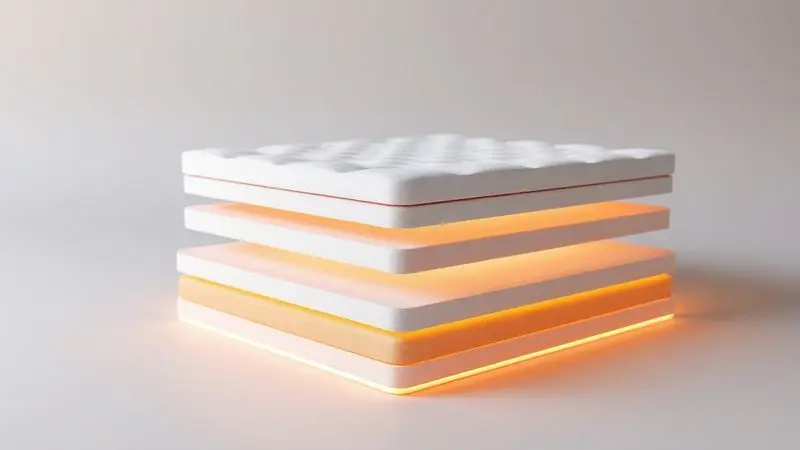

Ao procurar por um novo colchão e se deparar com a marca Zeflex, é natural a dúvida surgir: entre tantos termos técnicos e promessas de conforto, o Colchão Casal Zeflex é bom mesmo?

A resposta não está apenas nas especificações, mas em como essas características se traduzem na sua noite de sono.

Imagine encontrar um colchão que realmente se adapta ao seu corpo, que minimiza aquele desconforto de acordar com o movimento do parceiro e que oferece o suporte exato que sua coluna precisa.

Com modelos populares como o Maré e o Montanna, a Zeflex propõe duas respostas diferentes para a mesma pergunta. Este guia vai além das dimensões e densidades, conectando cada tecnologia ao benefício real que você sentirá todas as manhãs.

<SummaryList products={frontmatter.top_products} />

## Colchão Casal Zeflex 138X188X26 Maré Eps Molas Ensacadas Azul Marinho

<ProductBox 
  title={frontmatter.top_products[0].title} 
  image={frontmatter.top_products[0].image} 
  link={frontmatter.top_products[0].link} 
/>

Pense naquela sensação de afundar em um colchão que parece moldado exatamente para o seu corpo. É essa experiência que o Maré oferece, graças às suas molas ensacadas individualmente.

Cada mola trabalha de forma independente, distribuindo seu peso de maneira uniforme e aliviando os pontos de pressão nos ombros e quadris. Você não está apenas deitando sobre uma superfície, está recebendo um suporte ativo que acompanha seus movimentos durante a noite.

A camada adicional de espuma de alta densidade funciona como um abraço firme para sua coluna, mantendo o alinhamento natural enquanto você descansa. E para quem costuma acordar com calor, o segredo está no revestimento.

Tecido em um material macio e respirável, ele permite que o ar circule, regulando a temperatura e transformando seu sono em algo verdadeiramente refrescante.

Com capacidade para suportar até 120 kg por pessoa e um nível de conforto que chamamos de "o ponto ideal", ele é a escolha para quem busca equilíbrio entre aconchego e sustentação, sem firmeza excessiva.

<CaixaProsContras>

**Prós:**

- Tecnologia de molas ensacadas que se adapta ao corpo.

- Camada de espuma de alta densidade para maior conforto.

- Revestimento respirável que ajuda na regulação da temperatura.

- Suporte indicado para até 120kg por pessoa.

**Contras:**

- Não acompanha a base box, que precisa ser comprada à parte.

- Classificação intermediária pode não agradar quem busca firmeza excessiva.

</CaixaProsContras>

## Colchão Casal Zeflex 138X188X32 Montanna EPS Plus Molas Ensacadas

<ProductBox 
  title={frontmatter.top_products[1].title} 
  image={frontmatter.top_products[1].image} 
  link={frontmatter.top_products[1].link} 
/>

Se a sua maior frustração é acordar toda vez que seu parceiro se vira na cama, o Montanna foi pensado para você. Com 32 cm de altura e a mesma tecnologia de molas ensacadas, ele leva o conceito de independência a outro nível.

Cada mola é literalmente embrulhada em seu próprio compartimento, criando uma barreira que absorve o movimento. O resultado é simples: um pode se revirar à vontade enquanto o outro continua imerso no próprio sono, sem interferências.

A espuma DN20 KG/M3 dá a ele uma densidade que promete durar anos sem perder a forma, enquanto o revestimento em poliéster malha e suede oferece um toque que convida ao descanso imediato.

Com suporte projetado para até 120 kg por metro quadrado, ele é robusto, mas sua altura de 32 cm exige atenção. Antes de escolhê-lo, verifique se sua cama atual e seus lençóis acomodam essa espessura extra que, em troca, entrega uma sensação de luxo e suporte completo.

<CaixaProsContras>

**Prós:**

- Tecnologia de molas ensacadas que evita a transferência de movimento.

- Conforto adequado com espuma de boa densidade.

- Revestimento macio e agradável ao toque.

- Bom suporte para até 120 kg por metro quadrado.

**Contras:**

- Pode ser leve para pessoas mais pesadas.

- Altura de 32 cm pode não ser ideal para todos os tipos de cama.

</CaixaProsContras>

## Descrição do produto

Então, como escolher entre o Maré e o Montanna? A decisão vai além das especificações técnicas e toca na sua rotina de sono. O Maré, com seus 26 cm de altura, é o camaleão dos colchões.

Ele se adapta à maioria das camas existentes e oferece o que muitos consideram o equilíbrio perfeito: não é muito macio a ponto de afundar, nem tão firme que parece uma tábua.

Sua espuma EPS garante durabilidade e uma firmeza consistente que protege seu investimento ao longo do tempo. É para quem prioriza versatilidade e um descanso alinhado, sem complicações.

Já o Montanna é a solução para um problema específico. Se você divide a cama e valoriza a independência do sono, os 32 cm e as molas ensacadas fazem dele um investimento estratégico. A altura extra não é apenas estética, traduz-se em mais camadas de conforto e suporte.

A espuma de alta densidade e o tratamento do tecido criam um ambiente que parece saído de um hotel boutique. Escolhê-lo é optar por uma experiência de sono premium, onde cada detalhe foi pensado para isolar você do mundo e dos pequenos movimentos ao lado.

## Colchão Casal Eurosono 138X188X32 Montanna EPS Plus Molas Ensacadas

<ProductBox 
  title={frontmatter.top_products[2].title} 
  image={frontmatter.top_products[2].image} 
  link={frontmatter.top_products[2].link} 
/>

Se você está considerando outras marcas no mesmo segmento de preço e tecnologia, o Eurosono Montanna surge como uma alternativa interessante.

Ele compartilha muitas características com o modelo Zeflex, incluindo as molas ensacadas individualmente e as dimensões de 138x188x32 cm, mas traz consigo alguns diferenciais que podem pesar na sua decisão.

Um dos principais atrativos são os tratamentos antiácaro e antialérgico aplicados ao tecido. Para quem sofre com alergias ou simplesmente deseja um ambiente de sono mais higiênico, essa pode ser a característica que fecha o negócio.

A placa de EPS na composição garante a sustentação necessária, enquanto o revestimento em malha poliéster mantém a respirabilidade. É importante notar, no entanto, que a disponibilidade pode variar entre vendedores, e o preço nem sempre será o mais acessível do mercado.

Avaliá-lo significa colocar na balança a conveniência dos tratamentos especiais contra a possível necessidade de pesquisar um pouco mais para encontrá-lo.

<CaixaProsContras>

**Prós:**

- Molas ensacadas que oferecem suporte individualizado.

- Nível de conforto intermediário, ideal para diversas pessoas.

- Tratamentos antiácaros e antialérgicos.

- Boa altura para uma melhor ergonomia.

**Contras:**

- Disponibilidade pode variar entre vendedores.

- Pode não ser a opção mais acessível do mercado.

</CaixaProsContras>

## Conclusão

Decidir por um colchão Zeflex, seja o Maré ou o Montanna, é mais do que comparar preços e especificações. É entender qual modelo conversa com as suas necessidades específicas de sono.

O Maré se apresenta como o parceiro versátil, pronto para se adaptar à sua cama e oferecer anos de conforto equilibrado, sem surpresas.

Já o Montanna é o especialista, focado em resolver a transferência de movimento e entregar uma experiência de dormitório premium, mesmo que exija um espaço adequado para sua altura generosa.

Ambos compartilham a tecnologia inteligente das molas ensacadas, que transforma um simples deitar em um descanso verdadeiramente personalizado.

A escolha final, portanto, não é sobre qual colchão é "melhor", mas sobre qual história de sono você quer viver todas as noites. Considere seu espaço, seu orçamento e, principalmente, como você quer acordar todas as manhãs.

O investimento em um bom colchão é um investimento em você mesmo. Agora, com as informações em mãos, você pode fechar os olhos e visualizar qual dessas opções vai garantir as noites de sono reparadoras que você merece.