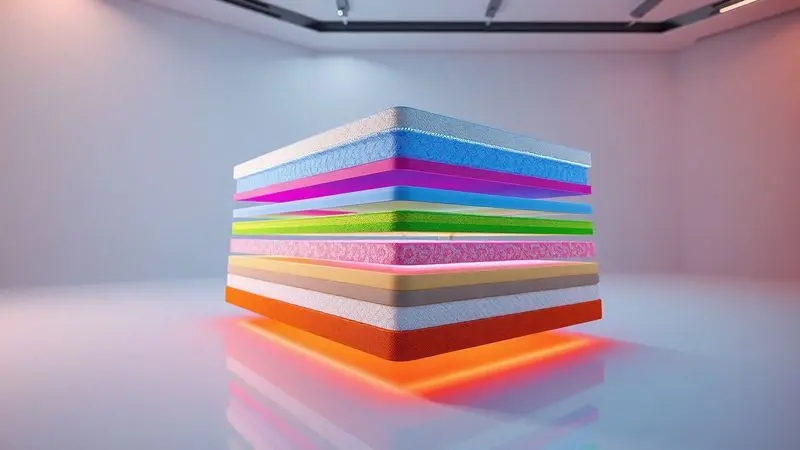
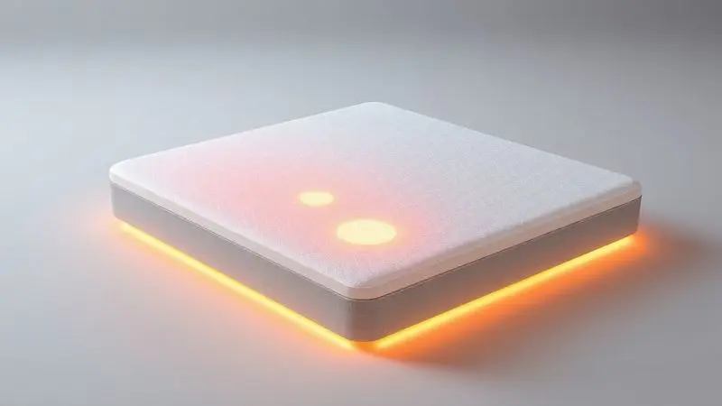

Comprar um colchão novo é mais do que uma simples compra, é uma decisão que define sua qualidade de vida por anos. Imagine acordar sem aquela dor nas costas, sentir seu corpo realmente relaxado depois de uma jornada intensa.

Entre as marcas que prometem essa transformação, a Zissou vem com uma proposta que vai além do convencional: tecnologia premium entregada em uma caixa. Mas essa promessa se sustenta na prática?

Analisamos os modelos Spark, Blue e Coral Híbrido para descobrir se o investimento vale cada centavo do seu descanso.

<SummaryList products={frontmatter.top_products} />

## O Colchão Zissou é bom? Entenda a proposta da marca

A Zissou não quer apenas ser um colchão no seu quarto, quer ser uma experiência completa de descanso.

Desde o primeiro momento, quando você recebe aquela caixa compacta (que elimina o drama da entrega de colchões gigantes), até a expansão que se transforma em seu novo lar de sono.

O diferencial está na combinação: materiais que respeitam o meio ambiente com tecnologias que respeitam seu corpo. Se você dorme de lado, de barriga ou alternando posições, existe um modelo pensado para você.

A variedade não é apenas sobre tamanhos, mas sobre como seu corpo se sente durante aquelas 8 horas cruciais.

## O que é o conceito de colchão na caixa?

Você já enfrentou a dificuldade de receber um colchão tradicional? Muitas vezes precisa de ajuda para carregar, espaço para manobrar, e a instalação pode ser um verdadeiro desafio. O colchão na caixa reinventa essa experiência.

Ele é compactado, enrolado e vem em um pacote que você pode carregar sozinho até o quarto. Quando abre, o material se expande gradualmente, assumindo sua forma completa.

Essa praticidade não é apenas sobre facilidade, é sobre democratizar o acesso a colchões de alta qualidade sem a necessidade de visitar lojas físicas.

A maioria dos fabricantes oferece períodos de testagem, permitindo que você decida se esse novo companheiro de sono realmente combina com você.

## Colchões Zissou G3: Bem vindos a nova era do sono

A terceira geração dos colchões Zissou não é apenas uma evolução técnica, é um upgrade emocional. Imagine não apenas dormir, mas descansar com a sensação de que cada parte do seu corpo recebe atenção individual.

Os modelos G3 são projetados para serem parceiros silenciosos que trabalham enquanto você recupera suas energias.

### Colchão Zissou Spark

<ProductBox 
  title={frontmatter.top_products[0].title} 
  image={frontmatter.top_products[0].image} 
  link={frontmatter.top_products[0].link} 
/>

Se você busca um equilíbrio inteligente entre investimento e qualidade, o Spark é sua porta de entrada para o universo Zissou. Disponível nas versões híbrida e de espuma, ele promete aquele suporte que transforma o simples 'dormir' em uma experiência restauradora.

A versão híbrida combina espuma viscoelástica com molas ensacadas, criando uma sensação única: firmeza que não sacrifica o acolhimento.

Com nível de firmeza 7, é considerado o modelo mais robusto da linha. Isso significa segurança para quem precisa de apoio extra, especialmente para quem tem preocupações com a coluna.

A construção reduz significativamente a transferência de movimento, pense em não sentir o parceiro se mexendo durante a noite, permitindo que ambos tenham seu espaço de descanso intacto. A garantia de 10 anos reforça a confiança no produto.

Se sua preferência inclina-se para colchões mais macios, o Spark pode parecer inicialmente um desafio. Mas para quem valoriza firmeza estrutural e suporte consistente, ele pode ser justamente o que seu corpo pede.

<CaixaProsContras>

**Prós:**

- Bom equilíbrio entre custo e qualidade.

- Conforto com suporte ideal para colchões firmes.

- Tecnologia de regulação térmica para noites frescas.

- Baixa transferência de movimento, ótimo para casais.

**Contras:**

- Pode ser considerado rígido para quem prefere colchões mais macios.

- É o modelo de entrada, então pode faltar recursos de alguns modelos premium.

</CaixaProsContras>

### Colchão Zissou Blue

<ProductBox 
  title={frontmatter.top_products[1].title} 
  image={frontmatter.top_products[1].image} 
  link={frontmatter.top_products[1].link} 
/>

Quando o padrão Spark já satisfaz, mas você quer elevar sua experiência ao nível premium, o Blue aparece como a escolha definitiva.

Sua estrutura híbrida combina espumas viscoelásticas importadas, látex natural e molas ensacadas, uma sinergia que transforma a superfície do colchão em um espaço personalizado para seu corpo.

A tecnologia Ultra Cooling é o coração dessa experiência. Imagine dormir em um clima tropical sem sentir seu corpo sufocar sob o calor. Essa regulação de temperatura acontece silenciosamente durante toda a noite.

O zoneamento ergonômico oferece suporte adequado e alivia pontos de pressão específicos, como aquela dor no ombro que sempre aparece quando você dorme de lado.

A capa do colchão tem um acabamento elegante e é parcialmente confeccionada à mão, um detalhe que reforça o cuidado em cada etapa da produção. Naturalmente, esse nível de refinamento tem um custo que pode ser considerado elevado para alguns budgets.

Mas para quem prioriza o descanso como um investimento em saúde e bem-estar, o Blue justifica cada centavo.

<CaixaProsContras>

**Prós:**

- Tecnologia Ultra Cooling que regula a temperatura

- Híbrido com molas ensacadas e látex natural

- Zoneamento ergonômico para melhor suporte

- Acabamento elegante e feito parcialmente à mão

**Contras:**

- Preço pode ser elevado para alguns consumidores

- Algumas dimensões são sob encomenda com prazo maior de entrega

</CaixaProsContras>

### Colchão Zissou Coral Híbrido

<ProductBox 
  title={frontmatter.top_products[2].title} 
  image={frontmatter.top_products[2].image} 
  link={frontmatter.top_products[2].link} 
/>

Para quem busca um ponto intermediário entre o Spark e o Blue, o Coral Híbrido apresenta uma proposta equilibrada. Combinando molas ensacadas com camadas de espuma, ele oferece suporte inteligente que se adapta ao seu corpo sem comprometer o conforto.

O látex hipoalergênico e viscoelástico premium trabalham juntos para criar uma base respirável.

O tecido desenvolvido para não retar calor significa que você não precisa se preocupar com aquela sensação de sufocamento nas noites mais quentes.

Com garantia de 5 anos e período de teste de 100 dias, você tem tempo suficiente para descobrir se esse colchão realmente se torna parte do seu ritual de descanso.

A capacidade de suporte varia entre os modelos, algumas opções suportam até 120 kg por lado. Se você busca um híbrido que equilibra qualidade técnica com investimento consciente, o Coral pode ser sua resposta.

<CaixaProsContras>

**Prós:**

- Combinação eficaz de molas e espumas

- Tecido que não retém calor

- Garantia de 5 anos

- Período de teste de 100 dias

**Contras:**

- Capacidade de peso pode variar entre os modelos

- Pode não ser acessível a todos os orçamentos

</CaixaProsContras>

#### Descrição da Fabricante e especificações técnicas

A Zissou não fabrica apenas colchões, cria ecossistemas de descanso. Cada modelo é resultado de uma busca constante por inovação que não sacrifica a qualidade.

Materiais sustentáveis e de alta durabilidade são combinados com camadas de espuma de memória, sistemas de suporte ortopédico e tecidos respiráveis. A proposta é simples: proporcionar um sono reparador que respeite tanto seu corpo quanto o planeta.

A empresa oferece opções de firmeza e tamanhos que conversam diretamente com diferentes perfis, desde quem dorme solo até casais que precisam de espaços individuais dentro do mesmo colchão.

#### Avaliação do Colchão Zissou Coral Híbrido

O Coral Híbrido é mais que um colchão, é um mediador entre firmeza e conforto. A combinação de camadas de espuma e mola cria uma base que sabe quando ser firme e quando ser acolhedora.

A tecnologia de adaptação ao corpo pode ser especialmente benéfica para quem enfrenta desafios na coluna ou simplesmente deseja transformar sua rotina de sono.

O revestimento respirável mantém uma temperatura agradável, eliminando aquela necessidade de ajustar o ar-condicionado durante a madrugada. Se você busca uma solução prática que atende diversos perfis sem comprometer a qualidade técnica, o Coral oferece esse equilíbrio.

## Como escolher um Colchão Zissou ideal para você?

Escolher seu colchão Zissou é como encontrar um parceiro de descanso, precisa combinar com seus hábitos, suas necessidades e seu espaço.

Primeiro, pense sobre como você dorme: se você é um dorminhoco de lado, um colchão mais macio pode ser o aliado que alivia a pressão nos ombros e quadris.

Se você prefere dormir de costas ou de barriga, algo mais firme oferece o suporte necessário para manter sua coluna alinhada.

Considere também o material: os colchões Zissou variam entre espuma e mola, cada um com seu universo de sensações. Verifique as dimensões do seu espaço, um colchão que se encaixa confortavelmente no seu quarto é parte fundamental da experiência.

E lembre-se: mesmo com períodos de testagem, seu corpo é o melhor avaliador. Permita-se sentir como cada modelo responde ao seu peso, sua postura e seus movimentos.

## Qual é o preço do Colchão Zissou?

Investir em um colchão Zissou é sobre compreender valor além do preço. Os custos variam naturalmente conforme modelo e tamanho, mas o que realmente importa é a relação entre o que você investe hoje e o que recebe durante anos.

Um colchão de qualidade impacta diretamente na qualidade do seu sono, e consequentemente na sua saúde, energia e disposição. Quando analisa o preço, pense não apenas no número, mas na durabilidade, no conforto e na transformação que esse produto traz para suas noites.

## Conclusão

A jornada para encontrar o colchão perfeito pode parecer complexa, mas a Zissou oferece um mapa claro com opções que conversam diretamente com diferentes necessidades.

Desde o Spark, que equilibra custo e qualidade com firmeza robusta, até o Blue, que eleva o descanso ao nível premium com tecnologias de regulação térmica e zoneamento ergonômico, cada modelo tem sua voz própria.

O Coral Híbrido aparece como o mediador ideal, combinando características técnicas com investimento consciente.

O conceito de colchão na caixa elimina as barreiras logísticas, permitindo que você receba qualidade premium sem o drama tradicional da entrega. Materiais sustentáveis reforçam que seu descanso também respeita o planeta.

A decisão final não é sobre qual colchão é 'o melhor', é sobre qual colchão é 'o seu'. Seu corpo, seus hábitos de sono e seu espaço são os verdadeiros guias. A Zissou oferece opções, mas você oferece a experiência.

Escolha conscientemente, teste com atenção, e transforme suas noites em verdadeiros momentos de recuperação.