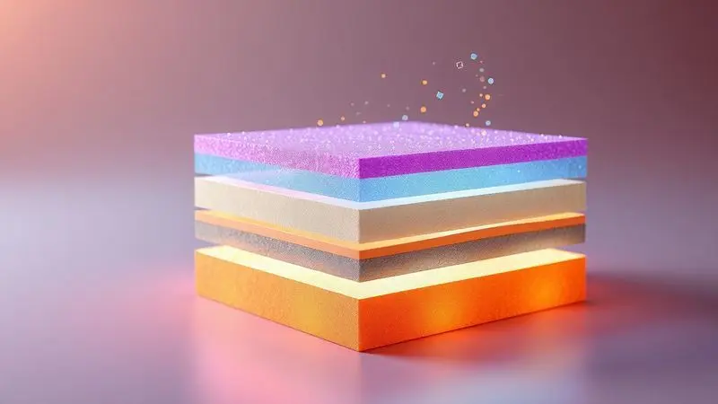
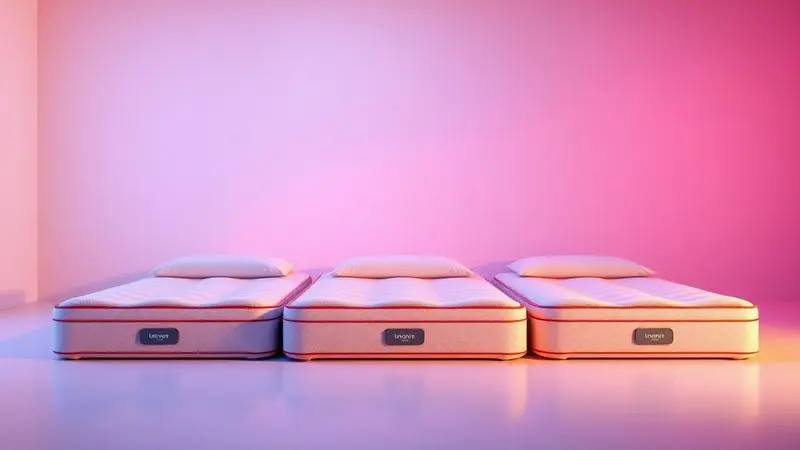
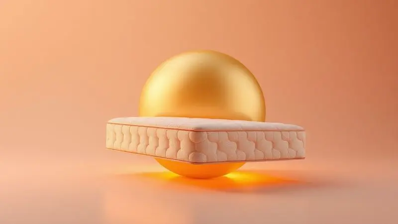

Escolher o colchão ideal é uma daquelas decisões que nos faz virar na cama, literalmente. Com tantas opções 'bed-in-a-box' no mercado, fica aquele frio na barriga: será que o colchão Luuna é bom mesmo?

Essa marca mexicana conquistou o Brasil prometendo alta tecnologia, dormir fresco como uma brisa suave e a segurança de testar por 100 noites. Mas entre promessas e realidade, o que realmente importa é como seu corpo vai acordar depois de meses usando um colchão.

Neste artigo, deixamos o marketing de lado e mergulhamos na experiência real, analisando cada modelo, ouvindo quem já dormiu neles e desvendando se vale mesmo abrir a sua carteira.

<SummaryList products={frontmatter.top_products} />

## Colchão Luuna: o que você precisa saber

Quando você abre a caixa de um Luuna, encontra muito mais que espuma. Encontra uma filosofia de sono que começa com camadas inteligentes de foam e espuma de alta densidade, distribuindo seu peso de forma tão equilibrada que pontos de pressão praticamente desaparecem.

A magia está na personalização: você escolhe a firmeza que seu corpo precisa. E para aqueles que acham que um colchão bom precisa ser feio, o design contemporâneo da Luuna prova o contrário, integrando-se com naturalidade à decoração do seu quarto.

Ainda assim, conforto é como sabor: pessoal e intransferível. Por isso a marca insiste tanto em algo que vamos explorar a seguir.

## Por que os colchões Luuna são tão populares?

Você já parou para pensar no que realmente torna um colchão popular? Não é apenas preço ou propaganda. Com a Luuna, o segredo está em como eles transformam características técnicas em experiências que você sente.

A tecnologia deixa de ser um jargão do site e se torna a memória muscular da sua coluna relaxando. A personalização deixa de ser um checkbox e se torna a escolha perfeita entre um abraço aconchegante e um suporte firme.

Tudo isso embalado em uma proposta que chega à sua porta, eliminando a dor de cabeça de percorrer lojas.

### O que é a certificação CertiPUR-US?

Imagine dormir sabendo que cada respiração noturna não traz consigo substâncias químicas que seu corpo teria que processar. É isso que a certificação CertiPUR-US garante.

Mais que um selo no site, é a certeza de que sua espuma é livre de formaldeído, metais pesados e outros compostos orgânicos voláteis que poderiam afetar sua saúde. A produção segue rigores ambientais, então seu descanso não vem às custas do planeta.

Isso significa acordar com a tranquilidade de quem fez uma escolha que cuida do corpo e do ambiente. E quando você combina essa segurança com a liberdade para experimentar…

## 100 noites para testar e aprovar

A Luuna entrega seu colchão junto com um convite tentador: durma com ele por 100 noites antes de decidir. Essa não é apenas uma política comercial, é um alívio psicológico. Tira o peso da decisão.

Transforma a compra de um colchão em um relacionamento de teste, onde você pode conhecer verdadeiramente como seu corpo reage a cada curva, apoio e nível de firmeza. É como namorar antes de casar, mas com o suporte lombar.

### O que acontece com os colchões devolvidos?

Se você já pensou na sustentabilidade disso, saiba que a Luuna também pensou. Um colchão devolvido passa por uma inspeção minuciosa para avaliar se está em condições de ser recondicionado.

Quando possível, ele é limpo, preparado e destinado a programas de revenda acessível ou doação. Quando não, segue os protocolos ambientais adequados.

Essa circularidade dá uma segunda chance ao produto e oferece opções econômicas para quem busca qualidade com orçamento mais apertado. E essa ética se reflete na forma como a empresa lida com os clientes.

## Reputação da Luuna no Reclame Aqui

Conhecer a reputação de uma marca é como perguntar à vizinhança sobre um novo morador. No Reclame Aqui, a Luuna mostra um perfil de quem atende de forma satisfatória, com uma taxa de resolução que deixa a maioria dos consumidores tranquilos.

Sim, há reclamações sobre prazos de entrega e momentos de atendimento mais lentos, algo quase inevitável em qualquer empresa de grande volume.

Mas o que chama atenção é a consistência com que a marca resolve problemas quando eles surgem, especialmente em casos de troca ou devolução. Quem experimenta os produtos, em geral, volta para elogiar a qualidade.

Essa dualidade oferece uma visão honesta: você terá qualidade no produto e uma empresa que busca corrigir seus deslizes.

## Quais são os melhores colchões da Luuna?

Entrar na linha da Luuna é como visitar uma confeitaria sofisticada: cada modelo tem seu sabor, sua textura, seu momento ideal. Dos mais acessíveis aos mais tecnológicos, cada um oferece uma experiência de sono diferente.

Vamos além das descrições técnicas para entender qual deles pode ser a cama dos seus sonhos.

### Colchão Luuna Original

<ProductBox 
  title={frontmatter.top_products[0].title} 
  image={frontmatter.top_products[0].image} 
  link={frontmatter.top_products[0].link} 
/>

Imagine um colchão que acolhe o formato do seu corpo como um abraço, mas mantém sua coluna alinhada como um fisioterapeuta faria. Essa é a essência do Luuna Original.

Disponível em três alturas (21, 26 ou 32 cm), ele usa a tecnologia Cooling Tech® para transformar noites abafadas em brisas refrescantes.

A LuunaGel® trabalha nas camadas de alta densidade para dissipar pontos de pressão e promover um alinhamento postural quase terapêutico.

Para quem busca uma superfície extremamente firme, talvez não seja o amor à primeira vista. Mas a variedade de firmezas disponíveis significa que a maioria encontra seu ajuste ideal, especialmente quem valoriza uma adaptação sutil do corpo ao colchão.

<CaixaProsContras>

**Prós:**

- Conforto e suporte personalizados.

- Tecnologia Cooling Tech® para noites frescas.

- Alta taxa de satisfação entre os usuários.

- Garantia de 10 anos e 100 noites de teste.

**Contras:**

- Pode não agradar quem busca firmeza máxima.

- O custo pode ser um pouco elevado em comparação a marcas menos conhecidas.

</CaixaProsContras>

#### Ficha Técnica do Luuna Original

O coração do Luuna Original bate com espuma de alta densidade que memoriza seus contornos e alivia pressões de forma inteligente.

Sua respirabilidade é assegurada por um tecido superior que trabalha em conjunto com a tecnologia de resfriamento, criando um microclima ideal para o sono.

Nas opções moderadas de firmeza, encontra equilíbrio para casais com preferências diferentes, enquanto a garantia robusta oferece paz para os próximos anos.

### Colchão Luuna Supreme

<ProductBox 
  title={frontmatter.top_products[1].title} 
  image={frontmatter.top_products[1].image} 
  link={frontmatter.top_products[1].link} 
/>

Se sua busca é por um colchão que seja um verdadeiro refúgio macio, o Supreme chega com 32 cm de puro aconchego. O Cool Touch e o Copper Memory Foam trabalham em dupla para regular a temperatura, especialmente bem-vindos em regiões quentes.

O abraço da espuma é tão gentil que você sente como se estivesse flutuando.

Para casais, o isolamento de movimento é um anjo da guarda: um se vira, o outro continua imerso no próprio sonho.

Alguns usuários levantam questões sobre a durabilidade com o passar dos anos, mas essa preocupação é atenuada pela garantia de uma década e pelo conforto que faz muitos dormirem sorrindo.

<CaixaProsContras>

**Prós:**

- Conforto e maciez excepcionais.

- Tecnologia de resfriamento eficaz.

- Acabamento de alto nível e design atraente.

- Boa praticidade na entrega e manuseio.

**Contras:**

- A durabilidade pode ser uma preocupação.

- O modelo é mais voltado para quem prefere colchões macios.

</CaixaProsContras>

#### Ficha Técnica do Luuna Supreme

A camada viscoelástica do Supreme entende seu corpo como poucas: adapta-se, alivia pressões e mantém o alinhamento da coluna sem esforço.

Enquanto você dorme, a tecnologia de resfriamento dissipa o calor gerado pelo corpo, e o tecido respirável garante que o ar circule livremente. Disponibilidade em vários tamanhos garante que cada um encontre sua medida perfeita de sono personalizado.

### Colchão Luuna Blue

<ProductBox 
  title={frontmatter.top_products[2].title} 
  image={frontmatter.top_products[2].image} 
  link={frontmatter.top_products[2].link} 
/>

Com 21 cm de altura e três camadas inteligentes, o Luuna Blue é o equilibrista da linha. A tecnologia Air Flow ventila, a Cloud Comfort abraça com memória e a Active Support estrutura.

Essa combinação cria uma firmeza que suporta a coluna sem ser agressiva, ideal para diferentes biotipos e posições de sono.

A espuma de memória trabalha discretamente para aliviar áreas sensíveis, e a redução de transferência de movimento faz dele um companheiro silencioso para casais. Para quem prefere o afundamento de colchões mais macios, talvez o Blue não seja a resposta.

Mas se você busca versatilidade com frescor, ele se destaca.

A adaptação é quase imediata, e a distribuição uniforme de pressão faz com que você esqueça que tem um corpo para posicionar.

<CaixaProsContras>

**Prós:**

- Conforto e suporte equilibrados.

- Boa adaptação ao corpo com a espuma de memória.

- Redução da transferência de movimento, ideal para casais.

- Camada Air Flow que aumenta o frescor.

**Contras:**

- Pode ter um odor inicial ao ser aberto.

- Não é a melhor escolha para quem busca extremo conforto macio.

</CaixaProsContras>

#### Ficha Técnica do Luuna Blue

A construção do Blue é uma sinfonia em camadas: no topo, a espuma de memória que acalenta os contornos do corpo, abaixo, a espuma de alta densidade que dá longevidade e consistência.

O tecido respirável mantém o clima agradável durante a noite, e as várias medidas disponíveis garantem que o sono caiba em qualquer espaço.

### Colchão Luuna Support

<ProductBox 
  title={frontmatter.top_products[3].title} 
  image={frontmatter.top_products[3].image} 
  link={frontmatter.top_products[3].link} 
/>

Se sua coluna reclama com frequência e você anseia por um suporte que acalme essas dores, o Luuna Support chega falando a língua das vértebras.

Com firmeza classificada em 8/10, as camadas Air Flow e Active Support oferecem respirabilidade e robustez em uma estrutura que suporta até 150 kg por pessoa.

A capa removível e lavável é um mimo para quem valoriza limpeza fácil, e o alívio de dores nas costas é testemunhado por quem já trocou noites de desconforto por descanso reparador.

Para quem prefere o afundamento macio de outros modelos, essa firmeza pode ser um ajuste. Mas se sua prioridade é estrutura sólida e material de qualidade, esse é o escolhido.

<CaixaProsContras>

**Prós:**

- Excelente suporte ortopédico para a coluna.

- Capa removível e lavável facilita a limpeza.

- Boa durabilidade com alta resistência ao peso.

- Contribui para um sono fresco e confortável.

**Contras:**

- Pode ser firme demais para quem prefere colchões macios.

- O transporte pode ser complicado devido ao tamanho da embalagem.

</CaixaProsContras>

#### Ficha Técnica do Luuna Support

O Luuna Support conta com espuma de alta densidade que trabalha como uma rede inteligente, aliviando pressões em pontos estratégicos enquanto a estrutura de mola ensacada ventila e controla temperatura.

É hipoalergênico, oferecendo segurança extra para alérgicos, e seu design moderno esconde cuidados ortopédicos que transformam noites de sono.

### Colchão Luuna Essential

<ProductBox 
  title={frontmatter.top_products[4].title} 
  image={frontmatter.top_products[4].image} 
  link={frontmatter.top_products[4].link} 
/>

Para quem busca firmeza extra sem pagar extra, o Essential chega com a robustez da espuma D28 ortopédica. A sensação é de suporte sólido, particularmente benéfico para dores nas costas persistentes.

A capacidade de peso impressiona: até 300 kg, abrangendo diferentes perfis com segurança.

Embalado a vácuo e antiácaros, facilita o transporte e a manutenção. Embora não tenha os materiais mais eco-friendly ou a tecnologia memory foam, sua proposta é clara: funcionalidade eficiente a um preço justo.

Para quem prioriza suporte firme acima de detalhes de composição, o Essential entrega.

<CaixaProsContras>

**Prós:**

- Firmeza extra proporciona bom suporte para a coluna.

- Ideal para quem sofre com dores nas costas.

- Capacidade de peso robusta (até 300 kg).

- Garantia de 10 anos e 100 noites de teste.

**Contras:**

- Não possui tecnologia de memory foam.

- Materiais não são prioritariamente eco-friendly.

</CaixaProsContras>

#### Ficha Técnica do Luuna Essential

Com espuma de alta resiliência, o Essential oferece suporte que se adapta a diferentes tipos de corpo enquanto alivia pressões durante o sono.

Sua estrutura respirável regula a temperatura naturalmente, e o colchão chega com certificações de qualidade que garantem durabilidade e conforto ao longo dos anos, uma opção acessível que não economiza no essencial.

## Perguntas Frequentes sobre a Luuna

Quando a decisão se aproxima, as perguntas se multiplicam. Aqui estão respostas para as dúvidas mais comuns que surgem antes de escolher seu Luuna.

### Quanto tempo dura um colchão Luuna?

A vida útil de um colchão Luuna normalmente oscila entre 7 a 10 anos, um período durante o qual ele mantém seu suporte e conforto consistentes.

Essa durabilidade aumenta com cuidados simples: girar o colchão periodicamente, usar protetores adequados e seguir as recomendações de manutenção. Tratar bem do seu colchão é um investimento que retorna em noites bem dormidas por anos.

### Quantos kg o colchão Luuna suporta?

Cada modelo carrega seu próprio limite, variando geralmente entre 120 kg e 150 kg por pessoa. Essa faixa cobre a maioria dos biotipos e garante que o suporte se mantenha eficiente.

As tecnologias de espuma distribuem o peso de forma equilibrada, preservando tanto o conforto quanto a longevidade do colchão. Verificar as especificações de cada modelo garante que você escolha aquele que abraça seu corpo com a segurança certa.

### Qual colchão Luuna é mais macio?

Se seu desejo é afundar em maciez, o Luuna Soft é a resposta. Sua camada de espuma de memória oferece um abraço envolvente que alivia pontos de pressão enquanto o mantém fresco durante a noite.

É a escolha perfeita para quem procura aquela sensação de nuvem aconchegante que faz esquecer o dia corrido.

## Conclusão

Decidir por um colchão Luuna vai além de escolher espuma e tecnologia. É optar por uma experiência de sono que respeita seu corpo, oferecendo desde o conforto personalizado do Original até o suporte ortopédico do Support.

Os 100 dias de teste transformam a ansiedade da compra em tranquilidade para experimentar, enquanto a certificação CertiPUR-US garante que sua saúde respire aliviada.

Cada modelo fala com um tipo diferente de dorminhoco: o que busca frescor, o que precisa de firmeza, o que deseja maciez ou o que prioriza custo-benefício. A reputação da marca mostra uma empresa que corrige suas falhas e entrega qualidade consistente nos produtos.

No final, a pergunta 'o colchão Luuna é bom mesmo?' se responde com os relatos de quem acorda sem dores, dorme fresco e encontra na cama um refúgio verdadeiramente reparador. Aproveite os 100 dias para descobrir qual Luuna é o seu par perfeito de noites bem dormidas.