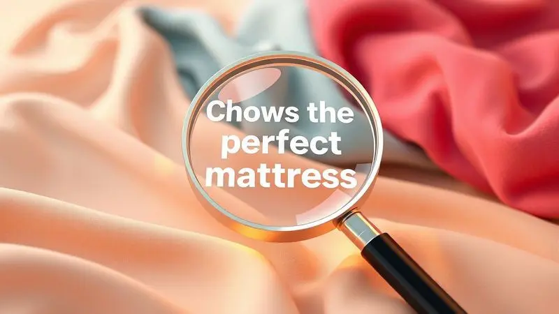

A Probel é uma das marcas mais tradicionais e respeitadas no mercado brasileiro de colchões, acumulando décadas de história e inovação.

No entanto, com a diversidade de tecnologias de molejo e densidades de espuma disponíveis hoje, surge a dúvida: o colchão Probel é bom para o seu biotipo específico?

Escolher o modelo ideal exige entender a diferença entre sistemas como o MasterPocket e as espumas de alta densidade da marca.

Neste guia, analisamos a reputação da Probel, detalhamos suas principais tecnologias e selecionamos os 10 melhores colchões da marca para garantir que sua escolha resulte em noites de sono verdadeiramente restauradoras.

<SummaryList products={frontmatter.top_products} />

## Colchão Probel é Bom? Análise Completa da Marca

Você já se perguntou se uma marca com tanta história ainda sabe entregar o que você precisa hoje? Os colchões Probel constroem sua reputação em um pilar duplo: qualidade de materiais que duram e um conforto que não é mero luxo, mas uma necessidade para seu descanso.

Eles oferecem uma gama que vai do apoio firme e ortopédico para quem precisa de suporte extra, até a maciez que envolve seu corpo depois de um dia longo, garantindo que a palavra "sono" volte a significar renovação de verdade.

### A Marca Probel e sua Reputação no Reclame Aqui

Decidir por uma marca também é confiar no que acontece depois que você clica em "comprar". Analisando o Reclame Aqui, você encontra uma Probel que, apesar de enfrentar críticas pontuais, demonstra uma postura proativa.

A maioria dos registros mostra uma empresa que busca resolver questões, com boa parte das avaliações saindo de um status negativo para positivo após o atendimento.

Esse compromisso com a resolução, mais do que a ausência de problemas, é um indicativo valioso de segurança para seu investimento.

## Principais Características e Tecnologias Probel

Mas o que realmente acontece dentro desses colchões para entregar tanto conforto? A Probel aposta em duas frentes principais: sistemas de molas inteligentes e espumas de alta performance.

A combinação destas tecnologias é o que transforma especificações técnicas em sensações reais de bem-estar.

### Sistemas de Molejo: Ensacadas, Bonnel, Prolastic e Miracoil Pró

Imagine que cada parte do seu corpo recebe o apoio exato de que precisa. É assim que funcionam as molas ensacadas, que trabalham independentemente para se moldar aos seus contornos, eliminando aquela sensação de "balanço" quando seu parceiro se mexe.

O sistema Bonnel, clássico e robusto, oferece uma solução durável e mais acessível, ideal para quem busca firmeza tradicional. Já o Prolastic mescla a resiliência das molas com a maciez da espuma, criando uma camada de transição única.

Por fim, o Miracoil Pró leva a engenharia de suporte a outro patamar, prometendo uma distribuição de peso que alivia pontos críticos como ombros e quadris. A escolha entre eles define se seu sono será apoiado, abraçado ou perfeitamente equilibrado.

### Espumas de Alta Performance: HR Gel, Visco Gel e Promax Pr

Esses não são espumas comuns. Elas são projetadas para reagir ao seu calor e peso. A HR Gel tem partículas que ajudam a dissipar o calor corporal, te mantendo fresco mesmo nas noites mais quentes.

O Visco Gel tem uma memória que vai além do marketing, aliviando a pressão em áreas como os ombros e os quadris ao se adaptar lentamente ao seu formato.

A Promax Pr, por sua vez, é a fortaleza da durabilidade, oferecendo uma base resistente que não cede com o tempo, garantindo que o suporte do primeiro dia seja o mesmo anos depois.

São essas nuances que transformam um simples deitar na cama em um verdadeiro ritual de recuperação.

## Ranking: Os 10 Melhores Colchões Probel para Comprar em 2025

Diante de tantas opções, encontrar o modelo certo pode parecer uma tarefa complexa. Para facilitar sua jornada, reunimos uma curadoria dos 10 colchões Probel que mais se destacam em 2025, equilibrando inovação, conforto e feedback de quem já dormiu neles.

Aqui, você vai além das fichas técnicas e descobre qual modelo conversa com seu estilo de sono.

### 1. Colchão Molas Ensacadas MasterPocket Evolution Euro Pillow

<ProductBox 
  title={frontmatter.top_products[0].title} 
  image={frontmatter.top_products[0].image} 
  link={frontmatter.top_products[0].link} 
/>

O que você sentiria se cada movimento seu fosse apoiado de forma independente? O MasterPocket Evolution Euro Pillow entrega exatamente isso, com seu sistema de molas ensacadas que funciona como uma rede de suporte personalizada para cada curva do seu corpo.

A camada extra do Euro Pillow atua como um abraço logo na superfície, oferecendo uma maciez imediata que não sacrifica a firmeza necessária para o alinhamento da coluna.

Além do conforto físico, ele pensa na sua saúde, com um tecido que inibe a proliferação de ácaros e fungos, criando um ambiente mais puro para seu descanso.

Ele suporta até 110 kg por pessoa e sua construção robusta é um sinal de que ele está ali para durar muitas noites de sono profundo.

<CaixaProsContras>

**Prós:**

- Adaptação perfeita ao corpo, aliviando pressão.

- Tecnologia de molas ensacadas oferece suporte individualizado.

- Camada de Euro Pillow proporciona conforto adicional.

- Tratamento antiácaro e antifungo para um sono mais saudável.

**Contras:**

- Pode ser considerado robusto, o que pode não agradar a todos.

- O peso máximo suportado é limitado a 110 kg por pessoa.

</CaixaProsContras>

### 2. Colchão Espuma D40/20 Guarda Costas Premium Hiper Firme

<ProductBox 
  title={frontmatter.top_products[1].title} 
  image={frontmatter.top_products[1].image} 
  link={frontmatter.top_products[1].link} 
/>

Para quem acredita que firmeza é sinônimo de descanso de qualidade, este modelo é uma resposta direta. A espuma D40 cria uma superfície de apoio sólida e hiper firme, ideal para quem precisa ou prefere um suporte mais rígido para a coluna.

Longe de ser apenas duro, ele ganha em aconchego com seu Pillow Top Americano, uma camada superficial que suaviza o contato inicial. O tratamento antiácaro no tecido é um cuidado silencioso, mas essencial, que trabalha a seu favor a cada respiração durante o sono.

Com capacidade para 120 kg por pessoa, ele é uma fortaleza de suporte que não abre mão do cuidado com os detalhes.

<CaixaProsContras>

**Prós:**

- Alta densidade que garante suporte firme e ortopédico.

- Tratamento antiácaro e antifungo para melhor higiene.

- Disponível em diversas dimensões para atender diferentes necessidades.

- Pillow Top Americano que adiciona conforto à superfície.

**Contras:**

- Pode ser considerado muito firme para quem prefere um colchão mais macio.

- Não é necessário virar, mas isso pode limitar o desgaste uniforme ao longo do tempo.

</CaixaProsContras>

### 3. Colchão de Molas Ensacadas Probel Vegas Comfort

<ProductBox 
  title={frontmatter.top_products[2].title} 
  image={frontmatter.top_products[2].image} 
  link={frontmatter.top_products[2].link} 
/>

Cansado de acordar porque seu parceiro virou na cama? O Vegas Comfort é a solução para os dorminhocos inquietos. Suas molas ensacadas isolam o movimento, garantindo que o descanso de um não perturbe o do outro.

Com um conforto classificado como intermediário, ele atende bem a maioria dos gostos, e o Pillow Euro agrega um toque extra de sofisticação e maciez na superfície.

O revestimento em malha não é apenas estético, ele respira, ajudando a manter a temperatura agradável durante toda a noite. A tecnologia "No Turn" também é um alívio para a rotina, eliminando a tarefa pesada de virar o colchão.

Basta girá-lo de vez em quando para prolongar sua vida útil.

<CaixaProsContras>

**Prós:**

- Conforto personalizado com molas ensacadas.

- Camada extra de maciez com Pillow Euro.

- Revestimento antialérgico e respirável.

- Tecnologia "No Turn" que facilita a manutenção.

**Contras:**

- Suporta até 110 kg por pessoa, o que pode ser limitado para usuários mais pesados.

- Pode não ser tão macio para quem prefere colchões muito suaves.

</CaixaProsContras>

### 4. Colchão Queen Mola Ensacada Probel Excede Premium

<ProductBox 
  title={frontmatter.top_products[3].title} 
  image={frontmatter.top_products[3].image} 
  link={frontmatter.top_products[3].link} 
/>

Este é para quem não quer fazer concessões. O Excede Premium une a precisão das molas ensacadas com a sofisticação das espumas ProSoft e ProMax, criando uma experiência de sono em camadas.

Cada mola trabalha para contornar seu corpo, enquanto as espumas garantem a transição suave entre o suporte firme e a superfície acolhedora do pillow super. O resultado é um alinhamento postural quase personalizado e uma redução drástica na transmissão de movimento.

O fato de não precisar ser virado é a cereja do bolo em um produto pensado para simplificar sua vida, desde a compra até a manutenção diária.

<CaixaProsContras>

**Prós:**

- Molas ensacadas que se adaptam ao corpo, proporcionando conforto.

- Surface com pillow super para um toque macio.

- Tratamentos antiácaro e antifungo para maior higiene.

- Design sem a necessidade de virar o colchão.

**Contras:**

- Firmeza que pode não agradar a todos os tipos de dorminhocos.

- Peso máximo suportado pode ser limitante para pessoas muito maiores.

</CaixaProsContras>

### 5. Colchão Casal Mola Ensacada Probel Bari

<ProductBox 
  title={frontmatter.top_products[4].title} 
  image={frontmatter.top_products[4].image} 
  link={frontmatter.top_products[4].link} 
/>

Conforto que se adapta e durabilidade que permanece. O Bari é a prova de que um colchão pode abraçar seu corpo sem perder sua estrutura ao longo dos anos.

O sistema de molas ensacadas oferece um suporte tão personalizado que parece feito sob medida para sua coluna, enquanto o pillow top com fibra siliconada e espuma D20 recebe você com uma maciez fresca e agradável.

É um colchão que entende a dinâmica de um casal, suportando até 110 kg por pessoa e isolando movimentos para que o descanso seja individual e coletivo ao mesmo tempo. A tecnologia No Turn é a promessa de que esse conforto veio para ficar, com uma manutenção mínima.

<CaixaProsContras>

**Prós:**

- Conforto excepcional com molas ensacadas.

- Alinhamento da coluna e redução de movimento.

- Pillow top macio e fresco.

- Durabilidade com espumas de alta densidade.

**Contras:**

- Pode ser considerado um investimento alto.

- Limitação na absorção de calor em climas muito quentes.

</CaixaProsContras>

### 6. Colchão Solteiro Probel a Vácuo D28 Night and Day In Box

<ProductBox 
  title={frontmatter.top_products[5].title} 
  image={frontmatter.top_products[5].image} 
  link={frontmatter.top_products[5].link} 
/>

Praticidade que cabe em uma caixa, conforto que preenche suas noites. Se você mora em um apartamento pequeno, mudou-se recentemente ou simplesmente odeia a logística de receber um colchão tradicional, este modelo é um divisor de águas.

A embalagem a vácuo reduz radicalmente seu tamanho, facilitando o transporte e a entrada em qualquer espaço. E não se engane, a praticidade não vem em detrimento do descanso.

Com densidade D28, ele oferece uma firmeza confortável que ajuda a manter sua coluna alinhada, e o tratamento antiácaro do tecido garante que essa conveniência também seja saudável. Lembre-se, porém, que a mágica do vácuo só acontece uma vez.

<CaixaProsContras>

**Prós:**

- Suporte firme e ideal para alinhamento da coluna

- Embalagem a vácuo facilita transporte e recebimento

- Tratamento antiácaro reduz alergias

- Conforto proporcionado pela espuma macia

**Contras:**

- Não pode ser embalado novamente após aberto

- Modelos podem variar em altura e espessura

</CaixaProsContras>

### 7. Colchão de Espuma D33 Guarda Costas Probel

<ProductBox 
  title={frontmatter.top_products[6].title} 
  image={frontmatter.top_products[6].image} 
  link={frontmatter.top_products[6].link} 
/>

Firmeza que vira durabilidade. O grande trunfo deste colchão não está apenas na sensação sólida que ele oferece ao deitar, mas na sua construção dupla face.

Você literalmente ganha dois colchões em um, podendo alternar os lados para garantir um desgaste absolutamente uniforme ao longo de muitos anos. A densidade D33 é o ponto ideal para quem busca suporte firme sem a rigidez extrema.

Os tratamentos antimicrobianos embutidos no tecido são seus guardiões noturnos, trabalhando para manter o ambiente do seu sono o mais puro possível. Perfeito para quem tem uma preferência clara por uma base mais sólida e valoriza um produto que resiste ao tempo.

<CaixaProsContras>

**Prós:**

- Conforto firme e suporte adequado

- Dupla face aumenta a durabilidade

- Tratamentos antimicrobianos para um sono saudável

- Altura variada para diferentes preferências

**Contras:**

- Pode ser muito firme para quem gosta de colchões macios

- Suporta até 100 kg por pessoa, o que pode ser limitante

</CaixaProsContras>

### 8. Colchão Casal Mola Ensacada Probel Cairo Ultra Gel

<ProductBox 
  title={frontmatter.top_products[7].title} 
  image={frontmatter.top_products[7].image} 
  link={frontmatter.top_products[7].link} 
/>

Frescor e suporte em um só lugar. O Cairo Ultra Gel combina a tecnologia reconfortante das molas ensacadas com a inovação das espumas HR Gel.

Essas espumas são conhecidas por sua capacidade de dissipar o calor, oferecendo uma sensação de frescor que faz toda a diferença nas estações mais quentes.

O pillow tipo Euro adiciona uma camada de luxo e maciez superficial, enquanto as molas garantem que o suporte para suas costas seja impecável. Com capacidade para 120 kg por pessoa e uma altura generosa de 30 cm, ele tem uma presença majestosa no quarto.

A única ressalva fica pela garantia, que em 12 meses pode parecer curta diante de tanta tecnologia.

<CaixaProsContras>

**Prós:**

- Sistema de molas ensacadas que se adapta ao corpo.

- Espumas de conforto em HR Gel que proporcionam frescor.

- Adequado para casais com diferentes biotipos.

- Pillow Euro que oferece maior suavidade na superfície.

**Contras:**

- Garantia de apenas 12 meses para as molas e espuma.

- Nível de firmeza intermediário que pode não agradar a todos.

</CaixaProsContras>

### 9. Colchão de Espuma D45 Anatômico ProDormir Advanced Tech2000 Plus

<ProductBox 
  title={frontmatter.top_products[8].title} 
  image={frontmatter.top_products[8].image} 
  link={frontmatter.top_products[8].link} 
/>

Este é o colchão para quem não negocia suporte. A densidade D45 é um dos índices mais altos, traduzindo-se em uma espuma de altíssima resistência e durabilidade, capaz de suportar até 150 kg.

A estrutura em EPS (poliestireno expandido) dá a ele uma estabilidade excepcional, ideal para quem busca uma base extremamente firme e ortopédica.

Todo esse caráter robusto é humanizado pelo Pillow Top Europeu, que oferece uma primeira camada de acolhimento, e pela forração antiderrapante, um detalhe de segurança que faz diferença.

É a escolha certa para quem prioriza a saúde da coluna acima de tudo e não abre mão de materiais de primeira linha.

<CaixaProsContras>

**Prós:**

- Alta densidade D45 para melhor suporte.

- Estrutura ortopédica que promove alinhamento da coluna.

- Tratamento antiácaro e antifungo, hipoalergênico.

- Disponível em várias dimensões para atender diferentes necessidades.

**Contras:**

- Firmeza extra pode não ser ideal para todos.

- Garantia limitada a 12 meses.

</CaixaProsContras>

### 10. Colchão de Espuma D28 PróDormir Advanced Ultra Resistente

<ProductBox 
  title={frontmatter.top_products[9].title} 
  image={frontmatter.top_products[9].image} 
  link={frontmatter.top_products[9].link} 
/>

Simplicidade inteligente para quem não precisa de firulas. Este colchão prova que conforto e durabilidade não dependem de altura excessiva ou dezenas de camadas.

Com uma combinação de espumas D20 e D28, ele oferece uma sensação de "macio com firmeza" que é reconfortante e segura. O tratamento antiácaro e antifungo é um cuidado essencial, e o acabamento em bordado matelassê traz um toque de elegância discreta ao design.

Por ser "One Side", ele elimina a confusão sobre qual lado está para cima, tornando a rotina mais prática. Perfeito para pessoas com até 60 kg que buscam uma solução eficiente, de baixa manutenção e que realmente funcione.

<CaixaProsContras>

**Prós:**

- Conforto e durabilidade notáveis.

- Tratamento antiácaro e antifungo.

- Design elegante com bordado matelassê.

- Não precisa ser virado, facilitando o uso.

**Contras:**

- Altura de 14 cm pode ser considerada baixa por alguns.

- Indicado apenas para pessoas com até 60 kg.

</CaixaProsContras>

## Guia de Compra: Como Escolher o Melhor Colchão Probel

Depois de conhecer os melhores modelos, como garantir que sua escolha não será uma loteria? Escolher um colchão Probel vai além de comparar preços.

É um processo de autoconhecimento, onde você precisa ouvir seu corpo e identificar quais tecnologias conversam com sua rotina de sono. Testar em lojas físicas é fundamental, mas vá além de apenas sentar na borda. Deite, vire, simule sua posição favorita.

Priorize o conforto que faz sentido para você.

### Molas ou Espumas: Qual a Melhor Opção para Você?

Essa é a primeira grande decisão e ela define a personalidade do seu descanso. Colchões de molas ensacadas são especialistas em isolamento de movimento e suporte pontual, perfeitos para casais ou para quem sente que afunda demais.

Já os de espuma, especialmente os de memória, são mestres no alívio de pressão, envolvendo seu corpo de forma mais uniforme. Pense no seu sono: você precisa de estabilidade absoluta ou prefere ser abraçado? A resposta para essa pergunta ilumina o caminho certo.

### Entendendo as Densidades e Suporte de Peso

A densidade da espuma (o número que vem após o "D") não é apenas um dado técnico, é um indicador de longevidade e sensação. Densidades mais altas (como D40 ou D45) significam espumas mais compactas e duráveis, ideais para maior peso e quem busca firmeza constante.

Densidades mais baixas (como D28) tendem a ser mais macias e com uma sensação de maior afundamento. Crucialmente, respeitar o limite de peso indicado não é apenas uma sugestão.

É uma garantia de que o colchão manterá suas propriedades de suporte e conforto pelo tempo prometido.

### Importância do Pillow Top e Acabamento em Matelassê

O pillow top é como um aperto de mão acolhedor antes do sono profundo. É essa camada extra que transforma um colchão firme em "firme e confortável", amortecendo a pressão inicial de ossos salientes como ombros e quadris.

Já o acabamento em matelassê, além de ser um detalhe estético que valoriza o visual do seu quarto, tem uma função prática: ele "prende" as camadas internas do colchão, impedindo que elas se movam ou se desloquem com o tempo, mantendo a integridade estrutural do produto.

São investimentos em conforto imediato e em durabilidade a longo prazo.

## FAQ: Perguntas Frequentes sobre a Probel

Mesmo com todas as informações, algumas dúvidas persistem. Esta seção é para aquelas perguntas que ficam ecoando na sua cabeça depois de ler tantas especificações, as que realmente importam na hora de tomar uma decisão final.

### Quais os principais benefícios e diferenciais da marca Probel?

A Probel constrói sua reputação sobre três pilares principais. Primeiro, o equilíbrio técnico: eles dominam tanto a fabricação de molas de alta performance quanto o desenvolvimento de espumas diferenciadas.

Segundo, a durabilidade comprovada: é uma marca associada a produtos que resistem ao tempo, mantendo o conforto.

Terceiro, a variedade que atende a biotipos reais: você encontra desde opções hiper firmes para necessidades ortopédicas específicas até modelos com camadas de conforto generosas. É essa combinação de tradição, inovação e pragmatismo que faz a diferença.

### Quando a Probel faliu? Entenda a história da marca

A história da Probel tem um capítulo triste, mas que não apaga sua trajetória.

A marca, que foi sinônimo de colchão de qualidade para gerações de brasileiros, entrou com um pedido de recuperação judicial em 2016 e, após tentativas de reestruturação, encerrou suas atividades em 2018.

O fechamento refletiu desafios de mercado e mudanças na concorrência.

No entanto, para muitos consumidores, o legado da Probel permanece vivo nos produtos que ainda estão em uso, lembrando de uma época em que a marca era uma garantia de artesanato e qualidade robusta na indústria do sono.

## Conclusão

Investir em um colchão Probel, diante de tudo que analisamos, é muito mais do que comprar um lugar para dormir. É optar por uma herança de know-how em conforto e suporte, traduzida em tecnologias que entendem as nuances do corpo humano.

Seja através da precisão cirúrgica das molas ensacadas, da durabilidade promissora das altas densidades, ou dos cuidados com a higiene do sono, a Probel oferece um portfólio que conversa com necessidades reais e diversos biotipos.

A decisão final, portanto, não se resume a uma lista de prós e contras, mas a um encontro: qual dessas tecnologias ressoa com a história do seu próprio descanso?

Ao escolher o modelo que equilibra sua preferência por firmeza, sua necessidade de suporte e os detalhes que importam para sua saúde, você não está apenas adquirindo um produto.

Está garantindo que, noite após noite, seu corpo tenha o cenário perfeito para se recuperar e se preparar para um novo dia.