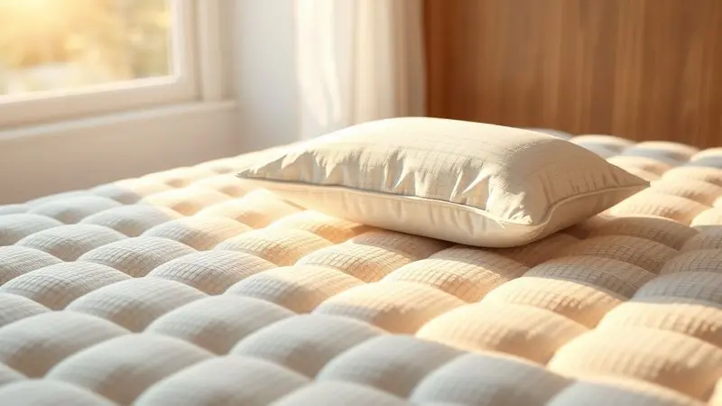
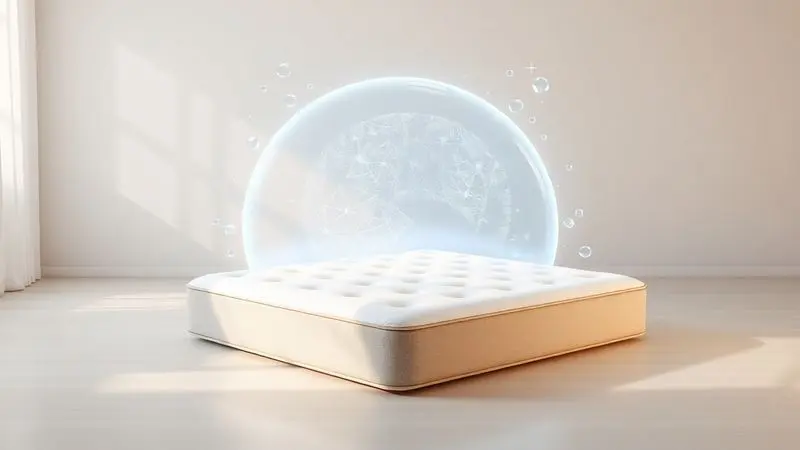

Procurando uma noite de sono realmente revigorante? Os colchões Reconflex estão conquistando espaço no mercado brasileiro com uma proposta ousada: unir tecnologia de ponta e conforto que realmente dura.

Mas em meio a tantas opções, densidades diferentes e promessas de firmeza ideal, você pode estar se perguntando se esse investimento vale a pena para suas noites.

Nesta análise, mergulhamos fundo na tecnologia por trás da marca, explicamos como cada material funciona no seu corpo durante o sono e detalhamos modelos populares como o Protettore Pillow Top.

Nosso objetivo é simples: ajudar você a encontrar exatamente o colchão que conversa com seu jeito de dormir, avaliando não apenas números técnicos, mas a experiência real que cada escolha proporciona.

Prepare-se para descobrir se a Reconflex tem o parceiro de sono que sua saúde merece.

<SummaryList products={frontmatter.top_products} />

## A Tecnologia dos Colchões Reconflex

O que realmente diferencia um colchão que promete noites melhores de um que apenas ocupa espaço no quarto? A resposta da Reconflex está em uma filosofia de engenharia do sono que equilibra dois mundos: a adaptabilidade suave da espuma e a resposta ativa das molas.

Não se trata apenas de materiais avançados, mas de como eles conversam entre si para criar um ecossistema de descanso.

### Tecnologia de Espuma e Mola da Marca

Imagine deitar em uma superfície que parece ter memória do formato do seu corpo enquanto oferece resistência precisa onde você mais precisa. É essa sinergia que a Reconflex busca com sua combinação de espuma viscoelástica e molas ensacadas.

A espuma trabalha cedendo gradualmente aos seus contornos, aliviando a pressão em pontos críticos como ombros e quadris.

Enquanto isso, as molas respondem de forma independente, distribuindo o peso de maneira inteligente e minimizando aquela sensação de 'balanço' quando alguém se mexe ao lado.

O resultado é uma experiência de sono que respeita suas particularidades: se você precisa de mais firmeza na região lombar ou de mais acolchoamento nos ombros, o sistema se ajusta.

E o melhor: essa combinação inteligente também contribui para a respiração do material, evitando aquela sensação abafada que tanto incomoda nas noites quentes.

### Tecidos Especiais e Tecnologia de Travesseiro

Você já percebeu como algumas noites você acorda suando, enquanto outras sente frio mesmo com os mesmos cobertores? A Reconflex entende que o conforto térmico é parte fundamental do descanso profundo.

Por isso, investe em tecidos com tecnologia respirável que funcionam como uma segunda pele inteligente: mantêm a temperatura estável, absorvem a umidade quando necessário e ainda contam com proteção antiácaro para quem sofre com alergias.

Mas a experiência não para no colchão. A marca leva essa filosofia de personalização para os travesseiros, oferecendo opções com memória e gel que se moldam à curvatura natural do seu pescoço.

Pense nisso como um sistema integrado: enquanto o colchão cuida do alinhamento da sua coluna, o travesseiro complementa o trabalho, garantindo que sua cabeça repouse na posição ideal.

São detalhes que, juntos, transformam a simples ação de dormir em um ritual de recuperação verdadeira.

## Colchão Casal Protettore Pillow Top Espuma Viscoelástica

<ProductBox 
  title={frontmatter.top_products[0].title} 
  image={frontmatter.top_products[0].image} 
  link={frontmatter.top_products[0].link} 
/>

A tecnologia só faz sentido quando aplicada em produtos reais que solucionam problemas concretos. É aqui que o Protettore Pillow Top entra em cena, representando o encontro entre inovação e praticidade no dia a dia de um casal.

Este modelo foi pensado para quem busca o equilíbrio perfeito entre aconchego e suporte firme.

A magia começa com o molejo Miralastic Pro, uma base robusta capaz de suportar até 220 kg sem perder a estabilidade. Sobre essa fundação segura, uma generosa camada de espuma viscoelástica no Pillow Top recebe seu corpo como um abraço personalizado.

Essa combinação inteligente significa que você sente o conforto imediato da adaptação aos seus contornos, mas sem aquele afundamento excessivo que cansa a musculatura.

O cuidado com os detalhes continua no tecido: uma malha de alta gramatura oferece um toque suave contra a pele, enquanto bordas reforçadas garantem que o colchão mantenha sua forma mesmo com anos de uso.

E para sua tranquilidade, as certificações INMETRO e o selo ABICOL são a garantia de que este não é apenas um produto bonito, mas seguro e testado rigorosamente.

<CaixaProsContras>

**Prós:**

- Conforto excepcional pela espuma viscoelástica.

- Boa firmeza com suporte para até 220 kg.

- Tecido suave que adiciona um toque macio.

- Bordas reforçadas aumentam a durabilidade.

**Contras:**

- A durabilidade pode variar conforme o uso.

- Pode não ser ideal para quem prefere colchões extremamente macios.

</CaixaProsContras>

### Diferenciais Exclusivos e Estrutura do Modelo

O que faz do Protettore Pillow Top mais do que apenas um colchão com boas especificações? A resposta está na inteligência por trás de cada camada.

A estrutura foi projetada com zonas de suporte diferenciadas que reconhecem as partes do seu corpo que precisam de mais firmeza (como a região lombar) e as que pedem mais acolchoamento (como os ombros).

Mas o diferencial vai além do conforto imediato. Um sistema interno de ventilação canaliza o ar através do colchão, promovendo uma circulação constante que evita o acúmulo de calor.

Pense nisso como ter um climatizador embutido: enquanto você dorme, o material trabalha para manter a temperatura ideal, independentemente da estação do ano.

Essa atenção aos detalhes invisíveis é o que transforma uma noite comum em uma experiência de recuperação completa.

### Suporte de Peso e Benefícios do Protettore

Para casais com diferenças significativas de peso ou para quem simplesmente valoriza estabilidade, o Protettore oferece uma solução elegante.

O sistema de suporte distribuído significa que, quando uma pessoa se vira ou muda de posição, o movimento não se propaga para o outro lado do colchão. Cada um dorme em seu próprio universo de conforto, sem comprometer o descanso do parceiro.

Essa característica técnica se traduz em benefícios práticos que você sente todas as manhãs: menos interrupções durante a noite, menos dores causadas por má postura e aquela sensação revigorante de ter dormido profundamente.

É a tecnologia trabalhando silenciosamente para que seu corpo possa fazer o que precisa fazer: se recuperar completamente.

## Melhores Colchões: Como Escolher o Ideal para Você

Diante de tantas opções e tecnologias, como tomar a decisão certa sem se perder em especificações técnicas? Comece se perguntando não apenas como você dorme, mas como você acorda.

A posição que você assume naturalmente durante a noite, seu peso e até suas dores específicas devem guiar sua escolha.

Colchões com maior percentual de espuma viscoelástica tendem a oferecer mais adaptabilidade e alívio de pressão, ideais para quem tem dores articulares ou busca um abraço mais acolhedor.

Já os modelos com predominância de molas proporcionam mais ventilação e resposta ativa, excelentes para quem sente calor à noite ou prefere uma sensação de 'leveza' ao deitar.

Não subestime a importância do tamanho: um colchão confortável é aquele que permite que você se mova livremente sem medo de cair da borda. E sempre que possível, não deixe de experimentar pessoalmente.

Deitar por alguns minutos pode revelar mais sobre o comportamento real do colchão do que horas lendo especificações técnicas.

## Dicas Importantes para a Durabilidade do seu Colchão

Investir em um bom colchão é apenas o primeiro passo. Para que ele mantenha suas propriedades de conforto ano após ano, alguns cuidados simples fazem toda a diferença.

Comece protegendo seu investimento com uma capa adequada: ela age como um escudo contra derramamentos acidentais, poeira e ácaros, prolongando significativamente a vida útil do material principal.

A cada três meses, reserve alguns minutos para rodar o colchão (cabeceira para os pés) e virá-lo, se possível. Esse simples gesto garante um desgaste uniforme, evitando que áreas específicas se deformem prematuramente.

Trate seu colchão como a ferramenta de recuperação que ele é: evite pular sobre ele ou usá-lo como banco, pois esses impactos repetidos podem comprometer sua estrutura interna.

Por fim, mantenha-o limpo aspirando regularmente a superfície e seguindo atentamente as instruções do fabricante para manutenção específica. Esses pequenos rituais de cuidado são seu seguro para noites confortáveis por muitos anos.

## Conclusão

Escolher um colchão vai muito além de comparar densidades, preços ou tecnologias de marketing. É sobre encontrar um parceiro silencioso que entende as necessidades únicas do seu corpo e responde a elas noite após noite.

A Reconflex, com sua abordagem híbrida que combina a inteligência da espuma viscoelástica com a resposta ativa das molas, apresenta uma proposta convincente para quem busca esse equilíbrio.

O Protettore Pillow Top exemplifica bem essa filosofia: oferece o aconchego adaptável que acalma pontos de pressão sem abrir mão da firmeza que sua coluna precisa.

Sua capacidade de acomodar diferenças de peso entre casais e manter a temperatura ideal são diferenciais que se traduzem em melhorias reais na qualidade do seu sono.

Lembre-se que o melhor colchão não é necessariamente o mais caro ou com mais camadas, mas aquele que dialoga com suas necessidades específicas.

Se você valoriza conforto personalizado, estabilidade para dormir em casal e tecnologia que realmente funciona no dia a dia, a Reconflex merece sua consideração séria.

Suas noites de sono são um investimento contínuo em sua saúde - escolha um aliado que honre esse compromisso.