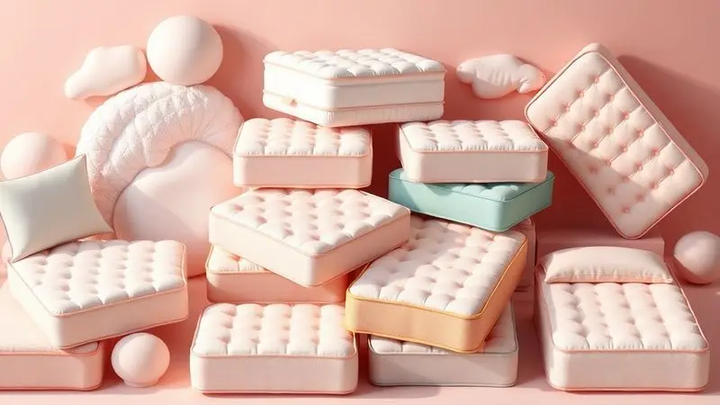
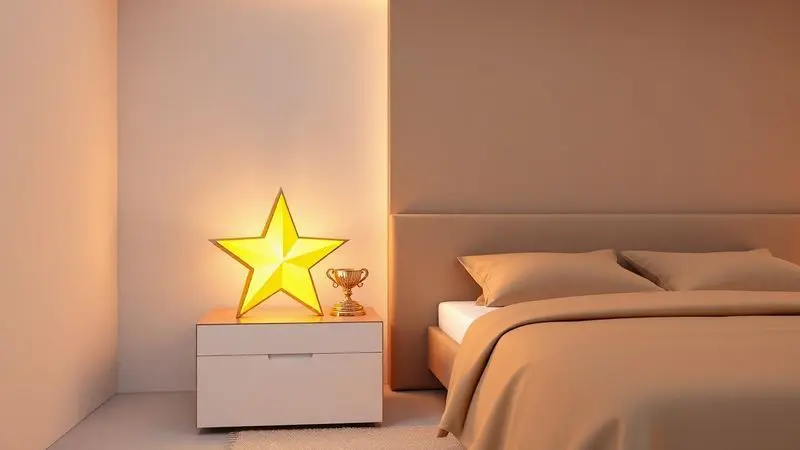

Toda a busca pelo sono perfeito começa com uma decisão crucial: o colchão certo. No Brasil, quando se fala em qualidade superior no descanso, um nome aparece com frequência: Sankonfort. Mas será que esse colchão realmente faz jus à fama?

Com uma variedade que vai desde as molas mais modernas até espumas de altíssima densidade, compreender o que cada modelo oferece é o primeiro passo para transformar suas noites e, consequentemente, seus dias.

Vamos desvendar juntos se o investimento em um colchão Sankonfort realmente compensa para sua saúde postural e para aquele descanso reparador que você merece.

<SummaryList products={frontmatter.top_products} />

## Sobre a marca de colchões Sankonfort

Imagine uma empresa que entende que dormir bem vai além de simplesmente deitar na cama. Essa é a proposta da Sankonfort, uma marca que conquistou seu espaço no mercado brasileiro oferecendo soluções pensadas para diferentes realidades.

Não se trata apenas de vender colchões, mas de proporcionar experiências de sono personalizadas.

O diferencial está na abordagem: das opções mais acessíveis até as linhas premium, o foco permanece em ergonomia e longevidade. A marca investe continuamente em tecnologias que permitem aos seus produtos se moldarem ao corpo, não o contrário.

Essa é a base do sono verdadeiramente reparador que promovem.

Para completar, o compromisso com o consumidor se estende além da venda.

A reputação por atendimento de qualidade e garantias que realmente inspiram confiança fazem da Sankonfort uma escolha segura para quem não quer correr riscos na hora de investir em saúde e bem-estar.

## Algumas das principais linhas Sankonfort

Cada corpo tem suas particularidades, cada pessoa, seus desafios. A Sankonfort compreende isso e oferece linhas distintas, cada uma com uma especialidade.

Se você sofre com calor à noite, precisa de suporte extra para a coluna ou busca a tecnologia mais avançada para casais, existe um modelo pensado exatamente para você. Escolher não é apenas sobre gosto; é sobre encontrar o que seu corpo realmente precisa.

### Colchão Sankonfort Le Griff Molas Ensacadas

<ProductBox 
  title={frontmatter.top_products[0].title} 
  image={frontmatter.top_products[0].image} 
  link={frontmatter.top_products[0].link} 
/>

Já aconteceu de você se mexer durante a noite e acordar o parceiro? Ou vice-versa? Esse é o clássico problema que as molas ensacadas individualmente do Sankonfort Le Griff pretendem resolver.

Imagine a liberdade de rolar para o lado que quiser sem que a outra pessoa sinta cada movimento. Isso porque cada mola trabalha de forma independente, isolando os impactos.

O frescor também é protagonista aqui. O tecido de bambu não é apenas uma escolha sustentável, é uma experiência sensorial que mantém a superfície respirável e agradável, especialmente nas noites mais quentes.

Para quem sofre com espirros e alergias matinais, o tratamento antiácaro e antialérgico integrado cria uma barreira protetora, transformando seu leito em um santuário saudável.

Porém, é preciso entender que este modelo caminha para o lado mais firme da balança. Se você é do time que afunda no colchão como se fosse uma nuvem, essa sensação pode não agradar totalmente.

Alguns usuários inclusive relataram desconforto e dores, o que mostra como a experiência pode ser pessoal. A marca, é claro, reforça suas certificações de qualidade e oferece um ano de garantia para o molejo, mas seu corpo terá a palavra final.

<CaixaProsContras>

**Prós:**

- Molas ensacadas oferecem suporte independente.

- Tecido de bambu proporciona frescor e conforto.

- Tratamentos antiácaro promovem um sono saudável.

- Sustentabilidade na escolha dos materiais.

**Contras:**

- Pode ser considerado firme demais para alguns usuários.

- Relatos de desconforto e dores nas costas por alguns clientes.

</CaixaProsContras>

### Colchão Sankonfort Espuma Orthopedic

<ProductBox 
  title={frontmatter.top_products[1].title} 
  image={frontmatter.top_products[1].image} 
  link={frontmatter.top_products[1].link} 
/>

Acordar com aquela dor nas costas que parece ter se instalado durante a noite é mais comum do que se imagina. Se isso faz parte da sua rotina matinal, o Sankonfort Espuma Orthopedic chega como uma proposta direta.

As camadas estratégicas de espuma D26 combinadas com AG80 foram desenvolvidas para oferecer não apenas firmeza, mas uma firmeza inteligente, que estabiliza a coluna na posição correta.

O toque, no entanto, não foi negligenciado. A mistura de poliéster e algodão no revestimento traz uma maciez que convida ao descanso imediato, sem abrir mão do suporte necessário.

E aqui vai um ponto crucial para muitas pessoas: cada lado suporta até 120 kg com tranquilidade. Essa é a segurança de saber que o colchão responderá igualmente bem, independentemente do biotipo.

Se você sonha com a sensação de afundar em um abraço macio ou espera aquela adaptação extra que sistemas de molas proporcionam, talvez esse não seja seu modelo ideal. Ele entrega excelência no suporte ortopédico, mantendo um perfil consistente e previsível.

<CaixaProsContras>

**Prós:**

- Boa combinação de firmeza e conforto.

- Tratamento antiácaro e antialérgico.

- Tecido macio e de alta qualidade.

- Suporta até 120 kg por pessoa.

**Contras:**

- Pode não ser ideal para quem prefere um conforto mais macio.

- Não possui sistema de molas para maior adaptação ao corpo.

</CaixaProsContras>

### Colchão Sankonfort Espuma Orthopedic Plus

<ProductBox 
  title={frontmatter.top_products[2].title} 
  image={frontmatter.top_products[2].image} 
  link={frontmatter.top_products[2].link} 
/>

Pensando em fazer um investimento para durar anos, não apenas meses? O Orthopedic Plus eleva o conceito de durabilidade a outro patamar. A estrutura imponente, com suas duas camadas de espuma D26 reforçadas pela AG80, não é apenas resistente, é quase imperturbável.

Este é o colchão para quem tem uma visão de longo prazo sobre o próprio descanso.

A proteção à saúde vai além do suposto. O pacote de tratamentos inclui ação antiácaro, antialérgica, antifúngica e antibacteriana, criando um ecossistema genuinamente seguro para seu sono.

Isso é especialmente reconfortante para quem convive com sensibilidade respiratória ou condições alérgicas.

Disponível em duas alturas (18 cm e 25 cm) e suportando até 120 kg por pessoa, ele se adapta a diversos contextos e necessidades. A ressalva permanece na característica principal dele: a firmeza.

Se seu conceito de conforto está mais associado à maciez e à sensação de "nuvem", este pode parecer um território um pouco mais austero.

<CaixaProsContras>

**Prós:**

- Boa durabilidade e resistência.

- Tratamentos antiácaros e antialérgicos.

- Disponível em várias medidas.

- Suporta pesos elevados.

**Contras:**

- Nível de conforto firme, pode não agradar a todos.

- Menos adequado para quem prefere colchões mais macios.

</CaixaProsContras>

### Colchão Sankonfort Noble 50

<ProductBox 
  title={frontmatter.top_products[3].title} 
  image={frontmatter.top_products[3].image} 
  link={frontmatter.top_products[3].link} 
/>

Há momentos em que a tradição e a experiência acumulada falam mais alto. O Noble 50 carrega esse legado, utilizando espuma Sanko, uma referência consolidada no segmento de espumas flexíveis de alta performance.

É como ter a garantia de que aquele material já foi testado e aprovado em inúmeros lares antes de chegar ao seu.

O revestimento em tecido de malha não é apenas uma questão estética. Ele funciona como uma segunda pele respirável que, aliada ao tratamento antiácaro e antialérgico, transforma a superfície em uma zona de conforto seguro.

A estrutura firme trabalha diretamente no alinhamento da coluna, sendo frequentemente recomendado por quem busca alívio de dores persistentes.

A durabilidade é outra bandeira deste modelo, que geralmente suporta até 100 kg por pessoa sem vacilar. Em algumas versões, a inclusão de molas ensacadas individuais adiciona aquela camada extra de tecnologia que isola movimentos.

Sim, para alguns, essa firmeza pode parecer excessiva inicialmente, mas muitos descobrem que é exatamente o que seu corpo precisava para descansar de verdade.

<CaixaProsContras>

**Prós:**

- Conforto e suporte adequado para a coluna.

- Revestimento antiácaro e antialérgico.

- Produzido por uma marca reconhecida no mercado.

- Durável e resistente ao uso.

**Contras:**

- Pode ser considerado firme demais para alguns.

- Disponibilidade de tamanhos pode limitar opções.

</CaixaProsContras>

## Melhor Escolha: Qual modelo Sankonfort comprar?

Escolher não precisa ser um exercício de adivinhação. Comece ouvindo seu corpo. Você acorda com dores? Sente calor excessivo durante a noite? É daqueles que se mexe muito e atrapalha o parceiro?

Cada resposta aponta para um caminho diferente dentro do portfólio Sankonfort.

Para quem prioriza isolamento de movimento e frescor natural, as linhas com molas ensacadas e tecido de bambu são apostas certeiras.

Se o suporte ortopédico e uma estrutura robusta são não-negociáveis, as espumas Orthopedic e Orthopedic Plus oferecem exatamente essa robustez. Não esqueça de considerar o espaço físico: as medidas disponíveis devem conversar harmoniosamente com seu quarto e sua cama.

O segredo está em equilibrar suas necessidades atuais com as expectativas de durabilidade. Um colchão é um investimento de médio prazo em sua qualidade de vida. Trate-o como tal.

## Conclusão

Ao final dessa jornada por linhas, tecnologias e características, fica claro: o colchão Sankonfort não é apenas bom, é uma escolha inteligente para quem valoriza o descanso de qualidade.

A marca traduz especificações técnicas em benefícios reais que você sente todas as manhãs ao acordar renovado.

Cada modelo foi pensado para resolver problemas concretos. Seja para o casal que busca harmonia no movimento, para quem enfrenta batalhas contra alergias, ou para quem precisa de um apoio firme para a coluna, existe uma solução dentro do catálogo.

A variedade de opções em firmeza demonstra o entendimento de que não há um corpo igual ao outro.

A experiência de milhares de usuários que relatam alívio de dores e melhora significativa na qualidade do sono não é coincidência. É resultado de um projeto que coloca o bem estar em primeiro lugar.

Se você está pronto para substituir noites mal dormidas por um descanso verdadeiramente reparador, a Sankonfort oferece o terreno sólido onde essa transformação pode acontecer.