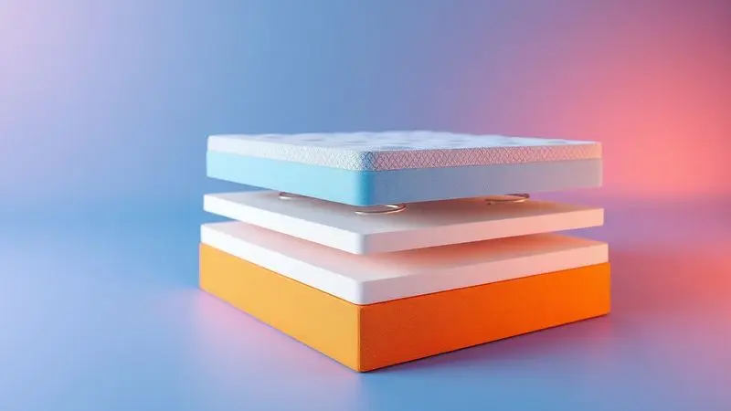
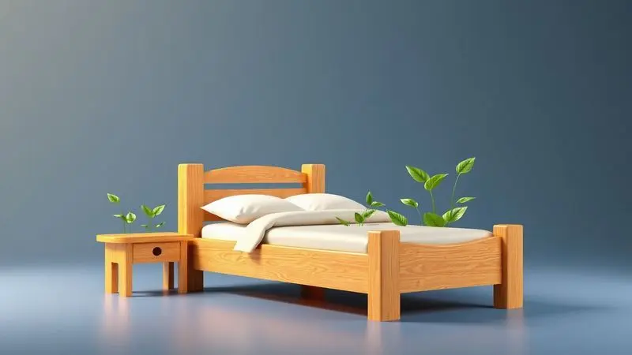
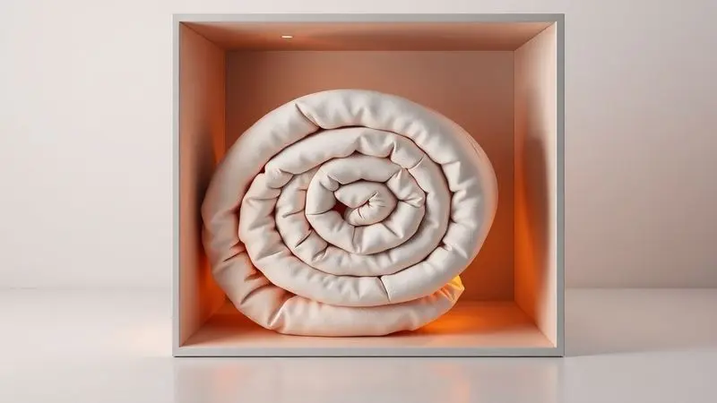

A escolha de um novo colchão é um dos investimentos mais importantes para a saúde e bem-estar, afinal, passamos um terço da vida dormindo.

Entre as diversas marcas disponíveis no mercado brasileiro, a Umaflex se destaca pela presença em grandes varejistas e preços competitivos. Mas será que o colchão Umaflex é bom mesmo ou o barato pode sair caro?

Neste artigo, mergulhamos na história da marca, exploramos suas tecnologias exclusivas e analisamos detalhadamente os modelos mais populares para ajudar você a decidir se a marca vale o seu investimento em 2025.

<SummaryList products={frontmatter.top_products} />

## História e Credibilidade da Umaflex no Mercado

Quando você investe um terço da sua vida em algo, merece saber exatamente quem está por trás desse cuidado. A Umaflex não é apenas uma marca de colchões, é uma empresa brasileira que há mais de 30 anos transforma noites em momentos de verdadeiro descanso.

Imagine dormir sabendo que cada ponto de apoio em seu corpo foi pensado por três décadas de experiência.

Essa história não é apenas sobre tempo, é sobre evolução constante: a marca cresceu investindo em tecnologia e inovação enquanto mantinha o foco no que realmente importa: seu conforto.

Não é à toa que gerações de brasileiros continuam escolhendo Umaflex, criando uma relação de confiança que se reflete nas avaliações positivas e na fidelização de clientes. O melhor?

Você pode descansar ainda mais tranquilo sabendo que a marca é reconhecida por práticas sustentáveis, provando que cuidar do seu sono também pode significar cuidar do planeta.

## Diferenciais e Tecnologias da Marca Umaflex

Três décadas de experiência se traduzem em mais do que tradição, se transformam em tecnologia inteligente que entende seu corpo. Os colchões Umaflex não são apenas camadas de espuma e molas, são sistemas projetados para conversar com suas curvas e apoios.

Imagine deitar e sentir que o colchão se adapta a você, não o contrário. Essa conversa silenciosa entre seu corpo e o leito acontece graças a materiais hipoalergênicos que respeitam sua saúde e sistemas de ventilação que mantêm o frescor mesmo nas noites mais quentes.

Tudo pensado para que você simplesmente esqueça que está deitado em um colchão e apenas vivencie o sono perfeito.

### Molas e Espumas de Produção Própria

O segredo de um colchão que realmente se adapta a você? Controle total sobre cada componente. A Umaflex fabrica suas próprias molas e espumas em um processo meticuloso que elimina as variações de qualidade.

Cada mola foi projetada não apenas para suportar, mas para abraçar seus pontos de pressão, trabalhando em harmonia com espumas desenvolvidas especificamente para oferecer a sensação certa de conforto e durabilidade.

Esse domínio sobre a produção permite à marca fazer algo que poucas conseguem: personalizar a firmeza conforme o que seu corpo realmente precisa. O resultado?

Imagine deitar e sentir que o colchão já conhece você, equilibrando alívio de pressão, suporte e ventilação em uma experiência que transforma sua noite de sono em um ritual de renovação.

### Sistema Polyframe para Estabilidade

Já se sentiu como se pudesse rolar para fora da cama durante a noite? Ou acordou sentindo que as bordas do colchão cediam? O Sistema Polyframe foi criado exatamente para eliminar essa sensação perturbadora.

Imagine um contorno protetor de espuma que envolve toda a estrutura do colchão, criando uma plataforma firme e segura até nas extremidades.

Essa não é apenas uma questão de durabilidade (embora ela garanta que seu colchão mantenha a forma por muito mais tempo), mas de paz de espírito.

Você pode se mover à vontade durante a noite, ou compartilhar a cama com alguém, sem aquela ansiedade de estar à beira do precipício. É como ter um guardião silencioso que garante sua estabilidade enquanto você sonha.

### Uso de Madeira de Reflorestamento na Estrutura

E se você pudesse dormir melhor sabendo que sua escolha também protege o planeta? A Umaflex transformou essa possibilidade em realidade ao adotar madeira de reflorestamento em todas as suas estruturas.

Essa não é apenas uma prática sustentável, é uma filosofia que reconhece nosso papel no cuidado com o meio ambiente.

A madeira cultivada especificamente para essa finalidade oferece a mesma resistência e durabilidade, mas com uma diferença crucial: você investe em conforto sem contribuir para a extração ilegal ou desmatamento.

É uma sensação especial saber que, enquanto sua coluna encontra o apoio perfeito, você também apoia um ciclo que beneficia gerações futuras. Durma bem por você, e pelo mundo que você ajudará a preservar.

## Análise dos Melhores Modelos de Colchão Umaflex

Escolher o colchão certo é como encontrar o parceiro perfeito para seu descanso: cada modelo tem sua personalidade, seu jeito único de cuidar de você.

A Umaflex oferece opções que vão desde o abraço suave até o apoio firme, garantindo que, independentemente de como você dorme, haja um colchão que entenda seu corpo.

Vamos explorar os seis modelos que mais conquistam os brasileiros, entendendo não apenas suas especificações, mas como cada um deles pode transformar suas noites.

### 1. Colchão Umaflex Mocaccino

<ProductBox 
  title={frontmatter.top_products[0].title} 
  image={frontmatter.top_products[0].image} 
  link={frontmatter.top_products[0].link} 
/>

Feche os olhos e imagine afundar em uma nuvem que conhece exatamente onde seu corpo precisa de alívio. Essa é a experiência prometida pelo Mocaccino, um colchão que redefine o conceito de maciez inteligente.

Com seus 30 cm de altura, você pode sentir o conforte elevado desde o primeiro contato, enquanto as molas ensacadas individualmente trabalham em silêncio para distribuir seu peso de forma perfeita.

A espuma com densidade D-26kg/m³, certificada pelo Inmetro, oferece a base ideal, complementada por uma manta extra de D-20kg/m³ que adiciona aquele toque de carinho adicional. A cereja do bolo?

O Euro Pillow que transforma a superfície em um convite irresistível ao relaxamento. Perfeito para quem dorme de lado, ele alivia a pressão nos ombros e quadris como poucos, embora sua natureza macia possa não agradar quem prefere a firmeza ortopédica.

Ele suporta até 120 kg por pessoa, e está disponível em diversas medidas para se adaptar ao seu espaço de sonhos.

<CaixaProsContras>

**Prós:**

- Altura de 30 cm proporciona conforto elevado.

- Molas ensacadas individualmente para suporte adaptável.

- Euro Pillow que oferece maciez adicional.

- Disponível em várias medidas para atender diferentes necessidades.

**Contras:**

- Pode não ser ideal para quem prefere colchões mais firmes.

- Suporte de peso limitado a 120 kg por pessoa.

</CaixaProsContras>

### 2. Colchão Umaflex Duo Flex D45

<ProductBox 
  title={frontmatter.top_products[1].title} 
  image={frontmatter.top_products[1].image} 
  link={frontmatter.top_products[1].link} 
/>

Às vezes, conforto não significa apenas maciez, mas a segurança de se sentir firmemente apoiado. O Duo Flex D45 é aquele colchão que parece dar um abraço firme e reconfortante, ideal para quem busca suporte sólido sem sacrificar o aconchego.

Com densidade D45, ele oferece uma estrutura robusta que trabalha para manter sua coluna alinhada enquanto você descansa, suportando até 150 kg por pessoa.

Disponível em alturas que variam de 19 cm a 30 cm, você pode escolher exatamente o nível de presença que deseja em seu quarto.

O tecido em 100% poliéster garante durabilidade que acompanha o tempo, e algumas versões trazem o Euro Pillow para quem deseja um toque extra de carinho.

Se você procura um investimento que equilibra qualidade e firmeza, este é o parceiro ideal, embora seu preço reflita essa construção robusta. É o tipo de colchão que diz: "Pode descansar, eu seguro tudo por você".

<CaixaProsContras>

**Prós:**

- Alta densidade de espuma D45, oferecendo bom suporte.

- Durabilidade garantida pelo uso de poliéster na fabricação.

- Capacidade de suportar até 150 kg por pessoa.

- Disponibilidade em diferentes tamanhos e alturas.

**Contras:**

- O preço pode ser mais elevado comparado a outras opções.

- A firmeza pode não agradar quem prefere colchões mais macios.

</CaixaProsContras>

### 3. Colchão Umaflex Duo Top D33

<ProductBox 
  title={frontmatter.top_products[2].title} 
  image={frontmatter.top_products[2].image} 
  link={frontmatter.top_products[2].link} 
/>

O equilíbrio perfeito entre conforto e apoio parece uma meta inalcançável, até você conhecer o Duo Top D33. Este colchão é o mestre da mediação, oferecendo firmeza suficiente para suportar sua coluna com a maciez certa para abraçar seus pontos de pressão.

Com densidade D33, ele é o companheiro ideal para pesos moderados (até 90 kg), adaptando-se ao seu corpo sem exigir demais dele.

O segredo do seu conforto está no Pillow Top, uma camada extra que faz você sentir que está dormindo sobre um travesseiro gigante, enquanto o tecido poliéster mantém um toque suave e acolhedor.

Para quem sofre com alergias, a proteção contra ácaros e fungos é um respiro de alívio, e a certificação INMETRO garante que você está investindo em qualidade comprovada.

A variedade da linha pode exigir um pouco mais de atenção na escolha, mas é essa diversidade que garante encontrar exatamente o que seu corpo pede.

<CaixaProsContras>

**Prós:**

- Boa relação entre conforto e suporte.

- Pillow Top para maior maciez.

- Proteção contra ácaros e fungos.

- Certificação de qualidade pelo INMETRO.

**Contras:**

- Limitado a usuários com peso moderado.

- Variações podem dificultar a escolha do modelo ideal.

</CaixaProsContras>

### 4. Colchão Umaflex Harmony

<ProductBox 
  title={frontmatter.top_products[3].title} 
  image={frontmatter.top_products[3].image} 
  link={frontmatter.top_products[3].link} 
/>

Harmony não é apenas um nome, é uma promessa: a de que você pode dançar sozinho enquanto compartilha a cama. Este colchão reflete 30 anos de expertise da Umaflex em criar experiências de sono que respeitam tanto o conforto individual quanto a vida a dois.

As molas ensacadas trabalham como pequenos balés independentes, absorvendo seu movimento sem transmiti-lo para o outro lado, garantindo que nenhum virar de lado vire motivo de despertar.

As espumas de densidade D-40 oferecem o equilíbrio ideal entre suporte para coluna e maciez para o corpo, enquanto o tecido em malha de alta gramatura convida você a se entregar ao descanso.

Com capacidade para até 140kg por pessoa e a possibilidade do Euro Pillow, ele se adapta a diversas necessidades, embora a variedade de modelos possa exigir uma reflexão extra sobre o que realmente combina com sua rotina de sono.

<CaixaProsContras>

**Prós:**

- Conforto e suporte adequados para a coluna.

- Molejo de molas ensacadas reduz a transferência de movimento.

- Disponibilidade em diversos tamanhos.

- Tecido em malha agradável ao toque.

**Contras:**

- Variedade de modelos pode gerar confusão na escolha.

- Preço pode ser considerado elevado por alguns consumidores.

</CaixaProsContras>

### 5. Umaflex Berlim com Pillow Top e Molas Ensacadas

<ProductBox 
  title={frontmatter.top_products[4].title} 
  image={frontmatter.top_products[4].image} 
  link={frontmatter.top_products[4].link} 
/>

Imagine um espaço onde seus movimentos noturnos permanecem como segredos só seus.

Isso é o que o Berlim oferece: um sistema de molas ensacadas que garante independência total de movimentação, perfeito para casais que não querem que seus ritmos de sono interfiram no descanso do outro.

A camada de Pillow Top, feita em espuma D20, transforma a superfície em um convite contínuo ao relaxamento, enquanto os tecidos Jacquard e Poliéster proporcionam um toque suave que acaricia sua pele.

Com capacidade para até 130 kg por pessoa, ele oferece suporte robusto, embora não se classifique como ortopédico.

Se você busca a sensação de estar dormindo em seu mundo particular, mesmo dividindo a cama, o Berlim cria esse espaço de intimidade e conforto que transforma noites compartilhadas em descansos individuais respeitados.

<CaixaProsContras>

**Prós:**

- Sistema de molas ensacadas para maior individualidade de movimentos.

- Camada de Pillow Top que oferece maciez extra.

- Revestimento em tecido suave e de qualidade.

- Suporte adequado para pessoas até 130 kg.

**Contras:**

- Não é classificado como ortopédico, podendo não ser ideal para todos.

- A densidade da espuma do Pillow Top (D20) pode não agradar a quem prefere colchões mais firmes.

</CaixaProsContras>

### 6. Umaflex Diamante 2 Euros

<ProductBox 
  title={frontmatter.top_products[5].title} 
  image={frontmatter.top_products[5].image} 
  link={frontmatter.top_products[5].link} 
/>

Algumas experiências precisam de presença, e o Diamante 2 Euros chega com seus 36 cm para anunciar que aqui, o conforto tem peso e substância.

Este é o colchão que não faz concessões: molas ensacadas individualmente garantem suporte personalizado, eliminando completamente a transferência de movimento, enquanto o pillow top duplo no estilo Euro Pillow oferece duas camadas de conforto imediato.

A funcionalidade double face significa que ele pode ser virado periodicamente, estendendo sua vida útil significativamente, e a capacidade de suportar até 120 kg fala de uma estrutura projetada para durar.

As espumas de alta densidade e a certificação Inmetro são selos de qualidade, embora o revestimento em poliéster possa não agradar paladares mais exigentes.

Ideal para quem acredita que investir em sono é investir em qualidade de vida, o Diamante é um colchão que assume seu papel com a seriedade de quem sabe que guarda um terço da sua vida.

<CaixaProsContras>

**Prós:**

- Molas ensacadas para maior conforto

- Double face que aumenta a durabilidade

- Pillow top duplo para conforto extra

- Certificado pelo Inmetro

**Contras:**

- Revestimento de poliéster que pode não agradar a todos

- Peso elevado devido à espessura

</CaixaProsContras>

## Colchão Embalado a Vácuo Umaflex Vale a Pena?

Já pensou em transportar um colchão de 30 cm dentro de um elevador apertado ou subir com ele por uma escada em caracol? A tecnologia de embalagem a vácuo da Umaflex transforma essa logística complexa em uma tarefa simples e acessível.

Mais do que praticidade, estes colchões mantêm toda a qualidade e conforto dos modelos tradicionais, utilizando as mesmas camadas de espuma e látex que você já conhece.

A mágica acontece quando você desenrola o colchão em casa e observa ele recuperar sua forma completa, pronto para se adaptar às suas curvas.

A grande questão não é se vale a pena tecnicamente (a resposta é sim, mantêm as mesmas tecnologias), mas se essa convenience combina com seu momento de vida.

Se você está mudando de casa, morando em espaços com acesso limitado, ou simplesmente quer evitar o estresse do transporte tradicional, essa pode ser a solução perfeita. A experiência de conforto continua a mesma, o que muda é apenas o caminho até seu quarto.

## Conclusão

Depois de explorar a história, tecnologias e os seis modelos mais populares da Umaflex, a resposta à pergunta inicial se torna clara: sim, o colchão Umaflex é bom sim, mas com um detalhe crucial.

A qualidade existe, a durabilidade é comprovada, e as tecnologias realmente fazem diferença na hora de dormir. Porém, a palavra-chave é "adequação". O Mocaccino perfeito para quem busca maciez pode ser frustrante para quem precisa de firmeza.

O Diamante robusto pode ser excessivo para quem quer leveza. Sua decisão final deve começar com uma pergunta honesta: como meu corpo pede para ser cuidado durante a noite? E então, qual dessas seis personalidades conversa melhor com essa necessidade?

A vantagem da Umaflex está justamente nessa diversidade de soluções, todas construídas com o mesmo cuidado de três décadas de experiência. Experimente, sinta, compare.

Seu sono merece esse tempo de escolha, porque um terço da sua vida espera por um abraço que entenda exatamente o que você precisa.

## Dúvidas Frequentes sobre a Marca Umaflex

A marca Umaflex é conhecida pela variedade de colchões que oferece, atendendo diferentes necessidades de conforto e suporte.

Muitas pessoas se perguntam sobre a durabilidade e os materiais utilizados em seus produtos, e é sempre bom verificar as especificações antes de comprar.

### Qual o melhor colchão Umaflex?

A resposta está mais dentro de você do que na lista de modelos. O melhor colchão Umaflex é aquele que entende seu corpo e sua rotina de sono.

Se você acorda com dores nas costas e precisa de suporte firme, os modelos de alta densidade como o Duo Flex D45 podem ser sua resposta.

Se o que você busca é o conforto de afundar em uma superfície macia que abraça seus pontos de pressão, o Mocaccino ou o Berlim com Pillow Top conversam melhor com essa necessidade.

Para casais que se movimentam muito durante a noite, tecnologias como as molas ensacadas (presentes no Harmony, Berlim e Diamante) são transformadoras.

O verdadeiro teste acontece quando você deita e sente que o colchão não está apenas sob você, mas com você, adaptando-se ao seu jeito único de descansar.

### Onde encontrar um colchão Umaflex com segurança?

Encontrar um colchão Umaflex com tranquilidade começa pelo caminho certo. Lojas de móveis de confiança e revendedores autorizados oferecem a garantia de produtos originais e assistência qualificada.

O site oficial da marca é seu mapa do tesouro, indicando pontos de venda confiáveis e atualizando ofertas exclusivas. Grandes plataformas de e-commerce também são opções seguras, especialmente quando combinadas com avaliações verificadas de outros consumidores.

Independentemente do caminho escolhido, reserve um momento para entender as políticas de troca e devolução: um bom vendedor se preocupa tanto com sua satisfação quanto com a venda.

Seu investimento em sono merece essa camada extra de segurança, garantindo que, além de conforto, você tenha paz de espírito.