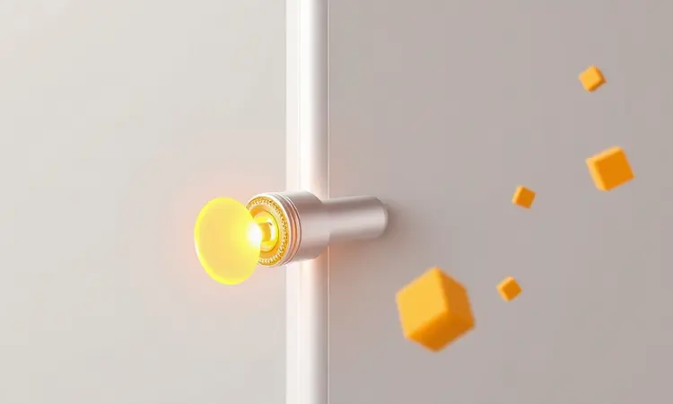
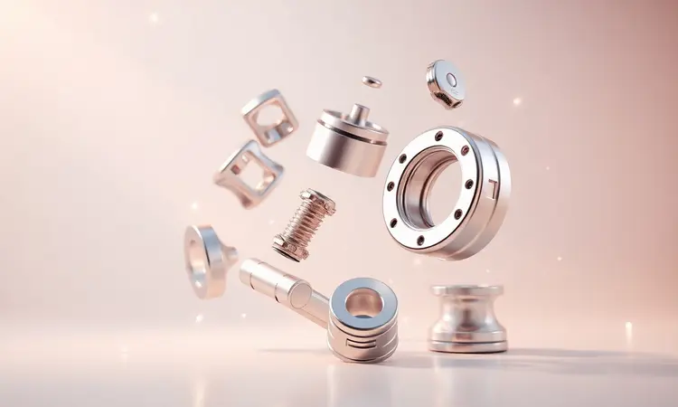

Ter uma Airfryer em casa realmente transforma a rotina na cozinha, mas às vezes esse aliado tecnológico pode apresentar alguns desafios que tiram qualquer um do sério.

Você já imaginou preparar aquela batata frita crocante para o jantar e, na hora de servir, o cesto simplesmente não quer sair? Ou pior, ligar o aparelho e ele ficar frio como gelo, ignorando completamente seus comandos?

Este guia vai além das instruções básicas. Vamos te ensinar não apenas o passo a passo para resolver esses problemas, mas também como transformar sua experiência com a Airfryer de uma relação de amor e ódio para uma parceria duradoura na cozinha.

<SummaryList products={frontmatter.top_products} />

## Como retirar o cesto da Philips Airfryer corretamente: Passo a passo seguro

Pense naquele momento de satisfação quando a comida está perfeita, o aroma invade a cozinha e... o cesto não sai. A frustração é real, mas a solução é mais simples do que parece. A regra número um é segurança: sempre desligue o aparelho da tomada e espere ele esfriar.

Nada de tentar resolver problemas com equipamentos quentes, certo?

Com o aparelho frio e seguro, localize o botão de liberação na parte frontal. Pressione com firmeza, mas sem exagero, e puxe o cesto suavemente para fora. A chave está na suavidade e na firmeza ao mesmo tempo.

Se você sentir resistência, pare imediatamente e vamos para o próximo tópico.

### Onde localizar o botão de liberação e a trava de segurança

Seu dedo procura o botão, mas parece que ele desapareceu. Calma, ele está lá, geralmente bem na frente do aparelho, às vezes discretamente integrado ao design. Este pequeno botão é o guardião do seu cesto, responsável por mantê-lo seguro durante o funcionamento intenso.

Ao lado dele, muitas vezes encontramos a trava de segurança, uma peça menor que complementa a proteção. Juntos, eles formam uma dupla imbatível para evitar acidentes durante o cozimento. Antes de cada uso, vale a pena dar aquela conferida rápida.

Um toque no botão, uma checada na trava, e você está pronto para outra fornada perfeita.

## O que fazer se o cesto da Airfryer Philips estiver preso ou travado?

Agora vamos ao cenário que realmente tira a paciência: o cesto teima em não sair, mesmo com o botão pressionado. Respire fundo porque, na maioria das vezes, a solução está em detalhes simples.

Primeiro, verifique se o encaixe está perfeito. Às vezes, um pequeno desalinhamento é suficiente para travar todo o mecanismo. Desconecte o aparelho da tomada, deixe esfriar completamente e tente alinhar o cesto com cuidado.

Se ainda assim resistir, examine se há resíduos de alimentos acumulados nas bordas. Esses pequenos invasores podem criar uma barreira invisível. Uma limpeza cuidadosa com um pano úmido pode ser a solução mágica.

Lembre-se, força bruta é inimiga da eletrônica. Se após todas essas tentativas o problema persistir, pode ser hora de consultar o manual ou acionar o suporte especializado. Investir alguns minutos nessas verificações pode poupar horas de frustração.

## Minha Airfryer Philips não liga: 5 causas prováveis e como resolver

Depois de dominar a arte de sacar o cesto, você pode enfrentar outro desafio comum: pressionar o botão liga/desliga e... nada acontece. O silêncio do aparelho é quase palpável, mas na maioria dos casos, a solução está em uma dessas cinco verificações rápidas.

Primeiro, o básico que às vezes escapamos: verifique a tomada. Parece óbvio, mas quantas vezes já não esquecemos de conferir o óbvio? Teste com outro aparelho para ter certeza que a energia está chegando.

Segundo, examine o posicionamento do cesto. Se ele não estiver perfeitamente encaixado, o sistema de segurança impede o funcionamento. É um recurso inteligente que evita acidentes.

Terceiro, confira a tampa. Assim como o cesto, ela precisa estar bem fechada para que o circuito de segurança libere o funcionamento.

Quarto, o superaquecimento. Se você usou o aparelho intensamente, ele pode ter entrado em modo de proteção. Deixe descansar por 30 minutos e tente novamente.

Quinto e último, as aberturas de ventilação. Obstruídas por poeira ou móveis, elas podem causar superaquecimento e desligamento automático. Uma limpeza rápida com um pincel seco pode fazer milagres.

## Por que a Airfryer Philips não esquenta ou não começa a cozinhar?

Agora vamos para um cenário ainda mais intrigante: o aparelho liga, as luzes acendem, mas o calor simplesmente não vem. Sua comida fica lá, crua e indiferente à sua pressa. Duas peças-chave podem estar por trás desse mistério.

O primeiro suspeito é a fonte de alimentação. Mesmo que o aparelho ligue, se a voltagem estiver instável ou insuficiente, o aquecimento pode ser comprometido. Teste em outra tomada, preferencialmente em um circuito diferente.

O segundo, e mais técnico, envolve os componentes internos. Mas antes de imaginar o pior, vamos entender como verificar essas peças de forma simples e segura.

### Verificando o termostato e a resistência interna

Imagine poder controlar o calor com tanta precisão que seus alimentos ficam exatamente como você deseja, sem partes queimadas ou malpassadas. Essa é a promessa do termostato da sua Airfryer.

Para verificar se ele está cumprindo sua parte, faça um teste prático: selecione uma temperatura média, digamos 180°C, e observe.

Se o equipamento nunca atinge o calor adequado, ou se aquece demais mesmo em temperaturas baixas, temos um indicativo de problema no termostato. Já a resistência interna é o coração quente do aparelho.

Sua falha é mais dramática: simplesmente não há calor, mesmo com todas as luzes acesas.

Manter esses componentes em perfeito estado não é apenas sobre técnico, é sobre garantir que cada refeição saia exatamente como você imaginou. A consistência na cozinha começa com equipamentos que respondem com precisão aos seus comandos.

## Entendendo os ícones de erro: O que significa a luz de falta de água piscando? (Modelos NA55x)

Se você possui um dos modelos mais avançados, como os da série NA55x, já deve ter notado que eles se comunicam de forma mais sofisticada. Quando aquela pequena luz começa a piscar indicando falta de água, não é alarme, é conversa.

O aparelho está te dizendo, educadamente, que precisa de hidratação para desempenhar suas funções com perfeição.

Em modelos que utilizam tecnologia de vapor, a água é essencial para controlar a temperatura e umidade, criando resultados impossíveis nos modelos convencionais.

A solução é tão simples quanto elegante: verifique o reservatório. Está vazio? Complete com água filtrada. Está cheio mas mal posicionado? Reencaixe com cuidado até ouvir aquele clique suave que confirma o encaixe perfeito.

Se mesmo assim a luz persistir, o manual do usuário se torna seu melhor aliado. Cada piscada tem um significado específico, uma linguagem que, uma vez decifrada, transforma você de usuário em especialista do seu próprio equipamento.

## Melhores modelos de Philips Airfryer para quem precisa de uma nova

<ProductBox 
  title={frontmatter.top_products[0].title} 
  image={frontmatter.top_products[0].image} 
  link={frontmatter.top_products[0].link} 
/>

Às vezes, a solução não está no conserto, mas na renovação. Se você está considerando uma nova Airfryer, existe um universo de opções que vão muito além do básico. Cada modelo traz uma personalidade diferente para sua cozinha.

O Philips Walita Airfryer Forno Série 5000 é o substituto perfeito do forno convencional. Com 12L de capacidade, ele oferece espaço generoso para alimentar a família toda em uma única fornada.

As 9 funções diferentes são como ter nove aparelhos em um, desde assar até grelhar, tudo com a praticidade de uma Airfryer.

Para quem valoriza a tecnologia no dia a dia, a Philips Walita Airfryer Digital Série 2000 XL apresenta uma interface digital que simplifica até as receitas mais elaboradas.

A eficiência energética é outro trunfo, economizando na conta de luz sem abrir mão do desempenho.

E se o espaço na cozinha é seu maior desafio, o modelo Série 1000 Duplo Cesto apresenta uma solução engenhosa: dois cestos independentes em 7,1L totais. Imagine preparar proteínas em um cesto e legumes no outro, tudo simultaneamente, sem misturar sabores.

Sim, a Philips não costuma ser a opção mais econômica do mercado, mas cada real investido se transforma em durabilidade, precisão e resultados consistentes. É a diferença entre ter um eletrodoméstico e ter um parceiro culinário.

## Peças de reposição: Quando trocar o cesto ou o recipiente?

<ProductBox 
  title={frontmatter.top_products[1].title} 
  image={frontmatter.top_products[1].image} 
  link={frontmatter.top_products[1].link} 
/>

Todo relacionamento duradouro precisa de cuidados, e com sua Airfryer não é diferente. O cesto e o recipiente são como as palmas das mãos do seu aparelho, e com o tempo podem mostrar sinais de desgaste.

O momento de trocar chegou quando você nota que o revestimento antiaderente perdeu sua magia. Arranhões profundos, áreas descascadas ou manchas persistentes são sinais claros.

Esses danos geralmente vêm do uso de utensílios metálicos ou esponjas abrasivas, inimigos número um do revestimento.

A boa notícia é que a manutenção diária é simples: água quente e detergente neutro após cada uso, seguido de secagem completa. A maioria dos modelos ainda oferece o bônus de serem seguros para máquina de lavar louça, facilitando a rotina.

Ao buscar peças de reposição, atenção redobrada à compatibilidade. Cada modelo tem suas particularidades, e usar peças incorretas pode comprometer não apenas o desempenho, mas também a segurança.

Investir em peças originais é investir em anos a mais de parceria na cozinha.

## Acessórios úteis para facilitar o uso do cesto no dia a dia

<ProductBox 
  title={frontmatter.top_products[2].title} 
  image={frontmatter.top_products[2].image} 
  link={frontmatter.top_products[2].link} 
/>

Agora vamos ao território da evolução. Os acessórios transformam sua Airfryer de uma fritadeira em um estúdio culinário completo. Eles são como poderes especiais que você desbloqueia conforme domina o básico.

A "Variety Basket" com seu fundo de malha removível é uma revolução na limpeza. Já imaginou preparar alimentos pequenos como batatas baby ou vegetais cortados sem o medo de perdê-los pelos vãos?

Esse acessório resolve, e ainda vem com tampa multifuncional que protege sem abafar.

Os suportes para o cesto são heróis desconhecidos. Eles garantem estabilidade durante o uso intenso, evitando aqueles movimentos indesejados que podem derramar alimentos ou gordura. Simples, mas transformador.

Para os aspirantes a chef de confeitaria, os kits de pastelaria abrem um mundo de possibilidades. Bolos, queques, tortas salgadas, tudo com a praticidade e textura únicas que só a Airfryer proporciona.

Sim, o investimento em acessórios pode fazer pensar duas vezes, mas cada peça é como uma ferramenta especializada que expande seu repertório culinário. É a diferença entre cozinhar e criar.

## Dicas de manutenção preventiva para sua Airfryer durar anos

Agora que já dominamos soluções para problemas e expansões de funcionalidade, chegamos à filosofia da longevidade. Sua Airfryer pode ser uma companheira por muitos anos se você adotar alguns rituais simples de cuidado.

A limpeza pós-uso não é apenas higiene, é respeito ao equipamento. Água morna, sabão neutro e uma esponja macia preservam o revestimento antiaderente e evitam acúmulo de resíduos que podem afetar o sabor dos alimentos.

Os cabos de alimentação merecem atenção regular. Verifique se não há sinais de desgaste, trincas ou dobras excessivas. Eles são as veias que levam energia ao coração do aparelho.

A moderação no carregamento é sabedoria pura. Encher o cesto além da conta compromete a circulação do ar quente, resultando em alimentos mal cozidos e sobrecarga no sistema. Seguir as indicações de capacidade não é frescura, é ciência.

Por fim, o ambiente. Manter a área ao redor limpa e ventilada não é apenas estética, é segurança. O fluxo de ar adequado previne superaquecimento e garante que cada ciclo de cozimento seja eficiente e uniforme.

Adote esses hábitos e sua Airfryer responderá com anos de serviço fiel, transformando refeições cotidianas em pequenos eventos gastronômicos.

## Perguntas Frequentes (FAQ) sobre problemas na Philips Airfryer

Algumas dúvidas são tão comuns que merecem um capítulo especial. Elas representam os momentos em que a maioria dos usuários pensa "será que só acontece comigo?"

O cesto teimoso que não sai mesmo com o botão pressionado geralmente indica um pequeno desalinhamento ou resíduos nas bordas. A solução está na paciência e na verificação minuciosa, nunca na força.

Fumaça excessiva durante o uso quase sempre tem um culpado simples: alimentos acumulados na parte inferior do aparelho. Uma limpeza mais profunda, especialmente nas áreas de difícil acesso, resolve o mistério.

Já a falta de aquecimento, mesmo com o aparelho ligado, frequentemente aponta para questões de energia ou componentes internos. As verificações que ensinamos anteriormente são seu mapa do tesouro para esse cenário.

Cada dúvida resolvida é um degrau na sua jornada de mestria sobre o equipamento. Com o tempo, você não apenas resolve problemas, mas previne que eles aconteçam.

## Conclusão

Dominar sua Philips Airfryer vai muito além de seguir um manual de instruções. É sobre construir uma relação de confiança com um equipamento que pode transformar sua relação com a cozinha.

Dos momentos de frustração com um cesto travado à satisfação de ver a família reunida em torno de uma refeição perfeita, cada desafio superado é uma vitória.

Lembre-se que a tecnologia, por mais avançada que seja, ainda depende do toque humano. Sua atenção aos detalhes, sua paciência nas primeiras tentativas e seu cuidado na manutenção são os ingredientes secretos que fazem toda a diferença.

Hoje você não aprendeu apenas a solucionar problemas técnicos. Aprendeu a linguagem do seu aparelho, os sinais que ele emite quando precisa de ajuda e os gestos que garantem sua longevidade.

Sua Airfryer deixou de ser uma máquina misteriosa para se tornar uma extensão confiável das suas habilidades na cozinha.

A próxima vez que enfrentar um desafio, respire fundo e lembre-se: cada problema tem solução, e cada solução te torna um pouco mais dono da sua experiência culinária. Sua cozinha nunca mais será a mesma.