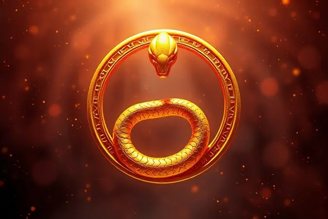
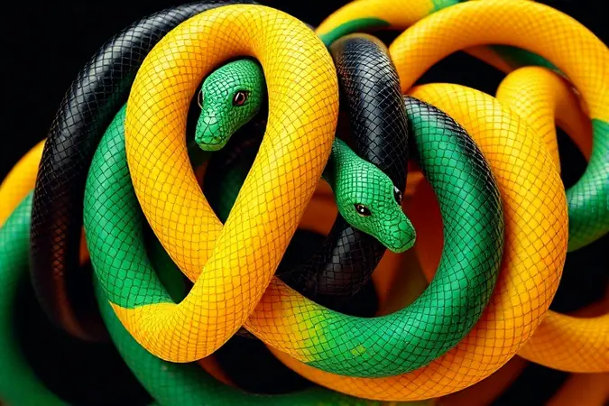
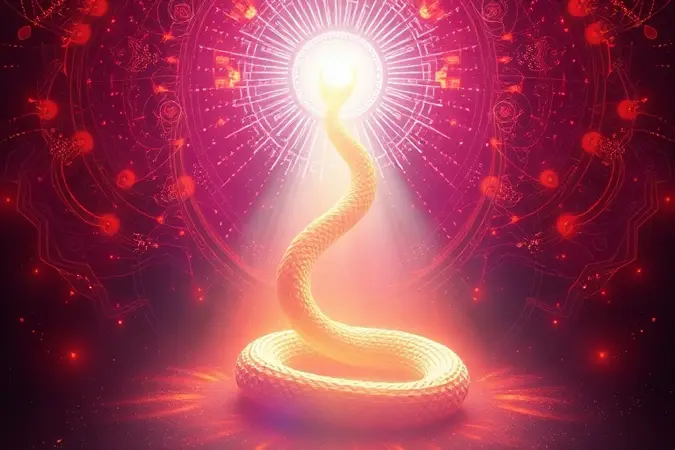

Você acordou assustado após sonhar com uma cobra e agora está se perguntando o que isso significa para sua vida? Saiba que você não está sozinho; este é um dos sonhos mais comuns e carregados de simbolismo no mundo todo.

Ter uma cobra em seu subconsciente pode ser tanto um sinal de renovação e cura quanto um alerta para traições ou medos ocultos.

Neste guia definitivo, vamos explorar todas as interpretações possíveis, desde o significado das cores até cenários específicos como cobras na cama ou ataques, para que você entenda exatamente a mensagem que seu inconsciente está tentando enviar.

<SummaryList products={frontmatter.top_products} />

## O que Significa Sonhar com Cobra? Entenda o Simbolismo Universal

Sonhar com cobras é uma experiência que muitas pessoas consideram intrigante, e seu simbolismo pode variar bastante. Em geral, as cobras são associadas a transformações, renascimento e cura.

Elas também podem representar medos e inseguranças ocultas, sugerindo a necessidade de enfrentar situações difíceis em nossa vida. A interpretação do sonho pode depender do contexto: se a cobra está ameaçando ou se é um elemento calmante no sonho.

Esses sonhos muitas vezes convidam à reflexão sobre mudanças pessoais e emoções profundas, oferecendo uma oportunidade para autoconhecimento e crescimento espiritual.

## A Psicologia por Trás do Sonho: O que Freud e Jung Dizem sobre Cobras

A interpretação dos sonhos envolvendo cobras varia entre as abordagens de Freud e Jung. Freud associava a cobra a símbolos de desejo sexual e medo, sugerindo que esses sonhos poderiam refletir ansiedades reprimidas ou questões relacionadas à sexualidade.

Por outro lado, Jung via a cobra como um arquétipo que representa transformação e renovação. Para ele, sonhar com cobras poderia sinalizar que o sonhador está passando por um processo de mudança pessoal ou enfrentando questões profundas de sua psique.

Ambas as perspectivas oferecem insights valiosos sobre como esses sonhos podem refletir emoções e experiências internas.

## Interpretando por Cores: O que a Tonalidade da Cobra Revela

As cores das cobras em sonhos podem ter significados variados. Por exemplo, uma cobra verde pode representar prosperidade e renovação, enquanto uma cobra preta pode sinalizar transformação e proteção.

Cada tonalidade traz uma mensagem específica que merece ser analisada.

### Sonhar com Cobra Preta: Medos e o Desconhecido

Imagine acordar com o coração acelerado, ainda sentindo aquela presença sombria em seu sonho.

A cobra preta não é apenas um símbolo de medo, ela representa aquela parte de você que teme o desconhecido, aquelas transformações que você sabe que precisa enfrentar mas que te paralisam.

É como se seu inconsciente estivesse dizendo: "Há algo que você precisa olhar de frente, mesmo que seja escuro". Quando esse sonho aparece, pode ser um convite para você reconhecer suas incertezas e dar o primeiro passo para iluminar esses cantos obscuros da sua vida.

### Sonhar com Cobra Verde: Sorte, Cura ou Regeneração?

Ao contrário do susto que a cobra preta pode causar, a cobra verde traz uma sensação diferente. Ela é como aquele sopro de ar fresco depois de uma tempestade, aquela esperança que renasce quando você menos espera.

Se ela apareceu em seus sonhos, pode ser um sinal de que seu corpo e mente estão buscando equilíbrio, pedindo por cura emocional. É como se seu subconsciente estivesse sussurrando: "Está na hora de se reconectar com seu bem-estar, de permitir que novas energias fluam".

Preste atenção em como você se sentiu durante o sonho, porque esse sentimento é a chave para entender se é hora de renovação ou se você já está no caminho da regeneração.

### Sonhar com Cobra Amarela: Alerta com Dinheiro e Riqueza

A cobra amarela tem uma mensagem clara sobre sua vida financeira, mas vai além dos números no extrato bancário. Ela fala sobre oportunidades que podem estar surgindo, sobre aquela sensação de que algo está prestes a mudar em suas finanças.

No entanto, a pergunta que ela traz é profunda: você está realmente aberto para receber essas bênçãos? Ou há algum bloqueio interno que te impede de prosperar?

Esse sonho pode ser um alerta gentil para você se preparar emocionalmente para as mudanças positivas que estão a caminho, garantindo que você não apenas as receba, mas também saiba como cultivá-las.

### Sonhar com Cobra Coral: O Perigo das Aparências Enganosas

A beleza vibrante da cobra coral pode ser fascinante, mas também enganosa. Esse sonho é como aquele pressentimento que você tem quando algo parece bom demais para ser verdade.

Seu inconsciente pode estar te alertando sobre pessoas ou situações que se apresentam de forma atraente mas escondem riscos. É aquele amigo que sempre tem a resposta certa, aquele negócio que promete retornos incríveis...

mas algo dentro de você sente que precisa ir além da superfície. Esse sonho pede que você confie mais na sua intuição do que nas aparências, que faça uma pausa antes de tomar decisões impulsivas.

### Sonhar com Cobra Branca: Paz de Espírito ou Mudanças Necessárias

A cobra branca traz um paradoxo interessante: ela pode representar tanto a paz de espírito que você busca quanto as mudanças necessárias para alcançá-la.

É como se seu subconsciente dissesse: "Você tem clareza suficiente para ver o que precisa ser feito, mas será que tem coragem para agir?" Esse sonho pode aparecer quando você está em um momento de transição, quando velhos padrões já não servem mais mas novos caminhos ainda não estão claros.

A mensagem é para que você confie nessa sabedoria interior que está emergindo, mesmo que ela exija que você abandone certas zonas de conforto.

## Sonhar com Cobra na Cama: O Significado da Intimidade Invadida

Sonhar com uma cobra na cama pode simbolizar preocupações sobre a intimidade ou a confiança em relacionamentos. Esse sonho sugere que algo ou alguém está invadindo seu espaço pessoal, representando desconfiança ou traição.

### Cobra em cima, embaixo ou dentro do cobertor

A posição da cobra em relação ao cobertor revela camadas diferentes do que está acontecendo em sua vida emocional. Se ela está em cima do cobertor, pode representar um problema que você já reconhece, algo que está visível e pedindo sua atenção imediata.

Quando está embaixo, sugere questões mais profundas, sentimentos que você tem mantido escondidos, talvez até de si mesmo. E se a cobra está dentro do cobertor?

Isso fala da intimidade mais profunda, daquelas partes da sua vida pessoal que poucos conhecem e que agora precisam de cuidado especial. Cada posição é um convite para explorar diferentes níveis do seu mundo interior.

### Sonhar com cobra no berço ou na cama dos filhos

Esse sonho toca em um dos instintos mais primários: o de proteger nossos filhos. Quando a cobra aparece no espaço das crianças, é como se todos os seus medos sobre a segurança deles ganhassem forma. Mas vá além do susto inicial.

Esse sonho também pode refletir transformações que estão acontecendo na dinâmica familiar, ou mostrar como você está processando seu papel como protetor.

Em vez de apenas ver isso como um alerta, encare como uma oportunidade para refletir: como estão as conexões emocionais na sua família? Há algo que precisa ser dito ou ajustado para garantir que todos se sintam realmente seguros e acolhidos?

## Ações e Comportamentos: O que o Movimento da Cobra Indica

O movimento da cobra simboliza adaptabilidade e transformação. Geralmente, sugere que você deve prestar atenção às mudanças em sua vida e estar preparado para se ajustar a novas circunstâncias de maneira fluida e astuta.

### Sonhar com Cobra Atacando ou Te Picando: Traições e Alertas

Aquele frio na espinha quando a cobra se move para atacar, a dor súbita da picada... esses elementos no sonho podem refletir aquela sensação no mundo real de que alguém está prestes te decepcionar. Mas esse sonho vai além das relações externas.

A cobra que ataca também pode representar seus próprios medos internos, aquelas vozes autocríticas que "picam" sua autoestima, ou situações que você tem evitado enfrentar.

A mensagem não é para você ficar paranoico, mas para desenvolver uma atenção mais aguçada, tanto para as pessoas ao seu redor quanto para os desafios internos que precisam da sua coragem.

### Sonhar que Mata uma Cobra: Superação de Obstáculos e Inimigos

Há uma sensação poderosa quando você vence a cobra no sonho, como se finalmente tivesse enfrentado algo que te assombrava há tempo.

Essa vitória simbólica não significa que você eliminou todos os problemas da sua vida, mas que descobriu dentro de si a força para lidar com eles.

Pode representar a superação de um hábito negativo, o fim de uma relação tóxica, ou simplesmente a decisão de não deixar mais que certos medos te controlem.

Esse sonho é um lembrete: você tem mais recursos internos do que imagina, e está pronto para transformar desafios em conquistas.

### Sonhar com Cobra Enrolada no Corpo ou no Pescoço: Sufocamento Emocional

A sensação de peso, de aperto, de não conseguir respirar livremente... quando a cobra se enrola em você no sonho, ela materializa exatamente como você se sente em certas situações da vida real.

Pode ser aquele trabalho que consome toda sua energia, aquele relacionamento que limita sua expressão, ou até expectativas sociais que te pressionam.

Esse sonho não está apenas mostrando o problema, ele está pedindo que você reconheça: "Estou me sentindo preso, e preciso encontrar uma saída".

A boa notícia é que o próprio sonho já é o primeiro passo para essa libertação, pois traz à consciência o que antes estava apenas como um mal-estar difuso.

## Tamanho Importa? Sonhar com Cobra Grande vs. Cobra Pequena

O tamanho da cobra em seu sonho é como um termômetro emocional. Quando ela é grande, impressionante, quase avassaladora, reflete aquelas preocupações que parecem maiores do que você, que ocupam tanto espaço mental que não deixam ver outras coisas.

Já a cobra pequena, muitas vezes despercebida a princípio, pode representar questões sutis que estão apenas começando a se desenvolver, detalhes que você tem ignorado mas que podem crescer se não forem atendidos.

Preste atenção não apenas ao tamanho, mas à sua reação a ele: o medo que uma cobra pequena causa pode revelar tanto quanto o pavor diante de uma gigante.

## O Significado Espiritual de Sonhar com Cobra em Diferentes Religiões

Sonhar com cobras carrega significados profundos e variados nas diferentes tradições religiosas. No Cristianismo, a cobra muitas vezes simboliza tentação e pecado, remetendo à história de Adão e Eva.

Já no Hinduísmo, a cobra é vista como um símbolo de sabedoria e proteção, representando a kundalini, uma energia espiritual latente. No Budismo, ela pode ser interpretada como uma representação da transformação e do poder oculto.

Em suma, o sonho com cobras pode refletir tanto desafios espirituais quanto oportunidades de crescimento, dependendo do contexto cultural e individual da pessoa.

## Melhores Livros para Decifrar seus Sonhos e se Autoconhecer

<ProductBox 
  title={frontmatter.top_products[0].title} 
  image={frontmatter.top_products[0].image} 
  link={frontmatter.top_products[0].link} 
/>

Se você deseja entender melhor o que seus sonhos podem estar tentando lhe dizer, existem alguns livros que podem ser verdadeiros guias nessa jornada de autoconhecimento.

Um dos mais clássicos é “A Interpretação dos Sonhos” de Sigmund Freud, onde ele explora a relação entre o inconsciente e os elementos oníricos. Outro grande nome é Carl G.

Jung com “O Homem e Seus Símbolos”, que conecta sonhos a arquétipos universais, ampliando a visão freudiana.

Para uma abordagem mais contemporânea, “O Oráculo da Noite” de Sidarta Ribeiro oferece uma narrativa fascinante sobre a ciência do sonho. Se você busca algo prático, “Significado dos Sonhos” de Leon Nacson é um guia passo a passo para decifrar mensagens oníricas.

Vale lembrar que a interpretação de sonhos pode ser subjetiva; a leitura pode trazer insights valiosos, mas também requer uma pitada de autoconhecimento para aplicar esses significados na sua vida.

## Guia Prático: O que fazer após ter um sonho marcante com cobra?

Após sonhar com uma cobra, é importante refletir sobre as emoções e a situação atual da sua vida. Comece registrando o sonho em um diário, anotando detalhes como o contexto, as cores da cobra e como você se sentiu durante o sonho.

Isso ajuda a conectar significados pessoais ao simbolismo da cobra, que pode representar transformação ou medos ocultos. Em seguida, considere meditar ou praticar técnicas de autocuidado para lidar com qualquer emoção intensa que possa surgir.

Por fim, pode ser útil discutir o sonho com amigos ou um terapeuta, pois isso pode proporcionar novas perspectivas e ajudar na compreensão das mensagens ocultas.

## FAQ: Perguntas Frequentes sobre Sonhar com Cobra

Sonhar com cobras é uma experiência comum que muitas pessoas relatam. Esse tipo de sonho pode ter diferentes significados, dependendo do contexto e das emoções sentidas durante o sonho.

Uma pergunta frequente é: "O que significa sonhar que estou sendo perseguido por uma cobra?" Isso pode indicar que você está lidando com medos ou inseguranças em sua vida.

Outra dúvida comum é: "Sonhar que mato uma cobra, o que significa?" Essa ação pode simbolizar a superação de desafios ou a liberação de emoções reprimidas. É sempre importante considerar o sentimento do sonhador, pois ele dá nuances ao significado do sonho.

## Conclusão

Sonhar com cobras é como receber uma carta do seu próprio subconsciente, escrita em uma linguagem de símbolos e emoções. Cada detalhe - a cor, o tamanho, o movimento, o cenário - é uma pista preciosa sobre o que está acontecendo em sua vida interior.

Esses sonhos não são premonições assustadoras, mas sim ferramentas de autoconhecimento que podem te ajudar a entender medos, reconhecer transformações necessárias e identificar padrões que talvez estejam te limitando.

Lembre-se que a interpretação mais valiosa sempre levará em conta como você se sentiu durante o sonho e como ele ressoa com sua realidade atual.

Em vez de buscar um significado universal fixo, pergunte-se: "O que essa cobra representa para mim neste momento da minha vida?" A resposta pode revelar insights surpreendentes sobre seus relacionamentos, seus medos, suas aspirações e seu caminho de crescimento pessoal.

Use esses sonhos como um convite para olhar mais profundamente para dentro de si, para ter conversas honestas consigo mesmo e para tomar decisões que realmente reflitam quem você é e quem deseja se tornar.

Se um sonho com cobra te perturbou, veja isso como um sinal de que algo importante precisa da sua atenção, não como uma sentença, mas como uma oportunidade de evolução.