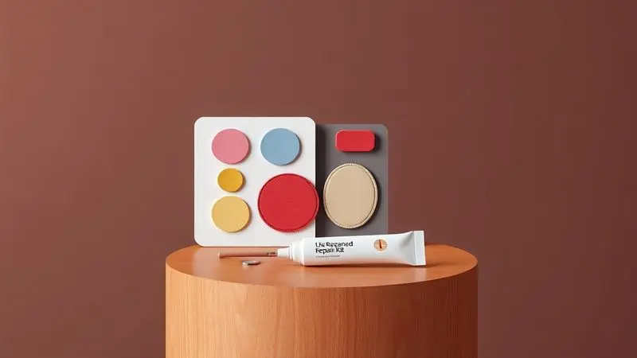
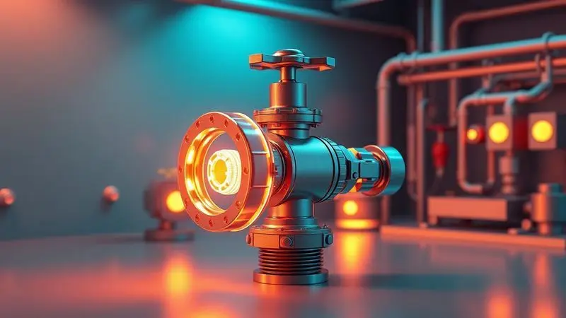
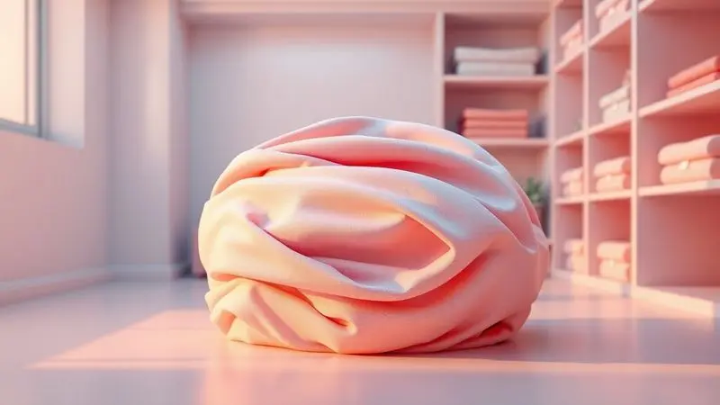

Acordar no meio da noite com seu corpo pressionando o solo porque o colchão inflável perdeu toda sua pressão é uma experiência frustrante que muitos conhecem. Mas você não precisa aceitar esse pesadelo como parte da sua vida.

A verdade é que quase todos os colchões de ar têm pontos vulneráveis onde o ar pode escapar - das válvulas às costuras mais delicadas.

A boa notícia é que 90% desses vazamentos podem ser resolvidos em casa, se você sabe como encontrar o problema e aplicar o reparo adequado.

Neste guia completo, não apenas revelamos os métodos mais eficientes para localizar até os menores e mais teimosos vazamentos, mas também trazemos o passo a passo detalhado para um reparo profissional que dura tanto quanto o colchão original.

Você aprenderá a distinguir entre problemas simples que podem ser corrigidos em minutos e situações mais graves que exigem atenção especial.

Escolher os materiais certos, evitar os erros comuns que só pioram o dano e saber quando realmente vale investir em um novo colchão serão parte do seu arsenal.

<SummaryList products={frontmatter.top_products} />

## Entendendo seu Colchão Inflável: Tipos e Pontos Críticos de Vazamento

Imagine seu colchão inflável como uma bolha de ar inteligente: ele precisa manter sua pressão interna enquanto resiste ao peso do seu corpo.

Existem dois tipos principais - os de ar convencional e os de espuma inflável, mas ambos compartilham pontos vulneráveis onde o desgaste natural ataca primeiro.

As válvulas são a porta de entrada do ar, mas também podem ser sua porta de saída se não estiverem bem vedadas. As costuras, onde os materiais se unem, são zonas de tensão que podem se desgastar com o uso repetido.

Detectar vazamentos precocemente não é apenas sobre manter a forma do colchão, é sobre garantir que você possa relaxar completamente durante suas aventuras outdoor ou visitas a amigos sem aquela ansiedade subconsciente de que seu apoio está desaparecendo lentamente.

## 4 Métodos Infalíveis para Localizar Vazamentos Invisíveis

Quando o vazamento é tão pequeno que você não consegue ouvir ou sentir, ele pode parecer um mistério impossível. Mas esses métodos transformam essa busca invisível em um processo visual e prático que revela cada ponto problemático.

### Método 1: Detecção por Espuma Detergente (O Mais Simples e Caseiro)

Esta técnica é tão simples quanto eficaz. Misture água com um pouco de detergente líquido em um recipiente - a proporção não precisa ser perfeita. Com uma esponja ou pano, aplique essa solução generosamente sobre toda a superfície do colchão inflado.

Aqui acontece a magia: quando a espuma entra em contato com o ar escapando, pequenas bolhas começam a formar um círculo perfeito no local exato do vazamento. É como ver o problema se materializar, eliminando toda a frustração de não saber onde está o defeito.

Este método não requer ferramentas especializadas e é econômico, permitindo que você identifique e planeje o reparo sem complicações.

### Método 2: Teste por Submersão Total (Para Vazamentos Difíceis)

Para vazamentos que resistem ao método do sabão, essa abordagem é sua solução definitiva. Encha completamente o colchão com ar e submerja-o em uma banheira, piscina ou mesmo um grande recipiente de água.

Observe cuidadosamente enquanto o colchão está submerso. Bolhas de ar emergirão em um fluxo constante nos pontos exatos onde o problema está.

Esta técnica é especialmente poderosa para vazamentos em áreas pequenas ou em costuras complicadas, onde o ar escapa em múltiplas direções. Depois de identificar a zona afetada, você está pronto para aplicar o remendo adequado que restaurará a vedação completa.

### Método 3: Verificação de Válvulas e Costuras (Áreas Mais Críticas)

Comece sempre pelos pontos onde os vazamentos são mais comuns. Verifique se as válvulas estão completamente fechadas e livres de qualquer detrito ou resíduo que possa comprometer a vedação.

Depois, examine cada costura com atenção. São essas linhas de junção que sofrem mais tensão com a expansão e contração do material. Uma verificação prática: inflar o colchão e aplicar água com sabão especificamente nessas áreas críticas.

As bolhas que aparecem são seu mapa de problemas, permitindo que você ataque o vazamento antes que ele se transforme em uma crise.

### Método 4: Técnica de Mangueira e Pressão (Para Colchões Grandes)

Quando você tem um colchão grande que precisa de uma verificação rápida e abrangente, esta técnica é ideal. Encha o colchão até sua pressão máxima recomendada e, usando uma mangueira ou esguicho, aplique água sobre toda sua superfície.

Observe enquanto a água escorre: bolhas de ar surgindo indicam precisamente onde o problema está. Este método é especialmente eficiente para colchões com áreas extensas onde o desgaste pode criar múltiplos pontos de falha.

É simples, rápido e elimina a necessidade de submergir grandes colchões.

## Kit de Materiais Essenciais: O que Realmente Funciona

Mas encontrar o problema é apenas o primeiro passo. Para fixá-lo de forma permanente, você precisa do kit de materiais adequado. A escolha correta aqui é o que separa um reparo temporário de uma solução que dura anos.

### Melhores Colas Específicas para Vinil e PVC

<ProductBox 
  title={frontmatter.top_products[0].title} 
  image={frontmatter.top_products[0].image} 
  link={frontmatter.top_products[0].link} 
/>

Quando o material é vinil ou PVC, a cola comum não funciona - você precisa de um adesivo que compreenda a flexibilidade desses materiais.

Para PVC rígido, produtos como Tekbond ou Soudal oferecem adesivos que criam uma soldagem a frio, ideal para situações que exigem resistência máxima à água.

Para vinil ou PVC flexível - como em colchões infláveis e lonas - a "Cola Vinil" da Tekbond se destaca por sua capacidade de manter a flexibilidade enquanto resiste às intempéries.

Alternativas excelentes incluem E6000 e Loctite Plastic Bonder, ambos formulados especificamente para aderir firmemente em superfícies flexíveis.

Prepare sempre a superfície adequadamente e trabalhe em ambientes ventilados, pois alguns desses produtos têm odor característico.

### Kits de Reparo Completos vs DIY - Análise Comparativa

<ProductBox 
  title={frontmatter.top_products[1].title} 
  image={frontmatter.top_products[1].image} 
  link={frontmatter.top_products[1].link} 
/>

Os kits de reparo completos são a escolha da conveniência. Eles incluem patches de PVC pré-cortados e adesivos específicos, tudo em um pacote projetado para funcionar em harmonia. São ideais para quem busca uma solução rápida e confiável sem experiência prévia.

A abordagem DIY oferece flexibilidade total. Você pode escolher materiais específicos e ajustar o processo às suas necessidades. Se já tem alguns itens em casa ou encontra materiais com melhor custo, essa opção pode ser mais econômica.

Mas ela demanda pesquisa cuidadosa para garantir que você está usando combinações compatíveis - um erro aqui pode resultar em reparo que se desfaz rapidamente.

### Materiais Alternativos para Soluções de Emergência

Quando o vazamento acontece durante uma viagem ou em uma situação urgente, materiais alternativos podem salvar seu descanso. Um pedaço de fita adesiva resistente - como fita de isolamento - pode servir como tampão temporário para pequenos furos.

Para buracos maiores, uma borracha ou plástico improvisado pode criar uma barreira eficiente até que você tenha acesso aos materiais adequados.

Cola específica para plásticos também pode ser aplicada rapidamente para selar vazamentos emergenciais. Mantenha esses itens básicos sempre disponíveis para resolver problemas que surgem quando você menos espera.

## Guia Passo a Passo: Reparo Profissional em 7 Etapas

Com o problema localizado e os materiais escolhidos, você está pronto para o reparo profissional. Este passo a passo transforma um processo técnico em uma experiência de restauração que devolve completamente a funcionalidade ao seu colchão.

### 1. Preparação Perfeita da Superfície (O Segredo da Durabilidade)

Antes de aplicar qualquer remendo, a preparação da superfície é o que define a durabilidade do reparo. Limpe cuidadosamente a área ao redor do vazamento usando um pano suave e água com sabão neutro.

Remova completamente qualquer sujeira, partículas ou resíduos que podem interferir com a adesão.

Deixe a área secar completamente - esta etapa é crucial.

Um remendo aplicado sobre uma superfície limpa e seca não apenas funciona melhor, mas também dura tanto quanto o material original, garantindo que você possa desfrutar de muitas noites confortáveis sem preocupações.

### 2. Corte e Customização do Remendo (Muito Além do Padrão)

Em vez de usar um remendo padrão, considere cortar um pedaço de material que corresponda exatamente ao tipo de superfície do seu colchão. Esta customização garante aderência perfeita e aumenta significativamente a durabilidade do conserto.

Utilize adesivos específicos para o material do seu colchão - essa combinação garante que o remendo não apenas se mantenha no lugar, mas também resiste à pressão constante e ao desgaste do uso regular.

Com atenção aos detalhes, você pode até combinar cores ou padrões, transformando o reparo em uma personalização que melhora a aparência do seu colchão.

### 3. Aplicação Técnica da Cola: Como Evitar Falhas Comuns

A aplicação da cola parece simples, mas técnicas adequadas evitam falhas futuras. Primeiro, limpe novamente a área para garantir que nenhum resíduo interfere com a adesão. Aplique uma camada uniforme de cola - evite excessos que podem criar bolhas ou pontos de fraqueza.

Uma dição essencial: deixe a cola secar por pelo menos 15 minutos antes de pressionar o remendo sobre ela. Este tempo permite que o adesivo comece seu processo de fixação.

Depois de aplicar pressão, respeite o tempo de cura completo recomendado pelo fabricante antes de inflar o colchão novamente.

### 4. Pressão e Curas: O Processo que Faz a Diferença

Este é o momento onde a paciência se transforma em resultado permanente. Após localizar o vazamento e aplicar o remendo, mantenha pressão adequada para que o material se fixe completamente ao colchão.

Evite inflar o colchão ao máximo antes da cura completa - isso permite que o adesivo ou selante se ajuste profundamente à superfície do vinil. O tempo de cura varia entre produtos, mas geralmente requer algumas horas.

Mantenha o colchão em ambiente estável durante este período para prevenir novas falhas.

### 5. Teste de Resistência Final (Antes de Confiar 100%)

Antes de considerar o problema resolvido, realize este teste final. Encha o colchão até sua capacidade recomendada e deixe-o em superfície plana por algumas horas.

Observe cuidadosamente: há qualquer sinal de perda de ar? Pressione levemente diferentes áreas para verificar se mantém pressão constante.

Este teste é sua garantia que pode confiar completamente na sua cama inflável antes de usá-la em situações reais como acampamentos ou visitas.

## Erros Fatais que Você PRECISA Evitar (Por Quem Já Errou)

Alguns erros podem transformar um reparo simples em um problema permanente. Evitar essas falhas comuns é essencial para garantir que seu trabalho tenha resultado duradouro.

### Super Bonder: Por que Destrói seu Colchão a Longo Prazo

O Super Bonder parece uma solução rápida, mas seu uso cria uma camada rígida que não permite a flexibilidade natural do material do colchão. Esta rigidez força novas rupturas nas áreas próximas ao reparo, transformando um pequeno vazamento em múltiplos problemas.

Além disso, essa cola pode comprometer a impermeabilidade original do colchão, reduzindo sua durabilidade radicalmente.

Em vez dessa solução temporária, considere kits de reparo específicos para colchões infláveis que proporcionam vedação segura e mantêm a flexibilidade necessária.

### Os 5 Minutos de Paciência que Salvam 100% dos Reparos

Dedicar apenas cinco minutos para inspecionar cuidadosamente a área afetada pode prevenir frustrações futuras. Deixe o colchão esvaziar completamente e use água com sabão para identificar cada bolha que revela um furo.

Este passo é crucial porque pequenos vazamentos podem passar despercebidos na inspeção rápida. Um reparo bem feito depende completamente de uma identificação precisa do problema. Este tempo extra elimina a ansiedade de dormir sobre um reparo incompleto.

## Diagnóstico Avançado: Qual Vazamento Vale a Pena Consertar?

Nem todos os vazamentos merecem o mesmo nível de atenção. Saber diferenciar entre problemas simples e situações críticas economiza seu tempo e recursos.

### Quando a Válvula é a Culpada (E Como Reparar)

Se você suspeita que a válvula está causando vazamentos, verifique primeiro se está completamente fechada. Se o problema persistir, examine a vedação de borracha - com o tempo ela pode ressecar ou desgastar.

Para reparar, aplique lubrificante à base de silicone nas partes móveis da válvula. Se a válvula está realmente danificada, substituição pode ser necessária. Manutenções regulares aqui prolongam significativamente a vida útil do colchão.

### Rachaduras Múltiplas vs Furo Único: Decisão Crítica

Um furo único é geralmente mais fácil de identificar e reparar - você pode concentrar toda sua atenção em um ponto específico.

Rachaduras múltiplas indicam problemas mais profundos, como deterioração do material, exigendo reparos extensivos ou mesmo substituição completa do colchão.

Avaliar esta extensão é fundamental para decidir se um remendo simples será suficiente ou se é hora de investir em novo colchão.

### Sinais de que seu Colchão Inflável Chegou ao Fim

Perda rápida de ar é o primeiro alerta claro que algo está comprometendo a estrutura. Irregularidades na superfície - ondulações ou áreas moles - apontam para danos internos mais graves.

Material apresentando rachaduras extensivas ou descoloração significativa indica deterioração avançada. Se seu colchão começa emitir barulhos estranhos ao se mover, sua estrutura está comprometida e substituição é a opção mais segura.

## Estratégias de Prevenção: Como Evitar Novos Vazamentos

Reparar um vazamento resolve o problema atual, mas prevenir novos problemas protege seu investimento e seu descanso futuro.

### Cuidados na Limpeza que Prolongam a Vida Útil

Mantenha seu colchão inflável limpo sem produtos químicos agressivos que podem degradar o material. Use solução suave de água morna e sabão neutro para limpar a superfície.

Depois da limpeza, secar completamente antes de guardar é essencial para evitar mofo e bolor. Armazenar em local fresco e seco, longe de luz solar direta que causa desbotamento e desgaste acelerado, transforma seu colchão em companheiro duradouro para muitas aventuras.

### Armazenamento Correto: Erro que 80% das Pessoas Cometem

Armazenamento inadequado compromete radicalmente a vida útil do produto. Dobrar ou enrolar o colchão de maneira irregular cria deformações que se transformam em vazamentos.

O ideal é esvaziar completamente e armazenar de forma plana em local seco e arejado. Evitar lugares úmidos ou com temperaturas extremas previne danos estruturais.

Usar bolsa ou capa protetora mantém o colchão livre de sujeira e desgastes durante armazenamento, garantindo que está sempre pronto para uso quando necessário.

## Perguntas Frequentes Resolvidas por Especialistas

### Qual o tempo de cura ideal para diferentes tipos de cola?

O tempo de cura varia significativamente entre tipos de cola. Cola de contato seca rapidamente - em torno de 20 a 30 minutos - mas pode levar até 24 horas para cura completa.

Colas epóxi geralmente têm secagem inicial de 5 a 10 minutos, mas cura total pode exigir 48 horas.

Para colas específicas para plásticos ou borrachas, o tempo é similar ao da cola de contato. Seguir sempre instruções do fabricante garante melhor adesão e durabilidade do reparo.

### Posso usar cola de silicone ou fita adesiva comum?

Usar cola de silicone ou fita adesiva comum oferece apenas reparo temporário. A cola de silicone pode não aderir adequadamente ao material do colchão, enquanto fita adesiva descola rapidamente quando exposta à umidade.

Para reparo eficaz e duradouro, considere kits específicos para reparo de colchões projetados para suportar condições e pressões que esses itens enfrentam regularmente.

### Como reparar uma válvula defeituosa sem trocar todo o colchão?

Reparar válvula defeituosa pode ser feito com técnicas simples. Localize a válvula danificada e remova-a se possível. Limpe área ao redor completamente para garantir ausência de sujeira ou detritos.

Use adesivo específico para plásticos ou borrachas para colar válvula novamente ou instalar nova. Se válvula não é removível, aplique camada de selante de borracha ao redor dela. Depois da aplicação, deixe secar completamente antes de inflar colchão novamente.

Esta abordagem prolonga vida útil sem necessidade de substituição completa.

### O reparo caseiro segura mesmo em dias de calor intenso?

Reparo caseiro pode ser eficaz mesmo em dias de calor intenso. Materiais utilizados em tintas e adesivos caseiros tendem ser resistentes a variações de temperatura.

Garanta sempre que local onde reparo foi feito está completamente seco e limpo para aumentar durabilidade.

Evite exposição direta ao sol nos primeiros dias após conserto - isso ajuda solidificar melhor cola ou material utilizado, garantindo que colchão continua funcional por tempo prolongado.

## Conclusão

Transformar um colchão inflável com vazamentos em uma solução confiável novamente não é apenas sobre técnicas e materiais - é sobre restaurar a confiança no seu próprio descanso.

Desde encontrar o problema invisível até aplicar o reparo permanente, cada passo deste guia foi projetado para eliminar a frustração de acordar sobre um colchão que desaparece lentamente.

Agora você sabe não apenas como identificar e corrigir vazamentos, mas também como prevenir novos problemas através de cuidados simples no armazenamento e limpeza. Diferenciar entre reparos simples e situações que exigem substituição economiza seu tempo e recursos.

Lembre-se que a paciência durante o processo de cura é o segredo para resultados que duram tanto quanto o colchão original.

Com estas técnicas em seu arsenal, você transforma um problema comum em uma solução permanente, garantindo que seu colchão inflável continue sendo companheiro confiável para todas suas aventuras e momentos de relaxamento.

A próxima vez que sentir seu colchão murchando, você saberá exatamente como restaurar completamente sua funcionalidade - e seu descanso.