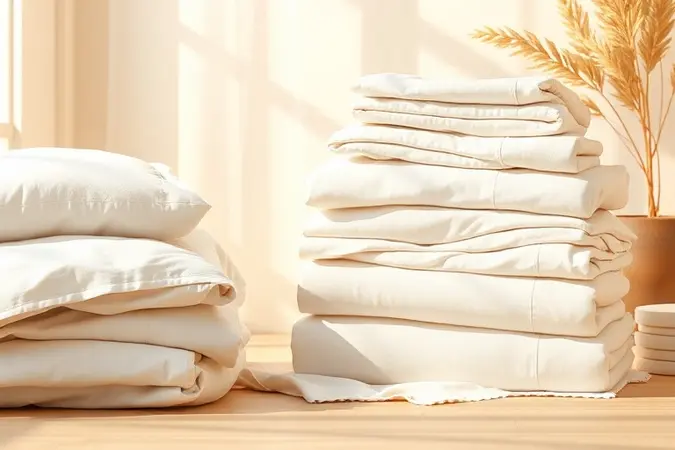
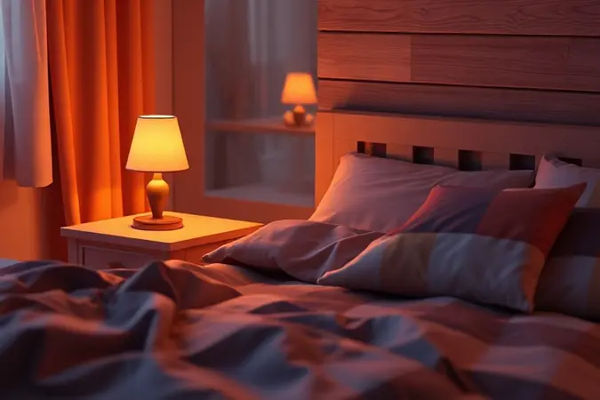

Imagine chegar em casa após um dia cansativo e encontrar um quarto que parece ter sido preparado especialmente para você, com uma cama que parece um convite ao descanso. Esse é o poder de transformar seu dormitório em um refúgio digno dos melhores hotéis.

Não se trata apenas de colocar lençóis novos; existe uma arte composta por detalhes cuidadosamente pensados que, quando combinados, criam uma experiência sensorial completa.

Aqui, você vai descobrir como dominar cada elemento, desde a escolha dos tecidos até os gestos finais que fazem toda diferença entre dormir bem e dormir excepcionalmente bem.

<SummaryList products={frontmatter.top_products} />

## O que define uma verdadeira 'Cama de Hotel'?

Pare um momento e visualize aquela cama perfeita que você encontrou em sua última estadia luxuosa. O que há nela? Não é apenas um conjunto de itens, mas uma combinação harmoniosa que começa com uma base sólida: um colchão que oferece suporte sem sacrificar o aconchego.

Acima dele, lençóis que parecem deslizar sobre sua pele, normalmente feitos de algodão egípcio ou percal, que oferecem aquela frescura característica. Os travesseiros, pensados para diferentes tipos de apoio, convidam você a afundar a cabeça.

E por fim, os detalhes visuais, como almofadas estrategicamente posicionadas e mantas com dobras precisas, que completam a atmosfera de sofisticação e cuidado.

Uma verdadeira cama de hotel é menos sobre itens isolados e mais sobre como eles trabalham juntos para criar uma experiência do início ao fim.

## A Base do Conforto: O Segredo do Colchão e do Pillow Top

<ProductBox 
  title={frontmatter.top_products[0].title} 
  image={frontmatter.top_products[0].image} 
  link={frontmatter.top_products[0].link} 
/>

Se o colchão é a fundação, o pillow top é a camada de conforto que transforma um simples apoio em um abraço.

Pense nessa camada adicional como um travesseiro do tamanho da cama, que molda seu corpo e alivia pontos de pressão, seja feita de espuma, látex ou fibras naturais.

Essa escolha representa um investimento que vai além do aumento inicial do custo; ele melhora significativamente a qualidade do seu descanso e protege sua base principal do desgaste diário.

Claro, encontrar o equilíbrio é essencial, pois algumas espessuras podem ser excessivas para quem prefere mais firmeza. A chave está em testar e escolher o material que se adapta ao seu corpo, convertendo cada noite em um descanso restaurador.

## Como Escolher o Enxoval: Fios, Tramas e Materiais

<ProductBox 
  title={frontmatter.top_products[1].title} 
  image={frontmatter.top_products[1].image} 
  link={frontmatter.top_products[1].link} 
/>

Agora que a base está definida, chegamos ao contato direto com sua pele: o enxoval. Aqui, números como a contagem de fios ganham vida prática.

Tecidos com 300 a 400 fios oferecem uma maciez duradoura e resistência ideal para o dia a dia, enquanto aqueles acima de 600 fios trazem um luxo acetinado que transforma o momento de dormir em uma experiência tátil única.

Preste atenção também às tramas: a trama simples é resistente e clássica, já a de cetim adiciona um brilho discreto e uma sensação de seda. Em termos de materiais, o algodão é insuperável por sua respirabilidade e conforto, especialmente em versões como o percal.

O poliéster pode parecer uma opção prática inicialmente, mas tende a reter calor e criar bolinhas com o tempo, comprometendo o conforto que você buscou desde o início.

### Por que hotéis priorizam lençóis brancos e de fibras naturais?

Observe qualquer quarto de hotel cinco estrelas e verá um padrão: tecidos brancos que transmitem pureza e frescor instantâneos.

Essa escolha vai além da estética minimalista; ela comunica limpeza absoluta e facilita a identificação de qualquer mancha, garantindo padrões rigorosos de higiene. Mas a verdadeira mágica está nas fibras naturais.

Algodão e linho não são apenas suaves; eles respiram com você, regulando a temperatura do corpo durante a noite e evitando aquela sensação de abafamento. Essa combinação de frescor visual e conforto funcional explica por que os hotéis investem nesses materiais.

Além de proporcionar noites de sono mais profundas, as fibras naturais têm uma durabilidade superior, sustentando o alto padrão mesmo com uso constante.

## Passo a Passo: Como Arrumar a Cama com Perfeição

Arrumar a cama como um profissional envolve mais do que dobrar lençóis; é uma sequência de gestos que cria ordem física e mental. Comece removendo todos os itens e limpando a superfície do colchão.

Em seguida, trabalhe cada camada com atenção, começando pelo lençol de baixo e finalizando com as fronhas perfeitamente alinhadas. Cada etapa é um convite à calma, transformando um ritual doméstico em um momento de cuidado pessoal.

### 1. O ajuste do lençol de baixo e o segredo da esticagem

Tudo começa com uma fundação lisa. Estique o lençol de baixo de forma que as bordas fiquem exatamente alinhadas com o colchão, certificando-se de que os elásticos estejam bem estendidos.

O truque dos 'cantinhos' é simples: coloque o lençol sobre um canto e insira os outros três embaixo do colchão, criando uma superfície uniforme que não se moverá durante a noite.

Esse cuidado inicial pode parecer pequeno, mas faz uma diferença monumental na sensação de estabilidade e conforto quando você se deitar.

### 2. A técnica do 'Canto de Envelope' (Hospital Corner) explicada

Esta técnica é o coração da arrumação profissional. Segure o lençol de cima na extremidade inferior da cama, levante-o para formar um triângulo, e então dobre a parte lateral sobre o colchão, prendendo tudo firmemente.

O resultado não é apenas visualmente elegante, mas funcionalmente inteligente. Os lençóis permanecem perfeitamente ajustados durante toda a noite, eliminando a frustração de ter que consertá-los a cada movimento.

É um detalhe que eleva a experiência do sono de comum para excepcional.

### 3. A arte das camadas: Edredons, colchas e mantas

<ProductBox 
  title={frontmatter.top_products[2].title} 
  image={frontmatter.top_products[2].image} 
  link={frontmatter.top_products[2].link} 
/>

As camadas superiores são onde o calor encontra o estilo. Edredons volumosos oferecem aquecimento ideal para noites frias, com opções dupla face que permitem alternar entre estilos conforme seu humor.

Colchas leves adicionam um toque decorativo durante o dia e são perfeitas para climas amenos. As mantas trazem versatilidade, podendo ser usadas como cobertor adicional ou acessório descontraído jogado sobre a cama.

A verdadeira arte está em combinar esses elementos de acordo com a estação e sua preferência pessoal, criando uma experiência de conforto totalmente personalizada.

## Como organizar travesseiros e almofadas para um visual volumoso

<ProductBox 
  title={frontmatter.top_products[3].title} 
  image={frontmatter.top_products[3].image} 
  link={frontmatter.top_products[3].link} 
/>

A organização dos elementos superiores é como compor uma obra de arte tridimensional. Comece com os travesseiros de dormir na parte traseira, apoiando sua cabeça e pescoço.

Em seguida, adicione almofadas decorativas em tamanhos e formas variadas, criando profundidade visual. Almofadas quadradas atrás e retangulares na frente produzem uma composição equilibrada.

Não tenha medo de misturar texturas, como veludo com algodão ou linho com renda, para adicionar riqueza tátil. Sim, almofadas de corpo podem ocupar espaço considerável, mas oferecem um conforto adicional para apoiar as costas enquanto você lê ou assiste algo na cama.

O resultado final é um convite visual irresistível que promete conforto antes mesmo de você se deitar.

## Truque de Especialista: Como tirar rugas do lençol sem passar ferro

<ProductBox 
  title={frontmatter.top_products[4].title} 
  image={frontmatter.top_products[4].image} 
  link={frontmatter.top_products[4].link} 
/>

Lençóis amassados podem roubar instantaneamente a sensação de luxo, mas existem soluções práticas que preservam seu tempo. Um borrifador com água é seu aliado secreto: borrife levemente as áreas enrugadas e estique o tecido com as mãos enquanto seca.

Para um efeito mais profundo, coloque o conjunto na secadora com um pano úmido ou alguns cubos de gelo. O vapor gerado relaxa as fibras naturalmente, suavizando as dobras sem esforço.

Sprays específicos para desamassar tecidos oferecem uma opção ainda mais rápida, especialmente para manutenção entre lavagens.

Embora vincos muito profundos possam ainda exigir o ferro, essas técnicas cobrem a maioria das situações do dia a dia, mantendo sua cama com aparência impecável com mínima intervenção.

## O que é o Serviço de Abertura de Cama (Turndown Service)?

Este ritual vespertino é o epítome do cuidado personalizado. Ao final do dia, enquanto você janta ou se prepara para descansar, alguém discretamente prepara seu santuário pessoal.

Isso inclui desarrumar gentilmente a cama, arrumar os travesseiros de forma convidativa e, frequentemente, deixar pequenas surpresas como chocolates finos ou uma flor fresca sobre o travesseiro.

O turndown service transforma o simples ato de ir para a cama em uma transição cerimonial do dia ativo para a noite tranquila, criando uma sensação de ser cuidado que torna cada estadia memorável.

## Dicas de Manutenção e Higiene para um Enxoval Duradouro

Investir em um enxoval de qualidade exige cuidado correspondente. Lave suas roupas de cama regularmente com água morna e sabão neutro, removendo impurezas sem agredir as fibras.

Evite amaciantes em excesso, pois eles podem criar uma película que reduz a respirabilidade do tecido. A secagem completa é crucial, seja ao ar livre com luz solar suave ou na secadora em temperatura baixa, prevenindo o surgimento de mofo.

Armazene seus lençóis em locais secos e arejados, preferencialmente com sachês de lavanda para manter um aroma fresco. Esses hábitos simples extendem significativamente a vida útil de cada peça, garantindo que seu investimento continue proporcionando conforto por anos.

## Erros comuns que impedem sua cama de parecer de hotel

Alguns deslizes podem sabotar todo o esforço de criar uma atmosfera luxuosa. Menosprezar a importância de um protetor de colchão adequado resulta em uma base que parece menos limpa e acolhedora.

Escolher travesseiros sem considerar o nível de firmeza ou altura ideal afeta não apenas a aparência, mas também seu conforto cervical. Lençóis mal passados ou trocados com pouca frequência transmitem descuido, mesmo que o resto do quarto esteja organizado.

Finalmente, negligenciar o volume e as camadas dos cobertores elimina aquele senso de abundância e calor que define visualmente uma cama de hotel. Cada um desses detalhes, quando abordado, contribui para a transformação completa do espaço.

## Perguntas Frequentes (FAQ)

Naturalmente surgem dúvidas ao tentar replicar esse padrão de excelência em casa. A sequência certa existe? Como garantir que cada elemento funcione em harmonia? Estas são algumas das questões que vamos esclarecer a seguir.

### Qual o melhor tipo de tecido para lençol de hotel?

Quando hotéis buscam proporcionar a sensação perfeita entre suavidade e durabilidade, geralmente apostam em algodão percal ou algodão egípcio. O percal oferece uma trama fechada que é ao mesmo tempo leve e respirável, mantendo você fresco durante a noite.

Já o algodão egípcio eleva a experiência com fibras extra-longas que criam uma maciez luxuosa quase sedosa. Contagens de fios a partir de 300 garantem que o tecido resista bem às lavagens frequentes, mantendo sua qualidade.

Esta combinação de materiais premium e construção robusta é o que permite que os lençóis de hotel aguentem o uso intenso sem perder seu conforto característico.

### Como deixar o quarto com cheiro de hotel de luxo?

<ProductBox 
  title={frontmatter.top_products[5].title} 
  image={frontmatter.top_products[5].image} 
  link={frontmatter.top_products[5].link} 
/>

A fragrância é o elemento invisível que completa a experiência sensorial. Enquanto alguns aromas de hotéis podem ser intensos para ambientes residenciais, você pode capturar sua essência com equilíbrio.

Escolha notas como lavanda, que promove relaxamento, sândalo para um toque terroso e sofisticado, ou cítricos para frescor matinal. Mantenha o espaço impecavelmente limpo com produtos com fragrâncias sutis.

Use difusores elétricos ou sprays têxteis em almofadas e cortinas para dispersar o aroma de forma controlada. Velas de cera vegetal, quando acesas por alguns momentos, criam uma atmosfera íntima sem saturar o ambiente.

Armazenar sua roupa de cama com sachês perfumados garante que cada vez que você for para a cama, um aroma delicado seja liberado. O resultado é um santuário pessoal que não só parece, mas também cheira como um refúgio de luxo.

## Conclusão

Criar sua própria cama de hotel em casa vai muito além da simples arrumação, é um ato de autocuidado que transforma seu quarto em um santuário pessoal.

Cada escolha, desde a firmeza do colchão com sua camada de pillow top até a trama precisa dos lençóis de algodão egípcio, contribui para uma experiência de descanso que nutre corpo e mente.

As técnicas aprendidas, como o ajuste perfeito dos lençóis e a arte das camadas, não são apenas sobre estética, mas sobre criar uma rotina que sinaliza ao seu cérebro que é hora de desconectar.

O ritual do turndown service que você pode implementar para si mesmo, os aromas cuidadosamente selecionados e a manutenção atenta do enxoval garantem que esse espaço permaneça como seu refúgio particular.

Ao dominar esses elementos, você não está apenas melhorando seu sono, está investindo em um estilo de vida que valoriza o descanso de qualidade como fundamento para dias mais produtivos e satisfatórios.

Comece hoje transformando um canto do seu quarto, e logo todo o ambiente respirará o mesmo acolhimento que antes você só encontrava em viagens especiais.