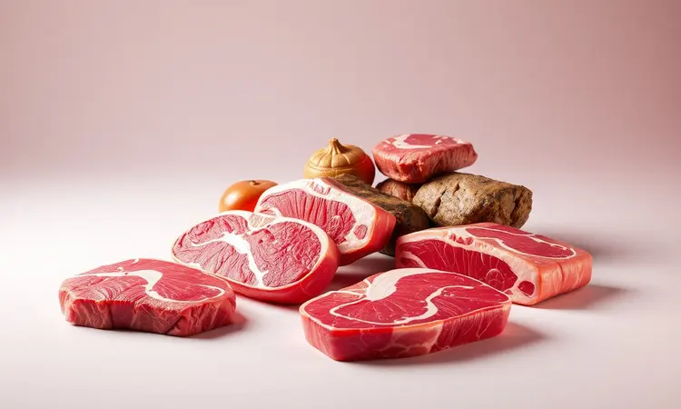
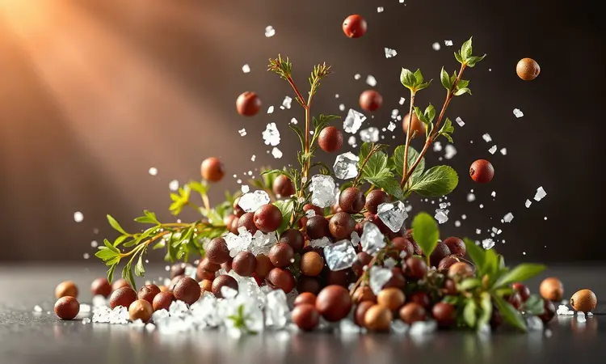
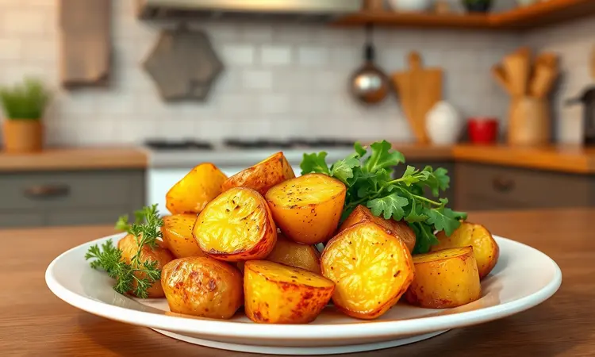

Você já desistiu de fazer costela em casa por achar que o processo é demorado demais ou que a carne ficaria seca e dura? É compreensível, mas a boa notícia é que a tecnologia está a seu favor.

Prepare-se para descobrir como preparar uma costela na Airfryer tão suculenta e macia que solta do osso, garantindo aquele sabor de churrasco profissional com a praticidade que sua rotina exige.

Neste guia, vamos revelar desde a escolha do corte ideal até os segredos de tempo e temperatura que os chefs não contam.

<SummaryList products={frontmatter.top_products} />

## Por que Fazer Costela na Airfryer é a Melhor Opção para o Dia a Dia?

Imagine acordar no domingo com vontade de um churrasco, mas sem disposição para passar horas cuidando do fogo. Ou chegar em casa depois do trabalho e em menos de uma hora ter na mesa uma refeição digna de restaurante. É essa magia que a Airfryer traz para sua cozinha.

Enquanto métodos tradicionais exigem horas de preparo, esse aparelho reduz o tempo de cozimento drasticamente sem sacrificar o sabor.

O segredo está na circulação de ar quente que envolve a carne por todos os lados, criando aquela crosta dourada e irresistível por fora enquanto preserva a suculência que faz a carne soltar do osso.

E tem mais: você usa muito menos óleo, transformando um prato tradicionalmente pesado em uma opção mais equilibrada para o dia a dia. A limpeza? Basta lavar o cesto, sem panelas engorduradas para esfregar.

É praticidade que cabe na sua rotina sem abrir mão do prazer de uma boa refeição.

## Melhores Cortes de Costela para a Fritadeira Elétrica

A primeira decisão que define o sucesso do seu prato é a escolha do corte certo. Pense na costela de boi quando quiser aquele sabor robusto e encorpado que lembra churrascaria premium.

A gordura entremeada derrete durante o cozimento, deixando cada pedaço incrivelmente suculento.

Para quem prefere uma textura ainda mais macia, a costela de porco é a campeã. Ela absorve marinadas como uma esponja, transformando temperos simples em explosões de sabor.

Se você busca algo diferente para impressionar, a costela de cordeiro oferece um sabor único e sofisticado que vai além do convencional.

Independente da sua escolha, o segredo está em dois pilares: o marinamento que prepara a carne para receber o calor e a temperatura precisa que trabalha as fibras sem ressecá-las.

## Utensílios Indispensáveis para um Resultado Perfeito

<ProductBox 
  title={frontmatter.top_products[0].title} 
  image={frontmatter.top_products[0].image} 
  link={frontmatter.top_products[0].link} 
/>

E agora que escolheu a carne perfeita, que ferramentas você precisa para transformá-la em uma obra-prima? Vamos além do básico e falamos dos aliados que fazem toda diferença.

O papel-alumínio de qualidade é seu primeiro grande parceiro.

Quando você embrulha a carne com o lado brilhante voltado para dentro, cria uma câmara de vapor que cozinha a carne uniformemente, garantindo aquela maciez que faz a costela desprender-se do osso com facilidade.

É como dar um banho de spa térmico para sua carne antes da finalização.

Uma forma específica para Airfryer evita que a costela grude no cesto, especialmente importante quando você está trabalhando com peças maiores.

Pegadores de silicone são seus melhores amigos para manusear a carne quente sem o risco de queimaduras ou de furar a superfície e liberar os preciosos sucos.

Não subestime o poder de uma boa faca afiada para cortar a costela no tamanho ideal antes e depois do cozimento. E se você realmente quer precisão profissional, há um acessório que muda completamente o jogo.

### Termômetro Culinário: O Segredo da Precisão

<ProductBox 
  title={frontmatter.top_products[2].title} 
  image={frontmatter.top_products[2].image} 
  link={frontmatter.top_products[2].link} 
/>

Você já tirou uma costela do forno achando que estava perfeita, só para descobrir que o centro ainda precisava de mais tempo? É aqui que o termômetro culinário entra como seu olho mágico dentro da carne.

Esqueça adivinhações ou cortes para verificar o ponto. Com um termômetro digital de espeto, você sabe exatamente quando a temperatura interna atingiu os 63°C para um ponto mal passado suculento ou os 71°C para um bem passado perfeito.

É a garantia de que cada centímetro da sua costela está exatamente como você deseja, sem áreas cruas ou ressecadas.

Os modelos infravermelhos são ótimos para verificar a superfície, mas para a precisão que realmente importa, o termômetro de espeto é investimento que paga cada centavo na primeira costela perfeita que você preparar.

### A Importância do Papel Alumínio de Qualidade

<ProductBox 
  title={frontmatter.top_products[1].title} 
  image={frontmatter.top_products[1].image} 
  link={frontmatter.top_products[1].link} 
/>

Voltando ao papel-alumínio, a qualidade faz mais diferença do que você imagina. Papéis de baixa qualidade podem não suportar as altas temperaturas da Airfryer, rasgando no meio do processo e liberando todo o vapor que estava amaciando sua carne.

Invista em um papel com espessura adequada e resistência térmica. Ele não apenas cria a barreira perfeita para o cozimento a vapor como também evita que partículas metálicas se transfiram para seus alimentos.

Pense nisso como o invólucro que protege seu tesouro culinário até o momento certo de revelá-lo.

## Ingredientes e O Segredo do Tempero Suculento

Agora vamos ao coração do sabor. Comece com uma costela de boi de boa qualidade, onde você consegue ver as camadas de carne e gordura que garantem a suculência. O tempero básico é elegante em sua simplicidade: sal grosso, pimenta-do-reino moída na hora e alho em pó.

Mas se quer elevar o jogo, adicione páprica doce para coração ou páprica defumada para aquele toque sutil de churrasco. E aqui está o verdadeiro segredo que separa o bom do extraordinário.

A marinada não é apenas sobre sabor, é sobre transformação física. Quando você deixa a costela descansando com o tempero por algumas horas (ou melhor ainda, durante a noite), os sais e ácidos começam a quebrar suavemente as fibras musculares.

É como uma massagem profunda que prepara a carne para receber o calor sem tensionar, resultando naquela textura que literalmente cai do osso.

## Passo a Passo Detalhado: Costela na Airfryer que Solta do Osso

Com todos os elementos preparados, é hora da magia acontecer. Comece temperando generosamente toda a superfície da carne, massageando os temperos para que penetrem. Enquanto isso, pré-aqueça sua Airfryer a 180°C.

Coloque a costela no cesto e deixe trabalhar por 40-50 minutos, virando cuidadosamente na metade do tempo para garantir que todos os lados recebam aquele calor dourador igualmente. Parece simples, mas dentro desse processo estão duas fases que fazem toda a diferença.

### Fase 1: O "Bafo" com Papel Alumínio

Nos primeiros 30 minutos, envolva sua costela em duas camadas de papel-alumínio, deixando espaço suficiente para o vapor circular sem escapar. Isso cria um microclima úmido dentro do embrulho, onde o calor suave de 160°C trabalha nas fibras sem agressão.

É como um banho turco para a carne: o vapor amacia, a temperatura controlada cozinha uniformemente e os sucos começam a se libertar, criando um caldo rico que banha a carne por dentro.

Quando você desembrulhar depois dessa fase, encontrará uma carne já macia, mas pálida e pronta para sua transformação final.

### Fase 2: A Finalização para Dourar e Criar Crosta

Agora vem o momento da revelação. Retire o papel-alumínio e aumente a temperatura para 200°C. É aqui que a mágica visível acontece: em apenas 5 a 10 minutos, a superfície que estava úmida e pálida se transforma em uma crosta dourada, caramelizada e levemente crocante.

Essa crosta não é apenas estética. Ela sela todos os sucos que foram liberados durante a primeira fase, criando uma barreira que mantém a umidade dentro enquanto desenvolve sabores complexos através da reação de Maillard.

Fique atento, pois o ponto ideal é quando você vê aquela cor dourada uniforme, mas antes que qualquer parte comece a queimar.

## Tabela de Tempo e Temperatura por Tipo de Corte

Cada corte tem sua personalidade e exige um tratamento específico. Para a costela de boi com seu sabor robusto, 25 a 30 minutos a 180°C criam o equilíbrio perfeito entre cozimento interno e desenvolvimento de sabor.

A costela de porco, mais delicada, responde melhor a 20-25 minutos a 200°C, temperatura que derrete sua gordura característica sem ressecar a carne.

Já as baby back ribs, menores e mais tenras, ficam perfeitas com 15-20 minutos na mesma temperatura, tempo suficiente para cozinhar sem perder sua textura única.

Lembre-se: esses são pontos de partida. O verdadeiro mestre confia no termômetro e na intuição, verificando a macieza com o garfo e ajustando conforme necessário.

## Dicas de Especialista para uma Carne Ainda Mais Macia

Quer o nível profissional? Comece secando completamente a superfície da costela com papel toalha antes de temperar.

A água na superfície cria vapor que impede a formação da crosta perfeita, enquanto uma superfície seca permite que os temperos grudem e a caramelização aconteça de forma uniforme.

Escolha cortes com boa marmorização, aquelas finas veias de gordura que derretem durante o cozimento, banhando a carne por dentro. É a gordura que transporta o sabor e cria a textura sedosa que faz você fechar os olhos ao mastigar.

E o passo mais negligenciado, mas talvez o mais importante: deixe a costela descansar por 5-10 minutos após sair da Airfryer. Durante esse tempo, as fibras relaxam e os sucos que foram para as extremidades pelo calor se redistribuem uniformemente.

Cortar imediatamente é como abrir uma garrafa de champagne agitada: você perde o melhor.

## Acompanhamentos Ideais para Servir com sua Costela

Uma costela perfeita merece companhias à altura.

Pense em contrastes e complementos: o purê de batatas cremoso oferece a suavidade que equilibra a intensidade da carne, enquanto uma salada coleslaw crocante traz frescor e textura que limpam o paladar entre uma mordida e outra.

Arroz com brócolis não é apenas um acompanhamento, é uma oportunidade de absorver os sucos deliciosos que ficaram no prato. E pães integrais ou franceses tornam-se veículos perfeitos para não deixar uma gota sequer desses sabores se perder.

## Erros Comuns: Por que sua Costela Pode Ficar Dura (e Como Evitar)

O maior pecado contra a suculência é pular a marinada ou fazer por pouco tempo. Menos de duas horas é apenas temperar a superfície; você quer que os sabores penetrem, amaciando enquanto aromatizam.

Temperatura muito alta desde o início é convite para o desastre: a superfície sela rápido, mas o interior fica cru, e quando o centro finalmente cozinha, as bordas já estão ressecadas. Comece sempre mais baixo e aumente gradualmente.

Não seguir o descanso pós-cozimento é como correr uma maratona e parar bruscamente: os músculos (no caso, as fibras da carne) contraem, prendendo os sucos que deveriam estar distribuídos. Paciência nesses últimos minutos transforma uma boa costela em uma inesquecível.

## Perguntas Frequentes sobre Costela na Airfryer (FAQ)

Quanto tempo realmente leva? Para uma costela média, conte com 30-40 minutos a 200°C, mas seu termômetro dirá a verdade final.

Preciso virar? Sim, na metade do tempo, para que todos os lados recebam igual atenção do ar quente.

Posso congelar depois de pronta? Pode, mas saiba que parte da textura se perde. O ideal é congelar antes do cozimento e seguir todo o processo quando for consumir.

E se minha Airfryer for pequena? Corte a costela em pedaços menores antes de temperar, garantindo que todos caibam numa única camada sem amontoar.

## Conclusão

Preparar uma costela na Airfryer que solta do osso não é ciência de foguete, mas é arte culinária acessível a todos.

É sobre entender como o calor age nas fibras, como os temperos conversam com a carne e como pequenos cuidados em cada fase se transformam em resultados extraordinários.

Desde a escolha do corte até o momento em que você serve, cada decisão contribui para aquele instante em que a faca desliza sem resistência e o primeiro pedaço se separa do osso, suculento e perfumado.

É a prova de que praticidade e qualidade podem andar juntas, que você não precisa de horas livres ou equipamentos profissionais para criar memórias gastronômicas.

Agora é sua vez. Escolha seu corte favorito, reserve algumas horas para a marinada fazer sua mágica e prepare-se para redefinir o que você acredita ser possível em sua própria cozinha.

Sua primeira costela perfeita não está em um restaurante caro, está a um pré-aquecimento de distância.