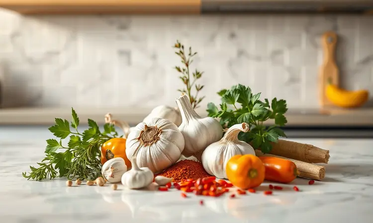
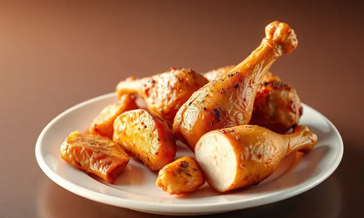
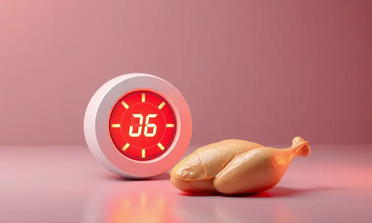
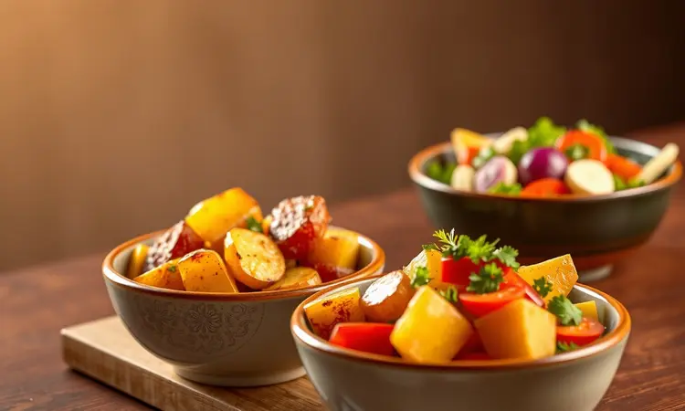

Você adora o sabor de um frango assado suculento, mas evita fazer em casa por causa da demora e da sujeira no forno? Saiba que a airfryer é a ferramenta perfeita para obter resultados profissionais com metade do esforço.

Neste guia definitivo, você vai descobrir como preparar o frango perfeito na airfryer, com aquela pele dourada e crocante que estala na mordida, enquanto a carne por dentro permanece tão macia que quase se desfaz.

Vou te mostrar o passo a passo completo, as melhores combinações de temperos e os truques de chef que transformarão sua rotina na cozinha.

Então, por que tantas pessoas estão abandonando o forno tradicional pela airfryer quando o assunto é frango assado? A resposta está em como essa tecnologia inteligente funciona.

Imagine o ar quente circulando suavemente por todos os lados do frango, garantindo que cada centímetro receba a mesma quantidade perfeita de calor.

Essa circulação consegue o que parece quase impossível: uma pele tão dourada e crocante quanto a batata frita do seu restaurante favorito, mas usando apenas uma colher de óleo ou até menos.

O sabor fica potente, concentrado como se você tivesse fritado, mas seu prato ganha um selo de saudabilidade quase mágico. E o melhor? Todo esse processo acontece em minutos, não em horas.

<SummaryList products={frontmatter.top_products} />

## Ingredientes e Temperos: O Segredo do Sabor Marcante

O ponto de partida para qualquer receita memorável é simples: bons ingredientes escolhidos com cuidado. Para o seu frango na airfryer, pense primeiro no corte que mais combina com seu paladar.

Coxas oferecem uma suculência natural que derrete na boca, enquanto peito de frango exige um pouco mais de técnica para ficar perfeito, mas recompensa com uma maciez que surpreende.

Quanto aos temperos, começamos sempre com o trinômio clássico que nunca falha: sal, pimenta-do-reino e alho em pó. A paprika entra como artista convidada, trazendo não apenas cor mas uma profundidade de sabor que faz diferença.

Ervas aromáticas como alecrim ou tomilho trabalham nos bastidores, liberando seus aromas sutis a cada mordida. Mas o verdadeiro segredo está nas marinadas. Deixar o frango absorvendo os sabores por algumas horas transforma completamente a experiência.

Pense numa marinada de iogurte natural e limão: o primeiro suaviza as fibras da carne, o segundo realça cada nota de sabor.

## Passo a Passo Completo: Como Preparar Frango na Airfryer

Com os ingredientes selecionados e o frango já abraçando os sabores da marinada, chegou a hora da magia acontecer. O processo é tão simples que você vai se perguntar por que não começou antes.

Prepare sua airfryer aquecendo-a a 200°C por cinco minutos, esse pré-aquecimento faz toda diferença para um cozimento uniforme desde o primeiro segundo. Coloque os pedaços de frango no cesto, garantindo que não estejam amontoados.

O ar precisa circular livremente para trabalhar sua magia. Programe 25 a 30 minutos e fique tranquilo: na metade do tempo, basta virar os pedaços com uma pinça. Essa virada é o movimento que garante aquela douradura perfeita em todos os lados.

### Como Temperar e Marinar para Máxima Suculência

Se você já se perguntou por que o frango do restaurante tem sempre aquela suculência que parece desafiar a física, a resposta está na paciência com a marinada.

Ingredientes ácidos como suco de limão ou vinagre de maçã fazem um trabalho silencioso mas essencial: eles relaxam as fibras da carne, criando caminhos para os sabores penetrarem mais fundo.

Aquela mesma alquimia acontece quando você acrescenta alho fresco picado ou gengibre ralado. O segredo não está apenas na combinação, mas no tempo de descanso.

Trinta minutos já fazem diferença, mas se você conseguir deixar marinar por algumas horas ou até durante a noite na geladeira, o sabor se multiplica exponencialmente. Você literalmente colherá na boca o tempo investido.

### O Truque de Mestre para a Pele Ficar Dourada e Crocante

Há uma certa magia em cortar a faca sobre a pele do frango e ouvir aquele estalo crocante, seguido por uma carne tão suculenta que quase derrama seu sabor. Para chegar nesse ponto, comece com um simples gesto: seque muito bem a pele com papel toalha.

Cada gota de umidade removida é menos vapor durante o cozimento, e menos vapor significa mais crocância. Uma leve pincelada de azeite faz a pele brilhar dourada enquanto conduz o calor de forma uniforme. O movimento mais importante? Aquela virada na metade do tempo.

Ela expõe todos os lados ao ar quente circulante, criando uma crosta dourada que protege toda a suculência por dentro.

## Guia de Tempo e Temperatura por Tipo de Corte (Coxa, Peito e Asa)

Cada corte de frango tem sua própria personalidade na airfryer, e entendê-las é a chave para resultados perfeitos. Coxas e sobrecoxas, com seu teor de gordura generoso, adoram 200°C por 25 a 30 minutos.

Esse tempo permite que a gordura derreta lentamente, banhando a carne por dentro enquanto a pele alcança seu tom dourado perfeito.

O peito de frango, mais tímido e com tendência a secar, prefere 180°C por 20 a 25 minutos, uma temperatura mais gentil que cozinha sem agressão.

Já as asas são as aventureiras do grupo: 200°C por 20 a 25 minutos as transformam em pedacinhos crocantes que desaparecem rapidamente da mesa. Independentemente do corte, seu melhor aliado é um termômetro culinário simples.

Quando o centro do pedaço mais grosso alcançar 75°C, você pode servir com a certeza de que cada mordida será suculenta e segura.

## Como Assar um Frango Inteiro na Airfryer com Sucesso

Há uma satisfação especial em servir um frango inteiro na mesa, com aquela apresentação que parece saída de programa culinário. A airfryer torna esse momento muito mais acessível do que você imagina.

Comece massajando o tempero por todo o frango, incluindo a cavidade, cada centímetro precisa sentir o sabor. Posicione-o na cesta deixando espaço generoso para o ar circular, como se estivesse deitado confortavelmente em sua própria câmara de calor.

A temperatura ideal fica em 180°C, e o tempo variará conforme o tamanho: conte com 45 a 60 minutos. Virar o frango na metade do processo é essencial para que as costas também ganhem sua crocância dourada.

Quando o termômetro inserido na parte mais grossa da coxa marcar 75°C, você terá realizado uma pequena mágica doméstica: um frango inteiro, perfeitamente assado, sem precisar lidar com a limpeza trabalhosa de um forno tradicional.

## Melhores Modelos de Airfryer para Assar Frangos Grandes

<ProductBox 
  title={frontmatter.top_products[0].title} 
  image={frontmatter.top_products[0].image} 
  link={frontmatter.top_products[0].link} 
/>

Depois de dominar as técnicas, talvez você queira expandir seus horizontes culinários com modelos que transformam a experiência completamente. Para frangos inteiros e refeições familiares, a capacidade se torna sua melhor amiga.

Modelos a partir de 5 litros funcionam, mas entre 10 e 15 litros você ganha espaço não apenas para o frango, mas para assar legumes ao redor, criando uma refeição completa em uma única cesta.

Os modelos do tipo "oven" (ou forno airfryer) trazem recursos como espetos giratórios que lembram aquelas churrascarias tradicionais, garantindo que cada lado doure igualmente sem que você precise intervir.

Dos modelos disponíveis, o Electrolux EAF90 impressiona com seus 12 litros e função rotisserie que literalmente gira seu frango enquanto cozinha. O Philco Air Fryer Oven PFR2200P, também com 12 litros, foi projetado pensando em aves e assados mais elaborados.

Já o Oster Oven, disponível em 12L ou 15L, oferece multifuncionalidade que vai além do frango, tornando-se um verdadeiro centro culinário compacto. Por fim, o Wap Barbecue Digital com 10 litros oferece versatilidade em um design que se adapta a diversas necessidades.

A consideração sobre espaço na bancada é válida: esses modelos maiores exigem seu lugar ao sol, mas o retorno em versatilidade compensa cada centímetro ocupado.

## Acessórios Úteis para Facilitar o Preparo e a Limpeza

<ProductBox 
  title={frontmatter.top_products[1].title} 
  image={frontmatter.top_products[1].image} 
  link={frontmatter.top_products[1].link} 
/>

Como qualquer ferramenta de cozinha, os acessórios certos podem transformar sua airfryer de um eletrodoméstico útil em um verdadeiro estúdio culinário.

Formas e bandejas antiaderentes são investimentos que pagam dividendos em tempo e paciência: elas garantem que seu frango deslize para o prato, deixando para trás apenas uma lavagem rápida.

Grelhas criam aquelas marcas douradas que dão ao prato uma aparência profissional, enquanto espetos permitem experimentar receitas de frango grelhado que você achava impossíveis fora de uma churrasqueira.

Separadores de alimentos são como ter duas airfryers em uma: imagine assar frango em um lado e batatas rústicas temperadas no outro, sem que os sabores se misturem.

Tapetes descartáveis ou reutilizáveis protegem o fundo do cesto e tornam a limpeza literalmente descartável. Apenas atente-se à compatibilidade: alguns acessórios são específicos para determinadas marcas.

No geral, esses pequenos investimentos ampliam dramaticamente o que você pode criar, tornando cada refeição uma nova descoberta.

## 5 Erros Comuns que Deixam o Frango Seco ou Cru por Dentro

Mesmo com toda a tecnologia, alguns deslizes podem comprometer seu frango perfeito. O primeiro é subestimar o poder da marinada: pular essa etapa é como tentar construir uma casa sem fundação.

O segundo erro é ignorar o pré-aquecimento: colocar o frango em uma airfryer fria significa que os primeiros minutos serão desperdiçados apenas aquecendo o aparelho, resultando em um cozimento desigual.

Terceiro, amontoar os pedaços na cesta impede a circulação do ar, criando pedaços que cozinham mais rápido nas extremidades enquanto o centro fica quase cru.

O quarto erro é esquecer que tamanho importa: pedaços muito grandes podem precisar de ajustes no tempo, enquanto pedaços muito pequenos secam antes de desenvolverem sabor.

Finalmente, confiar apenas no cronômetro sem verificar a temperatura interna é como dirigir sem olhar para a estrada. Um termômetro culinário simples é seu seguro contra surpresas desagradáveis, garantindo que cada refeição termine com elogios, não com preocupações.

## Dicas de Acompanhamentos Perfeitos para o seu Assado

Um frango perfeito merece acompanhamentos que conversem com seus sabores, criando uma sinfonia no prato. Arroz soltinho preparado com legumes em cubos absorve os sucos do frango de maneira sublime.

Purê de batata cremoso oferece o contraste perfeito com a crocância da pele: maciez que abraça o crocante. Saladas frescas com folhas verdes vibrantes e tomates adicionam aquele frescor que limpa o paladar entre as mordidas, preparando-o para a próxima.

Para quem busca algo fora do comum, cenouras caramelizadas lentamente desenvolvem uma doçura natural que dança com os temperos do frango. Abóbora assada com um fio de mel e nozes traz texturas e sabores que transformam uma refeição simples em uma experiência memorável.

Cada acompanhamento é uma oportunidade de ampliar a experiência, criando combinações que farão seus convidados ou sua família perguntarem: "Quando você vai fazer isso de novo?"

## Perguntas Frequentes (FAQ) sobre Frango na Airfryer

É natural que dúvidas surjam quando você começa a explorar essa nova maneira de cozinhar. "Quanto tempo realmente leva?" Depende do corte, mas a maioria dos pedaços leva entre 20 e 30 minutos a 180°C.

Lembrar de virar na metade do tempo é o segredo para uma douradura uniforme que parece profissional. "Preciso mesmo marinar?" Sim, e quanto mais tempo, melhor. Aquelas horas extras na geladeira trabalham transformando carne comum em uma experiência gastronômica.

"Como limpo isso depois?" A maioria dos modelos tem cestos removíveis que vão direto para a pia, e aqueles acessórios antiaderentes fazem com que os restos se soltem quase sozinhos.

Mais uma questão comum: "Posso fazer frango congelado?" Pode sim, mas adicione alguns minutos ao tempo de cozimento e conte com um pré-aquecimento um pouco mais longo.

E a eterna dúvida: "Qual o melhor tempero?" Comece com o clássico que mencionei, mas depois sinta-se livre para experimentar. Cozinha é descoberta, e sua airfryer é o laboratório perfeito.

## Conclusão

Dominar o frango na airfryer é mais do que aprender uma nova técnica culinária: é redescobrir o prazer de cozinhar sem o peso da complicação.

Essa ferramenta inteligente entrega o que promete: praticidade que se traduz em mais tempo para você, resultados que impressionam visualmente e, mais importante, sabores que fazem com que cada refeição valha a pena.

A crocância perfeita da pele, a suculência preservada da carne e a versatilidade para experimentar desde o jantar rápido entre semana até o almoço especial de domingo, tudo isso está ao alcance de alguns botões.

O que começou como um eletrodoméstico para quem tem pressa, revela-se como uma ferramenta para quem tem apreço pelo bem comer.

Cada frango assado torna-se não apenas uma refeição, mas uma pequena vitória doméstica: uma prova de que sabor e praticidade podem, sim, ocupar o mesmo espaço na sua cozinha e na sua rotina.

Agora que você tem o guia completo nas mãos, resta apenas escolher o corte, selecionar os temperos e dar o primeiro passo. Sua próxima refeição já está esperando para ser descoberta.