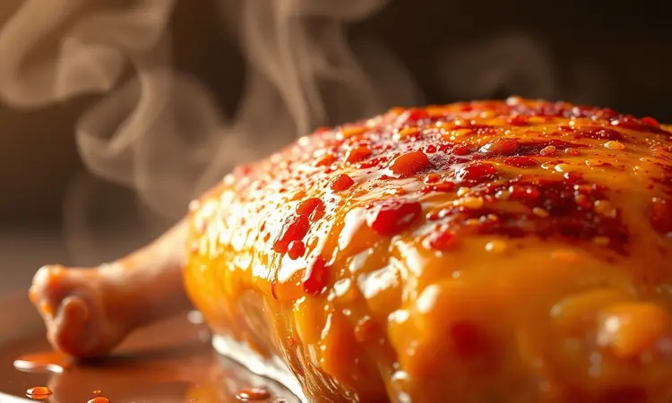
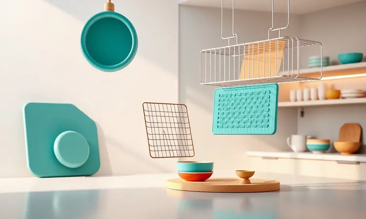
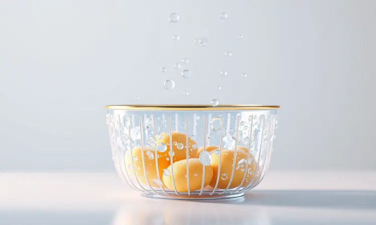

Já aconteceu com você de preparar frango na Airfryer e ele sair seco, borrachudo ou grudado no cesto? Você não está sozinho nessa frustração. A promessa de uma refeição rápida e saudável frequentemente esbarra em pequenos detalhes que fazem toda diferença.

Neste guia, vamos revelar os segredos para transformar qualquer corte do frango (peito, coxa ou sobrecoxa) em pratos dignos de restaurante. Você vai aprender desde a técnica que garante suculência interna até os acessórios que realmente facilitam sua rotina culinária.

<SummaryList products={frontmatter.top_products} />

## Por que preparar frango na Airfryer é a melhor escolha?

Imagine conseguir aquela textura crocante que só uma boa fritura proporciona, mas sem o óleo em excesso que deixa a sensação pesada depois.

A Airfryer entrega exatamente isso: utiliza ar quente em circulação intensa para selar rapidamente os sucos da carne, mantendo-a úmida por dentro enquanto desenvolve camada externa dourada e perfeitamente crocante. O resultado?

Uma refeição que combina saúde sem abrir mão do prazer gustativo. E a praticidade vai além do cozimento: a limpeza é absurdamente facilitada, já que não há borra de óleo ou gordura grudada por todos os lados.

Você pode explorar desde marinadas simples até combinações sofisticadas de temperos, personalizando cada prato de acordo com seu humor e paladar.

## O Segredo da Suculência: Como não deixar o frango ressecar

O segredo está em uma combinação inteligente de escolha do corte e técnica de preparo.

Peitos de frango, por serem naturalmente mais magros, exigem atenção extra para não perderem a umidade, enquanto coxas e sobrecoxas são mais generosas em gordura natural, o que as ajuda a se manterem suculentas.

A marinada não é apenas uma questão de sabor, ela atua como uma aliada química, amaciando as fibras musculares e criando uma barreira de umidade durante o cozimento.

O ponto crítico é a temperatura: cozinhar em temperaturas moderadas (em torno de 200°C) por tempo controlado possibilita que o calor atue de dentro para fora, selando os líquidos sem ressecar as extremidades.

Quando você domina esse equilíbrio, o resultado é irresistível: exterior dourado que cede à mordida revelando carne macia e repleta de sabor.

## Pode colocar papel-alumínio na Airfryer? Mitos e Verdades

A resposta é sim, mas com sabedoria. O papel-alumínio pode ser utilizado para evitar que alimentos mais delicados grudem, facilitando consideravelmente a limpeza posterior.

No entanto, o grande cuidado está em não obstruir os caminhos da circulação de ar: o fluxo livre é o que garante cozimento uniforme. Se for usar, crie uma base que permita que o ar continue circulando pelos lados.

### Papel-manteiga perfurado: Uma alternativa segura

<ProductBox 
  title={frontmatter.top_products[0].title} 
  image={frontmatter.top_products[0].image} 
  link={frontmatter.top_products[0].link} 
/>

Para muitos usuários, o papel-manteiga perfurado se tornou a solução ideal. Ele oferece a mesma proteção antiaderente do alumínio, mas com uma vantagem crucial: os furos são estrategicamente posicionados para permitir que o ar quente atravesse e atue em todo o alimento.

Isso significa que seu frango receberá calor por igual, eliminando aquelas áreas que ficam menos crocantes. A limpeza se torna uma tarefa de segundos.

Importante observar: nunca o utilize sem alimentos durante o pré-aquecimento, pois o fluxo de ar intenso pode levantá-lo e causar acidentes. Seguindo essa simples precaução, você ganha um aliado que eleva sua experiência culinária.

### Formas de silicone: Praticidade e limpeza fácil

<ProductBox 
  title={frontmatter.top_products[1].title} 
  image={frontmatter.top_products[1].image} 
  link={frontmatter.top_products[1].link} 
/>

Se você busca praticidade em estado puro, as formas de silicone são sua resposta.

Elas se adaptam perfeitamente ao formato do cesto, criando uma superfície antiaderente que elimina completamente o risco de grude e transforma a faxina posterior em algo quase inexistente (e ainda são laváveis na máquina de louças).

A condutividade térmica eficiente do silicone proporciona cozimento uniforme, dispensando a necessidade de adição de gordura extra.

Um ajuste sutil de tempo e temperatura pode ser necessário inicialmente, já que o material distribui calor de maneira diferente, mas essa curva de aprendizado é rápida e recompensadora.

São versáteis, saudáveis e transformam a experiência na Airfryer em algo ainda mais prático.

## Como temperar frango para Airfryer: Dicas para uma crosta perfeita

A crosta dourada e crocante que envolve o frango perfeito começa muito antes do cozimento. A combinação certa de temperos desempenha um papel duplo: intensifica sabores e contribui para a textura final.

Uma base clássica de sal, pimenta, alho em pó e suas ervas preferidas já oferece resultados excelentes. O segredo está no tempo de contato: permita que essa mistura interaja com a carne por pelo menos 30 minutos antes de ir para a Airfryer.

Esse período permite que os temperos penetrem superficialmente e criem uma camada que, ao entrar em contato com o calor, desenvolve aquela crosta irresistível que todos desejam.

### O uso do pulverizador de azeite para dourar

<ProductBox 
  title={frontmatter.top_products[2].title} 
  image={frontmatter.top_products[2].image} 
  link={frontmatter.top_products[2].link} 
/>

Este pequeno acessório transforma sua abordagem com gordura. Em vez de derramar óleo e arriscar excessos, o pulverizador aplica uma névoa fina e uniforme que cobre cada centímetro do frango com precisão.

O resultado é uma douratura perfeita e distribuída, sem aquelas manchas úmidas ou áreas gordurosas. Existem modelos em vidro que mantêm a pureza do azeite, opções em aço inoxidável de alta durabilidade e versões plásticas mais acessíveis.

A limpeza de alguns modelos pode exigir atenção extra, mas a praticidade oferecida compensa qualquer pequeno esforço adicional.

Ajustes no tipo de spray permitem controlar exatamente quanto e como o azeite será aplicado, dando a você controle total sobre o resultado final.

## Passo a Passo: Filé de frango grelhado e macio

A jornada para um filé de frango perfeito começa com paciência. Prepare uma marinada simples com azeite, suco de limão, alho picado e ervas frescas, deixando os filés absorverem esses sabores por 30 minutos.

Enquanto isso, pré-aqueça sua Airfryer; esse passo inicial garante que os filés encontrem o calor ideal logo ao entrar, desenvolvendo imediatamente a crosta dourada que desejamos. Ajuste para 200°C e posicione os filés em uma única camada, sem sobreposições.

Após aproximadamente 7 minutos, vire-os com cuidado usando uma pinça de silicone. Outros 7 minutos costumam ser suficientes, mas sempre valide: a temperatura interna deve atingir 75°C.

Quando atinge esse ponto, você tem em mãos carne suculenta, macia e envolta em uma camada levemente crocante.

## Coxa e Sobrecoxa na Airfryer: O tempo e a temperatura ideais

Estes cortes são os mais generosos em sabor naturais se preparados com atenção. Pré-aqueça a 200°C e distribua as peças em uma única camada no cesto, dando espaço entre elas para que o ar circule livremente.

O tempo de cozimento varia entre 25 e 30 minutos, dependendo do tamanho, mas a regra é simples: na metade do processo, vire cada peça para garantir que todos os lados recebam a mesma intensidade de calor.

O uso de marinadas mais intensas ou temperos em pó cria camadas de sabor que se intensificam durante o cozimento. O sinal de que estão prontas?

A carne se solta facilmente do osso e os sucos que escorrem são transparentes, indicando cozimento completo e segurança para consumo.

## Frango Congelado na Airfryer: Pode ir direto para o cesto?

Para dias de rotina mais acelerada, a resposta é sim! A Airfryer foi projetada para lidar com alimentos congelados, utilizando seu fluxo de ar poderoso para cozinhar e dourar simultaneamente.

A diferença principal será no tempo: adicione cerca de 5 a 10 minutos ao tempo habitual, dependendo da espessura das peças.

O importante é não acelerar demais o processo aumentando a temperatura, pois isso pode selar a superfície enquanto o interior ainda permanece congelado.

A abordagem mais segura é manter a temperatura padrão (200°C) e estender o tempo, verificando a temperatura interna com um termômetro antes de servir. Essa praticidade transforma o congelador em seu aliado estratégico para refeições rápidas sem sacrificar qualidade.

## O que fazer para o frango não grudar no cesto da Airfryer?

A frustração de encontrar pedaços grudados que se desfazem ao tentar removê-los tem solução simples. Comece sempre com um cesto limpo e completamente seco. Uma leve aplicação de spray antiaderente ou uma pincelada fina de óleo cria uma barreira protetora.

O arranjo no cesto faz diferença: mantenha os pedaços separados, em uma única camada, para que o ar não precise lutar para circular. Marinadas que contenham algum elemento gorduroso (azeite, iogurte) também funcionam como proteção natural durante o cozimento.

Seguindo essas orientações, você desliga a Airfryer e encontra pedaços inteiros, fáceis de remover e perfeitos para servir.

## Acessórios que vão elevar o nível do seu frango

Alguns acessórios transformam a experiência de cozinhar na Airfryer de básica para profissional. Grelhas elevadas permitem que gordura escorra, mantendo a crocância. Cestinhas para empanar facilitam a aplicação uniforme de farinhas.

Formas de silicone, como mencionado, são revolucionárias. Mas dois itens se destacam como verdadeiros diferenciais.

### Termômetro culinário digital: Acerte o ponto exato

<ProductBox 
  title={frontmatter.top_products[3].title} 
  image={frontmatter.top_products[3].image} 
  link={frontmatter.top_products[3].link} 
/>

Este pequeno dispositivo elimina a adivinhação da cozinha. Em vez de cortar a carne para verificar se está pronta (e perder sucos preciosos), basta inserir a sonda e ler a temperatura interna instantaneamente.

Modelos com medição à distância oferecem praticidade, enquanto os termômetros de sonda que permanecem no alimento durante o cozimento permitem monitoramento contínuo.

A precisão que oferecem é tranquilizadora: você sabe exatamente quando atinge os 75°C seguros, garantindo suculência máxima sem riscos. Recursos como desligamento automático e iluminação tornam o uso ainda mais intuitivo, mesmo em ambientes com pouca luz.

### Pinça de silicone para virar os alimentos sem riscar

<ProductBox 
  title={frontmatter.top_products[4].title} 
  image={frontmatter.top_products[4].image} 
  link={frontmatter.top_products[4].link} 
/>

Manusear alimentos quentes dentro do cesto da Airfryer exige um toque delicado e preciso.

As pinças de silicone são projetadas exatamente para isso: possuem extremidades macias que não arranham a superfície antiaderente do cesto, mas com firmeza suficiente para segurar e virar pedaços inteiros de frango.

Seu núcleo de aço inoxidável traz resistência, enquanto o revestimento de silicone suporta temperaturas elevadas (geralmente até 230°C). A versatilidade é ampla: servem desde para virar carnes na Airfryer até para servir saladas no dia a dia.

O mecanismo de travamento pode exigir um breve período de adaptação, mas rapidamente se torna uma extensão natural das suas mãos na cozinha.

## Como limpar sua Airfryer após o preparo do frango

Mantê-la limpa não é apenas uma questão de higiene, mas de desempenho. Após cada uso, desconecte e aguarde o completo resfriamento. Remova o cesto e a bandeja coletora de gordura (se houver) e deixe de molho em água morna com detergente suave por alguns minutos.

Resíduos mais persistentes costumam se soltar facilmente após essa etapa. Utilize uma esponja não abrasiva para esfregar, preservando o revestimento antiaderente.

O interior do aparelho pode ser limpo com um pano úmido, removendo qualquer resíduo de gordura que tenha escapado. A etapa final é fundamental: permita que todas as peças sequem completamente antes de remontar.

Essa prática evita a formação de odores e mantém seu aparelho sempre como novo.

## Perguntas Frequentes (FAQ)

Algumas dúvidas persistem mesmo após várias preparações. Vamos esclarecer as mais comuns de forma direta e prática.

### Quanto tempo leva para assar o frango na Airfryer?

O tempo varia significativamente conforme o corte. Pedaços menores como coxas e sobrecoxas levam entre 25 e 30 minutos a 200°C. Filés de peito, por serem mais finos, podem estar prontos em 14 a 16 minutos.

Um frango inteiro, dependendo do peso, exige de 40 a 50 minutos, sempre virando na metade do tempo para dourar uniformemente. A melhor forma de confirmar não é pelo relógio, mas pela temperatura: 75°C internos garantem perfeição.

### É preciso pré-aquecer a Airfryer?

O pré-aquecimento não é obrigatório, mas eleva seus resultados. Ele garante que o alimento entre em contato imediato com a temperatura ideal, desenvolvendo rapidamente a crosta protetora que sela os sucos.

Se estiver com pressa, pode pular essa etapa, mas adicione alguns minutos ao tempo total de cozimento para compensar o aquecimento gradual.

### Posso colocar várias camadas de frango uma sobre a outra?

Tecnicamente pode, mas os resultados serão comprometidos. Quando as peças se sobrepõem, o ar quente não consegue circular livremente, criando áreas úmidas e outras supercozidas.

Se realmente precisar cozinhar grandes quantidades, faça em lotes separados ou pare no meio do processo para mexer e redistribuir as peças. Para experiência ótima, a regra é simples: uma única camada com espaço entre os pedaços.

## Conclusão

Dominar o frango na Airfryer é uma jornada que recompensa cada passo aprendido. O que começa como um eletrodoméstico prático se transforma em uma ferramenta culinária versátil, capaz de entregar desde refeições cotidianas até preparações dignas de ocasiões especiais.

A chave está em entender que a simplicidade não é inimiga da excelência: escolher o corte adequado, temperar com intenção, controlar temperatura e tempo, e utilizar os acessórios certos são gestos que, somados, criam resultados extraordinários.

Cada ajuste que você faz, cada marinada que testa, cada peça que sai perfeita contribui para sua confiança na cozinha. A Airfryer não substitui o toque humano, ela potencializa suas habilidades.

Agora que você conhece os segredos, o convite está feito: experimente, adapte, descubra sua combinação favorita e transforme seu próximo frango não apenas em uma refeição, mas em uma experiência que vai impressionar a todos à mesa.