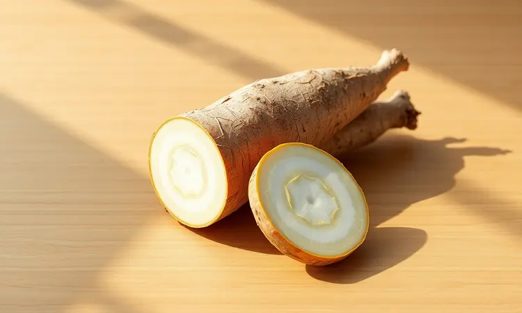
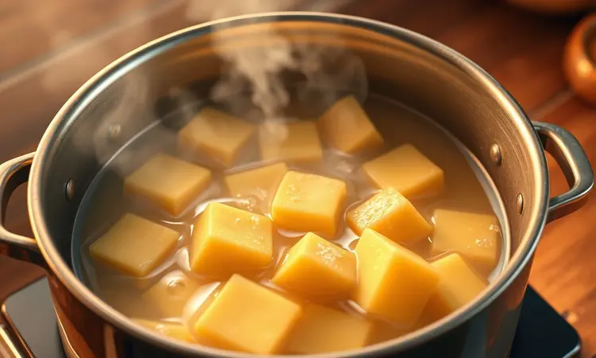
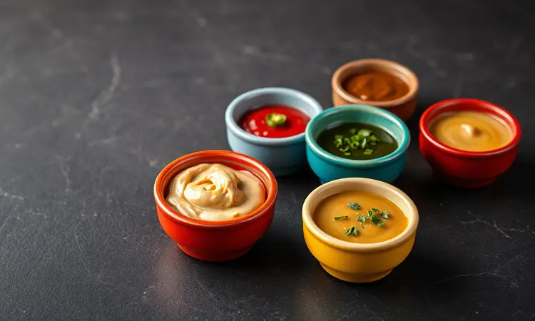
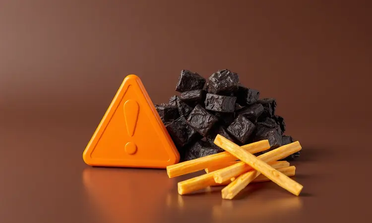

Você adora aquela macaxeira frita de boteco, mas quer evitar a sujeira do óleo e as calorias extras? Você não está sozinho. Muitas pessoas tentam fazer mandioca na fritadeira elétrica e acabam com um resultado seco, pálido ou duro demais.

A boa notícia é que existe um segredo simples para atingir a textura perfeita.

Neste guia, eu vou te ensinar o passo a passo definitivo, desde a escolha do aipim até o truque de mestre para garantir que ela fique douradinha e crocante por fora, mas derretendo por dentro. Prepare-se para elevar o nível do seu petisco saudável!

<SummaryList products={frontmatter.top_products} />

## Por que fazer Mandioca na Airfryer em vez de fritar no óleo?

Imagine a satisfação de morder uma mandioca crocante sem a culpa pós-petisco. É exatamente isso que a Airfryer oferece.

Enquanto a fritura tradicional mergulha a raiz em óleo, acrescentando calorias vazias, a tecnologia de circulação de ar quente cria uma crocância dourada usando uma fração mínima de gordura. O resultado?

Seu petisco mantém mais nutrientes, sua cozinha fica livre daquela gordura espirrada e você pode saborear cada pedaço com tranquilidade.

A praticidade é um bônus delicioso, permitindo que você prepare uma guloseima irresistível em minutos, sem perigo de queimaduras ou bagunça.

## Como escolher a melhor mandioca (ou macaxeira) no mercado

Tudo começa na feira ou no mercado. A mandioca perfeita para sua Airfryer tem alguns sinais claros. Sua casca deve ser lisa, com coloração uniforme e sem manchas escuras ou buracos.

Dê preferência às raízes de tamanho médio, pois as muito grandes podem esconder fibras menos saborosas no interior. Ao tocar, sinta a firmeza, uma textura que dá segurança sob os dedos. Se estiver mole demais, pode estar passando do ponto.

E não se esqueça de cheirar, aquele aroma fresco de terra é sempre um bom indicador. Se possível, apoie produtores locais, garantindo frescor extra e contribuindo para uma rede de consumo mais consciente.

## Receita de Mandioca Frita na Airfryer: O Passo a Passo

Com a mandioca certa em mãos, chegou a hora da magia acontecer. Este método transforma raízes simples em verdadeiras espetáculos de crocância.

### Ingredientes Necessários

Para cerca de 4 porções, você precisará de 1 kg de mandioca fresca, já descascada e cortada em pedaços grossos (cerca de 4 cm). O tempero básico leva apenas sal a gosto, mas aqui está seu playground para criatividade.

Considere pimenta do reino moída na hora para um toque picante suave, alho em pó para profundidade de sabor ou ervas desidratadas como orégano. Para um acabamento dourado, uma colher de sopa de azeite de oliva é suficiente.

Ervas frescas como alecrim ou tomilho podem transformar o aroma final.

### O Truque de Mestre: Por que o pré-cozimento é obrigatório?

Este é o segredo que separa a mandioca crocante da dura. O pré-cozimento amacia o interior denso da raiz, criando uma textura cremosa que contrastará perfeitamente com a casquinha dourada que a Airfryer vai criar.

Sem essa etapa, o ar quente secaria apenas a superfície, deixando o interior cru e fibroso. Além do resultado sensorial, você ganha tempo, já que a mandioca pré-cozida passa menos minutos na Airfryer, economizando energia.

Pense nisso como preparar o palco para o grande show de crocância.

### Modo de Preparo: Do cozimento à Airfryer

Comece colocando os pedaços de mandioca em uma panela com água fria suficiente para cobri-los. Leve ao fogo alto até ferver, então reduza para médio e deixe cozinhar por 20 a 25 minutos.

Você saberá que está no ponto certo quando conseguir espetar um garfo com facilidade, sentindo que o interior cede sem desmanchar. Escorra bem e deixe esfriar por alguns minutos, tempo ideal para a superfície secar um pouco.

Enquanto isso, pré-aqueça sua Airfryer a 200°C por alguns minutos. Tempere a mandioca com sal, pimenta e azeite, misturando delicadamente para não quebrar os pedaços. Disponha em uma única camada na cesta, sem sobrepor, e programe por 15 minutos.

Na metade do tempo, puxe a cesta rapidamente para dar uma sacudida, garantindo que todos os lados dourem igualmente.

## Segredos para uma Crocância Irresistível

Agora que você domina o básico, vamos aos detalhes que fazem toda a diferença entre o bom e o extraordinário.

### Temperatura e Tempo: O ajuste ideal para não ressecar

A mandioca pede um calor intenso por um tempo suficiente. A temperatura de 200°C é seu ponto de partida, criando aquela reação de douramento rápida que sela a crocância. Mantenha os pedaços por 15 a 20 minutos, mas não seja escravo do relógio.

A partir dos 12 minutos, comece a observar a cor. Você quer aquele tom dourado dourado que faz a boca salivar, não o marrom escuro do ressecamento. Se sua Airfryer tiver múltiplas funções, o modo "air crisp" ou similar é ideal.

Lembre-se, pedaços menores podem precisar de menos tempo, então ajuste conforme o tamanho escolhido.

### Azeite, Manteiga ou Manteiga de Garrafa? Qual usar para dourar

Cada gordura conta uma história diferente na sua mandioca. O azeite de oliva é o clássico saudável que realça sabores naturais sem dominá-los, perfeito para quem busca leveza.

Já a manteiga comum traz aquele sabor reconfortante e amanteigado, criando uma crosta mais rica, mas exige atenção para não queimar na alta temperatura.

A verdadeira estrela para muitos é a manteiga de garrafa, que combina a riqueza da manteiga com a resistência ao calor do azeite, resultando em um dourado profundo e aromático. Minha sugestão?

Comece com azeite para dominar a técnica, depois experimente as outras para descobrir sua combinação preferida.

## Variações de Temperos para turbinar o sabor

A mandioca é uma tela em branco para sua criatividade. Para uma versão clássica brasileira, tique o sal grosso com pimenta do reino moída na hora. Quer algo com personalidade? Misture páprica defumada com cominho em pó para um sabor terroso que lembra churrasco.

Amantes de alho vão se encantar com uma combinação de alho granulado, cebola em pó e um toque de salsinha desidratada.

E para um toque gourmet, experimente raspar queijo parmesão sobre os pedaços quentes logo após saírem da Airfryer, criando uma crosta cremosa e salgada.

O segredo é temperar após o pré-cozimento, mas antes de entrar na Airfryer, para que os sabores se fundam durante o processo final.

## Melhores Molhos para Acompanhar sua Macaxeira

Uma boa mandioca pede companhia à altura. Para os tradicionalistas, nada supera o clássico molho de alho, feito com maionese cremosa, alho socado e uma pitada de limão para frescor.

Se você busca contraste, um molho de pimenta caseiro (misture iogurte natural, pimenta dedo de moça picada e um fio de mel) cria uma dança entre o picante e o doce que realça a crocância.

Para transportar seu paladar para o nordeste, experimente um molho de leite de coco com coentro, onde a cremosidade tropical encontra a rusticidade da mandioca.

E para ocasiões especiais, um molho de queijo coalho derretido com pimenta biquinho oferece uma experiência de sabor completa. Cada molho conta uma história diferente com sua macaxeira crocante.

## Erros Comuns que deixam a mandioca dura (e como evitá-los)

Alguns deslizes podem afastar você da textura perfeita. O maior deles é pular o pré-cozimento ou interrompê-lo muito cedo. A mandioca precisa daquele momento de maciez garantida antes de encontrar o ar quente.

Outro erro silencioso é cortar pedaços de tamanhos diferentes, fazendo com que alguns já estejam queimando enquanto outros ainda estão crus por dentro. Corte com atenção para uniformidade.

Temperatura excessiva também é traiçoeira, ela cria uma casca dura enquanto o interior permanece cru. Comece com 200°C e ajuste conforme conhece seu aparelho.

E nunca, jamais sobrecarregue a cesta, o ar precisa circular livremente ao redor de cada pedaço para trabalhar sua mágica. Com esses cuidados, a dureza será apenas uma memória distante.

## Melhores Modelos de Airfryer para Resultados Crocantes

<ProductBox 
  title={frontmatter.top_products[0].title} 
  image={frontmatter.top_products[0].image} 
  link={frontmatter.top_products[0].link} 
/>

Agora que você sabe evitar os erros, que tal conhecer as ferramentas que elevam ainda mais seu jogo?

O Cosori Turbo Tower Pro Smart destaca-se com sua capacidade generosa de 10,8 litros e tecnologia de circulação de ar a 360º, garantindo que cada pedaço receba calor uniforme, da base ao topo.

O Ninja Max Pro impressiona com sua tecnologia Max Crisp, criando uma ventilação poderosa que transforma superfícies em camadas crocantes perfeitas.

Já a Philips Airfryer Série 1000 XL conquista pelo design inteligente que otimiza o fluxo de ar quente, produzindo resultados consistentes a cada uso.

Cada modelo tem sua personalidade e curva de aprendizado, mas todos compartilham um objetivo, entregar aquela crocância que faz você fechar os olhos de satisfação.

Independente da sua escolha, lembre-se das práticas essenciais, não sobrecarregue o cesto, pré-aqueça quando necessário e conheça os pontos fortes do seu aparelho.

Com paciência e experimentação, você transformará qualquer modelo em seu aliado para mandiocas irresistíveis.

## Perguntas Frequentes sobre Mandioca na Airfryer (FAQ)

As dúvidas mais comunes encontram respostas claras aqui, descomplicando seu processo.

### Posso fazer com mandioca congelada de pacote?

Sim, e essa é uma opção fantástica para dias corridos. A mandioca congelada geralmente já passou pelo pré-cozimento, economizando seu tempo na cozinha. O processo é simples, dispense o descongelamento prévio e coloque os pedaços ainda congelados na cesta da Airfryer.

Ajuste a temperatura para 180°C e programe entre 20 a 25 minutos, sacudindo a cesta a cada 7 minutos para garantir uniformidade. O resultado surpreende pela praticidade, mantendo boa crocância e sabor. É a prova de que delícia e agilidade podem andar juntas.

### Como reaquecer a mandioca sem perder a crocância?

A magia da Airfryer também funciona na segunda vez. Para reaquecer, pré-aqueça o aparelho a 180°C e espalhe os pedaços em uma única camada. Cinco a oito minutos geralmente são suficientes para reviver a crocância e o calor interior.

Se não tiver Airfryer disponível, uma frigideira antiaderente em fogo médio baixo funciona bem, virando os pedaços até que aqueçam por igual. O importante é evitar o microondas, que troca crocância por uma textura borrachuda e perde os sabores delicados.

Com esse cuidado, sua mandioca do almoço pode brilhar novamente no jantar.

## Conclusão

Transformar mandioca em petisco crocante na Airfryer é mais que uma técnica, é uma descoberta que reconcilia prazer e bem estar.

Você começou com a nostalgia da macaxeira de boteco e descobriu que pode recriar, e até superar, essa experiência em casa, sem a bagunça do óleo nem o peso da culpa.

Dominou o ritual desde a escolha da raiz perfeita no mercado até o truque do pré-cozimento que garante interior cremoso.

Aprendeu a linguagem da temperatura e do tempo, descobriu como gorduras diferentes contam histórias de sabor distintas e criou combinações de temperos que são sua assinatura pessoal.

Cada erro evitado tornou seu caminho mais claro, cada modelo de Airfryer conhecido ampliou suas possibilidades. E mesmo as dúvidas mais comuns, sobre mandioca congelada ou reaquecimento, agora têm respostas que fortalecem sua autonomia na cozinha.

O que era apenas uma raiz se transformou em possibilidade, em criatividade, em momentos compartilhados com um sabor especial.

Agora é sua vez. Escolha uma bela mandioca, aqueça sua Airfryer e permita-se o prazer de criar. Compartilhe suas combinações preferidas, suas descobertas, suas versões que surpreendem.

A cozinha é seu laboratório de felicidade, e a mandioca crocante é sua primeira obra prima.