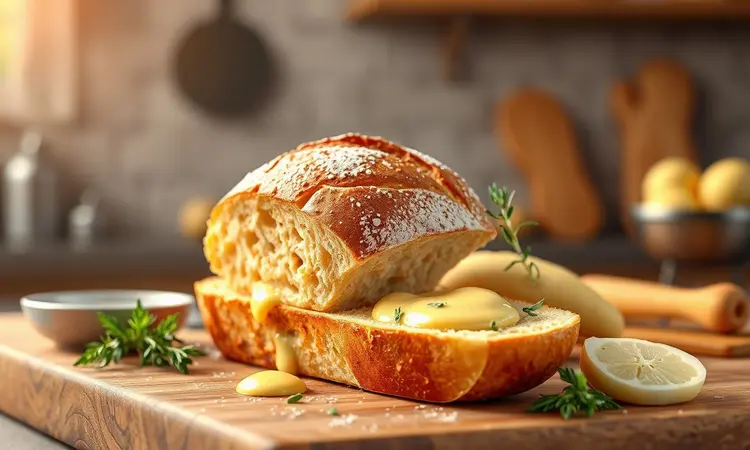
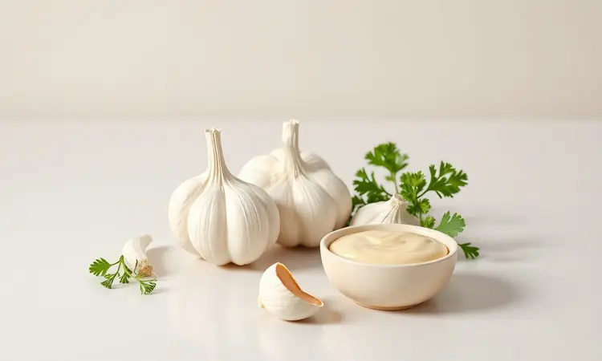

Imagine a cena: você está organizando um jantar especial ou simplesmente querendo um lanche reconfortante. O desejo é pão de alho crocante, mas a ideia de pré-aquecer o forno ou enfrentar a churrasqueira parece uma tarefa hercúlea.

E se dissesse que em menos de 10 minutos você pode ter exatamente o que procura, com menos sujeira e resultado garantido? Aqui você descobrirá não apenas como, mas por que a Airfryer se tornou a aliada perfeita para esse clássico.

Prepare-se para transformar momentos simples em experiências memoráveis.

<SummaryList products={frontmatter.top_products} />

## Por que fazer pão de alho na Airfryer é a melhor opção?

Você já experimentou aquela frustração de esperar o forno esquentar só para fazer alguns pães? A Airfryer resolve isso com elegância, oferecendo uma crocância que parece mágica.

Pense na superfície dourada e perfeita, que estala ao primeiro mordida, enquanto o interior mantém toda a suculência. Tudo isso acontece praticamente sem óleo, deixando seu lanche mais leve sem sacrificar o prazer sensorial.

A verdadeira vantagem, no entanto, vai além da rapidez. É sobre recuperar seu tempo e energia mental. Enquanto o pão assa uniformemente, você pode cuidar do resto do jantar, aproveitar com os convidados ou simplesmente relaxar sem monitorar constantemente.

Quando o timer apita, basta retirar o cesto e já está pronto para servir, sem aquela louça extra para lavar mais tarde.

## Como Fazer Pão de Alho Congelado na Airfryer: Passo a Passo Sem Erro

Para quem valoriza praticidade sem abrir mão do sabor, o pão de alho congelado é uma revelação. Comece preaquecendo sua Airfryer a 200°C por apenas 2 minutos, o que já coloca você à frente do método tradicional.

Organize as fatias em uma única camada, respeitando o espaço entre elas para que o ar quente circule livremente.

Em aproximadamente 8 minutos você notará aquela transformação visual: de um produto congelado para uma iguaria dourada e aromática. A chave está na paciência de não abrir constantemente, permitindo que o processo de cocção se complete de forma uniforme.

Ao final, cada fatia oferecerá aquele contraste perfeito entre exterior crocante e interior macio.

### Tempo e Temperatura Ideais para o Pão de Mercado

Ao trabalhar com produtos de mercado, uma pequena redução para 180°C faz toda a diferença na textura final. Esses 20 graus a menos garantem que o interior aqueça completamente antes que a superfície escureça demais.

Permaneça atento entre os 8 e 12 minutos, aproveitando para virar na metade do processo, o que garante uma douradura perfeita em todos os ângulos.

Cada Airfryer tem sua personalidade, portanto considere esses números como ponto de partida. Sua experiência logo revelará os ajustes ideais para o seu aparelho, criando uma relação intuitiva entre você e sua cozinha que elimina qualquer receio.

### As Melhores Marcas de Pão de Alho Congelado para Airfryer

<ProductBox 
  title={frontmatter.top_products[0].title} 
  image={frontmatter.top_products[0].image} 
  link={frontmatter.top_products[0].link} 
/>

Entre tantas opções nas prateleiras do supermercado, algumas se destacam por entender exatamente o que você procura.

A Zinho conquista paladares com seu equilíbrio entre crocância externa e suculência interna, especialmente na versão com queijo que derrete de forma encantadora.

Já a Swift oferece uma baguete que preserva a intensidade do alho fresco, quase como se você mesmo tivesse preparado o tempero.

Se prioridade for textura acima de tudo, a Santa Massa entrega um miolo tão macio que contrasta deliciosamente com a crosta formada. Para situações sociais, as bolinhas da Maturatta tornam o compartilhar natural e descomplicado.

Enquanto a Aurora facilita o processo inicial, seu perfil mais suave convida a incrementos pessoais. A Pingo Doce se apresenta como solução imediata, sempre lembrando que 5 minutos podem separar o adequado do ideal.

## Receita de Pão de Alho Caseiro Especial para Fritadeira Elétrica

Agora, se você anseia por algo verdadeiramente personalizado, criar seu próprio pão de alho oferece satisfação incomparável. Imagine poder ajustar cada detalhe do sabor às suas memórias gustativas favoritas.

Esta versão caseira transforma ingredientes simples em momentos especiais.

### Ingredientes para o Creme de Alho Perfeito

Comece com 4 a 5 dentes de alho que, quando amassados, liberam seus óleos essenciais. Combine com 200g de manteiga em temperatura ambiente, que abraça e transporta os sabores.

Uma colher de sopa de salsinha picada adiciona frescor que corta a riqueza, enquanto sal e pimenta do reino definem o perfil. Para quem busca um toque de sofisticação, queijo parmesão ralado cria camadas de sabor que surpreendem a cada mordida.

### Preparo e Montagem dos Pães

Misture todos os ingredientes até obter uma pasta homogênea que promete transformação. Escolha pães com estrutura capaz de suportar a generosidade do creme, cortando-os ao meio para criar superfícies prontas para receber a preparação.

Espalhe com cuidado, alcançando cada centímetro sem deixar excessos nas bordas que possam queimar.

Na Airfryer a 180°C, assista à mágica acontecer. Em aproximadamente 8 minutos, a manteige derrete e penetra, o alho torra sem queimar e o pão atinge aquela crocância dourada tão desejada. A espera é recompensada por aromas que preenchem a cozinha e antecipam o prazer.

## 5 Segredos de Especialista para o Pão não Ficar Duro ou Cru no Meio

Nada frustra mais do que expectativas quebradas na primeira mordida. Para garantir sucesso consistente, comece selecionando pães com estrutura apropriada, evitando aqueles que já perderam sua umidade natural.

A aplicação do creme deve ser generosa, mas distribuída uniformemente para que cada parte absorva a transformação.

O pré-aquecimento não é mera formalidade, mas sim a preparação do ambiente que garantirá cocção uniforme. Mantenha-se presente nos primeiros testes, observando como seu aparelho específico responde aos diferentes tipos de pães.

Por fim, aquele giro na metade do tempo não apenas garante douradora igual, mas também demonstra cuidado que se traduz em qualidade final.

## Como "Turbinar" o Pão de Alho Industrializado: Dicas Extras de Sabor

Produtos industrializados não precisam ser destino final. Eles podem ser ponto de partida para expressão criativa. Imagine cobrir sua fatia pré-preparada com mozzarella que se estica dramaticamente ao servir, criando experiência visual e gustativa.

Ou incorporar ervas frescas que revivem sabores caseiros, quase como se a horta estivesse ali ao lado.

Para paladares aventureiros, pimenta calabresa ou páprica defumada introduzem notas que conversam com o alho, elevando-o de acompanhamento para protagonista.

Esses pequenos toques transformam o convencional em memorável, demonstrando que o cuidado com detalhes define excelência.

## Melhores Airfryers para um Assado Uniforme e Rápido

<ProductBox 
  title={frontmatter.top_products[1].title} 
  image={frontmatter.top_products[1].image} 
  link={frontmatter.top_products[1].link} 
/>

Se você está comprometido com resultados perfeitos, o equipamento certo faz toda a diferença. A Philips Walita se destaca com sua tecnologia Rapid Air que parece entender exatamente o que cada alimento precisa.

Modelos como a série 3000 criam ambientes controlados onde o pão dourará sem necessitar de sua vigilância constante.

Alternativas como a Mondial oferecem espaços generosos para preparar quantidade adequada para encontros sociais, enquanto a Arno foca na simplicidade que convida ao uso diário.

A Oster combina funcionalidades que ampliam possibilidades, permitindo que sua Airfryer torne-se centro de várias preparações. A Electrolux fecha o leque com opções rigorosamente avaliadas por quem já experimentou a jornada culinária.

## Acessórios Úteis: Formas e Forros para Facilitar a Limpeza

<ProductBox 
  title={frontmatter.top_products[2].title} 
  image={frontmatter.top_products[2].image} 
  link={frontmatter.top_products[2].link} 
/>

A alegria de desfrutar seu pão de alho não deveria ser diminuída pela perspectiva da limpeza posterior. Formas de papel descartáveis oferecem praticidade imediata, especialmente quando o tempo é precioso.

Basta retirar e descartar, deixando apenas memórias gustativas agradáveis.

Para quem adota filosofia mais sustentável, opções em silicone não apenas resistem às temperaturas exigidas, mas também apresentam flexibilidade que facilita a remoção dos alimentos.

Após o uso, uma lavagem rápida restaura condições perfeitas para o próximo encontro culinário. Independentemente da escolha, o objetivo é sempre o mesmo: reduzir barreiras entre desejo e realização.

## Erros Comuns que Você Deve Evitar ao Assar Pão de Alho

Algumas lições aprendidas por experiência própria podem poupar frustrações desnecessárias. Ignorar o pré-aquecimento é como tentar correr sem antes esticar, criando condições desiguais desde o início.

A distribuição econômica do creme resulta em áreas secas que endurecem rapidamente, perdendo a oportunidade de sabor pleno.

O excesso de confiança às vezes leva a empilhar fatias como se o ar quente pudesse contornar obstáculos. Essa compactação impede a circulação que define o método, gerando resultados inconsistentes.

Com atenção a esses detalhes, você constrói confiança que se reflete em cada preparação subsequente.

## Perguntas Frequentes (FAQ) sobre Pão de Alho na Airfryer

Algumas dúvidas surgem naturalmente nessa jornada. A temperatura ideal geralmente flutua entre 180°C e 200°C, dependendo se sua matéria-prima parte do congelado ou fresco.

Os 8 a 10 minutos representam intervalo suficiente para transformação completa, embora sua observação pessoal sempre forneça informações valiosas.

Quantidade de manteige é questão de equilíbrio: suficiente para infundir sabor e umidade, mas sem criar ambiente encharcado que compromete textura. A beleza do processo está justamente na possibilidade de ajustes pessoais que refletem suas preferências únicas.

## Conclusão

O pão de alho na Airfryer representa mais do que simples acompanhamento culinário. Ele simboliza a possibilidade de criar momentos especiais sem demandas extenuantes, transformando desejo espontâneo em realidade em poucos minutos.

Desde o pão congelado da correria diária até a versão caseira que carrega sua assinatura pessoal, cada variação oferece satisfação imediata.

Você descobriu não apenas técnicas, mas também a filosofia por trás delas: respeito pelo ingrediente, compreensão do equipamento e valorização do seu tempo. Essas camadas de conhecimento garantem que cada preparação seja celebração, não apenas tarefa.

Agora você tem em mãos não apenas um guia prático, mas convite permanente para transformar momentos cotidianos em pequenos banquetes. O próximo passo é simples: escolha sua receita, aqueça sua Airfryer e comece a escrever suas próprias histórias culinárias.