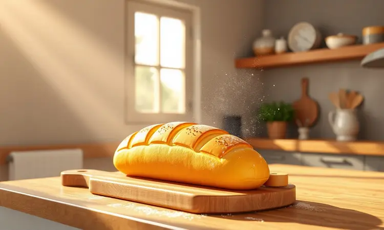
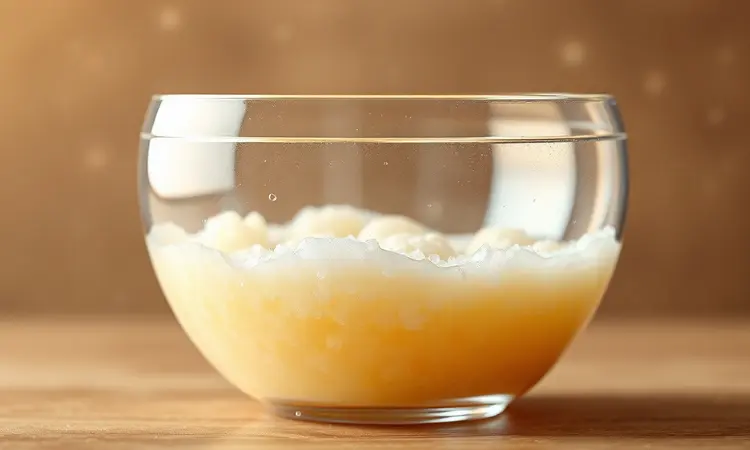
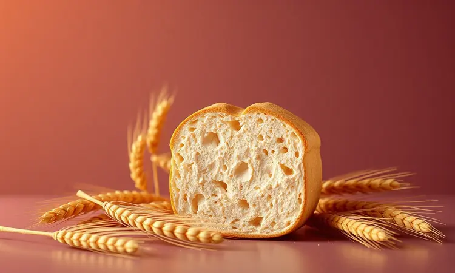
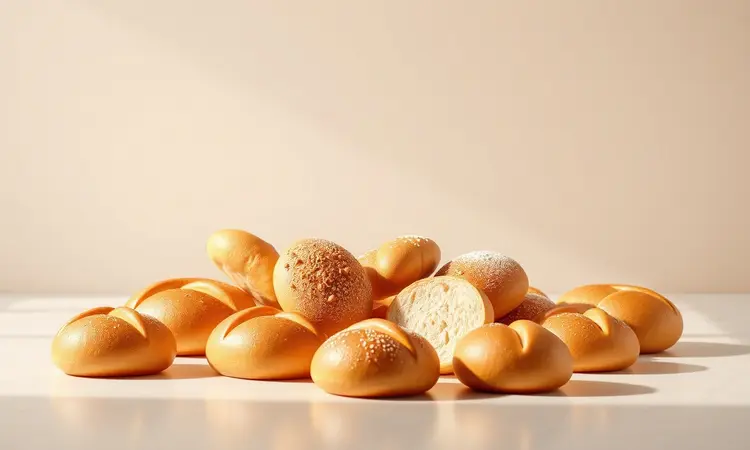

Imagine acordar com aquele cheirinho de pão fresco, mas sem passar horas na cozinha nem suar próximo ao forno convencional. A Air Fryer chegou para revolucionar sua rotina, oferecendo praticidade diária e resultados que vão fazer você esquecer a padaria.

Neste guia completo, você vai descobrir a receita definitiva para pães fofinhos por dentro e dourados por fora, além de segredos e acessórios que garantem sucesso desde a primeira tentativa.

<SummaryList products={frontmatter.top_products} />

## Por que fazer pão na Air Fryer é uma excelente ideia?

Esqueça a ideia de que fazer pão caseiro exige horas de dedicação. Com a Air Fryer, você conquista praticidade em três dimensões: sem pré-aquecimento, com tempo de cozimento até 50% menor e economia de energia que faz diferença no fim do mês.

Mas o verdadeiro milagre está no resultado: uma crocância irresistível por fora que esconde um interior tão macio que parece algodão. E a versatilidade?

Prepare-se para experimentar desde pães simples até receitas gourmet, tudo adaptado ao seu paladar e ao ritmo da sua vida.

## Acessórios essenciais: Quais formas e utensílios usar?

<ProductBox 
  title={frontmatter.top_products[0].title} 
  image={frontmatter.top_products[0].image} 
  link={frontmatter.top_products[0].link} 
/>

Os acessórios certos transformam a experiência de assar pão de uma tarefa em um prazer. Formas de silicone ou metal são seus melhores aliados, permitindo criar formatos criativos e garantindo que o pão saia inteiro, sem grudar.

Um suporte específico para pão faz toda diferença, assegurando que cada fatia doure uniformemente.

E a limpeza? Papel manteiga perfurado ou forros descartáveis mantêm sua Air Fryer impecável, especialmente com massas mais úmidas.

Esses itens podem parecer detalhes, mas são eles que elevam suas receitas do nível caseiro para o profissional, com praticidade que justifica cada centavo investido.

### O uso do papel manteiga e forros de silicone na Air Fryer

<ProductBox 
  title={frontmatter.top_products[2].title} 
  image={frontmatter.top_products[2].image} 
  link={frontmatter.top_products[2].link} 
/>

Esses aliados silenciosos fazem mais do que facilitar a limpeza. O papel manteiga perfurado permite a circulação de ar perfeita para uma cocção uniforme, enquanto os forros de silicone reutilizáveis oferecem uma alternativa sustentável que dura anos.

A chave está na qualidade: escolha materiais que suportem altas temperaturas sem obstruir o fluxo de ar, garantindo que seu pão fique crocante sem perder a umidade interna.

## Melhores Modelos de Air Fryer para Assar Pães e Massas

<ProductBox 
  title={frontmatter.top_products[1].title} 
  image={frontmatter.top_products[1].image} 
  link={frontmatter.top_products[1].link} 
/>

Agora que você já conhece os acessórios, vamos aos equipamentos que fazem a magia acontecer. Os modelos tipo "Air Fryer Oven" são os verdadeiros campeões para pães e massas, com capacidade ampliada e funções que imitam um forno convencional.

A Electrolux Air Fryer Oven 5 em 1 com 12L oferece função dedicada para assar e vem com acessórios que dispensam compras extras. Já a Mallory Air Oven Unique de 30 litros é ideal para pães artesanais maiores, embora exija mais espaço na bancada.

A Philco Air Fryer Oven PFR2200P combina 12L com praticidade no uso diário, enquanto a Mondial Air Fryer Oven impressiona com seu painel digital intuitivo.

Para quem busca versatilidade máxima, o Oster Forno e Fryer (até 25L) é uma escolha inteligente. Avalie sua rotina: potência e funções específicas para assar fazem toda diferença quando o objetivo é pão perfeito.

## Ingredientes Necessários para o Pão Caseiro Perfeito

Com tudo preparado, chegamos ao coração da receita: ingredientes simples que se transformam em memória afetiva. Comece com 500 gramas de farinha de trigo, 10 gramas de sal para realçar sabores e 10 gramas de açúcar que atuam como combustível para a fermentação.

Não pode faltar 1 pacote (10 gramas) de fermento biológico seco, o responsável por aquele crescimento que enche os olhos. Complete com 300 ml de água morna e, para um toque especial, 30 ml de óleo ou azeite. Esses são os alicerces do seu pão dos sonhos.

## Passo a Passo Detalhado: Do preparo da massa ao cozimento

A jornada começa na tigela: misture os ingredientes secos primeiro, depois incorpore os líquidos aos poucos. Sove com carinho até sentir a massa ficar lisa e elástica entre seus dedos.

Deixe descansar em um cantinho aconchegante da cozinha, cubra com um pano e aguarde a mágica da fermentação acontecer. Quando dobrar de volume, está pronta para a Air Fryer, onde dourará até ficar com aquele tom dourado que antecipa o sabor.

### O Segredo da Esponja: Garantindo a fermentação ideal em menos tempo

Este é o truque secreto das padarias artesanais. Prepare uma esponja misturando parte da farinha, água e fermento, deixando descansar por 30 minutos. Nesse breve intervalo, o fermento trabalha criando uma rede de bolhas de ar que se tornam a estrutura do seu pão.

Resultado? Uma massa mais leve, arejada e com sabor desenvolvido em tempo recorde. É como dar ao seu pão um impulso inicial que transforma bom em extraordinário.

## Tempo e Temperatura: O ajuste fino para o pão não ficar cru por dentro

Aqui está o equilíbrio perfeito entre ciência e intuição. Para a maioria dos pães, a temperatura ideal varia entre 160°C e 180°C. Comece com 15 a 20 minutos, mas fique atento: cada massa tem sua personalidade. A partir dos 10 minutos, faça o teste do palito.

Se sair limpo, você acertou na dose. Esse ajuste fino é o que separa um pão bem passado daquele centro úmido indesejado, garantindo crocância externa com maciez interna impecável.

## 5 Dicas de Ouro para o seu Pão ficar mais fofinho que o de padaria

Quer superar a padaria da esquina?

Siga estas orientações: 1) Escolha farinha de trigo com alto teor de glúten para estrutura e leveza, 2) Hidrate generosamente com água na temperatura certa para ativar todo o potencial do fermento, 3) Ofereça um ambiente morno para a massa descansar e crescer uniformemente, 4) Dedique tempo ao sovo para desenvolver o glúten que dá elasticidade, 5) Resista à tentação de abrir a Air Fryer durante o cozimento - cada abertura rouba calor precioso.

Seguindo esses passos, você descobre que maciez de padaria artesanal está ao alcance das suas mãos.

## Variações Deliciosas: Pão Integral, de Leite e Recheado na Air Fryer

A versatilidade da Air Fryer libera sua criatividade. O pão integral ganha corpo com farinha integral e sementes, oferecendo sabor marcante e benefícios nutricionais. Já o pão de leite é pura poesia para o café da manhã, com fofura que derrete na boca.

Mas o ápice está nos recheados: imagine abrir um pão e encontrar queijo derretido, presunto defumado ou até doce de chocolate surpresa. A Air Fryer torna possível criar experiências que vão além do pão, transformando cada refeição em momento especial.

## Erros Comuns ao Assar Pães na Air Fryer e Como Evitá-los

Alguns deslizes podem distanciar você do pão perfeito. O primeiro é esquecer o pré-aquecimento, essencial para o crescimento adequado. Massa muito úmida é outro desafio - siga a receita com precisão e ajuste líquidos conforme a farinha absorve.

Cada Air Fryer tem sua personalidade térmica; aprenda a conhecer a sua e ajuste tempo e temperatura com sensibilidade. Atenção a esses detalhes transforma tentativas em conquistas culinárias.

## Como Armazenar e Reaquecer para Manter a Maciez por mais tempo

O pão perfeito merece cuidados pós-cozimento. Para armazenar, envolva-o em pano limpo ou papel toalha e guarde em saco plástico com mínimo de ar. A geladeira é inimiga da maciez, deixando o pão duro rapidamente.

Na hora de reaquecer, sua Air Fryer será novamente heroína: alguns minutos em temperatura baixa reativam a crocância externa sem ressecar o interior. Assim, você prolonga o prazer do pão fresco por dias, sempre que a saudade bater.

## Perguntas Frequentes (FAQ) sobre Pão na Air Fryer

"Qual temperatura ideal?" Entre 160°C e 180°C, variando conforme a receita. "Quanto tempo leva?" De 15 a 25 minutos, mas sempre verifique após os primeiros 15. "E se o pão não crescer?" Pode ser fermentação inadequada ou temperatura errada dos ingredientes.

Use sempre produtos frescos e respeite as etapas para garantir a fofura que conquista.

## Conclusão

Fazer pão na Air Fryer é mais do que uma técnica culinária, é uma revolução no seu relacionamento com a cozinha.

Do primeiro aroma que invade sua casa à sensação de partir um pão quentinho que suas próprias mãos criaram, cada etapa revela que praticidade e sabor autêntico podem coexistir.

Você descobriu que acessórios certos são facilitadores, que ingredientes simples se transformam em emoção e que ajustes sutis fazem a diferença entre o bom e o inesquecível. Agora, com todas as ferramentas e segredos em mãos, sua jornada começa de verdade.

Ligue sua Air Fryer, escolha sua primeira receita e prepare-se para escrever sua própria história de pão caseiro. A padaria artesanal da sua casa está pronta para abrir - e o primeiro cliente é você.