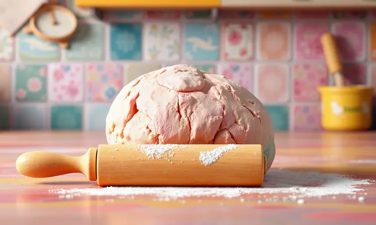
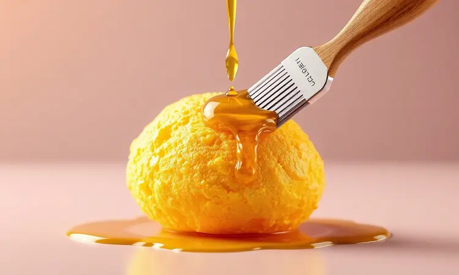
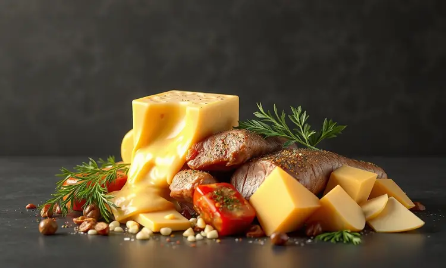

Você adora aquele pastelzinho de feira, mas foge da gordura e da sujeira da fritura por imersão? Você não está sozinho. A promessa de um lanche mais saudável atrai muitos, mas o desafio é conseguir aquela textura sequinha e crocante sem o óleo.

Neste guia definitivo, vamos te ensinar o passo a passo para fazer o pastel na air fryer perfeito, revelando o segredo para a massa não ressecar e os melhores recheios para surpreender sua família.

<SummaryList products={frontmatter.top_products} />

## Por que fazer pastel na air fryer vale a pena?

Imagine acordar com vontade daquele lanche crocante, mas sem aquela sensação de peso depois. É exatamente isso que a air fryer oferece. Ela transforma o óleo abundante da fritura tradicional em apenas uma leve camada, suficiente para garantir o dourado perfeito.

O resultado? Uma massa que mantém toda a crocância, mas que não deixa você com aquela culpa de ter exagerado.

E não é apenas sobre saúde. A temperatura uniforme da air fryer significa que você não precisa ficar virando os pastéis a cada minuto. Dá para preparar o recheio, organizar a mesa ou até cuidar das crianças enquanto o equipamento faz seu trabalho.

No final, a limpeza é tão simples que você praticamente só precisa passar um pano na cesta. É aquele tipo de praticidade que transforma um desejo espontâneo em realidade sem complicações.

## Qual a melhor massa para pastel de air fryer?

A resposta é simples: aquela que se adapta ao seu estilo de vida. A massa podre e a pronta para pastel são as campeãs por um motivo: sua textura já foi testada para crocância.

Elas criam aquela camada externa perfeita que todos amamos, mantendo a leveza que a air fryer proporciona.

### Massa pronta de rolo vs. Massa caseira

Aqui está o verdadeiro dilema: conveniência versus personalização. A massa pronta de rolo é sua aliada nos dias corridos. Ela está lá, esperando no supermercado, pronta para se transformar em um lanche rápido quando o tempo é escasso.

Mas se você tem um tempinho extra e quer realmente fazer a diferença, a massa caseira abre um mundo de possibilidades. Pode ajustar a espessura ao seu gosto, garantir ingredientes específicos ou simplesmente curtir aquele orgulho de 'fiz do zero'.

O sabor é diferente, mais autêntico, e a textura pode ser personalizada para ficar exatamente como você prefere.

## O Segredo da Crocância: Como não deixar o pastel ressecar

O grande desafio da air fryer não é fazer o pastel ficar crocante, mas mantê-lo assim por dentro. O segredo está no equilíbrio: tempo suficiente para o dourado perfeito, mas não tanto que transforme o recheio em algo seco.

### A importância de pincelar: Óleo, azeite ou gema?

<ProductBox 
  title={frontmatter.top_products[0].title} 
  image={frontmatter.top_products[0].image} 
  link={frontmatter.top_products[0].link} 
/>

Essa camada fina é a diferença entre um pastel perfeito e um que parece papelão. O azeite traz um sabor mais marcante, ideal para recheios salgados tradicionais. O óleo neutro mantém o foco no recheio, sem interferir no sabor. E a gema?

Ela é o truque dos profissionais: além da cor dourada intensa, cria uma textura levemente mais resistente.

Mas atenção: mais não é melhor. Uma pincelada leve é suficiente. O excesso pode fazer com que a gordura escorra e cause fumaceira, além de deixar a massa oleosa ao invés de crocante.

Quanto ao tempo, pense em 8 a 15 minutos a 200°C como sua zona de conforto. A metade desse tempo é seu momento de verificação: vire os pastéis e observe como estão dourando. Recheios muito líquidos podem precisar de um minuto extra, mas cuidado para não exagerar.

## Receita Passo a Passo de Pastel na Air Fryer

<ProductBox 
  title={frontmatter.top_products[1].title} 
  image={frontmatter.top_products[1].image} 
  link={frontmatter.top_products[1].link} 
/>

Vamos transformar teoria em prática. Primeiro, escolha seu recheio e prepare-o antecipadamente. Nada pior que tentar embrulhar um recheio quente que derrete a massa antes mesmo de chegar à air fryer.

Com o recheio pronto e em temperatura ambiente, abra sua massa escolhida. Coloque uma porção no centro, suficiente para saborear, mas não tanto que impecha o selamento. Umedeça as bordas com água, dobre e aperte bem.

Essa etapa é crucial: uma selagem mal feita é convite para vazamentos desastrosos.

Agora, a pincelada mágica. Escolha seu ingrediente preferido e cubra toda a superfície de forma uniforme. Não precisa encharcar, apenas cobrir.

### Ingredientes essenciais

Comece pela base: a massa. Se for caseira, farinha de trigo, água, sal e uma colher de óleo criam a textura ideal. Para os dias de pressa, a pronta resolve perfeitamente.

O recheio é sua tela em branco. Queijo derretido, carne moída bem temperada, frango desfiado, ou se quiser surpreender, experimente espinafre com ricota. A criatividade é seu único limite.

E claro, aquele óleo ou azeite para a pincelada final. É o toque que transforma massa branca em dourado convidativo.

### Tempo e Temperatura ideal para o pastel perfeito

Aqui está a fórmula: 200°C pré-aquecidos são seu ponto de partida. Essa temperatura alta inicial garante que a massa comece a crocar imediatamente, selando o exterior rapidamente.

Na cesta, espaço é luxo. Não empilhe os pastéis; deixe ar circular entre eles. Esse fluxo de ar quente é o que cria a crocância uniforme que a fritura tradicional consegue, mas sem a banheira de óleo.

De 8 a 12 minutos depois, dependendo da espessura, você terá pastéis dourados. A metade do tempo é seu momento de verificação: uma rápida virada garante que todos os lados recebam igual atenção.

## Melhores Recheios: Do Clássico ao Gourmet

Do queijo derretido que lembra feira até combinações que surpreenderiam um chef, o recheio é onde a personalidade do seu pastel brilha.

### Carne moída bem temperada (Dicas da Rita Lobo)

A diferença entre uma carne moída comum e uma memorável está nos detalhes. Comece refogando cebola e alho até que liberem todo seu aroma. Só então adicione a carne.

O tempero não vem apenas do sal. Um fio de molho de soja escuro traz umami, cominho em pó dá profundidade, e ervas frescas no final acrescentam frescor. Cozinhe até que toda a umidade evapore, recheios molhados são inimigos da crocância.

### Queijo e suas variações: O truque para não vazar

Queijo derretendo e escorrendo pela massa parece inevitável, mas existe um truque simples: amido de milho. Uma colher misturada ao queijo antes de embrulhar absorve o excesso de umidade enquanto aquece, mantendo o cremoso sem o caos.

Muçarela é a escolha segura, mas que tal misturar com um pouco de cheddar para sabor extra? Ou provolone para um toque mais marcante?

### Frango com requeijão cremoso

A combinação perfeita de proteína e cremosidade. Cozinhe o frango desfiado até ficar dourado e sequinho. Só então misture o requeijão, fora do fogo, para manter sua textura sedosa.

O contraste é divino: a crocância externa da massa encontra o interior suave e cremoso. Uma pitada de pimenta do reino finaliza com elegância.

### Opções doces: Pastel de Nutella, Banana e Goiabada

Por que limitar os pastéis ao salgado? A air fryer transforma sobremesas em experiências crocantes inesperadas.

A Nutella derrete criando um centro de chocolate quente que contrasta com a massa crocante. A banana, fatiada finamente e polvilhada com canela, carameliza levemente, criando doçura natural.

E a goiabada, especialmente acompanhada de queijo minas, revive memórias de doces tradicionais com textura moderna.

## Erros comuns que você deve evitar

Alguns deslizes podem transformar seu pastel perfeito em decepção. O primeiro é esquecer o pré-aquecimento. A air fryer precisa estar na temperatura certa antes de receber os pastéis, caso contrário eles começam a cozinhar lentamente e podem ficar borrachudos.

Sobrecarregar a cesta é outro erro frequente. Quando os pastéis estão amontoados, o ar quente não circula uniformemente. Resultado: alguns pontos crocantes, outros moles.

E aquela tentação de pincelar óleo generosamente 'para garantir'? Pode ter efeito contrário. Óleo em excesso escorre, queima e cria fumaça, além de deixar a massa oleosa ao invés de crocante.

Por fim, não ignore a necessidade de virar. Mesmo com circulação de ar eficiente, uma virada na metade do tempo garante dourado uniforme em todos os lados.

## Como requentar o pastel e manter a textura

Sobrou pastel? A boa notícia é que a air fryer resgata a crocância como nenhum outro método. Preaqueça a 180°C e coloque os pastéis por 5 a 7 minutos. Eles voltam quase como recém-feitos.

Sem air fryer disponível? O forno convencional a 180°C por 10 minutos, com os pastéis envoltos levemente em papel alumínio (não hermeticamente), funciona bem. O papel protege contra o ressecamento excessivo enquanto o calor restaura a textura.

E o micro-ondas? Melhor evitar. Ele aquece através da umidade, o que significa massa mole e perda total da crocância que você tanto trabalhou para conseguir.

## Perguntas Frequentes (FAQ)

### Pode colocar papel alumínio ou papel manteiga na air fryer?

<ProductBox 
  title={frontmatter.top_products[2].title} 
  image={frontmatter.top_products[2].image} 
  link={frontmatter.top_products[2].link} 
/>

Sim, mas com inteligência. O papel manteiga é excelente para evitar que alimentos grudem, especialmente recheios doces que podem caramelizar e colar. Mas atenção: nunca cubra toda a cesta. O fluxo de ar precisa circular livremente, então deixe espaço nas laterais.

O papel alumínio exige mais cuidado. Ele não deve tocar as resistências e precisa ser moldado de forma que não bloqueie completamente o ar. Alguns modelos têm recomendações específicas no manual, vale a leitura.

A regra geral é usar esses materiais para facilitar a limpeza, não como barreira. Eles devem ajudar, não atrapalhar o funcionamento principal da air fryer.

### Quanto tempo leva para assar?

Entre 10 e 15 minutos é a faixa ideal, mas pense nisso como uma receita de bolo: o palito ainda é seu melhor amigo. Pastéis menores ou com massa mais fina podem estar prontos em 8 minutos. Recheios mais densos ou pastéis maiores podem precisar dos 15 completos.

A pré-aquecida de 3 a 5 minutos faz toda diferença. Ela garante que os pastéis comecem a cozinhar imediatamente na temperatura certa, criando aquela crocância inicial que sela a massa.

E não subestime o poder da visualização. Na metade do tempo, abra a cesta, veja como está o dourado, vire se necessário. Cada air fryer tem sua personalidade, e você aprenderá a reconhecer os sinais do seu modelo.

## Conclusão

Fazer pastel na air fryer é mais que uma alternativa à fritura; é uma redefinição do que um lanche rápido pode ser. Troca a gordura excessiva por crocância inteligente, a sujeira por praticidade, e a culpa por satisfação genuína.

Imagine seu próximo lanche da tarde: massa dourada e crocante se quebrando perfeitamente, revelando um recheio quente e saboroso. Tudo isso sem o cheiro de óleo queimado impregnando a cozinha, sem a louça gordurosa para lavar, sem aquela sensação pesada depois.

Cada passo deste guia foi pensado para transformar o processo em algo simples, quase intuitivo.

Da escolha da massa ao pincelamento final, do controle de temperatura aos recheios criativos, você agora tem todas as ferramentas para fazer não apenas um pastel, mas uma experiência.

A air fryer democratiza o crocante. Ela entrega aquilo que antes exigia técnica e paciência com a simplicidade de um botão. E o melhor: convida à experimentação. Que recheio você tentará primeiro?