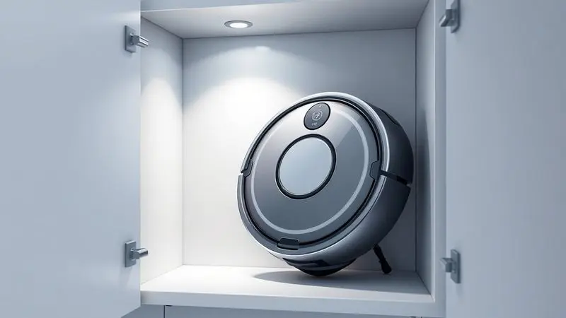

Você finalmente investiu em um robô aspirador para facilitar sua rotina, mas surge a dúvida: será que estou carregando o aparelho da forma certa?

Carregar seu robô aspirador de maneira inadequada não só prejudica a limpeza diária, como pode reduzir drasticamente a vida útil da bateria, que é o componente mais caro do equipamento.

Neste guia definitivo, você vai aprender o passo a passo para a primeira carga, onde posicionar a base estrategicamente e como evitar os erros que fazem a bateria viciar. Prepare-se para maximizar a autonomia do seu ajudante tecnológico.

<SummaryList products={frontmatter.top_products} />

## Por que o carregamento correto é vital para a vida útil do robô?

Imagine comprar um parceiro de limpeza que promete anos de serviço, mas que em poucos meses mal consegue completar uma sala sem precisar recarregar. Essa frustração muitas vezes não vem de um defeito, mas de hábitos simples que prejudicam a bateria.

As baterias de lítio modernas são sensíveis, e quando tratadas com o carinho certo, podem manter até 80% de sua capacidade original mesmo após anos de uso. O segredo está na forma como você alimenta seu robô.

Pense na bateria como o coração do aparelho. Desconectá-lo antes da carga completa, usar carregadores inadequados ou deixá-lo semanas esquecido em uma gaveta são práticas que aceleram o 'envelhecimento' das células.

Seguir as orientações do fabricante não é burocracia, é garantir que cada centavo do seu investimento se transforme em anos de limpeza tranquila.

## A primeira carga: o que você precisa saber antes de ligar o aparelho

Retire seu novo robô da caixa com a mesma empolgação de quem ganha um novo membro da família. Antes de vê-lo começar sua primeira missão, há um ritual importante. A primeira carga é como ensinar uma criança a andar: precisa de paciência e atenção.

Deixe-o na base por pelo menos 3 a 5 horas, mesmo que a luz verde acenda antes.

Essa carga inicial tem um propósito mais profundo do que apenas encher as células de energia. É o momento em que a bateria se 'calibra', entendendo sua capacidade total.

Resistir à tentação de testá-lo imediatamente significa garantir que ele terá energia suficiente para [mapear sua casa inteira](/como-funciona-o-mapeamento-do-robo-aspirador/) desde o primeiro dia, sem paradas inesperadas.

Enquanto espera, aproveite para preparar o terreno. Uma primeira limpeza em um ambiente organizado, sem muitos obstáculos, permite que o robô 'aprenda' o layout da casa de forma eficiente. Pense nisso como uma apresentação bem organizada.

Quando a luz finalmente indicar 'pronto', você terá um ajudante totalmente recarregado e pronto para memorizar cada canto da sua casa.

## Onde posicionar a base carregadora: o guia de instalação perfeita

A base de carregamento é o porto seguro do seu robô, e a escolha da localização determina se ele sempre encontrará o caminho de volta ou se ficará perdido como um viajante sem mapa.

O local ideal deve ser uma superfície completamente plana, longe de rodapés altos ou tapetes que possam emperrar as rodas na hora do retorno.

Coloque a base encostada em uma parede, mas com espaço suficiente para que o robô possa se alinhar. O objetivo é criar um corredor de aproximação fácil, como a entrada de um aeroporto bem sinalizada.

### Evitando obstáculos: o espaço livre necessário ao redor da base

<ProductBox 
  title={frontmatter.top_products[0].title} 
  image={frontmatter.top_products[0].image} 
  link={frontmatter.top_products[0].link} 
/>

Seu robô precisa de espaço para 'estacionar' sem dificuldade. Mantenha pelo menos meio metro livre em cada lateral da base e cerca de um metro e meio à frente.

Alguns modelos mais sofisticados até pedem duas vezes essa distância, especialmente em ambientes com móveis baixos onde o sinal de retorno pode ser bloqueado.

Uma base em um cantinho apertado, cheio de pernas de mesa ou plantas baixas, transforma uma simples recarga em uma missão impossível. Pior: aumenta o risco de quedas em escadas se o robô, tentando chegar até a base, calcular mal o espaço.

Investir cinco minutos agora para escolher o local perfeito significa economizar horas tentando resolver problemas de conexão depois.

## Interpretando os sinais: o que significam as luzes e sons de carga?

Com a base perfeitamente posicionada, seu robô estará pronto para sua rotina de limpeza e recarga. É aqui que uma linguagem silenciosa começa a se estabelecer entre vocês. Cada piscar de luz, cada bipe, conta uma história sobre o que está acontecendo dentro da máquina.

Uma luz verde intermitente é a mensagem mais reconfortante: 'Estou recarregando normalmente, continue com seu dia'. Quando ela se estabiliza em verde fixo, é como um sussurro dizendo 'Pronto para a próxima missão'.

Já um piscar vermelho é o equivalente a seu robô levantando a mão pedindo atenção.

Esses sinais não são apenas decorativos. Uma luz vermelha persistente pode indicar desde sensores sujos até um problema no carregador. Sons de alerta muitas vezes são o aparelho tentando dizer 'Não consigo encontrar a base' ou 'Preciso que você limpe meu filtro'.

Aprender essa linguagem transforma sua interação de meramente operacional para quase intuitiva.

## Posso deixar o robô aspirador sempre na base de carregamento? (Mito vs. Verdade)

É o jantar da família e alguém comenta: 'Você não devia deixar isso na tomada o tempo todo, vicia a bateria'. Essa crença vem de uma época tecnológica diferente, mas ainda gera dúvidas genuínas.

A verdade é que os robôs modernos são mais inteligentes do que imaginamos. Eles possuem sistemas que interrompem o carregamento quando atingem 100%, evitando a sobrecarga. Então, sim, você pode deixá-lo na base sem preocupações imediatas.

Porém, existe um 'mas' importante para quem quer maximizar a vida útil. O ideal é permitir que a bateria complete ciclos completos de uso e recarga ocasionalmente. Imagine o coração de um atleta: precisa tanto de atividade quanto de repouso.

Uma ou duas vezes por mês, use o robô até ele avisar que está com pouca bateria, antes de recolocá-lo na base. Esse pequeno hábito mantém as células 'exercitadas' e prolonga sua saúde.

## Manutenção essencial: como limpar os contatos de carregamento corretamente

<ProductBox 
  title={frontmatter.top_products[1].title} 
  image={frontmatter.top_products[1].image} 
  link={frontmatter.top_products[1].link} 
/>

Assim como você verifica o óleo do carro a cada tantos quilômetros, seus contatos de carregamento precisam de atenção periódica.

São justamente essas pequenas placas metálicas, tanto no robô quanto na base, que permitem a transferência da energia que mantém seu ajudante ativo.

Uma vez por mês, tire cinco minutos para essa cerimônia de cuidado. Desligue o aparelho, passe um pano macio e seco sobre os contatos até remover qualquer poeira ou resíduo.

Se houver sujeira mais resistente, um pouquinho de álcool isopropílico em um cotonete funciona perfeitamente.

O que parece um detalhe insignificante pode ser a diferença entre um carregamento eficiente de três horas e uma luta de seis horas para atingir 50%.

A poeira acumulada cria uma barreira invisível entre os contatos, forçando o robô a trabalhar mais para receber menos energia.

## Solucionando problemas: o que fazer quando o robô não carrega ou não volta para a base?

Chega aquele dia em que você chega em casa e encontra seu robô parado no meio da sala, com a luz vermelha piscando desesperadamente. Antes de pensar no pior, respire fundo. A maioria dos problemas tem soluções simples.

Comece pela base: a tomada está funcionando? Os contatos estão limpos? Muitas vezes, uma simples poeira nos sensores ou uma tomada desencaixada é o culpado.

Se tudo parece normal, tente o equivalente ao ['desligar e ligar novamente'](/como-resetar-robo-aspirador/): tire o robô da base por um minuto, depois recoloque-o.

Se a bateria estiver muito descarregada, alguns modelos precisam de um 'choque' inicial com uma carga direta de 15-20 minutos antes de aceitarem recarregar na base.

Sempre consulte o manual do seu modelo específico, mas lembre-se que 90% dos problemas de carregamento se resolvem com essas verificações básicas.

## Quando é hora de trocar a bateria do seu robô aspirador?

<ProductBox 
  title={frontmatter.top_products[2].title} 
  image={frontmatter.top_products[2].image} 
  link={frontmatter.top_products[2].link} 
/>

A relação com seu robô passa por fases. Nos primeiros dois anos, ele parece ter energia infinita. Entre o terceiro e quarto ano, começa a dar sinais sutis de cansaço. Esses sinais são importantes de reconhecer:

Primeiro vem a redução na autonomia. Ele que antes limpava toda a casa com uma carga agora precisa voltar para recarregar duas vezes.

Depois você nota que a sucção não parece mais tão poderosa, e que aquele tapete que ele sempre vencia agora parece uma montanha intransponível.

Trocar a bateria não é um fracasso, é um renascimento. Uma nova bateria original pode devolver ao seu robô toda a energia do primeiro dia. Evite alternativas genéricas que prometem 50% de economia mas duram metade do tempo.

Invista na peça recomendada pelo fabricante e ganhe mais três a quatro anos de serviço fiel.

## Melhores modelos de robô aspirador com carregamento inteligente e mapeamento

<ProductBox 
  title={frontmatter.top_products[3].title} 
  image={frontmatter.top_products[3].image} 
  link={frontmatter.top_products[3].link} 
/>

Se você está pensando em [atualizar seu ajudante](/melhores-robo-aspirador-2024/) ou comprando o primeiro, alguns modelos realmente transformam a experiência de carregamento em algo quase mágico.

O [Xiaomi Robot Vacuum X20 Max](/melhor-robo-aspirador-xiaomi/) é um exemplo brilhante: com mapeamento a laser 360º e uma estação que não só carrega, mas também esvazia sozinha o compartimento de poeira.

Outra opção fascinante é o [Liectroux G7](/robo-aspirador-liectroux-g7-e-bom/), que funciona como uma central de limpeza completa. Imagine seu robô voltando para a base, se recarregando, se limpando e se preparando para a próxima missão, tudo sem sua intervenção.

São investimentos maiores, sim, mas que pagam em anos de praticidade absoluta.

Esses [modelos inteligentes](/robo-aspirador-de-po-kabum-smart-500-e-bom/) entendem quando precisam de uma 'pausa para café' de 15 minutos para ter energia suficiente para completar a tarefa, retornando ao trabalho sem que você sequer note a interrupção.

## Perguntas Frequentes (FAQ) sobre Carregamento de Robô Aspirador

Mesmo com todas as orientações, algumas dúvidas persistem na mente de quem quer cuidar bem do seu investimento. Vamos esclarecer as mais comuns.

### Quanto tempo leva para o robô carregar totalmente?

A resposta varia como o tempo de preparo de diferentes refeições. Um [modelo mais simples](/robo-aspirador-sweep-e-bom/) pode estar pronto em 2 horas, enquanto um robô com bateria de alta capacidade e funções avançadas pode precisar de até 6 horas.

A boa notícia é que muitos modelos modernos praticam o 'carregamento tático': recarregam o suficiente para mais 20-30 minutos de limpeza em apenas 15 minutos, permitindo que continuem trabalhando quase sem pausas.

### O robô consome muita energia ficando sempre na tomada?

Esse é um medo que herdamos dos eletrodomésticos antigos. Os robôs aspiradores modernos são projetados para eficiência energética extrema. Quando a bateria atinge 100%, eles entram em modo de espera, consumindo menos eletricidade do que uma lâmpada LED.

Deixá-lo na base é como deixar seu smartphone carregando a noite toda: o sistema inteligente gerencia o consumo para garantir que não haja desperdício.

### Como armazenar o robô se eu for viajar por muito tempo?

Se você vai passar semanas ou meses fora, prepare seu robô como faria com uma planta ou um peixe de estimação. Dê a ele uma carga completa final, limpe cuidadosamente filtros e escovas, e guarde em um local fresco e seco, longe da luz solar direta.

Uma bateria armazenada com 50-80% de carga em temperatura ambiente se mantém saudável por meses. Evite guardar completamente sem carga, pois isso pode danificar as células de forma irreversível.

## Conclusão

Cuidar do carregamento do seu robô aspirador é muito mais do que seguir instruções técnicas. É estabelecer um relacionamento com uma máquina inteligente que trabalha discretamente para facilitar sua vida.

Os rituais que compartilhamos aqui, a primeira carga paciente, a limpeza mensal dos contatos, a atenção aos sinais luminosos, são pequenos gestos que se transformam em anos de serviço confiável.

Lembre-se que seu robô não é apenas um eletrodoméstico. É um investimento em tempo livre, em uma casa mais limpa com menos esforço, em mais horas para fazer o que realmente importa para você.

Tratá-lo com o cuidado que ele merece garante que essa parceria continue fluindo suavemente, limpando seus pisos enquanto você constrói memórias. E no final das contas, isso não tem preço.