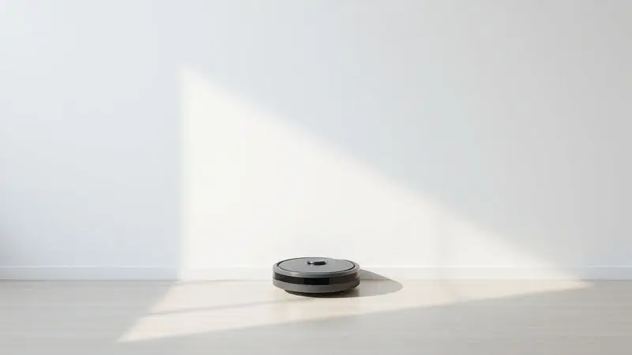
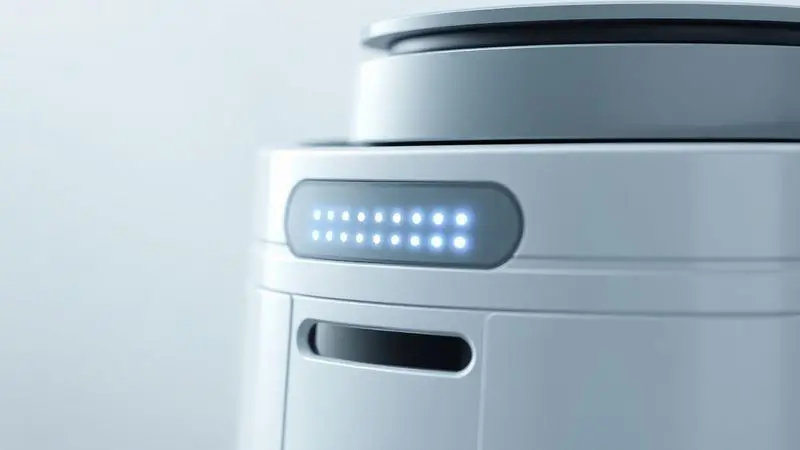
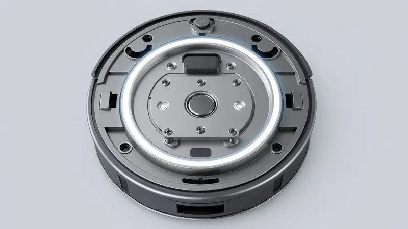
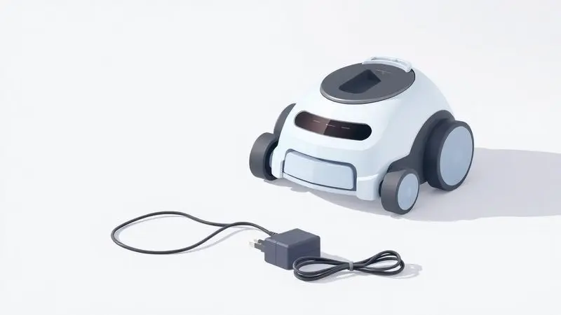

Você finalmente adquiriu a praticidade de um aspirador robô, mas percebeu que a eficiência dele depende diretamente de uma bateria bem cuidada. Carregar o seu aparelho parece simples, mas pequenos erros no dia a dia podem comprometer a autonomia da limpeza.

Se você quer garantir que seu Multilaser esteja sempre pronto para o trabalho e dure por muitos anos, este guia é para você. Vamos mostrar desde o posicionamento ideal da base até truques de especialista para preservar a bateria.

<SummaryList products={frontmatter.top_products} />

## Entendendo o Sistema de Carga do Aspirador Robô Multilaser

[Seu Multilaser](/robo-aspirador-hydra-e-bom/) é mais inteligente do que parece. Ele possui um sistema automático que faz com que, quando a bateria está baixa ou quando termina a limpeza, ele volte sozinho para sua base de carregamento.

É como um parceiro de trabalho que sabe exatamente quando está cansado e volta para casa se recarregar. Esse processo geralmente leva algumas horas, mas o resultado é que você sempre encontra seu robô pronto para a próxima missão de limpeza.

## Preparando o Ambiente: Onde Posicionar a Base de Carregamento?

Agora que você entende como ele se recarrega, é hora de preparar o lar para esse ritual. O posicionamento da base é crucial para que tudo funcione sem complicações. Pense nisso como escolher o melhor lugar para seu carro na garagem.

Coloque a base em um local plano, longe de escadas e áreas com movimento intenso. Evite cômodos com incidência direta de luz solar, já que o calor excessivo pode prejudicar tanto o robô quanto a base.

O ideal é um canto tranquilo, onde ele possa estacionar sem interromper o fluxo da casa.

### A Regra do Espaço Livre: Evitando Obstáculos

Seu robô precisa de uma pista de pouso limpa. Cabos soltos, pequenos brinquedos ou móveis baixos demais se tornam barreiras que podem fazer com que ele se perca no caminho de volta para casa.

Por isso, antes de iniciar a limpeza, dê uma rápida olhada no trajeto entre a área de trabalho e a base.

Essa organização previne frustrações, como encontrar seu aspirador preso embaixo do sofá ou, pior, com a bateria totalmente descarregada porque não conseguiu retornar.

## Passo a Passo: Como Carregar o Robô Multilaser Corretamente

Posicione o robô na base, certificando-se de que os contatos metálicos estejam alinhados. Uma luz indicadora vai sinalizar que o processo começou. A grande vantagem? Você não precisa ficar monitorando. Quando carregado, ele vai avisar.

Apenas evite mantê-lo na base por dias a fio sem necessidade.

### Modo de Carga Automática (Retorno à Base)

Este é o modo que torna sua vida mais fácil. Ativado, ele garante que seu robô nunca fique sem energia no meio de uma limpeza.

Imagine programá-lo para limpar enquanto você está no trabalho e, ao voltar, encontrá-lo descansando na base, totalmente recarregado e pronto para a próxima tarefa.

Para que essa magia aconteça, a base deve estar sempre ligada e em um local que o robô consiga [mapear facilmente](/como-funciona-o-mapeamento-do-robo-aspirador/).

### Modo de Carga Manual com Fonte Direta

Às vezes, a base pode ficar inacessível temporariamente, ou talvez você queira usar o robô em um andar diferente da casa. Nesses casos, a carga manual salva o dia. Basta conectar o cabo de alimentação diretamente ao robô, normalmente em uma entrada específica.

É uma solução prática para emergências, mas lembre-se, esse não é o método padrão recomendado para o dia a dia.

## Decifrando as Luzes: O que os Indicadores de LED Significam?

As luzinhas do seu Multilaser são sua janela para entender o que está acontecendo com ele. Elas falam uma linguagem simples que, uma vez aprendida, tira qualquer mistério do uso.

### Diferença entre Luz Piscante e Luz Fixa

Pense na luz piscante como um sinal de atividade. Quando você coloca o robô na base para carregar, essa piscada diz 'estou trabalhando nisso'. Se ele piscar em outras situações, pode ser um alerta de obstáculo ou necessidade de atenção.

Já a luz fixa é a mensagem que todo mundo quer ver, significa 'missão cumprida, pronto para ação'. Dominar essa comunicação básica evita aquela sensação de ficar adivinhando se o carregamento está sendo feito ou não.

## Quanto Tempo Demora para o Carregamento Completo?

A paciência é uma virtude, mesmo para robôs. Os [modelos Multilaser](/aspirador-robo-eclipse-multilaser-e-bom/) geralmente precisam de 3 a 5 horas para uma recarga completa. Esse tempo pode variar um pouco dependendo do [modelo específico](/robo-aspirador-wap-w3000-e-bom/) e do estado da bateria.

A boa notícia é que, como ele faz isso sozinho enquanto você está ocupado com outras coisas, você praticamente não percebe o tempo passar.

O segredo é usar sempre o carregador original, essa é a garantia de que a energia está chegando da forma certa para prolongar a saúde da bateria.

## 5 Dicas de Especialista para a Bateria Durar mais de 2 Anos

1.  **Não espere o desmaio total:** Recarregue quando a bateria estiver entre 20% e 30%, não quando chegar a zero. É como se alimentar antes da fome extrema.

2.  **Dê um descanso:** Se não for usar o robô por vários dias, tire-o da base. Uma pausa faz bem para qualquer um.

3.  **Escolha o modo certo:** Use o modo de limpeza adequado para cada ambiente. Para áreas pequenas, não precisa do turbo máximo.

4.  **Mantenha o ambiente amigável:** Temperaturas extremas (muito calor ou muito frio) são inimigas da bateria.

5.  **Limpeza regular:** Isso inclui o robô por fora e, principalmente, os seus pontos de contato com a base.

### Limpeza dos Contatos de Cobre: O Segredo do Carregamento Eficiente

Esses pequenos discos metálicos são o aperto de mãos entre seu robô e a base. Se estiverem sujos ou oxidados, a conversa energética fica comprometida. A cada duas semanas, passe um pano seco ou uma borracha escolar macia neles. Simples assim.

Evite produtos de limpeza químicos que podem corroer o metal. Cinco minutos nessa tarefa podem salvar você de horas de frustração com carregamentos que não acontecem.

### Por que você nunca deve deixar a bateria zerar totalmente?

As baterias de íon-lítio, como as do seu Multilaser, têm uma espécie de memória negativa. Quando você as deixa chegar a 0%, elas podem entrar em um estado de 'choque' chamado descarga profunda.

Desse estado, algumas não se recuperam totalmente, perdendo capacidade permanente. Outras simplesmente se recusam a voltar à vida. Trate sua bateria como trata seu celular: carregue antes que o alerta vermelho comece a piscar desesperadamente.

## Problemas Comuns: O Robô Multilaser Não Carrega? Veja a Solução

Primeiro, respire fundo. A maioria dos problemas de carregamento tem solução simples. Comece pelo básico: a tomada está funcionando? A base está bem conectada? As luzes indicadoras acenderam? Se sim, vá para o próximo passo.

### Verificando a Fonte e a Tomada

Às vezes o problema não está no robô, está na parede. Teste a tomada com outro aparelho que você sabe que funciona. Evite usar extensões ou adaptadores, eles podem não fornecer a voltagem estável que o carregador precisa.

Se possível, conecte a base diretamente na tomada. Lembre-se também que sobrecarregar um ponto de energia com vários aparelhos pode criar flutuações que confundem o sistema de carregamento do seu Multilaser.

Se após essas checagens o problema persistir, limpe os contatos (como ensinamos acima) e tente [reiniciar o robô](/como-resetar-robo-aspirador/) desconectando-o totalmente por um minuto. A grande maioria das falhas se resolve com esse 'reinício' simples.

## Quando é Hora de Trocar a Bateria do seu Aspirador?

<ProductBox 
  title={frontmatter.top_products[0].title} 
  image={frontmatter.top_products[0].image} 
  link={frontmatter.top_products[0].link} 
/>

Tudo na vida tem um ciclo, e com as baterias não é diferente. Os sinais são claros: o robô começa a funcionar por apenas 20 minutos em vez dos 60 habituais, mesmo após uma carga completa. Ele desliga do nada no meio da sala, como se tivesse perdido as forças.

Ou então, o processo de carregamento que antes levava 3 horas agora leva 6 ou mais.

Quando chegar essa hora, opte sempre por [baterias originais Multilaser](/aspirador-de-po-multilaser-robo-moon-ho401-e-bom/) ou compatíveis de marcas confiáveis. Uma bateria de baixa qualidade não só tem performance inferior como pode, em casos extremos, danificar o robô.

A troca é um investimento que devolve ao seu parceiro de limpeza toda a energia de quando era novo.

## Acessórios de Reposição Essenciais para seu Multilaser

<ProductBox 
  title={frontmatter.top_products[1].title} 
  image={frontmatter.top_products[1].image} 
  link={frontmatter.top_products[1].link} 
/>

Para manter o desempenho no auge, alguns acessórios precisam de atenção periódica. Os filtros são os pulmões do seu robô, e devem ser trocados ou limpos conforme as instruções do modelo (geralmente a cada 3-6 meses).

As escovas, tanto a central quanto as laterais, sofrem desgaste natural do atrito, e kits de reposição estão amplamente disponíveis.

O reservatório de pó, embora resistente, pode rachar em quedas. Ter um sobressalente evita que um acidente banal interrompa sua rotina de limpeza.

E claro, quando a bateria chegar ao fim de sua vida útil (geralmente após 2-3 anos de uso regular), sua substituição devolve a autonomia original.

## Perguntas Frequentes (FAQ)

### Posso deixar o aspirador robô sempre na tomada?

Embora os sistemas modernos tenham proteção contra sobrecarga, deixá-lo eternamente conectado não é o ideal. É como manter seu celular 100% do tempo no carregador, a bateria perde um pouco da sua 'elasticidade' natural.

O mais saudável é carregar quando necessário e retirar da base quando atingir 100%.

### O robô parou de encontrar a base, o que fazer?

Primeiro, garanta que a área ao redor da base está realmente desobstruída (lembra da regra do espaço livre?). Limpe os sensores do robô e da base com um pano seco, pois poeira pode cegá-los. Verifique se a base está ligada.

Se o problema continuar, tente reposicionar a base em outro local, às vezes uma mudança mínima de ângulo resolve. Por fim, o bom e velho reinício, desconectando tudo por um minuto, pode resetar qualquer bug de navegação.

## Conclusão

Cuidar da bateria do seu [aspirador robô](/robo-aspirador-electrolux-erb30-e-bom/) Multilaser vai muito além de simplesmente conectá-lo na tomada.

É sobre entender o ritmo do seu parceiro de limpeza, criar um ambiente onde ele possa funcionar sem obstáculos e adotar hábitos simples que preservam sua energia por anos.

Desde o posicionamento estratégico da base até a leitura das luzes indicadoras, cada detalhe contribui para que você tenha sempre um aliado pronto para ação.

Lembre-se que o maior segredo está na prevenção.

Aqueles cinco minutos de manutenção mensal, a atenção aos sinais de desgaste e o respeito aos ciclos de carga da bateria fazem toda diferença entre um aparelho que dura uma temporada e um companheiro que trabalha fielmente ao seu lado por longo tempo.

Agora que você domina essa arte, sua casa estará sempre impecável, sem que você precise se preocupar se o robô terá energia suficiente para concluir o serviço.

Coloque essas dicas em prática e desfrute da verdadeira autonomia que um aspirador robô bem cuidado pode oferecer.