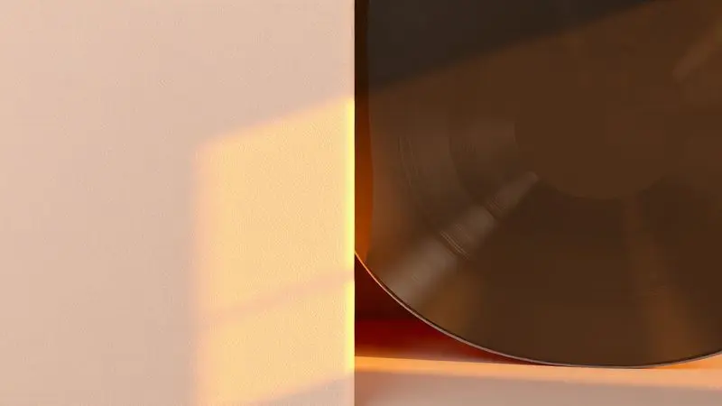

Acordar no meio da noite sentindo o chão frio porque seu colchão inflável esvaziou é uma daquelas experiências que transformam um acampamento tranquilo ou uma noite de visitas em um verdadeiro pesadelo.

Antes de considerar a compra de um modelo novo, saiba que a maioria dos furos pode ser resolvida com um pouco de paciência e a técnica certa, mesmo quando o problema está no lado aveludado que parece desafiar qualquer reparo.

Este guia vai acompanhar você em cada etapa, desde encontrar aquele vazamento invisível até realizar um conserto tão profissional que você quase se esquece que houve um problema.

<SummaryList products={frontmatter.top_products} />

## Como Identificar o Vazamento no Colchão Inflável?

Imagine seu colchão completamente inflado, mas perdendo ar de forma misteriosa. O primeiro passo é transformar-se em um detetive de vazamentos. Inicie com o colchão cheio e percorra cada centímetro com as mãos, sentindo qualquer brisa mínima de ar escapando.

Preste atenção especial às costuras, áreas de dobra e, claro, o lado aveludado. Em um ambiente silencioso, aproxime o ouvido e escute com atenção: às vezes, o som do ar saindo é mais revelador do que qualquer inspeção visual.

### O Método da Água com Sabão: Encontrando Bolhas Reveladoras

Quando o vazamento teima em se esconder, é hora de recorrer ao truque clássico que nunca falha. Prepare uma solução simples com água e algumas gotas de detergente em um borrifador ou recipiente.

Pulverize ou aplique essa mistura nas áreas suspeitas, especialmente onde você já sentiu alguma corrente de ar. Onde houver um furo, por menor que seja, pequenas bolhas começarão a se formar como se fossem delatando o culpado.

Este método não requer equipamentos especiais e oferece resultados visuais instantâneos, transformando um problema invisível em algo que você pode literalmente apontar.

### Inspeção por Pressão e Audição: Como Achar Furos Silenciosos

Alguns vazamentos são tão discretos que nem o método da água com sabão os revela claramente. Nesses casos, combine técnicas. Com o colchão cheio, aplique pressão suave em diferentes áreas com as palmas das mãos.

Sinta não apenas o ar escapando, mas também mudanças sutis na tensão do material. Simultaneamente, em um cômodo absolutamente silencioso, feche os olhos e concentre-se apenas no som.

O ruído de um vazamento pequeno pode ser comparável a um sussurro, mas quando você o encontra, a sensação é de pura vitória.

## Como Colar Colchão Inflável do Lado do Veludo? (O Segredo do Sucesso)

O lado aveludido apresenta um desafio único: sua textura porosa parece rejeitar qualquer tipo de adesivo comum. É aqui que a maioria dos reparos caseiros falha, criando aquela frustração de ver o remendo se soltar na primeira vez que você se deita.

Mas o segredo não está na força, e sim na preparação. O processo começa muito antes da aplicação da cola, com uma limpeza meticulosa que remove não apenas a sujeira, mas também os resíduos de gordura natural que impedem a aderência perfeita.

### Por que o Remendo Comum Não Adere na Camurça?

Pense no veludo como uma esponja microscópica. Cada fibra minúscula cria milhares de pontos de contato que absorvem a cola em vez de permitir que ela forme uma camada uniforme.

Enquanto em superfícies lisas de vinil o adesivo cria uma película contínua, na camurça ele se infiltra nas fibras, perdendo sua capacidade de selar.

Além disso, a flexibilidade natural do tecido trabalha contra adesivos rígidos, criando pontos de tensão que eventualmente cedem. A solução não é uma cola mais forte, mas uma abordagem que respeite a natureza do material.

### Passo a Passo para Remover o Veludo e Expor o Vinil

Este é o momento que separa um reparo temporário de um conserto definitivo. Com uma lâmina afiada ou tesoura de ponta fina, levante cuidadosamente as bordas do veludo ao redor da área danificada.

Imagine que você está cirurgicamente removendo apenas a camada superficial sem tocar no vinil saudável por baixo. Trabalhe com movimentos delicados e precisos, como se estivesse abrindo uma embalagem delicada.

Uma vez que o veludo esteja removido, você revela a superfície lisa de vinil pronta para receber o reparo de forma adequada. Esta etapa extra garante que o adesivo tenha uma base perfeita para criar uma ligação duradoura.

## Guia Completo de Reparo: Do Preparo à Secagem Final

Com o vinil exposto e o problema localizado, você está pronto para a fase de reconstrução. Esta não é uma simples aplicação de cola, mas um ritual cuidadoso que determina se seu colchão durará mais uma temporada ou será esquecido no armário.

Cada etapa tem sua importância, e pular qualquer uma delas é convidar o fracasso a se repetir.

### 1. Limpeza Profunda e Desengorduramento da Área

Antes de qualquer coisa, a área precisa estar imaculadamente limpa. Use um pano seco para remover poeira e partículas soltas. Em seguida, prepare uma solução de água morna com sabão neutro e, com um pano limpo, esfregue suavemente a área ao redor do furo.

O objetivo não é apenas remover a sujeira visível, mas eliminar os óleos naturais e resíduos que são invisíveis a olho nu. Enxágue com um pano umedecido apenas com água limpa e deixe secar completamente.

Esta superfície preparada é como uma tela em branco para sua obra de reparo.

### 2. Aplicação da Cola Vinil e Posicionamento do Remendo

Agora vem a parte crítica. Aplique uma camada uniforme de cola específica para vinil sobre a área limpa e seca, estendendo-se levemente além dos limites do furo. Se estiver usando um remendo, aplique cola também em suas bordas.

Alinhe cuidadosamente o remendo sobre o dano, pressionando do centro para as extremidades para expulsar qualquer bolha de ar que possa ter ficado presa. Mantenha pressão firme por pelo menos 60 segundos, contando mentalmente ou usando um temporizador.

Esta pressão inicial é o que garante o contato perfeito entre as superfícies.

### 3. O Truque da Pressão Constante: Eliminando Bolhas de Ar

Após a aplicação inicial, não abandone o reparo. Coloque um peso uniforme sobre a área consertada, como um livro pesado ou uma tábua com alguns objetos.

Esta pressão constante durante as primeiras horas é crucial para que a cola cure de forma homogênea, sem criar pontos fracos. Se você notar que alguma borda começa a levantar, aplique mais pressão específica naquele ponto.

Lembre-se de que o material precisa se adaptar ao remendo, e essa adaptação ocorre melhor sob pressão moderada e consistente.

### 4. Tempo de Cura: Quanto Tempo Realmente Esperar Antes de Inflar?

Esta é a etapa que testa sua paciência, mas também determina a durabilidade do conserto. Espere no mínimo 24 horas antes de sequer pensar em inflar o colchão. Em ambientes mais frios ou úmidos, estenda esse período para 48 horas.

Durante este tempo, a cola não apenas seca, mas realiza uma ligação química com o vinil, criando uma união que é quase tão forte quanto o material original.

Inflar antes deste período completo é como retirar um bolo do forno antes de assar: aparentemente pronto, mas desmoronando ao primeiro toque.

## Materiais Recomendados para um Conserto Duradouro

A qualidade do conserto está diretamente ligada à qualidade dos materiais utilizados. Economizar aqui significa quase certamente repetir o processo em breve. Invista em produtos desenvolvidos especificamente para o tipo de material que você está reparando.

### Cola Vinil Incolor Tekbond: A Favorita dos Especialistas

<ProductBox 
  title={frontmatter.top_products[0].title} 
  image={frontmatter.top_products[0].image} 
  link={frontmatter.top_products[0].link} 
/>

Entre os profissionais que realizam reparos em itens de camping e lazer, a Cola Vinil Incolor Tekbond é quase uma lenda. Sua transparência garante que o conserto seja praticamente invisível, preservando a estética do seu colchão.

Mas o verdadeiro diferencial está no desempenho: em cerca de 20 minutos você já tem uma fixação segura o suficiente para manusear o item, e em 24 horas atinge sua resistência máxima.

A formulação é especificamente desenvolvida para materiais flexíveis como vinil, expandindo e contraindo junto com o colchão sem rachar ou soltar. É a diferença entre um remendo que dura uma viagem e um que dura anos.

### Kit de Reparo Nautika com Remendos de PVC

<ProductBox 
  title={frontmatter.top_products[1].title} 
  image={frontmatter.top_products[1].image} 
  link={frontmatter.top_products[1].link} 
/>

Para quem prefere uma solução completa em uma única embalagem, o Kit de Reparo Nautika é como ter um pequeno hospital de campo para seus equipamentos infláveis.

Inclui remendos em formatos variados que se adaptam a diferentes tipos de danos, além de um tubo de cola vinílica de qualidade.

A compatibilidade com diversos modelos da marca oferece a tranquilidade de saber que o produto foi testado especificamente para o material do seu colchão.

Mantenho um desses kits sempre na mochila de camping, porque quando você mais precisa dele, normalmente está longe de qualquer loja especializada.

## O Que Jamais Usar: Por Que o Super Bonder é um Perigo para Infláveis?

Em um momento de desespero, pode ser tentador recorrer ao Super Bonder ou qualquer cianoacrilato. Resista a essa tentação. Estas colas são desenvolvidas para materiais rígidos e criam uma ligação que não flexiona.

Quando aplicadas em vinil, não apenas falham em selar adequadamente, mas podem literalmente corroer o material, transformando um pequeno furo em um rasgo considerável.

Além disso, sua rigidez cria pontos de tensão que acabam cedendo com a expansão e contração natural do colchão inflável. É a receita perfeita para transformar um problema reparável em uma perda total.

## Vazamento na Válvula: Como Resolver Problemas de Vedação?

Quando o problema não é um furo no corpo do colchão, mas sim um vazamento na válvula, a abordagem muda completamente. Primeiro, verifique se a válvula está completamente fechada e limpa de qualquer sujeira ou resíduo que possa impedir o encaixe perfeito.

Se o vazamento persistir, aplique uma fina camada de silicone ou selante de borracha específico para válvulas ao redor da base. Deixe curar conforme as instruções do fabricante antes de testar.

Em casos mais extremos onde a própria válvula está danificada, a substituição pode ser necessária, mas felizmente esta é uma peça que costuma ser fácil de encontrar e relativamente simples de trocar.

## Vale a Pena Consertar ou Comprar um Colchão Novo?

Esta decisão vai além do custo monetário imediato. Considere a idade do colchão, a qualidade original do material e, principalmente, o tamanho e localização do dano. Um colchão de boa marca com um pequeno furo em área plana vale cada minuto investido no reparo.

Já um modelo mais barato com múltiplos furos ou danos em costuras críticas pode estar comunicando que já cumpriu seu ciclo de vida útil.

### Quando o Conserto é Seguro e Quando Pode Ser Perigoso

A segurança deve ser sua prioridade máxima. Reparos em áreas planas e de fácil acesso são geralmente seguros e duráveis.

No entanto, quando o dano ocorre em uma costura estrutural ou próximo a uma válvula, a integridade do colchão pode estar comprometida mesmo após o conserto. Avalie não apenas o tamanho do furo, mas também seu impacto na distribuição de pressão.

Um pequeno furo em uma área que sofre muita tensão pode ser mais problemático do que um furo maior em uma área de baixa pressão.

### Sugestões de Colchões Infláveis de Alta Durabilidade para Troca

<ProductBox 
  title={frontmatter.top_products[2].title} 
  image={frontmatter.top_products[2].image} 
  link={frontmatter.top_products[2].link} 
/>

Se a decisão for pela troca, invista em modelos que evitarão futuras visitas a este guia. Marcas como Intex com tecnologia Fiber-Tech oferecem não apenas durabilidade superior, mas também um conforto que se aproxima de colchões convencionais.

A presença de bombas elétricas integradas transforma o processo de inflar de uma tarefa árdua em um simples apertar de botão.

Para quem acampa com frequência, modelos com camadas de proteção reforçada nas áreas de maior contato com o solo valem o investimento adicional, garantindo noites tranquilas sem preocupações com vazamentos.

## Perguntas Frequentes (FAQ) sobre Reparo de Colchões

As dúvidas mais comuns surgem justamente quando as mãos já estão sujas de cola e a frustração começa a aparecer. Antes de tomar qualquer decisão precipitada, verifique se sua questão já tem resposta aqui.

### Posso usar fita silver tape para tapar o furo temporariamente?

Em uma emergência absoluta, como no meio de uma viagem quando não há outra opção, a fita silver tape pode funcionar como um curativo provisório.

No entanto, entenda que isto é exatamente isso: uma solução temporária que provavelmente não resistirá a uma noite inteira de uso. A pressão constante do corpo e a flexão do material eventualmente farão com que a fita perca sua aderência.

Use-a para chegar até casa ou até uma loja onde possa adquirir os materiais adequados, mas não espere que ela se transforme em uma solução permanente.

### O que fazer se o furo for em uma costura ou dobra?

Estes são os reparos mais desafiadores, mas não impossíveis. A chave está na limpeza meticulosa e na aplicação de uma camada generosa de cola de qualidade que penetre profundamente no ponto de união.

Após a aplicação, considere reforçar com um remendo um pouco maior do que o necessário, aplicando pressão extra durante o período de cura.

Mesmo assim, esteja preparado para que este tipo de conserto tenha uma vida útil menor do que reparos em áreas planas, pois as dobras naturalmente criam pontos de tensão.

### Como evitar que o colchão fure novamente no acampamento?

A prevenção começa antes mesmo de sair de casa. Inspecione visualmente o local onde planeja montar o colchão, removendo pedras, galhos ou qualquer objeto pontiagudo. Utilize sempre uma lona ou tapete específico para camping como barreira protetora.

Ao inflar, respeite os limites de pressura indicados pelo fabricante, pois o excesso de ar torna o material mais suscetível a danos. Durante o transporte, armazene o colchão desinflado em sua bolsa original, protegido de objetos que possam perfurá-lo.

Estas pequenas atitudes transformam seu colchão de um item descartável em um companheiro de muitas aventuras.

## Conclusão

Reparar um colchão inflável vai muito além de simplesmente tapar um furo. É recuperar o conforto de noites bem dormidas, é transformar frustração em realização, e é aprender que a durabilidade muitas vezes está em nossas mãos.

Cada etapa deste processo, desde a identificação meticulosa do vazamento até a paciência durante a cura da cola, contribui para um resultado que honra tanto seu investimento quanto seu tempo.

Lembre-se de que os melhores materiais e a técnica adequada fazem a diferença entre um remendo que solta na primeira noite e um conserto que dura anos. Na próxima vez que seu colchão apresentar um problema, respire fundo e siga estes passos.

Você não apenas consertará um objeto, mas dominará uma habilidade que garantirá noites tranquilas em todas as suas aventuras. Seu futuro eu, descansando confortavelmente, agradecerá.