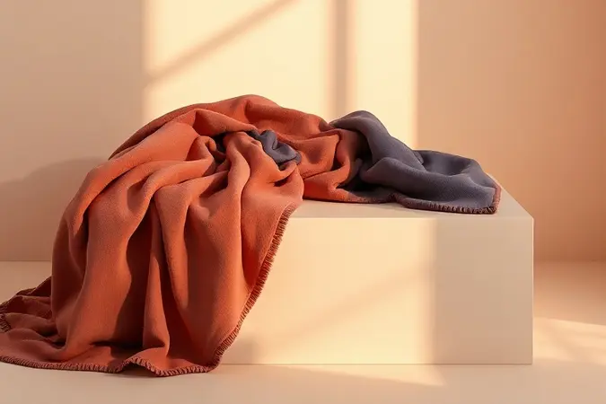
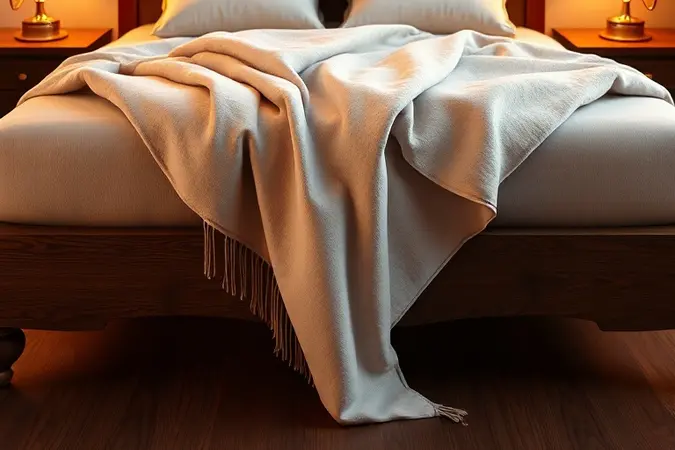
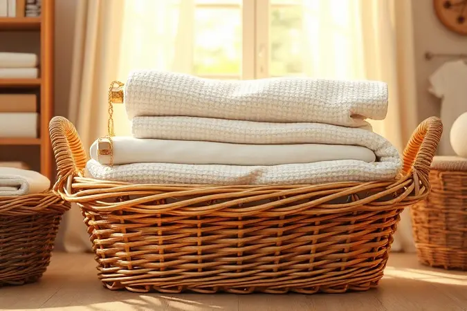

Você já entrou em um quarto e sentiu aquela sensação imediata de aconchego e sofisticação? As vezes a gente investe em lençóis de qualidade, mobília bonita, mas ainda assim parece faltar algo. Aquela peça que transforma um quarto comum em um santuário pessoal.

O segredo costuma estar exatamente onde menos esperamos: na peseira da cama. Uma manta bem colocada não é apenas um acessório, é a assinatura visual do seu espaço, a promessa de conforto ao final de um longo dia.

Prepare-se para descobrir como essa simples peça pode se tornar sua maior aliada na criação de um ambiente que, além de bonito, parece te abraçar.

<SummaryList products={frontmatter.top_products} />

## Por que Usar Mantas na Peseira da Cama?

Pense na manta da peseira como o acessório definitivo do seu quarto. Ela faz pelo seu espaço o que um lenço faz por um traje elegante: adiciona textura, cor e personalidade sem esforço aparente. Mas vai além da estética.

Nos pés frios de uma noite de inverno, ela está ali, pronta para aquecer. Quando você quer mudar o clima do ambiente sem reformar nada, basta trocá-la. Ela define o estilo do seu quarto, conversando com as outras peças para criar uma narrativa visual coesa.

Seja um ar moderno e limpo ou um estilo rústico cheio de personalidade, a manta certa conta essa história imediatamente.

## Tipos de Mantas Decorativas: Escolhendo o Material Ideal

A magia começa ao toque. O material que você escolhe determina não apenas o visual, mas a experiência sensorial completa.

### Mantas de Tricot: O Clássico do Aconchego

<ProductBox 
  title={frontmatter.top_products[0].title} 
  image={frontmatter.top_products[0].image} 
  link={frontmatter.top_products[0].link} 
/>

Mais do que uma manta, é um abraço tecido. Imagine chegar em casa depois de um dia frio e encontrar aquela textura artesanal esperando por você.

As mantas de tricot, sejam em lã natural ou poliéster, trazem uma profundidade visual incrível com suas tramas largas e detalhes decorativos. Elas falam de tradição, de momentos feitos à mão, de um conforto que parece ter história.

Sim, algumas, especialmente as de lã pura, pedem um cuidado especial na lavagem, mas esse pequeno ritual de preservação faz parte do charme. Você não está apenas cuidando de um tecido; está mantendo viva a sensação única que só esse tipo de aconchego proporciona.

### Mantas de Algodão: Versatilidade para o Ano Todo

<ProductBox 
  title={frontmatter.top_products[1].title} 
  image={frontmatter.top_products[1].image} 
  link={frontmatter.top_products[1].link} 
/>

Se a tricot é o inverno, o algodão é todas as estações em uma só peça. Leve e respirável, é sua companheira perfeita para noites de verão, funcionando como uma camada sutil sobre a cama.

Na primavera e outono, oferece aquele aconchego adicional perfeito para ler um livro no sofá. Para os dias de inverno mais rigoroso, ela se transforma na camada perfeita sobre cobertores mais pesados, garantindo conforto sem sufocar.

A beleza está na praticidade: é hipoalergênica, fácil de lavar e seca rápido. Para quem busca um elemento decorativo que combine estilo com a liberdade de um dia a dia sem complicações, o algodão é a resposta.

### Mantas de Pele Sintética ou Plush: Luxo para o Inverno

<ProductBox 
  title={frontmatter.top_products[2].title} 
  image={frontmatter.top_products[2].image} 
  link={frontmatter.top_products[2].link} 
/>

Aqui entramos no território do puro luxo sensorial. Deslizar os dedos sobre uma manta de pele sintética ou plush é uma experiência que transforma qualquer quarto em um hotel boutique.

A pele sintética oferece aquele toque aveludado e sofisticado, imitando a aparência nobre da pele animal de forma ética e durável. Já o plush é a definição de conforto extremo: uma textura felpuda e absurdamente macia que convida ao aconchego imediato.

Ambas aquecem com eficiência nas noites frias e trazem um impacto visual dramático. A manutenção? Muito mais simples do que parece, geralmente resolvida com um ciclo delicado na máquina.

Escolha estas quando quiser que sua cama não apenas pareça convidativa, mas grite luxo e conforto a cada olhar.

## Como Escolher a Cor e a Textura da Manta

Esta escolha é a sua chance de ditar o humor do ambiente. Cores neutras como bege, cinza e branco são sua base segura para um visual atemporal e elegante.

Eles funcionam como uma tela em branco, permitindo que você adicione personalidade com almofadas e outros acessórios. Quer fazer uma declaração? Tons de azul-safira, verde-escuro ou terracota adicionam energia e caráter sem medo.

Agora, combine essa cor com a textura certa. Uma manta de lã grossa em cor neutra fala de um aconchego nórdico e robusto. O mesmo tom em seda ou algodão fino transmite uma sofisticação mais leve e arejada.

O truque é pensar na conversa: sua manta deve sussurrar com as almofadas, acenar para as cortinas e complementar o tapete. Quando cor e textura dançam juntas, criam uma harmonia que os olhos percebem antes mesmo do cérebro processar.

## 5 Formas Elegantes de Colocar a Manta na Peseira (Passo a Passo)

A forma como você posiciona sua manta é a última camada do estilo. Pode ser a diferença entre "arrumado" e "estilo de vida".

### 1. A Dobra Reta e Alinhada (Estilo Minimalista)

Para mentes que apreciam a clareza e a ordem. Dobre sua manta em um retângulo limpo e posicione-a perfeitamente alinhada com a borda do pé da cama. O resultado é uma linha horizontal nítida que traz uma sensação de calma e controle ao espaço.

Este método celebra a própria manta, tornando-a o ponto focal geométrico da decoração. Ideal para quem ama um quarto que parece saído das páginas de uma revista de design, onde cada elemento tem seu lugar definido e propósito claro.

### 2. O Estilo Despojado (O Famoso 'Jogadinho')

O oposto da perfeição calculada. Aqui, a regra é não haver regras. Simplesmente pegue sua manta e a jogue com um gesto casual sobre os pés da cama. Deixe que as dobras se formem naturalmente, que uma ponta caia mais que a outra.

Esta técnica cria uma sensação de aconchego imediato, como se alguém tivesse acabado de se levantar de uma sesta. Transmite vivência, conforto despretensioso e um convite irresistível para deitar. É o visual do dia a dia feito com estilo.

### 3. Dobra em Triângulo no Canto da Cama

Um toque de elegância que parece ter saído de um hotel cinco estrelas. Estenda a manta diagonalmente sobre um canto do pé da cama, criando um triângulo perfeito que se abre para o resto do quarto.

Esta dobra adiciona movimento e interesse visual a uma superfície plana, quebrando a monotonia das linhas retas da cama. Além de linda, é funcional: a ponta solta fica sempre ao alcance para puxar nos primeiros sinais de frio.

Uma solução inteligente que une forma e função com sofisticação.

### 4. Camadas de Mantas e Peseiras

Por que escolher uma quando você pode ter duas? Esta é a técnica máxima do aconchego e do design. Comece com uma base, como uma colcha ou um edredom neutro. Sobre ela, adicione uma manta de textura contrastante, deixando uma borda da primeira camada visível.

O resultado são camadas de cor, padrão e sensação tátil que criam profundidade e riqueza visual. Misture uma manta de tricot pesado com uma de algodão mais leve, ou combine uma estampa ousada com um tom sólido. É a arte de vestir sua cama.

### 5. Peseira Esticada com Pontas Caídas

Dramática e contemporânea. Puxe a manta para que ela cubra toda a largura do pé da cama e deixe suas pontas caírem elegantemente pelos lados, quase tocando o chão.

Esta disposição cria linhas verticais que alongam visualmente a cama e adicionam uma dose de teatralidade ao ambiente. Funciona especialmente bem com mantas de tecidos fluidos, como chenille ou algodão felpudo, que caem com graça.

É uma declaração ousada, perfeita para quartos com tetos altos ou um estilo decorativo mais assertivo.

## Proporções: Mantas para Cama Casal, Queen e King

O tamanho certo não é uma mera sugestão; é a garantia de que sua manta vai fazer o trabalho visual que você espera. Para uma cama de casal, pense em mantas a partir de 1,50m de largura.

Ela vai cobrir a área da peseira de forma confortável, sem parecer apertada ou perdida.

Nas camas Queen, que já têm uma presença mais generosa no quarto, uma manda de cerca de 2m de largura cria o caimento elegante e proporcional que o espaço merece. Já para as majestosas camas King, você vai querer algo a partir de 2,40m.

Esta medida permite que a manta envolva completamente a largura da cama, criando aquele impacto visual pleno e satisfatório. Acertar na proporção é o que transforma uma "manta na cama" em "parte integrante da cama".

## Como Combinar a Manta com as Almofadas

<ProductBox 
  title={frontmatter.top_products[3].title} 
  image={frontmatter.top_products[3].image} 
  link={frontmatter.top_products[3].link} 
/>

Aqui é onde a magia da coordenação acontece. Sua manta e almofadas devem conversar, não gritar uma com a outras. Se você escolheu uma manta com estampa forte, use almofadas em cores sólidas retiradas da própria estampa. Isso cria unidade sem competição.

Se sua manta é um tom neutro sólido, essa é sua licença para brincar com almofadas em padrões variados e texturas ousadas, como veludo ou bordados.

Pense também nas estações. No inverno, almofadas de veludo ou lã combinam perfeitamente com mantas de tricot. No verão, troque por algodão leve ou linho.

O objetivo final não é a perfeição simétrica, mas sim uma coleção de elementos que, juntos, contam uma história coerente sobre quem você é e como quer se sentir naquele espaço.

## Erros Comuns ao Usar Mantas na Decoração que Você Deve Evitar

O caminho para um quarto perfeito também é saber o que não fazer. O primeiro tropeço é ignorar a escala: uma manta minúscula em uma cama king parece um erro, assim como uma manta enorme em uma solteiro parece sufocante. 

O segundo é o desequilíbrio tátil. Colocar uma manta de lã pesadíssima em um quarto de verão cheio de linho leve cria uma dissonância sensorial. O contexto importa. 

Por fim, o pecado da incoerência: jogar uma manta com estampa étnica vibrante em um quarto minimalista e monocromático sem nenhum elemento de ligação. A manta deve parecer que nasceu ali, não que foi parar ali por acidente. A regra de ouro?

Se você precisa se perguntar se combina, provavelmente não combina. Confie na sensação de harmonia imediata.

## Dicas de Manutenção: Como Lavar e Conservar suas Mantas

Para manter sua manta sempre com aquele aspecto convidativo de nova, um pouco de cuidado estratégico faz toda a diferença. Sempre comece uma amizade com a etiqueta de cuidados; ela sabe mais sobre seu tecido do que você. 

Mantas de algodão geralmente aceitam a máquina, mas trate-as com carinho: água fria e ciclo delicado preservam as fibras. As de lã são mais sensíveis, muitas vezes preferindo um banho de mão ou um ciclo específico para lãs na máquina.

Quando chegar a hora de secar, resista à secadora. O secar ao ar livre, à sombra, é o ritual de rejuvenescimento que mantém a maciez e a forma intactas.

Para guardar, pense em dobras fofas, não compressões apertadas. Um armário seco e arejado as mantém prontas para a próxima temporada, sem surpresas de mofo ou odores. Cuidar bem da sua manta é prolongar a sensação de aconchego que ela proporciona estação após estação.

## Conclusão

Ao longo destas linhas, você descobriu que uma manta na peseira da cama é muito mais que um pedaço de tecido. Ela é a pincelada final na pintura do seu quarto, o elemento que transforma um espaço funcional em um refúgio pessoal.

É sobre a textura que acalma ao toque, a cor que define o humor, o padrão que conta uma história.

Você agora tem o conhecimento para escolher não apenas um material, mas uma sensação. Sabe como posicioná-la para criar desde um minimalismo elegante até um aconchego despojado.

Entende que a proporção certa é a base da beleza e que a combinação com outros elementos é uma conversa silenciosa sobre estilo.

Mais importante, percebeu que decorar com mantas é um ato de autocuidato. É criar um ambiente que te recebe, te aconchega e reflete quem você é. Então, da próxima vez que olhar para sua cama, imagine as possibilidades. Qual sensação você quer encontrar ao final do dia?

Que história seu quarto vai contar? A manta certa espera para escrever o próximo capítulo dessa história com você. Comece hoje essa transformação.