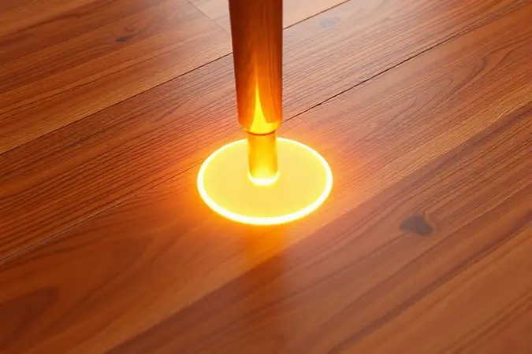

Você acabou de desembalar sua cama box Bom Pastor e parou na hora de rosquear os pés? Aquele friozinho na barriga é normal. Você quer garantir que tudo fique perfeito, que o investimento seja protegido e que seu primeiro sono seja tão tranquilo quanto o último da loja.

Respira fundo. Este guia foi feito para transformar essa insegurança em uma montagem simples e satisfatória.

Vamos juntos descobrir como instalar, ajustar e até escolher os melhores pés para que sua cama não seja apenas firme, mas também uma peça de conforto absoluto no seu quarto.

<SummaryList products={frontmatter.top_products} />

## Por que a Instalação Correta dos Pés é Essencial para sua Cama?

Pense em seus pés como os alicerces de uma casa. Instalá-los corretamente não é só questão de aparência, é sobre segurança e conforto. Uma cama nivelada evita aquele balanço que acorda você no meio da noite quando seu parceiro se mexe.

Distribui o peso do colchão de forma uniforme, prolongando sua vida útil e garantindo que o suporte ortopédico prometido pelo fabricante funcione como deve.

E tem mais: a altura certa facilita a limpeza, mantendo seu espaço livre da poeira e ácaros que adoram se esconder em cantos inacessíveis. No fundo, pés bem instalados são seu primeiro passo rumo a noites de sono verdadeiramente reparadoras.

## Materiais Necessários para a Montagem (Sem Ferramentas!)

A parte boa? Você não precisa ser um mestre dos parafusos. A Bom Pastor pensou na simplicidade. Na caixa, você já encontra os pés projetados especialmente para o encaixe perfeito na sua cama.

Tudo o que mais precisa é de um pano macio para limpar a área (garantindo que nenhum grão de poeira atrapalhe o encaixe) e, se quiser um extra de precisão, um nível de bolha. Com isso em mãos, você está pronto para uma montagem que não dura mais que alguns minutos.

## Passo a Passo: Como Instalar os Pés na Cama Box Bom Pastor

Agora vamos à prática. A sequência é tão intuitiva que você vai se perguntar por que teve medo.

### 1. Preparação: Posicionando o Box de Lado

Encontre um espaço amplo no quarto, afaste móveis e prepare-se para dar o primeiro giro. Virar o box de lado é fundamental. Isso não só libera as laterais inferiores, onde os pés serão fixados, como também dá a visão completa necessária para um alinhamento impecável.

É o momento de 'conhecer' a estrutura que vai sustentar seus sonhos.

### 2. Localizando os Furos de Encaixe no Tecido

Com o box na posição certa, é hora da caça ao tesouro. Os furos de encaixe estão discretamente posicionados na parte inferior. Em alguns modelos, podem estar escondidos sob um revestimento de tecido. Use a luz do celular se precisar.

Quando encontrá-los, você sentirá a satisfação de descobrir os pontos exatos onde a estabilidade será construída.

### 3. Rosqueando os Pés com Firmeza

Aqui está o coração do processo. Posicione o pé no furo correspondente e comece a rosquear com as mãos, sentindo o encaixe se firmando. A dica de ouro? Pressão firme, mas sem força bruta.

Você quer sentir a resistência da rosca se acomodando, não forçá-la até estragar o material. Para o aperto final, uma chave de boca ou alicate pode dar aquela segurança extra de que tudo está travado no lugar.

### 4. Ajuste de Rodízios e Pés Fixos

Se seu modelo tem rodízios, esta é a hora de desenrolá-los todos. Para pés fixos, basta garantir que estejam firmemente apoiados no chão. Aqui entra a magia do nivelamento. Passe um nível sobre a estrutura ou, na falta dele, use o método do copo d'água.

O objetivo é simples: nenhuma oscilação, nenhum ponto mais alto que o outro. Sua cama precisa ser uma planície de conforto.

## Tipos de Pés Compatíveis com Cama Box

Sua Bom Pastor é versátil. Além dos pés que vieram com ela, você pode personalizar altura e estilo conforme sua necessidade e o visual do quarto. Madeira, plástico ou metal? Cada material traz uma personalidade diferente.

### Conjunto de Pés de Madeira para Cama Box

<ProductBox 
  title={frontmatter.top_products[0].title} 
  image={frontmatter.top_products[0].image} 
  link={frontmatter.top_products[0].link} 
/>

Para quem busca um toque de calor natural e estabilidade robusta, os pés de madeira são uma carta na manga. O Kit 6 Pés de Cama Box 12cm Madeira Reforçada, por exemplo, oferece essa combinação de resistência e estética.

A madeira traz um peso visual que 'ancora' o móvel ao ambiente, criando uma sensação de permanência e solidez. É uma escolha que diz: 'aqui é um lugar para ficar'.

### Rodízios Reforçados para Cama Box (Pés com Rodinha)

<ProductBox 
  title={frontmatter.top_products[1].title} 
  image={frontmatter.top_products[1].image} 
  link={frontmatter.top_products[1].link} 
/>

Já imaginou poder deslizar sua cama para limpar atrás dela sem fazer força? Ou reposicionar o quarto em um fim de semana sem chamar reforços? Os rodízios reforçados transformam essa ideia em realidade.

Com capacidade para suportar centenas de quilos (alguns chegam a 800kg) e revestimento de silicone ou borracha que protege seu piso, eles são a escolha para quem valoriza praticidade sem abrir mão da estabilidade.

Apenas lembre-se de procurar modelos com trava se preferir que a cama fique fixa quando não estiver em movimento.

## Dicas Extras: Protegendo seu Piso e sua Cama

Sua cama está montada e nivelada. Agora, como garantir que essa harmonia dure? A resposta está nos pequenos detalhes que fazem grande diferença no longo prazo.

### Protetores de Feltro Autocolantes para Móveis

<ProductBox 
  title={frontmatter.top_products[2].title} 
  image={frontmatter.top_products[2].image} 
  link={frontmatter.top_products[2].link} 
/>

Esses pequenos discos de feltro são os heróis desconhecidos de qualquer casa.

Colados na base dos pés, eles criam uma camada de amortecimento que faz duas coisas maravilhosas: silencia qualquer ruído de atrito com o piso e, mais importante, cria uma barreira física contra arranhões.

É como calçar sua cama com sapatos macios que não riscam nem fazem barulho. Quando você se mover durante a noite, será apenas você e seu sono, sem raspadinhas metálicas de fundo.

## Erros Comuns ao Montar a Cama Box Bom Pastor

Todo mundo já pulou uma instrução achando que 'sabe como é'. O resultado geralmente é ter que desmontar e começar de novo. O erro mais comum com a Bom Pastor é justamente subestimar a importância do nivelamento.

Uma cama desnivelada, por mais firme que esteja, cria um sono instável. Outro deslize frequente é não verificar todos os componentes antes de começar, descobrindo no meio do processo que falta uma peça. E o clássico?

Usar força onde precisa de técnica, arriscando danificar as roscas. Esses cuidados poupam tempo e frustração.

## Perguntas Frequentes (FAQ)

As dúvidas que persistem depois da montagem geralmente giram em torno da manutenção.

'Como sei se os pés continuam nivelados?' A resposta está na observação simples: se você sente a cama balançar ou se a água de um copo colocado sobre ela mostra inclinação, é hora de reajustar.

'E se eu colocar um colchão mais pesado?' Os pés da Bom Pastor são projetados para o peso comum, mas sempre consulte as especificações do fabricante para cargas excepcionais.

'Os pés de plástico vão durar?' Sim, são materiais de alta resistência, mas a inspeção visual periódica é seu maior aliado.

## Conclusão

Montar os pés da sua cama box Bom Pastor é muito mais do que uma tarefa doméstica. É o ritual de inauguração do seu santuário do sono. Cada aperto certo, cada nível conferido, é um investimento em noites de descanso profundo.

Agora que você domina o processo desde a localização dos furos até a escolha dos acessórios ideais, pode aproveitar com total segurança o conforto que escolheu.

Lembre-se apenas de verificar periodicamente a firmeza dos pés, como quem cuida de algo que realmente importa. Porque uma cama bem montada não é só um móvel. É o palco onde suas melhores horas de descanso acontecem. Durma bem.