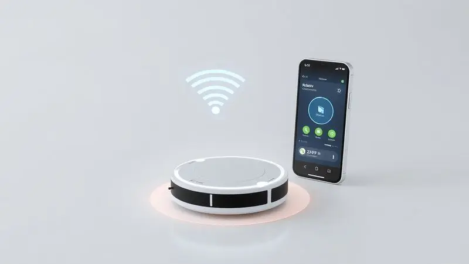
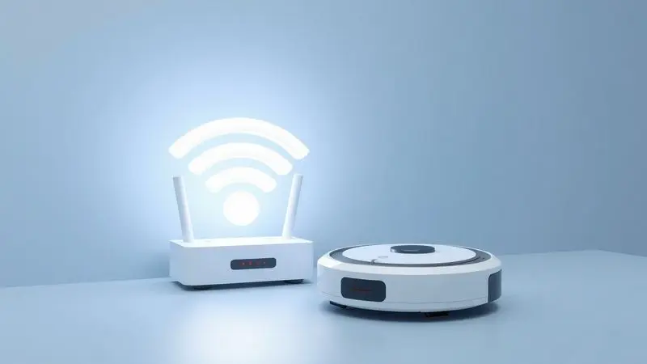

Imagine que você acabou de abrir a caixa do seu novo robô aspirador Xiaomi. Aquele sentimento de empolgação misturado com uma pontadinha de apreensão: será que vai funcionar direito?

Você não comprou apenas um eletrodoméstico, comprou tempo livre, praticidade e a promessa de ter uma casa limpa sem esforço.

Mas essa promessa só se realiza completamente quando seu robô se conecta ao Wi-Fi e entra no mundo inteligente que ele foi projetido para habitar.

<SummaryList products={frontmatter.top_products} />

## Por que Conectar o seu Robô Aspirador Xiaomi ao Wi-Fi?

Conectar seu robô ao Wi-Fi é como dar a ele um superpoder. De repente, ele deixa de ser apenas uma máquina que aspira o chão quando você aperta um botão e se transforma em um parceiro inteligente.

A mágica acontece no seu smartphone: com o aplicativo Mi Home instalado, você pode programar limpezas para horários em que está fora, receber notificações quando o trabalho termina, e até mesmo dar a ordem de começar a aspirar enquanto está sentado no sofá.

Mais do que controle remoto, é controle inteligente. E pense nas atualizações: seu robô evolui, ganha novas funções, fica mais esperto sem que você precise [comprar um modelo novo](/melhor-robo-aspirador-xiaomi/).

## Pré-requisitos: O que Você Precisa Antes de Começar

Antes de mergulhar na configuração, prepare seu kit básico. Você vai precisar de três coisas: o robô carregado e pronto para trabalhar, acesso à sua rede Wi-Fi doméstica (com a senha em mãos), e o aplicativo Mi Home instalado no seu smartphone.

### A Importância da Frequência de 2.4GHz (O Erro nº 1)

<ProductBox 
  title={frontmatter.top_products[0].title} 
  image={frontmatter.top_products[0].image} 
  link={frontmatter.top_products[0].link} 
/>

Este é o detalhe técnico mais crucial que a maioria das pessoas pula. Seu roteador moderno provavelmente emite duas redes: uma rápida 5GHz e outra de 2.4GHz com maior alcance. Os robôs Xiaomi conversam apenas com a segunda. Por quê?

Porque a 2.4GHz tem um superpoder invisível: ela atravessa paredes e mantém a conexão estável enquanto seu robô explora cada canto da casa. É a diferença entre ter controle total ou perder a comunicação quando ele entra no quarto mais distante.

Portanto, antes de começar, certifique-se de que está selecionando a rede correta no seu smartphone.

### Download e Configuração do Aplicativo Mi Home (Xiaomi Home)

O aplicativo Mi Home (também chamado de Xiaomi Home em algumas regiões) é o cérebro da operação. Baixe-o na App Store ou Google Play, crie uma conta rapidamente e faça login.

Quando abrir o app pela primeira vez, ele vai parecer um quarto vazio, pronto para receber seus dispositivos inteligentes. É aqui que a jornada realmente começa.

## Passo a Passo: Conectando o Robô Xiaomi ao Wi-Fi

Com tudo preparado, vamos ao ritual de conexão. É mais simples do que parece, desde que você siga a ordem correta.

### 1. Ativando o Modo de Emparelhamento no Dispositivo

Localize o botão de liga/desliga do seu robô. Em vez de apenas ligá-lo, pressione e segure por alguns segundos até ouvir um bip característico ou ver as luzes piscando em um padrão específico.

Este é o sinal de que ele está dizendo: "Estou pronto para me conectar, procurem por mim". É como colocar o robô no modo descoberta.

### 2. Adicionando o Dispositivo Manualmente no Aplicativo

Volte ao aplicativo Mi Home e toque no ícone "+" no canto superior direito. Na categoria "Limpeza", você encontrará seu [modelo específico de robô aspirador](/robo-aspirador-xiaomi-s10-e-bom/).

Selecione-o e o aplicativo vai guiá-lo por uma pequena dança: ele pedirá para você conectar seu smartphone à rede Wi-Fi do próprio robô (uma rede temporária que ele cria), e depois inserir os dados da sua rede doméstica.

É neste momento que você digita aquela senha que sempre esquece.

### 3. Configurando a Região e Permissões

Pequenos detalhes que fazem grande diferença. O aplicativo pode pedir para você selecionar sua região. Escolha corretamente, pois isso determina quais funcionalidades estarão disponíveis. Em seguida, conceda as permissões necessárias.

Pode parecer intrusivo, mas o aplicativo precisa de acesso à sua localização para funcionar corretamente com os serviços da Xiaomi. É uma troca rápida: você dá uma permissão, ganha um assistente de limpeza completo.

## Solução de Problemas: Por que meu Robô Xiaomi não Conecta?

Às vezes, mesmo seguindo todos os passos, a conexão teima em não acontecer. Não entre em pânico. Os problemas mais comuns têm soluções simples.

### Como Fazer o Reset de Fábrica do Robô Aspirador

Se nada mais funcionar, volte ao início. O [reset de fábrica](/como-resetar-robo-aspirador/) é o botão de reinício universal. Na parte inferior do robô, procure por um pequeno botão ou orifício de reset (muitas vezes é preciso usar um clipe de papel).

Pressione e segure por 5-10 segundos até ouvir um bip de confirmação. Lembre-se: isso apagará todas as configurações, então será como abrir a caixa novamente. Mas às vezes, começar do zero é a solução mais rápida.

### Problemas com Senhas de Wi-Fi e Caracteres Especiais

Seu robô pode ser um gênio da navegação, mas tem uma aversão peculiar: senhas muito complexas. Caracteres especiais como @!, # ou $ podem confundir seu processo de conexão.

Se você está travado nessa etapa, experimente temporariamente simplificar a senha do seu Wi-Fi (apenas letras e números) para fazer a conexão inicial. Depois que estiver tudo funcionando, você pode retornar à sua senha forte original.

Outra opção é criar uma rede convidada simples no seu roteador exclusivamente para dispositivos domésticos.

## Dicas Avançadas para Maximizar o Uso Inteligente

Agora que o básico está dominado, é hora de transformar seu robô de um simples aspirador em um mordomo digital.

### Integrando com Alexa e Google Home

<ProductBox 
  title={frontmatter.top_products[1].title} 
  image={frontmatter.top_products[1].image} 
  link={frontmatter.top_products[1].link} 
/>

Imagine acordar e dizer "Alexa, comece a limpeza da sala" enquanto prepara o café. Ou chegar do trabalho e pedir ao Google Home que verifique se o robô já terminou seu trabalho. Essa integração transforma comandos em conversas.

No aplicativo Mi Home, com o robô já configurado, busque as opções de integração com assistentes. Pode ser necessário ajustar a região do aplicativo para Singapura para maior compatibilidade, e depois vincular sua conta Xiaomi aos serviços da Amazon ou Google.

A partir daí, seu controle por voz estará ativo.

### Criando Agendamentos e Paredes Virtuais

Esta é onde a automação brilha. Em vez de lembrar de ligar o robô, programe-o para limpar automaticamente todas as segundas, quartas e sextas às 10h, quando você já está no trabalho.

E as [paredes virtuais](/como-funciona-o-mapeamento-do-robo-aspirador/) são como feitiços de proteção: desenhe linhas invisíveis no aplicativo para manter o robô longe do tapete da vovó ou do cantinho onde seu gato dorme. É controle tão preciso que parece mágica.

## Manutenção Essencial para Manter a Conectividade Estável

<ProductBox 
  title={frontmatter.top_products[2].title} 
  image={frontmatter.top_products[2].image} 
  link={frontmatter.top_products[2].link} 
/>

Uma conexão perfeita hoje não garante uma conexão perfeita amanhã. Alguns cuidados simples mantêm seu robô sempre online. Mantenha o firmware atualizado através do próprio aplicativo Mi Home.

Essas atualizações não são apenas correções de bugs, são melhorias de desempenho que chegam como presentes digitais. Posicione seu roteador estrategicamente, e se possível, mantenha o robô dentro de um raio de 5 metros para um sinal forte.

Limpe regularmente os sensores do robô: sujeira nos sensores pode afetar a navegação, e um robô perdido é um robô que não responde aos comandos.

## Perguntas Frequentes (FAQ)

### Qual a diferença entre o app Mi Home e o Xiaomi Home?

Basicamente, são o mesmo aplicativo com nomes diferentes para mercados diferentes. O Mi Home é voltado para o mercado asiático, enquanto o Xiaomi Home foi adaptado para o público ocidental, com interfaces e funcionalidades otimizadas para nossas regiões.

Se você [comprou seu dispositivo](/robo-aspirador-xiaomi-s40-e-bom/) no Brasil ou Europa, provavelmente terá melhor experiência com o Xiaomi Home.

### Posso usar o robô sem Wi-Fi?

Sim, mas é como dirigir um carro esportivo apenas na primeira marcha. Você ainda pode ligá-lo manualmente com o botão físico e ele fará seu trabalho básico.

Mas todas as funcionalidades inteligentes, o controle remoto, os agendamentos e as integrações ficarão inacessíveis. O Wi-Fi é o que transforma um eletrodoméstico em um dispositivo inteligente.

### O robô suporta redes 5GHz?

Não. Esta é uma limitação consciente dos dispositivos de automação residencial. As redes 5GHz são mais rápidas para transmitir vídeos e baixar arquivos, mas têm menor alcance e dificuldade em atravessar paredes.

Já a 2.4GHz, mais lenta mas mais persistente, é perfeita para dispositivos como [robôs aspiradores](/robo-aspirador-housekeeper-pro-polishop-e-bom/) que precisam manter conexão estável enquanto se movem por ambientes inteiros.

## Conclusão

Conectar seu [robô aspirador](/robo-aspirador-multi-carbon-ho412-bivolt-e-bom/) Xiaomi ao Wi-Fi é muito mais do que um procedimento técnico. É o ritual de iniciação que transforma uma máquina em um membro inteligente da sua casa.

Ao seguir este guia, você não apenas resolveu um problema de configuração, mas desbloqueou um universo de praticidade. Agora, quando você sair para trabalhar, seu robô pode estar cuidando da limpeza.

Quando chegar cansado em casa, pode dar um comando de voz para que ele comece a trabalhar. E nos finais de semana, pode esquecer completamente que existe poeira no chão. Os erros de conexão, as senhas complicadas, os resets necessários, tudo isso faz parte da jornada.

O resultado final, porém, é transformador: mais tempo para o que realmente importa, menos preocupação com tarefas domésticas, e a satisfação silenciosa de uma casa que se cuida sozinha. Seu futuro mais limpo e inteligente começa com um simples emparelhamento.