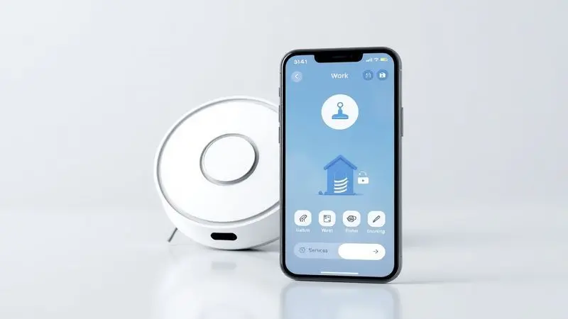
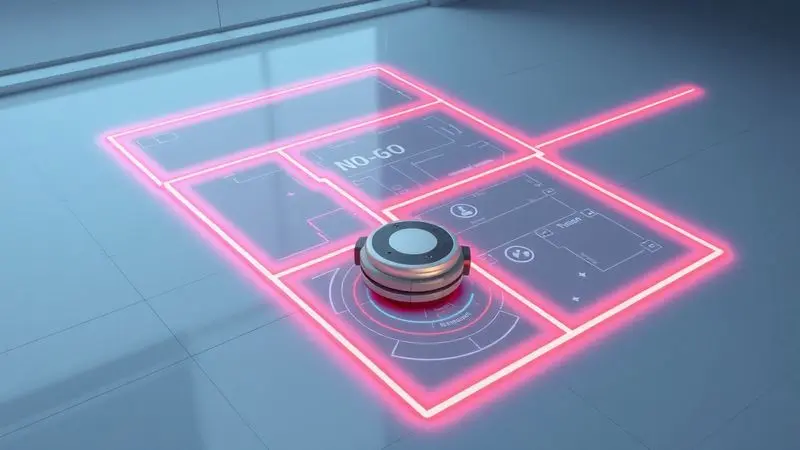

Imagine a cena: você acabou de retirar seu robô aspirador Xiaomi da caixa, todos aqueles aplicativos e luzes piscando parecem uma língua estrangeira, e aquela sensação de 'será que vou conseguir configurar isso?' toma conta. Respire fundo.

Este guia vai transformar essa intimidação inicial em confiança absoluta.

Em menos tempo do que você leva para assistir a um episódio da sua série favorita, seu parceiro de limpeza estará mapeando cada canto da sua casa e obedecendo aos seus comandos como se fosse mágica.

Vamos juntos descomplicar tudo, desde o primeiro toque no aplicativo Mi Home até os segredos das zonas proibidas e a integração perfeita com sua casa inteligente.

<SummaryList products={frontmatter.top_products} />

## Guia Definitivo: Como Configurar Robô Aspirador Xiaomi Passo a Passo (Sem Erros)

<ProductBox 
  title={frontmatter.top_products[0].title} 
  image={frontmatter.top_products[0].image} 
  link={frontmatter.top_products[0].link} 
/>

A beleza da configuração do seu Xiaomi está justamente na sua simplicidade quando você conhece o caminho certo. Comece colocando o robô na base de carregamento e ligando-o - aquela luz que acende é o primeiro sorriso do seu novo ajudante.

Em seguida, enquanto ele recarrega as energias para a aventura pela sua casa, baixe o aplicativo Mi Home no seu smartphone (disponível para Android e iOS).

Abra o app, selecione 'adicionar dispositivo' e encontre [seu modelo](/robo-aspirador-electrolux-erb40-e-bom/) na lista - é como apresentar seu robô ao mundo digital dele.

Um detalhe crucial que pouca gente menciona: muitos modelos conversam apenas com redes Wi-Fi de 2.4GHz. Se sua rede estiver operando em 5GHz, não se preocupe - isso é mais comum do que você imagina e temos a solução.

Enquanto o aplicativo guia você pelas configurações de horários e zonas de limpeza, aproveite para preparar o ambiente, retirando pequenos objetos do chão e garantindo que seu novo parceiro tenha espaço para respirar e aprender.

### O que você precisa antes de começar: Requisitos de Wi-Fi e Preparação

Antes do grande encontro entre seu smartphone e o robô, vamos falar sobre a ponte que os conectará: sua rede Wi-Fi. Pense nisso como o primeiro dia de aula do seu robô - ele precisa da conexão certa para aprender bem.

A maioria dos modelos opera exclusivamente na [frequência 2.4GHz](/como-conectar-robo-aspirador-xiaomi-no-wifi/), então verifique se sua rede oferece essa opção (muitos roteadores modernos trabalham com ambas as frequências simultaneamente).

Agora, faça um teste simples: caminhe até o local onde ficará a base do robô e verifique a força do sinal no seu celular. Se estiver fraco, imagine como será para o robô, que precisa se comunicar constantemente durante a limpeza.

Outro preparativo que faz toda diferença: libere espaço no Mi Home. O aplicativo será a sala de controle, o mapa do tesouro e o diário de bordo do seu ajudante. Com essas pequenas preparações, você está criando as condições perfeitas para um relacionamento sem atritos.

## Passo 1: Instalando e Configurando o Aplicativo Mi Home (Xiaomi Home)

Aqui começa a magia. Baixe o aplicativo Mi Home - é gratuito e encontra-se nas principais lojas de aplicativos. Ao abri-lo pela primeira vez, você não está apenas criando uma conta, está construindo a identidade digital do seu novo ecossistema doméstico.

O processo é intuitivo: siga os passos na tela para registrar seu e-mail e criar uma senha.

### Criando sua Conta e Escolhando a Região Ideal no App

Este momento é mais importante do que parece. Quando você seleciona sua região, não está apenas escolhendo uma localização geográfica, está definindo o DNA do suporte que receberá.

As atualizações de software, novas funcionalidades e até o atendimento técnico são influenciados por essa escolha.

Selecione a região onde você realmente reside - isso garante que seu robô fale a mesma língua que os servidores da Xiaomi, recebendo todas as melhorias e correções específicas para seu mercado.

## Passo 2: Conectando o Robô Aspirador à sua Rede Wi-Fi

Agora vamos ao momento da verdade: apresentar seu robô à internet da casa. No Mi Home, com sua conta criada, selecione 'adicionar dispositivo' e [escolha seu modelo](/melhor-robo-aspirador-xiaomi/) de robô.

O aplicativo vai guiá-lo através de um diálogo visual simples: ele mostrará como colocar o robô em modo de conexão (geralmente mantendo pressionados alguns botões específicos) e então pedirá que você selecione sua rede Wi-Fi e insira a senha.

### Atenção: O problema comum com Redes 5GHz e como resolver

Se você tem uma rede dual-band (que oferece 2.4GHz e 5GHz simultaneamente), aqui está um segredo: muitas vezes, mesmo com as duas opções disponíveis, os dispositivos inteligentes preferem conversar na frequência mais antiga. Não é defeito - é compatibilidade.

Durante a configuração inicial, se possível, conecte seu smartphone temporariamente à rede 2.4GHz para facilitar o 'handshake' entre os dispositivos.

Após a conexão bem-sucedida, você pode voltar sua atenção para outras coisas, sabendo que seu robô agora tem acesso estável à internet da casa.

## Passo 3: O Primeiro Mapeamento e Reconhecimento da Casa

Este é o momento mais fascinante do processo. Ao iniciar o [primeiro mapeamento](/melhor-robo-aspirador-com-mapeamento/), você está abrindo os olhos do seu robô. Deixe-o explorar livremente - ele usará seus sensores a laser e giroscópio para construir um mapa mental preciso dos seus ambientes.

Enquanto ele serpenteia pelos cômodos, identificando paredes, portas e móveis, você está testemunhando em tempo real a criação do manual de navegação pessoal da sua casa.

### Como Criar Barreiras Virtuais e Zonas Proibidas (No-Go Zones)

Agora que seu robô conhece o território, você assume o papel de arquiteto da limpeza. Imagine poder desenhar linhas mágicas no ar que seu robô respeita religiosamente. No Mi Home, com o mapa da sua casa visualizado, selecione a funcionalidade de barreiras virtuais.

Com gestos simples no touchscreen, você cria zonas proibidas em torno daquele vaso de porcelana da vovó, do tapete delicado da sala ou da área de brinquedos das crianças. É como instalar cercas invisíveis que protegem o que é importante para você.

## Personalizando a Limpeza: Modos de Sucção e Agendamentos Automáticos

Seu robô não é apenas inteligente, é adaptável. Nos dias em que as crianças fazem festa e os biscoitos se espalham pelo chão, ele pode operar no modo turbo - uma sucção potente que enfrenta qualquer desafio.

Para a manutenção diária, o modo silencioso mantém a paz enquanto remove discretamente a poeira.

Mas a verdadeira revolução vem com os agendamentos: imagine programar limpezas para horários específicos, como toda segunda, quarta e sexta às 10h, quando a casa está vazia, ou todos os dias às 14h, logo após o almoço. Você literalmente programa o conforto.

## Como Conectar o Robô Xiaomi à Alexa ou Google Home

Chegamos ao nível máximo de conveniência: o controle por voz. O processo é tão simples que parece brincadeira: primeiro, verifique se tanto seu robô quanto seu assistente de voz (Alexa ou Google Home) estão na mesma rede Wi-Fi.

No aplicativo do seu assistente, procure a opção 'adicionar habilidade' ou 'descobrir dispositivos' e busque por Xiaomi ou Mi Home. Conecte sua conta do Mi Home quando solicitado - são apenas alguns cliques.

A partir desse momento, comandos como 'Alexa, peça ao robô para limpar a cozinha' ou 'Ok Google, inicie a limpeza em todo o apartamento' se tornam parte do seu vocabulário doméstico.

## Manutenção Essencial: Como Limpar Sensores, Filtros e Escovas

<ProductBox 
  title={frontmatter.top_products[1].title} 
  image={frontmatter.top_products[1].image} 
  link={frontmatter.top_products[1].link} 
/>

Todo relacionamento duradouro exige cuidado, e com seu [robô aspirador](/robo-aspirador-electrolux-erb20-e-bom/) não é diferente. Os sensores são os olhos do seu ajudante - limpe-os semanalmente com um pano macio levemente umedecido (álcool isopropílico é ideal) para que ele nunca se perca.

Os filtros, pulmões do sistema, precisam de atenção especial: limpe-os semanalmente batendo suavemente para remover a poeira, mas nunca os lave com água. A cada três meses, considere substituí-los - é como trocar o filtro de ar do seu carro.

As escovas são os pés que percorrem sua casa todos os dias. Semanalmente, remova-as e libere os cabelos e fios que se acumulam. Essa rotina de 5 minutos garante que seu robô mantenha o desempenho do primeiro dia por anos.

Lembre-se: cuidado preventivo evita visitas ao técnico.

## Solução de Problemas Comuns (FAQ)

Quando algo não vai bem, respire fundo e siga esta lógica de detetive: comece verificando o básico. O robô está carregado? Os sensores estão limpos? As rodas giram livremente sem fios enrolados? Na maioria dos casos, a solução está nestes checkpoints simples.

Se ele parar de responder, tente reiniciá-lo - às vezes, todos nós precisamos de [um reset](/como-resetar-robo-aspirador/).

### Como Resetar o Robô Aspirador Xiaomi para o Padrão de Fábrica?

Se você precisa começar do zero (talvez esteja se mudando ou transferindo o robô para outra pessoa), o reset é sua ferramenta. Localize o botão de liga/desliga na parte inferior, pressione e segure por cerca de 10 segundos até ouvir um apito característico.

Aguarde o reinício completo. Importante: este processo apaga todos os seus mapas e configurações, então use apenas quando necessário - é o equivalente a formatar um computador.

## Conclusão

Lembre-se daquela sensação inicial de intimidação? Agora substitua-a pela confiança de quem domina completamente uma tecnologia que transforma o dia-a-dia.

Seu [robô aspirador Xiaomi](/robo-aspirador-xiaomi-2c-2700pa-e-bom/) não é mais um aparelho misterioso, e sim um parceiro que entende sua rotina, respeita seus espaços e trabalha enquanto você vive.

Desde o simples toque no celular para iniciar uma limpeza pontual até a sofisticação dos agendamentos automáticos que mantêm sua casa sempre pronta para receber visitas, você agora controla o bem-estar do seu lar com uma naturalidade que parece sempre ter existido.

A verdadeira magia acontece quando você para de pensar na configuração e simplesmente aproveita os resultados: acordar com os pisos limpos, chegar em casa após um dia cansativo e encontrar tudo impecável, ou permitir que as crianças brinquem no chão sem preocupações.

Este é o presente que a automação inteligente oferece - tempo de qualidade, paz de espírito e um ambiente mais saudável para quem você ama. Seu único trabalho agora? Aproveitar cada minuto extra que seu novo ajudante lhe devolveu.