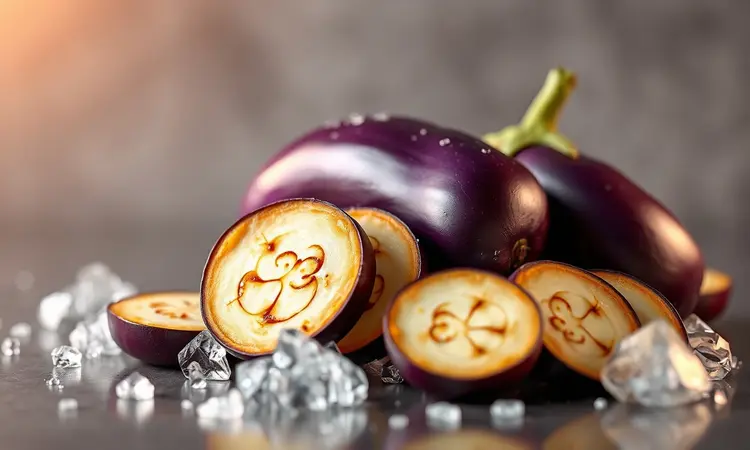
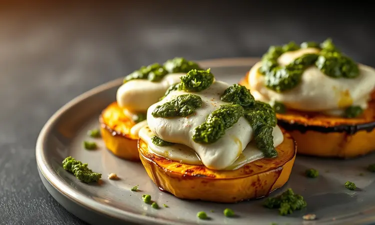
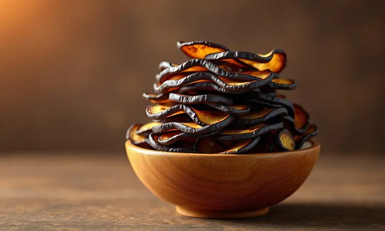
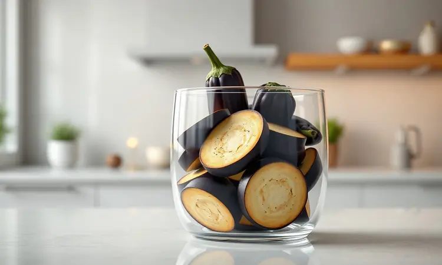

Fazer legumes na fritadeira elétrica é sinônimo de praticidade, mas a berinjela costuma gerar dúvidas: como deixá-la suculenta sem ficar amarga ou encharcada de óleo?

Se você busca uma alternativa saudável, rápida e econômica para o seu almoço ou petisco, este guia é para você.

Vou te mostrar o segredo para preparar a berinjela perfeita na airfryer, com 5 variações que vão do básico ao gourmet, garantindo crocância e sabor em poucos minutos.

<SummaryList products={frontmatter.top_products} />

## Por que fazer berinjela na airfryer é a melhor escolha para sua dieta?

Você já sentiu aquela vontade de comer algo crocante, mas o peso da fritura tradicional te segura? A airfryer resolve esse dilema de forma engenhosa. Ela transforma a berinjela em algo que parece ter saído de um óleo quente, mas usando apenas um fio de azeite.

O interior fica macio como um purê, enquanto a superfície adquire aquela crocância irresistível que encanta os sentidos.

Pense na praticidade: em vez de ficar vigiando uma frigideira cheia de óleo, você programa a temperatura e pode cuidar de outras coisas. Em 15 minutos, tem um acompanhamento saudável pronto.

E quando falamos de saúde, a berinjela oferece fibras que saciam, antioxidantes que protegem suas células e nutrientes que ajudam a equilibrar o colesterol.

Não é apenas um método de preparo: é uma forma de transformar uma simples verdura em um alimento que cuida de você enquanto agrada seu paladar.

## O Segredo de Ouro: Como tirar o amargor da berinjela antes do preparo

Você já preparou uma berinjela e sentiu aquele gosto amargo que arruína o prato inteiro? Esse é o principal obstáculo, mas também tem uma solução simples que muda tudo. O segredo está em uma técnica antiga, mas que nunca falha: o salgar.

Comece cortando sua berinjela da forma que preferir. Em seguida, espalhe uma camada generosa de sal sobre todos os pedaços e deixe descansar por 30 minutos. Esse tempo permite que a berinjela libere o líquido amargo que carrega naturalmente.

Quando você voltar, encontrará gotículas de água na superfície. É esse líquido que carrega o amargor embora.

Lave bem em água corrente para remover todo o excesso de sal, seque com um pano limpo ou papel toalha, e pronto. Sua berinjela está transformada, prometendo suavidade e sabor em cada mordida.

Esse passo único é o alicerce de todas as receitas que vou te mostrar a seguir.

## 1. Berinjela em Rodelas Simples e Temperada (O básico perfeito)

<ProductBox 
  title={frontmatter.top_products[0].title} 
  image={frontmatter.top_products[0].image} 
  link={frontmatter.top_products[0].link} 
/>

Se você tem pressa mas não quer abrir mão do sabor, comece aqui. Após seguir o segredo de ouro e tirar o amargor, corte sua berinjela em fatias de 1 a 2 cm de espessura.

A espessura ideal é suficiente para garantir que o interior fique cremoso enquanto a parte externa dourar.

Tempere com um fio de azeite extra virgem (só o suficiente para brilhar), uma pitada de sal e pimenta do reino moída na hora. A primeira mordida revela a magia: crocância por fora, cremosidade por dentro.

Programe sua airfryer a 200°C por 10 a 15 minutos, e você terá em mãos a base perfeita para qualquer refeição.

Do almoço rápido ao acompanhamento de um jantar especial, essas rodelas versáteis aceitam desde a simplicidade até complementos mais elaborados como queijo ralado ou ervas frescas.

### Como cortar para obter a textura ideal

<ProductBox 
  title={frontmatter.top_products[1].title} 
  image={frontmatter.top_products[1].image} 
  link={frontmatter.top_products[1].link} 
/>

O corte faz toda a diferença entre uma berinjela borrachuda e outra perfeita. Para rodelas, pense em duas moedas de um real empilhadas. Para cubos, imagine dados de brincar.

Essa espessura mágica permite que o calor da airfryer trabalhe em camadas: primeiro forma uma crosta externa dourada, depois cozinha suavemente o interior.

Se você preferir pular o salvamento prévio (embora eu recomende sempre), escolha berinjelas que pareçam jovens: casca brilhante, firme ao toque, sem manchas.

Mas lembre-se que mesmo as mais frescas ganham com a técnica do salgar, que também ajuda na desidratação inicial, criando espaço para a crocância se formar.

Durante o cozimento, uma pausa na metade do tempo para virar os pedaços garante que todos os lados recebam a mesma atenção. O resultado é consistência em cada porção.

## 2. Berinjela Empanada na Airfryer: Crocância máxima sem fritura

Agora vamos para o território do irresistível. Imagine a textura crocante da berinjela empanada, mas sem aquele arrependimento pós-fritura.

Aqui, o processo de salgar ganha nova importância, pois uma berinjela úmida sob o empanado cria uma barreira que impede a crocância perfeita.

Após secar bem seus pedaços de berinjela, mergulhe-os no empanado de sua preferência. O azeite faz um trabalho discreto mas essencial: ele ativa o processo de dourar com naturalidade. Uma sugestão?

Comece com 180°C por 12 minutos, então aumente para 200°C por mais 3-4 minutos para finalizar o dourado.

O que você obtém é uma experiência que engana os sentidos: parece frito, tem a crocância de frito, mas seu corpo agradece por ser tão mais leve. Perfeito para petiscos em família ou para impressionar visitas com uma opção que parece indulgente mas é consciente.

### O truque do azeite para dourar por igual

<ProductBox 
  title={frontmatter.top_products[2].title} 
  image={frontmatter.top_products[2].image} 
  link={frontmatter.top_products[2].link} 
/>

O azeite extra virgem na airfryer não é apenas ingrediente: é parceiro. Ele cumpre duas funções simultaneamente. Primeiro, conduz calor de forma uniforme, garantindo que nenhuma parte fique pálida enquanto outras já estão douradas.

Segundo, ele carrega o sabor dos temperos diretamente para dentro da berinjela.

A aplicação é simples: depois de bem seca, misture seus pedaços de berinjela com um fio generoso de azeite, usando as mãos para garantir que cada superfície receba seu toque. É essa cobertura sutil que transforma o processo de cozimento em um douramento harmonioso.

A temperatura baixa inicial (por volta de 160°C) desidrata suavemente, preparando o terreno. Quando você aumenta para 180°C ou 200°C, o azeite já distribuído trabalha para criar uma cor uniforme e convidativa.

## 3. Medalhão de Berinjela com Queijo e Pesto (Estilo Gourmet)

Chegou a hora de transformar a humilde berinjela em protagonista de mesa. Este medalhão é para aqueles momentos em que você quer algo mais que um acompanhamento: quer uma experiência. Comece com rodelas mais grossas, cerca de 2,5 cm, que suportarão as camadas de sabor.

Após o processo de salgar e cozinhar até ficarem macias (mas ainda firmes), vem a montagem. Imagine camadas: berinjela, uma colher do seu pesto caseiro preferido, uma fatia de queijo que derrete sedosamente (muçarela funciona maravilhas). Repita.

O retorno à airfryer por apenas 4-5 minutos tem um único propósito: fazer o queijo fluir entre as camadas, unindo todos os elementos em um abraço cremoso. Sirva imediatamente e observe como algo tão simples quanto berinjela se torna centro das atenções.

## 4. Antepasto de Berinjela na Airfryer (Pasta de berinjela rápida)

Às vezes, a berinjela brilha mais como ingrediente do que como estrela principal. Este antepasto é prova disso. Cubos de berinjela, temperados com azeite, sal, pimenta e um toque de ervas (orégano acena, manjericão sorri), vão à airfryer a 200°C por 15 minutos.

A mágica acontece quando você os retira: a airfryer concentrou os sabores, caramelizou levemente as bordas, mas manteve a textura. Misture com cebola roxa picada finamente, alho amassado e um fio de vinagre que corta a doçura natural.

O resultado? Uma pasta que espalha em torradas, enriquece saladas ou acompanha carnes. É a berinjela em sua forma mais conversável, pronta para se misturar e melhorar tudo ao seu redor.

## 5. Chips de Berinjela: O snack saudável e low carb

E se eu te disser que você pode ter chips crocantes enquanto mantém sua alimentação consciente? A airfryer torna possível. A chave está no corte: fatias tão finas que quase deixam passar a luz.

Tempere com parcimônia (o sal se concentra em fatias finas) e um fio de azeite. A 180°C por 15-20 minutos, com mexidas a cada 5 minutos, elas se transformam de pedaços úmidos em lascas douradas e crocantes.

Experimente variar: páprica defumada para um toque barbecue, alecrim seco para um aroma mediterrâneo, ou apenas sal marinho e pimenta para a pureza do sabor. É o snack que não pede desculpas, apenas segundas porções.

## Tabela Prática: Tempo e Temperatura para cada tipo de corte

Guie-se por estes números como um GPS culinário. Para chips (fatias finas), 200°C por 15-20 minutos, mexendo na metade. Pedaços médios ficam perfeitos a 180°C por 20-25 minutos.

Cubos maiores pedem 200°C por até 30 minutos, tempo suficiente para desenvolver sabor profundo.

Lembre-se sempre do pré-aquecimento. Esses 3-5 minutos extras fazem a diferença entre um cozimento desigual e uma textura uniforme. Esta tabela é seu atalho para resultados consistentes, independentemente do formato escolhido.

## 3 Erros comuns que deixam a berinjela murcha ou borrachuda

<ProductBox 
  title={frontmatter.top_products[3].title} 
  image={frontmatter.top_products[3].image} 
  link={frontmatter.top_products[3].link} 
/>

Vamos evitar frustrações. O primeiro erro é ignorar a umidade. A berinjela é esponja natural, e sem o processo de salgar, ela libera água durante o cozimento, criando um ambiente úmido que impede a crocância.

O segundo é o corte fino demais. Fatias que parecem papel podem queimar antes de cozinhar, resultando em pedaços secos e sem graça. Mantenha a espessura que discutimos anteriormente.

O terceiro é a temperatura tímida. A airfryer precisa de calor para trabalhar sua magia. Temperaturas muito baixas cozinham sem dourar, deixando a berinjela com textura de borracha. Confie nos números da tabela acima e sua airfryer responderá com resultados dourados.

## Perguntas Frequentes (FAQ)

### Pode colocar a casca da berinjela na airfryer?

Absolutamente. A casca é onde se concentram muitos dos nutrientes e fibras da berinjela. Quando preparada corretamente, ela se transforma na parte mais crocante e saborosa.

O processo de salgar e o cozimento em alta temperatura suavizam qualquer amargor potencial, revelando textura e sabor que você não quer perder. Em vez de descartar, celebre essa parte que traz cor e nutrientes ao seu prato.

### Como guardar a berinjela assada para não perder a textura?

O segredo está no resfriamento completo. Deixe sua berinjela descansar até atingir temperatura ambiente antes de armazenar. Use recipientes herméticos que impeçam a entrada de ar, o principal inimigo da crocância. Na geladeira, ela mantém sua qualidade por 3 a 5 dias.

Para reaquecer, evite o micro-ondas que torna tudo mole. Prefira uma rápida passada na airfryer (3-4 minutos a 180°C) ou em uma frigideira antiaderente em fogo médio. É o suficiente para recuperar a crocância original, como se tivesse acabado de sair do forno.

## Conclusão

Preparar berinjela na airfryer vai além de seguir receitas: é domar um ingrediente caprichoso para revelar sua melhor versão.

Da simplicidade das rodelas temperadas à sofisticação dos medalhões com queijo, cada variação prova que saúde e sabor podem caminhar juntos sem concessões.

Lembre-se do segredo de ouro (o salvamento prévio) como seu aliado contra o amargor. Confie nos tempos e temperaturas como guias, não como regras imutáveis. Sua airfryer e sua criatividade farão o resto.

Agora você tem em mãos não apenas cinco receitas, mas um repertório que transforma a berinjela de verdura esquecida em protagonista de suas refeições. Experimente, adapte, descubra suas variações preferidas.

O que começa como um experimento na cozinha pode se tornar um hábito saudável que seus sentidos e seu corpo agradecem. Sua airfryer está esperando para mostrar do que ela e a berinjela são capazes juntas.