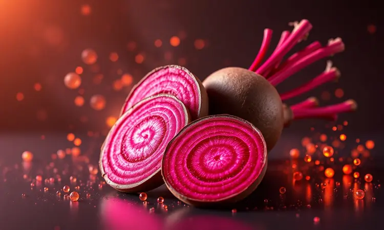
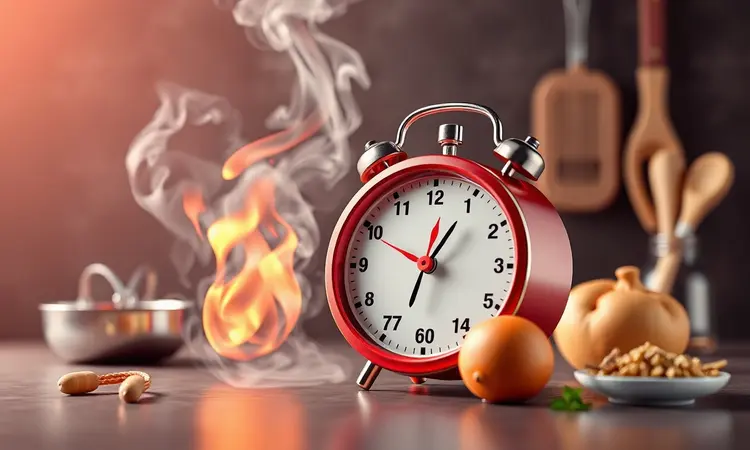
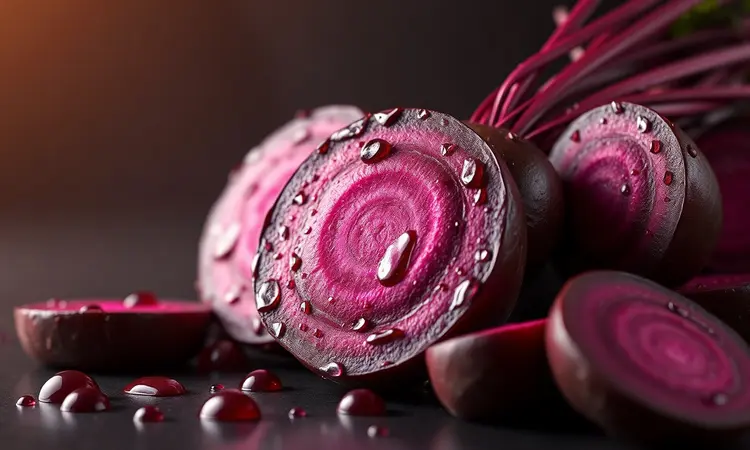

Cozinhar beterraba pode parecer um processo demorado e, muitas vezes, uma verdadeira bagunça na cozinha devido à sua cor intensa. No entanto, este vegetal é uma potência nutricional que merece estar no seu cardápio semanal.

Se você quer saber como obter a textura perfeita, preservar todos os nutrientes e ainda descobrir o segredo para uma beterraba crocante na Airfryer, você está no lugar certo.

Neste guia completo, vou te mostrar desde o método tradicional na pressão até técnicas modernas que mantêm o sabor e a saúde no prato.

<SummaryList products={frontmatter.top_products} />

## Por que a Beterraba é Essencial na Sua Dieta? (Benefícios e Nutrição)

Imagine sentir a energia do seu corpo funcionando melhor, com mais disposição para o dia a dia. Isso é o que a beterraba pode oferecer.

Rica em vitamina C, ácido fólico e minerais como potássio e manganês, ela trabalha silenciosamente pela sua saúde cardiovascular, ajudando a reduzir a pressão arterial e melhorar a circulação sanguínea.

Mas o verdadeiro tesouro está nos antioxidantes, que combatem os radicais livres e reduzem a inflamação no corpo quase como um escudo protetor natural. E aquela sensação de satisfação após uma refeição?

É graças às fibras, que auxiliam na digestão e proporcionam saciedade duradoura. Incorporá-la em saladas, sucos ou pratos cozidos é como fazer um investimento diário em sua saúde.

## Preparo Inicial: Como Lavar e Preparar a Beterraba sem Sujeira

<ProductBox 
  title={frontmatter.top_products[0].title} 
  image={frontmatter.top_products[0].image} 
  link={frontmatter.top_products[0].link} 
/>

Antes de qualquer técnica de cozimento, vamos resolver o maior incômodo: a possível bagunça. O segredo começa com uma simples tigela de água fria. Lave as beterrabas ali mesmo, mexendo suavemente para soltar a terra sem espirrar pela pia.

Com uma escova de vegetais, esfregue as superfícies sob água corrente, mantendo tudo controlado. Corte as raízes e folhas, deixando cerca de 2 a 3 cm na raiz, pois essa pequena distância faz toda a diferença para preservar os nutrientes durante o cozimento.

Para evitar manchas nas mãos, use luvas descartáveis, e para proteger a tábua, forre com papel toalha. Melhor ainda: corte as beterrabas diretamente em uma tigela. O suco que eventualmente escorrer fica contido, e você ganha praticidade e limpeza.

Essa atenção inicial muda completamente sua experiência na cozinha.

## Como Cozinhar Beterraba na Panela de Pressão: O Guia de Tempo Rápido

<ProductBox 
  title={frontmatter.top_products[1].title} 
  image={frontmatter.top_products[1].image} 
  link={frontmatter.top_products[1].link} 
/>

Quando o tempo é curto mas você não quer abrir mão da nutrição, a panela de pressão se torna sua melhor aliada. O milagre aqui são de 8 a 20 minutos após a panela pegar pressão para beterrabas pequenas, ou de 15 a 30 minutos para as maiores.

Reserve a preocupação de descascá-las para depois; cozinhá-las com casca preserva o sabor e os nutrientes de maneira impressionante.

Passado o tempo indicado, desligue o fogo e deixe a pressão sair naturalmente antes de abrir a panela. Essa paciência se traduz em beterrabas que praticamente se descascam sozinhas.

Se você está começando, um garfo será seu melhor amigo para verificar o ponto: ao espetar, deve encontrar resistência leve, como se a beterraba dissesse "estou pronta".

A potência da sua panela pode pedir ajustes finos, mas uma vez dominado, esse método te dará praticidade semanal.

## Cozimento ao Vapor: A Melhor Técnica para Preservar Nutrientes e Cor

<ProductBox 
  title={frontmatter.top_products[2].title} 
  image={frontmatter.top_products[2].image} 
  link={frontmatter.top_products[2].link} 
/>

Se seu objetivo é extrair o máximo de nutrientes enquanto mantém aquela cor vibrante que faz qualquer prato parecer mais apetitoso, o vapor é sua resposta.

Ao evitar o contato direto com a água, essa técnica preserva vitaminas e minerais sensíveis, como o ácido fólico e os antioxidantes que tanto beneficiam seu corpo.

Imagine cada pedaço de beterraba recebendo um banho de vapor suave que mantém sua essência intacta, sem lixiviar para a água o que deveria estar no seu prato.

## Praticidade: Como Cozinhar Beterraba no Micro-ondas em Minutos

<ProductBox 
  title={frontmatter.top_products[3].title} 
  image={frontmatter.top_products[3].image} 
  link={frontmatter.top_products[3].link} 
/>

Para dias em que cada minuto conta, o micro-ondas revela sua magia. Basta lavar as beterrabas, fazer alguns furinhos na casca para evitar surpresas, e colocá-las em um recipiente próprio com algumas colheres de sopa de água.

Tampe, mas deixe uma pequena abertura para o vapor circular.

Em questão de minutos, você terá o resultado: beterrabas inteiras ficam prontas em 10 a 15 minutos, enquanto pedaços menores economizam ainda mais tempo, com 6 a 10 minutos. Faça pausas para conferir o ponto com um garfo.

Quando ele entrar sem resistência, você descobriu como transformar pressa em praticidade nutritiva.

## Beterraba na Airfryer: Por Que este Método é Considerado o Mais Saudável?

<ProductBox 
  title={frontmatter.top_products[4].title} 
  image={frontmatter.top_products[4].image} 
  link={frontmatter.top_products[4].link} 
/>

Aqui está onde a modernidade encontra a nutrição de forma brilhante. A Airfryer não apenas reduz o uso de óleo, como mantém as vitaminas e minerais que tradicionalmente se perdiam na água do cozimento.

Os nitratos da beterraba, aqueles compostos que relaxam seus vasos sanguíneos e melhoram a circulação, permanecem mais concentrados. Os antioxidantes que previnem doenças continuam trabalhando a seu favor.

A única atenção necessária é monitorar o ponto. Passar do tempo pode deixá-la seca e comprometer aquele sabor adocicado natural que faz toda a diferença.

Mas quando bem executada, a beterraba na Airfryer oferece uma experiência sensorial completa: crocância externa, maciez interna e nutrição preservada.

### Passo a Passo: Beterraba Assada na Airfryer (Macia e Saborosa)

<ProductBox 
  title={frontmatter.top_products[5].title} 
  image={frontmatter.top_products[5].image} 
  link={frontmatter.top_products[5].link} 
/>

Lave bem a beterraba, descasque e corte em cubos uniformes. Tempere com azeite, sal e pimenta-do-reino como se estivesse preparando um tesouro culinário. Preaqueça sua Airfryer a 180°C e distribua os cubos na cesta sem sobreposição.

Os próximos 15 a 20 minutos são mágicos: mexa na metade do tempo para garantir que cada lado receba o calor igualmente.

O garfo será seu guia final. Quando encontrar resistência leve ao espetar, você terá descoberto o equilíbrio perfeito entre praticidade e sabor.

O tamanho das beterrabas e a potência da sua Airfryer podem pedir ajustes pessoais, mas essa jornada de descoberta faz parte do prazer culinário.

### Receita de Beterraba-Palha Crocante: O Crouton Saudável para sua Salada

<ProductBox 
  title={frontmatter.top_products[6].title} 
  image={frontmatter.top_products[6].image} 
  link={frontmatter.top_products[6].link} 
/>

Transforme suas saladas com esse crouton nutritivo que entrega crocância sem culpa. Rale uma beterraba crua em fios finos e remova o excesso de umidade com papel toalha como um chef profissional.

Tempere com azeite, sal e, se o paladar pedir, acrescente ervas secas ou pimenta-do-reino para personalizar.

No forno em temperatura alta ou na Airfryer a 180°C, distribua os fios em uma única camada. Essa atenção garante crocância uniforme, como se cada fio recebesse seu momento especial.

O tempo varia, mas vale cada minuto de espera quando você experimenta o resultado: uma explosão de textura que eleva qualquer salada de comum para extraordinária.

## Tabela de Tempo de Cozimento: Panela Comum vs. Pressão vs. Airfryer

Planejar sua semana fica mais fácil quando você domina os tempos. Na panela comum, conte com 40 a 60 minutos em água fervente. A pressão acelera essa história para 15 a 20 minutos, entregando maciez e sabor concentrados.

Já a Airfryer, com seus 25 a 30 minutos a 200°C, oferece uma experiência diferente: textura única que mantém o sabor natural quase intacto.

Cada método tem sua personalidade. A panela comum é como uma conversa demorada e prazerosa. A pressão é o amigo eficiente que resolve problemas rapidamente. A Airfryer é o toque moderno que preserva essências. Escolha conforme seu humor e tempo disponível.

## Dicas de Especialista: Como Manter a Cor Vibrante e Descascar Facilmente

Aquela cor intensa que atrai o olhar pode ser mantida com dois segredos simples: água fria e um toque de vinagre ou suco de limão durante o cozimento.

Essa dupla age como um fixador natural, preservando a aparência apetitosa que faz você querer comer com os olhos primeiro.

Para descascar sem drama, use luvas e cozinhe as beterrabas inteiras e com casca. Após o cozimento, a pele se solta quase como por mágica, poupando esforço e mantendo a cor mais intensa. São detalhes que transformam uma tarefa em um ritual agradável.

## Como Armazenar e Congelar a Beterraba Cozida para a Semana

<ProductBox 
  title={frontmatter.top_products[7].title} 
  image={frontmatter.top_products[7].image} 
  link={frontmatter.top_products[7].link} 
/>

Organize sua alimentação saudável com esse sistema prático. Na geladeira, guarde a beterraba cozida em recipientes herméticos, onde pode durar até uma semana. Para prolongar ainda mais, envolva pedaços cortados em papel toalha antes de armazenar.

Essa barreira extra mantém a textura perfeita para quando você precisar.

Para o congelamento, espere esfriar completamente após o cozimento. Essa paciência evita a formação de água no recipiente. Em sacos próprios para congelamento, espalhe os pedaços em camada fina antes de levar ao freezer, onde podem durar até 8 meses.

Um detalhe importante: cozinhe "al dente" antes de armazenar, pois após descongelar ela tenderá a uma textura mais macia. Rotule com a data e tenha sempre à mão um ingrediente que transforma refeições simples em nutritivas.

## Perguntas Frequentes (FAQ) sobre o Cozimento de Beterraba

"Qual a melhor forma de cozinhar beterraba?" Depende do que você busca: nutrição máxima pede vapor ou Airfryer, praticidade extrema pede micro-ondas, tradição pede panela comum, e pressa inteligente pede panela de pressão.

Cada método revela uma faceta diferente deste vegetal versátil.

"Quanto tempo leva?" Varie conforme sua escolha: 40 a 60 minutos na panela comum, 15 a 20 minutos na pressão, 25 a 30 minutos na Airfryer, ou apenas 6 a 15 minutos no micro-ondas.

"Devo descascar antes?" Não precisa. Cozinhar com casca facilita o manuseio posterior e preserva mais sabor e nutrientes. A pele sai facilmente após o cozimento, como se estivesse esperando pelo momento certo.

## Conclusão

Cozinhar beterraba deixa de ser uma tarefa complicada quando você descobre que cada método é uma oportunidade diferente.

Da praticidade do micro-ondas aos dias mais corridos à sofisticação da Airfryer para momentos especiais, passando pela eficiência da panela de pressão e pela nutrição máxima do vapor.

O que antes parecia bagunça e tempo perdido se transforma em uma jornada de descobertas culinárias.

Você não está apenas preparando um vegetal. Está dominando técnicas que preservam nutrientes essenciais para sua saúde, descobriando sabores que variam conforme o preparo, e ganhando autonomia na cozinha.

A beterraba deixa de ser aquele ingrediente que você compra por obrigação nutricional e se torna um aliado versátil, cheio de possibilidades.

Comece pelo método que mais se adapta ao seu estilo de vida hoje. Experimente, ajuste, descubra suas preferências. Em pouco tempo, incluir beterraba no seu cardápio será tão natural quanto escolher qual cor vai vestir pela manhã.

Agora é sua vez: qual técnica você vai experimentar primeiro?