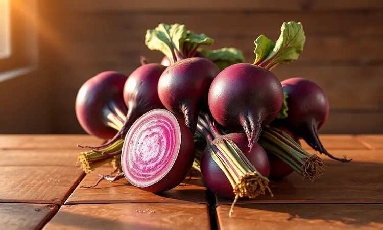
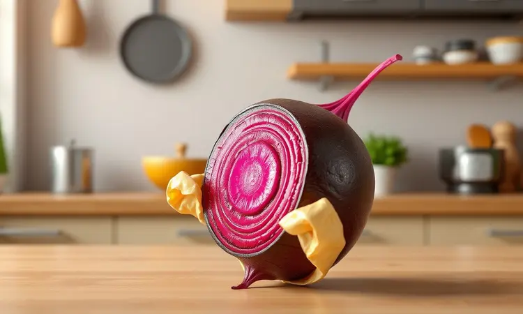
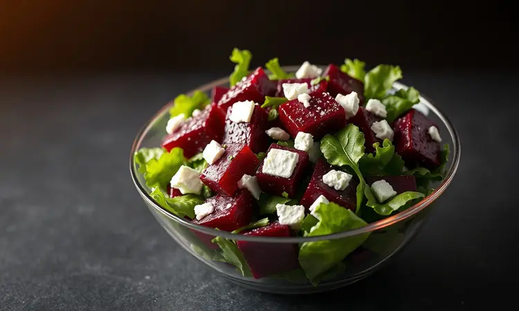

Você já se perguntou por que a beterraba de restaurante costuma ser muito mais saborosa e macia do que a feita em casa? O segredo está não apenas nos ingredientes, mas na técnica que transforma essa raiz humilde em uma experiência gastronômica.

Assar beterrabas no papel-alumínio vai muito além de evitar sujeira no forno, é o método que concentra os açúcares naturais e intensifica aquele sabor terroso que tanto amamos.

Imagine poder replicar em casa aquela textura cremosa por dentro e levemente caramelizada que só os chefs conseguem? É exatamente isso que você vai dominar hoje.

Neste guia completo, você vai descobrir cada passo do processo, desde a escolha da beterraba perfeita até os truques de mestre para descascar sem manchar as mãos.

Prepare-se para elevar o nível dos seus acompanhamentos com uma técnica simples que transforma completamente o resultado final.

<SummaryList products={frontmatter.top_products} />

## Por que assar a beterraba no papel-alumínio é melhor do que cozinhar?

Quando você cozinha beterraba na água, parte do sabor e dos nutrientes simplesmente escorrem pelo ralo. É como se a essência do vegetal se diluísse, deixando apenas uma versão pálida do que poderia ser. Assar no papel-alumínio muda completamente essa dinâmica.

O papel cria uma câmera de vapor que envolve cada pedaço, cozinhando de forma uniforme enquanto mantém todos os sucos naturais presos.

O resultado é uma beterraba que mantém sua cor vibrante, sua textura firme mas macia, e um sabor intensificado. Sem aquela textura encharcada que tanto decepciona. Além dessa transformação sensorial, você também preserva muito mais nutrientes.

Os antioxidantes e vitaminas que fazem da beterraba um superalimento ficam concentrados, não dissolvidos. Você não está apenas preparando um acompanhamento saboroso, está extraindo o máximo benefício dessa raiz poderosa.

## Como escolher as melhores beterrabas para assar

O sucesso começa antes mesmo de acender o forno. Segure uma beterraba na mão, sinta seu peso. As melhores são firmes e pesadas para seu tamanho, como se estivessem cheias de doçura esperando para ser revelada.

Evite qualquer uma com manchas escuras ou áreas moles que cedem ao toque. A casca deve ter uma cor vibrante, quase que pedindo para ser transformada.

Preste atenção no tamanho também. Beterrabas pequenas e médias são suas aliadas ideais, mais doces e com textura mais cremosa após o cozimento. As muito grandes podem desenvolver uma fibrosidade que não combina com a maciez que buscamos.

Se você encontrar beterrabas com as folhas ainda presas, considere isso uma bênção: folhas verdes e frescas são o selo de qualidade de uma beterraba recém-colhida.

Sempre que possível, opte por opções orgânicas. Você evita resíduos de pesticidas e experimenta um sabor mais puro, mais autêntico. É a diferença entre um ingrediente e uma experiência.

## Papel-Alumínio de Qualidade: O aliado essencial na cozinha

<ProductBox 
  title={frontmatter.top_products[0].title} 
  image={frontmatter.top_products[0].image} 
  link={frontmatter.top_products[0].link} 
/>

Você já passou pela frustração de embalar uma beterraba no papel-alumínio e, ao virar o pacotinho no forno, sentir que ele rasgou? O vapor escapa, a beterraba resseca, e toda a magia se perde. Isso acontece porque nem todo papel-alumínio é criado igual.

Um papel de qualidade, com espessura adequada (aqueles chamados de 'heavy duty'), é seu seguro contra decepções culinárias. Ele resiste às altas temperaturas do forno sem rasgar, mantendo o vapor perfeitamente selado.

Algumas versões ainda têm revestimento antiaderente, que não só facilita a limpeza mas também garante que suas beterrabas não grudem, mantendo toda a crosta saborosa intacta.

O investimento em um bom papel-alumínio é mínimo comparado ao impacto que ele tem no resultado final. É a diferença entre uma beterraba suculenta e concentrada e uma versão seca e sem graça.

## Receita Passo a Passo: Beterraba Assada Perfeita

Agora que você tem os ingredientes certos e o equipamento adequado, vamos à prática que transforma teoria em sabores inesquecíveis.

### Ingredientes necessários e preparo inicial

Comece com o básico: beterrabas frescas, azeite de oliva de boa qualidade (esse vai fazer diferença no sabor final), sal marinho e pimenta-do-reino moída na hora. Lave cada beterraba cuidadosamente para remover qualquer resíduo de terra.

Aqui vem o primeiro segredo: não descasque ainda. A casca protege a polpa durante o cozimento e será removida facilmente depois.

Seque bem as beterrabas, pincele generosamente com azeite e tempere com sal e pimenta. Essa camada de azeite não apenas ajuda na transmissão de calor, mas também cria uma leve caramelização na casca que adiciona complexidade ao sabor final.

### Assadeiras ideais para distribuição uniforme de calor

<ProductBox 
  title={frontmatter.top_products[1].title} 
  image={frontmatter.top_products[1].image} 
  link={frontmatter.top_products[1].link} 
/>

A escolha da assadeira pode fazer toda a diferença no resultado final. Você quer algo que distribua o calor de forma uniforme, sem pontos quentes que cozinhem desigualmente suas beterrabas.

Assadeiras de alumínio são excelentes para isso, aquecendo rapidamente e criando um ambiente de cozimento consistente.

Se você prefere ver o processo acontecer, as assadeiras de vidro temperado oferecem uma distribuição de calor eficiente enquanto permitem que você acompanhe a transformação sem abrir o forno constantemente.

Qualquer que seja sua escolha, o importante é garantir que as beterrabas tenham espaço suficiente na assadeira, sem ficarem amontoadas, permitindo que o calor circule livremente ao redor de cada pacotinho de papel-alumínio.

### Tempo de forno e temperatura ideal para cada tamanho

Agora chegamos ao momento mágico onde a ciência encontra a arte. A temperatura do forno pré-aquecido a 200°C é sua aliada perfeita: alta o suficiente para caramelizar os açúcares, mas controlada o bastante para cozinhar o interior sem queimar o exterior.

Coloque cada beterraba embrulhada individualmente no centro da grade do forno e ajuste o tempo de acordo com o tamanho. Para beterrabas pequenas (2-4 cm de diâmetro), 30 a 40 minutos são suficientes.

As médias (5-7 cm) precisam de 50 a 60 minutos para alcançar a macidez perfeita. Já as grandes (acima de 8 cm) podem exigir 70 a 90 minutos.

O verdadeiro teste não é o tempo no relógio, mas a textura no garfo. Quando um garfo entra e sai da beterraba com a mesma facilidade que entraria em uma manteiga macia, você chegou ao ponto ideal.

## Melhores facas para corte preciso de vegetais assados

<ProductBox 
  title={frontmatter.top_products[2].title} 
  image={frontmatter.top_products[2].image} 
  link={frontmatter.top_products[2].link} 
/>

Depois de horas esperando pelas beterrabas se transformarem no forno, a última coisa que você quer é estragar tudo com cortes desiguais ou uma faca sem fio que esmaga em vez de cortar.

Uma boa faca é a extensão da sua intenção na cozinha, especialmente quando trabalha com vegetais assados que merecem apresentação impecável.

Para fatiar beterrabas com elegância, a faca Santoku é uma aliada formidável. Sua lâmina mais curta e dura permite movimentos controlados e precisos, criando fatias uniformes que cozinham de forma consistente.

Se você prefere uma abordagem mais tradicional, a faca Nakiri, com sua lâmina totalmente reta, é especializada em legumes e oferece cortes limpos sem movimento de balanço.

Independentemente da escolha, mantenha suas facas bem afiadas. Uma faca afiada é mais segura e respeita a textura dos alimentos, preservando aquela maciez que você tanto trabalhou para conseguir.

## Truques para descascar a beterraba assada sem fazer sujeira

O terror roxo que mancha tudo o que toca pode ser completamente evitado com alguns truques simples. Assim que retirar as beterrabas do forno (usando pegadores, elas estarão quentes), coloque cada uma dentro de um saco plástico fechável e deixe descansar por 5 minutos.

O vapor que se forma dentro do saco amolece a casca, que literalmente se solta ao ser esfregada com os dedos.

Se preferir um método mais tradicional, use um pano de prato limpo e úmido para esfregar a casca enquanto as beterrabas ainda estão quentes. O atrito remove a casca sem que você precise tocar diretamente na polpa manchante.

Para os que realmente querem se proteger, um par de luvas de cozinha descartáveis resolve o problema definitivamente. Você mantém suas mãos impecáveis enquanto descasca com precisão cirúrgica.

## 3 Variações de Temperos para Potencializar o Savor

A beterraba é uma tela em branco esperando por pinceladas de sabor. Uma vez que você domina a técnica básica, pode começar a experimentar combinações que transformam o acompanhamento simples em protagonista da refeição.

### Beterraba com Ervas Finas e Alho Assado

Combine a doçura terrosa da beterraba com a sofisticação das ervas frescas. Antes de embrulhar no papel-alumínio, acrescente dentes de alho inteiros (com casca) e ramos de alecrim ou tomilho fresco.

À medida que tudo assa, o alho se transforma em uma pasta cremosa e as ervas liberam seus óleos essenciais, criando um aroma que invade sua cozinha e antecipa o prazer que está por vir.

### Versão Agridoce: Mel, Balsâmico e Nozes

Para uma experiência que dança entre o doce e o ácido, misture suas beterrabas com um fio generoso de mel de qualidade e uma chuva de vinagre balsâmico antes de assar.

O mel carameliza, criando uma crosta ligeiramente crocante, enquanto o balsâmico adiciona complexidade. Após assar, finalize com nozes picadas e levemente tostadas, que oferecem contraste de textura e um sabor tostado que complementa perfeitamente a doçura da beterraba.

## Erros comuns que deixam a beterraba ressecada (e como evitá-los)

O caminho para a beterraba perfeita tem algumas armadilhas fáceis de evitar se você as conhece antecipadamente. O erro mais comum é não vedar completamente o papel-alumínio, permitindo que o precioso vapor escape.

Quando embrulhar, dobre bem as bordas, criando um pacote hermético.

Outro equívoco é esquecer a gordura. O azeite não é apenas um condimento, é um condutor de calor e um protetor contra a desidratação. Sem ele, as beterrabas podem ressecar mesmo dentro do papel-alumínio.

Resista à tentação de abrir o forno constantemente para verificar. Cada abertura faz a temperatura cair drasticamente e interrompe o processo de cozimento uniforme. Confie nos tempos e na técnica, e faça o teste do garfo apenas quando estiver próximo do tempo estimado.

## Como usar beterrabas assadas em saladas, homus e acompanhamentos

Sua beterraba está perfeita, mas agora o que fazer com ela? Sua versatilitade é impressionante. Para uma salada que rouba a cena, fatie finamente as beterrabas e combine com folhas de rúcula, queijo feta esfarelado e nozes.

O contraste entre o doce da beterraba, o picante da rúcula e o salgado do queijo cria uma experiência que vai muito além de uma simples salada.

Transforme-as em um homus que impressiona visualmente e no paladar. Bata no processador com grão-de-bico cozido, tahine, suco de limão e alho.

O resultado é uma pasta de cor rosa vibrante, cremosa e com uma doçura sutil que faz com que todos perguntem sua receita secreta.

Como acompanhamento quente, sirva as fatias ao lado de um bife suculento ou de um peixe grelhado. A doçura natural complementa proteínas salgadas de forma harmoniosa, equilibrando o prato de maneira sofisticada.

## Perguntas Frequentes (FAQ) sobre o preparo no papel-alumínio

Preciso pré-cozinhar as beterrabas antes de assar? Absolutamente não. O método no papel-alumínio foi desenvolvido justamente para cozinhá-las do zero, preservando todos os sabores e nutrientes.

Posso adicionar outros vegetais no mesmo pacote? Pode, mas escolha vegetais com tempos de cozimento similares, como batatas ou cenouras em pedaços do mesmo tamanho.

Como saber se o papel-alumínio está bem vedado? O pacote deve ficar levemente inflado durante o cozimento, sinal de que o vapor está circulando dentro. Se permanecer murcho, pode haver vazamentos.

Posso reaquecer beterrabas assadas? Sim, e elas mantêm a textura maravilhosamente. Aqueça no forno ou micro-ondas, sempre protegidas para não ressecarem.

## Conclusão

Dominar a arte de assar beterrabas no papel-alumínio é uma dessas habilidades culinárias que parecem pequenas mas têm impacto transformador.

Você não está apenas aprendendo uma técnica, está descobrindo como extrair o máximo potencial de um ingrediente humilde, transformando-o em uma experiência gastronômica que impressiona pelo sabor, pela textura e pela apresentação.

Cada etapa, desde a escolha da beterraba certa até o momento em que você abre o pacote de papel-alumínio e revela aquela polpa vibrante e perfumada, é parte de um ritual que conecta você com a essência da boa comida.

Os erros que você agora sabe evitar, os truques que domina, os temperos que pode experimentar... tudo isso convergiu para uma simples verdade: você não precisa ser chef para comer como um.

A próxima vez que você pensar em beterraba, não imagine a versão cozida e sem graça. Veja aquela cor roxa intensa, sinta a macidez perfeita, antecipe o sabor concentrado.

Pegue suas beterrabas, seu papel-alumínio de qualidade, e transforme sua cozinha no restaurante que sempre quis ter em casa. O forno está esperando.