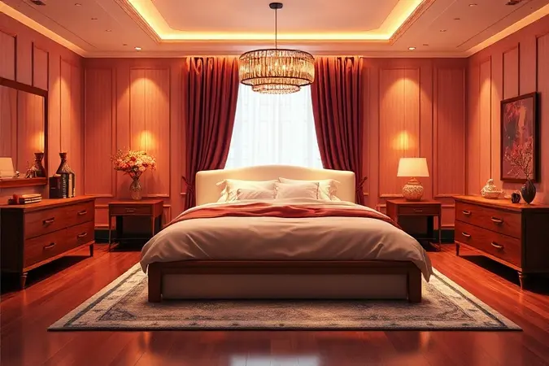
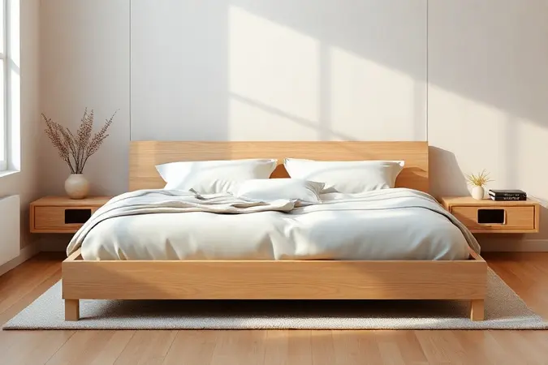
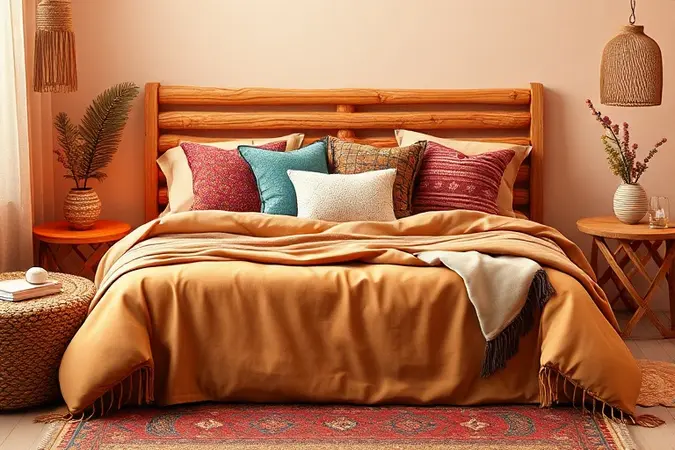
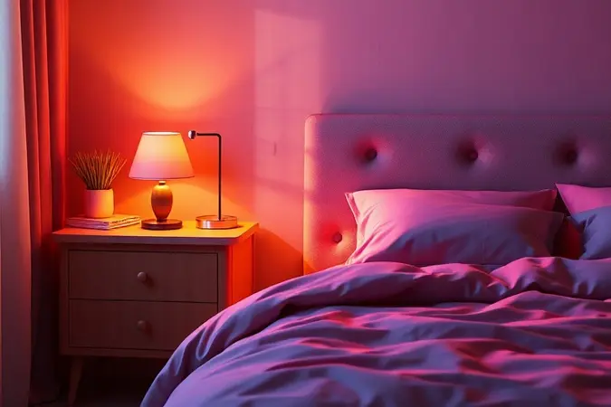

Já sentiu que, por mais que seu quarto esteja limpo, falta aquele toque de aconchego e sofisticação que vemos em hotéis de luxo? O segredo não está nos móveis caros, mas sim na arte de arrumar a cama.

Uma cama de casal convidativa é o primeiro passo para transformar seu dormitório em um refúgio de descanso genuíno.

Neste guia, você vai dominar o passo a passo definitivo da cama posta, aprender a combinar texturas e cores como um designer, e descobrir quais elementos elevam seu quarto de espaço funcional para santuário pessoal.

<SummaryList products={frontmatter.top_products} />

## Por que a decoração da cama de casal é o coração do quarto?

Sua cama não é apenas um móvel. É o ponto focal que define a atmosfera inteira do quarto. Pense nela como a protagonista silenciosa de seu espaço de descanso.

As escolhas que você faz aqui, desde as roupas de cama até as almofadas, não só refletem sua personalidade, mas moldam seu bem-estar emocional.

Uma cama bem decorada transforma o ato de dormir em um ritual, cria harmonia visual com cortinas e móveis, e te abraça com uma sensação de unidade que acalma a mente antes mesmo de fechar os olhos.

## O Passo a Passo da Cama Posta Perfeita: Camadas de Conforto

<ProductBox 
  title={frontmatter.top_products[0].title} 
  image={frontmatter.top_products[0].image} 
  link={frontmatter.top_products[0].link} 
/>

Imagine construir seu conforto camada por camada, como se estivesse preparando o cenário para a melhor noite de sono da sua vida. Comece com um jogo de cama em tecidos como algodão percal ou linho, que respiram com seu corpo durante a noite.

Sobre essa base, acrescente um edredom ou colcha de qualidade, que pode ser reversível para dias em que você quer mudar o humor do quarto. E para aquele abraço extra de aconchego, uma manta ou peseira na dobra certa faz toda a diferença.

O toque final vem das almofadas e travesseiros. Empilhe os travesseiros maiores na cabeceira, criando uma base macia para ler ou relaxar. Na frente, vá alternando almofadas decorativas de tamanhos variados.

Essa superposição não só enriquece a estética visual, mas transforma sua cama em um convite irresistível para deitar.

Uma cabeceira estofada pode elevar ainda mais essa experiência, oferecendo apoio confortável e um toque de elegância que preenche o espaço com personalidade.

### 1. A Base: A importância do protetor e do lençol de elástico

<ProductBox 
  title={frontmatter.top_products[1].title} 
  image={frontmatter.top_products[1].image} 
  link={frontmatter.top_products[1].link} 
/>

Essa é a camada invisível que garante tudo que vem depois. Um bom protetor de colchão não apenas preserva seu investimento contra manchas, mas cria uma barreira contra ácaros para quem sofre com alergias.

Procure modelos impermeáveis que oferecem proteção completa sem comprometer o conforto. E sobre esse protetor, o lençol de elástico é seu aliado secreto para noites sem interrupções.

Ele se ajusta perfeitamente ao colchão, mantendo tudo no lugar para que você nunca precise se levantar para arrumar a cama no meio da noite.

Em tecidos como percal ou malha, oferece uma maciez que se intensifica a cada lavagem, tornando o investimento em qualidade uma fonte diária de prazer sensorial.

### 2. O Volume: Edredom, Colcha ou Duvet?

<ProductBox 
  title={frontmatter.top_products[2].title} 
  image={frontmatter.top_products[2].image} 
  link={frontmatter.top_products[2].link} 
/>

Depois de cuidar da base, chegamos à camada que define o peso visual e térmico da sua cama. O edredom é o abraço quente perfeito para noites frias, recheado com penas ou fibras que envolvem seu corpo em calor constante.

Sua maciez cria um visual tão aconchegante quanto a sensação que proporciona, ideal para quem busca conforto máximo. Já a colcha é a opção leve e decorativa para climas mais amenos ou como segunda camada sobre o edredom, acrescentando cor e padrão sem peso. E o duvet?

Essa é a escolha inteligente para quem valoriza praticidade. Com uma capa externa que pode ser trocada e lavada facilmente, ele oferece a mesma sensação acolhedora do edredom com a flexibilidade de mudar o visual conforme seu humor ou a estação.

### 3. A Vira: O charme do lençol superior dobrado

<ProductBox 
  title={frontmatter.top_products[3].title} 
  image={frontmatter.top_products[3].image} 
  link={frontmatter.top_products[3].link} 
/>

Esse pequeno gesto faz uma diferença enorme na apresentação da sua cama. A 'vira', ou lençol superior dobrado sobre o edredom, é o mesmo detalhe que transforma camas de hotel em obras de arte convidativas.

Para criar esse efeito, basta esticar o lençol sobre o colchão e dobrá-lo para cima, formando uma borda limpa e sofisticada. Embora exija um momento extra ao arrumar a cama, o resultado justifica completamente o cuidado.

Essa dobra não só adiciona uma camada extra de textura, mas cria uma estrutura visual que organiza todo o conjunto, mostrando sua atenção aos detalhes e transformando o quarto em um espaço que parece saído de uma revista.

É a prova de que elegância muitas vezes está nos pequenos gestos feitos com intenção.

## Almofadas e Travesseiros: A Regra de Ouro da Proporção

<ProductBox 
  title={frontmatter.top_products[4].title} 
  image={frontmatter.top_products[4].image} 
  link={frontmatter.top_products[4].link} 
/>

Aqui é onde a mágica realmente acontece. As almofadas e travesseiros são os acessórios que dão personalidade e profundidade à sua cama. A regra de ouro? Trabalhe com uma combinação de 3 a 7 peças, variando tamanhos para criar camadas visuais interessantes.

Comece com as almofadas maiores apoiadas na cabeceira, e vá diminuindo o tamanho conforme avança para a frente da cama. Embora existam kits prontos que facilitam a escolha, selecionar peças avulsas oferece uma liberdade única para expressar seu estilo pessoal.

Misture texturas, brinque com padrões, combine cores que conversem entre si. Essa curadoria pessoal transforma sua cama em uma extensão autêntica de quem você é, criando um resultado tão único quanto sua impressão digital.

### Quantos travesseiros usar em cama de casal, queen e king?

O número ideal varia com o tamanho da cama e seu conforto pessoal. Para camas de casal, dois travesseiros geralmente criam o equilíbrio perfeito entre funcionalidade e estética.

Em camas queen, três ou quatro viajantes permitem um visual mais generoso e aconchegante, especialmente se você gosta de apoiar as costas para ler.

Já nas camas king, quatro a cinco travesseiros não são apenas necessários para preencher proporcionalmente o espaço, mas criam uma composição visual que impressiona pela abundância controlada.

A chave está em brincar com diferentes alturas e firmezas, criando uma paisagem de conforto que atende tanto às necessidades do sono quanto aos olhos.

### Como combinar tamanhos, cores e texturas sem errar

<ProductBox 
  title={frontmatter.top_products[5].title} 
  image={frontmatter.top_products[5].image} 
  link={frontmatter.top_products[5].link} 
/>

Comece estabelecendo uma base neutra. Lençóis em tons claros ou neutros criam um canvas versátil sobre o qual você pode construir sua criação. Sobre essa base, um edredom ou colcha com cor ou padrão se torna o ponto focal que guia todo o resto do esquema visual.

Com as almofadas, trabalhe em camadas. Coloque as maiores atrás, seguindo com tamanhos decrescentes na frente, criando uma escada visual que conduz o olhar naturalmente.

Para as cores, escolha uma paleta coesa de 2-3 tons que conversem entre si, usando uma cor dominante e outras como acentos. E quanto às texturas? Essa é a parte mais tátil da experiência.

Combine a suavidade do algodão percal com o aconchego de uma manta de lã, o brilho discreto do cetim com a rusticidade do linho. A variedade tátil não só enriquece visualmente, mas convida você a tocar, sentir e se envolver completamente com seu espaço de descanso.

## Peseiras e Mantas: O Toque Final de Aconchego e Estilo

<ProductBox 
  title={frontmatter.top_products[6].title} 
  image={frontmatter.top_products[6].image} 
  link={frontmatter.top_products[6].link} 
/>

Essas são as peças que transformam sua cama de funcional para afetiva. Uma peseira em algodão ou linho não só protege a parte inferior do edredom, mas adiciona um acabamento limpo e considerado ao conjunto completo.

E quando dobrada na altura certa, revela uma faixa de cor ou padrão que completa a narrativa visual. Já as mantas são o equivalente têxtil a um abraço ao chegar em casa. Escolha uma em material que faça sentido para seu clima e estilo de vida.

Em algodão ou lã merino para invernos rigorosos, ou em tecido mais leve para as estações amenas.

Vista sobre a dobra do lençol ou cuidadosamente disposta no pé da cama, ela acrescenta volume visual e uma promessa de conforto imediato para momentos de leitura, conversa ou simples relaxamento. Mais do que uma peça funcional, é um convite permanente à pausa.

## Elementos Estruturais: A Cabeceira como Protagonista da Decoração

<ProductBox 
  title={frontmatter.top_products[7].title} 
  image={frontmatter.top_products[7].image} 
  link={frontmatter.top_products[7].link} 
/>

A cabeceira é o quadro que emoldura toda a experiência da sua cama. Mais do que um apoio funcional, ela estabelece o tom estético do quarto inteiro.

As opções estofadas continuam sendo favoritas pelo conforto que oferecem ao apoiar as costas durante a leitura noturna, especialmente em modelos com costura capitonê que adicionam textura visual.

As inovações modernas trouxeram cabeceiras modulares que integram prateleiras, iluminação embutida e até tomadas USB, transformando sua cama em um hub de conforto tecnológico.

A limpeza pode exigir cuidados específicos dependendo do tecido, mas o impacto visual e sensorial justifica o investimento.

Para quem busca uma opção mais pessoal, cabeceiras pintadas ou composições de quadros criam uma parede de cabeceira totalmente customizada que reflete sua história e gostos, provando que até a estrutura mais básica pode se tornar uma expressão criativa.

### Cabeceiras de Madeira vs. Estofadas: Qual escolher?

<ProductBox 
  title={frontmatter.top_products[8].title} 
  image={frontmatter.top_products[8].image} 
  link={frontmatter.top_products[8].link} 
/>

Essa decisão resume-se ao equilíbrio entre estética, conforto e praticidade. Cabeceiras de madeira oferecem durabilidade inquestionável e uma versatilidade que se adapta a praticamente qualquer estilo de decoração, do rústico ao contemporâneo.

São fáceis de limpar com um simples pano úmido e trazem uma solidez visual que pode ancorar visualmente todo o quarto. Já as cabeceiras estofadas são o epítome do conforto sensorial.

Elas não só oferecem um apoio acolhedor para as costas, mas ajudam a isolar o frio da parede e absorvem sons, criando uma bolha de intimidade dentro do quarto. Com infinitas opções de tecidos, cores e texturas, permitem uma personalização profunda.

Requerem mais atenção na manutenção, especialmente para quem tem alergias, mas recompensam com uma experiência de conforto que transforma cada momento na cama em um pequeno luxo.

A escolha final deve refletir qual qualidade você valoriza mais no seu ritual diário de descanso.

## Estilos de Decoração para se Inspirar

Seu quarto é um espelho de como você deseja se sentir ao fechar os olhos à noite e abri-los pela manhã. Cada estilo de decoração oferece uma linguagem emocional diferente para expressar essa relação com o espaço do descanso.

### Minimalista e Escandinavo: Menos é mais

Esse estilo é uma declaração de paz através da simplicidade. Roupas de cama em branco, cinza e bege criam uma atmosfera calmante que acalma a mente antes do sono. As texturas são sutis mas presentes, um edredom de linho cru, uma manta de cashmere dobrada com precisão.

A cabeceira, quando existe, é discreta, em madeira clara ou estofada em tecido neutro. Cada elemento tem uma função e uma razão para estar ali, criando um espaço onde o olho encontra repouso tão rapidamente quanto o corpo.

É a arte de criar abundância através da contenção, onde cada objeto recebe o espaço para respirar e ser apreciado.

### Boho Chic e Romântico: Mistura de texturas e tons terrosos

Aqui a regra é abraçar a abundância sensorial. Uma paleta de terracota, verde musgo e mostarda cria uma conexão com a natureza que se estende dentro de casa.

Sobre a cama, camadas e mais camadas: um lençol de algodão, uma colcha crochetada, almofadas com bordados étnicos, uma manta de lã com franjas. As texturas conversam em coro, do crochê ao veludo, do linho ao macramê.

A cabeceira pode ser substituída por uma composição de quadros com molduras diferentes, plantas suspensas ou uma tapeçaria artesanal. É um estilo que convida ao recolhimento, criando um ninho têxtil tão rico em personalidade quanto confortável.

Perfeito para quem vê o quarto não apenas como um lugar para dormir, mas como um santuário criativo que alimenta a alma.

## Dicas de Especialista para uma Experiência de Hotel em Casa

<ProductBox 
  title={frontmatter.top_products[9].title} 
  image={frontmatter.top_products[9].image} 
  link={frontmatter.top_products[9].link} 
/>

Transformar seu quarto em um hotel boutique pessoal começa com escolhas conscientes que priorizam a experiência sensorial.

Invista em lençóis de algodão egípcio ou percale de alta contagem de fios, que oferecem aquele toque fresco e sedoso que faz você suspirar ao deitar.

Travesseiros com enchimento adaptativo e um edredom com regulagem térmica garantem que seu microclima pessoal seja perfeito todas as noites. A iluminação é a maquiagem do ambiente.

Abajures com luz quente e dimmers permitem ajustar a atmosfera conforme a hora e seu humor, criando transições suaves entre a atividade e o repouso.

E pequenos luxos, como um porta-copos elegante na mesa de cabeceira, um livro de poesia à mão, ou sabonetes artesanais no banheiro, completam a sensação de estar em um espaço cuidadosamente curado para seu bem-estar.

Manter esse padrão exige disciplina, mas a recompensa é acordar todos os dias sentindo que está em férias dentro da própria casa.

### Aromaterapia: O uso de águas de lençol e sprays de ambiente

O olfato é nossa conexão mais direta com a memória e a emoção. Usar águas de lençol com notas de lavanda ou camomila antes de dormir não apenas refresca os tecidos, mas sinaliza ao seu cérebro que é hora de desacelerar.

Um spray de ambiente com bergamota ou sândalo pode transformar instantaneamente a energia do quarto, limpando não apenas odores, mas emoções do dia.

Esses pequenos rituais olfativos criam associações positivas com seu espaço de descanso, transformando o ato de entrar no quarto em uma transição deliberada do mundo externo para o interno. É uma camada invisível de cuidado que envolve você antes mesmo de tocar na cama.

### Iluminação indireta e o papel das mesas de cabeceira

A luz certa no momento certo pode curar a ansiedade do dia. Iluminação indireta, através de abajures, arandelas ou fitas de LED escondidas, cria uma suavidade que acalma o sistema nervoso.

Opte por lâmpadas com temperatura de cor quente (2700K a 3000K) que imitam a luz do entardecer, incentivando naturalmente a produção de melatonina. As mesas de cabeceira são os companheiros funcionais dessa atmosfera.

Elas não apenas apoiam suas fontes de luz, mas guardam os objetos que fazem parte do seu ritual noturno. Um livro, seus óculos, um copo d'água, tudo organizado de forma que você não precise se levantar uma vez que já está aconchegado.

Juntas, a iluminação cuidadosa e o mobiliário intencional criam um ecossistema noturno que protege e nutre seu descanso.

## 5 Erros Comuns ao Decorar a Cama de Casal (E como evitá-los)

1. O exército de almofadas: Mais do que 3-4 almofadas decorativas podem transformar sua cama em um obstáculo ao invés de um convite. Priorize qualidade sobre quantidade, escolhendo peças que realmente acrescentam beleza e conforto.

2. A cama que engole o quarto: Uma cama king-size em um quarto pequeno pode criar claustrofobia. Meça seu espaço e escolha o tamanho que permite circulação confortável ao redor da cama.

3. A paleta descoordenada: Cores que brigam entre si criam ansiedade visual. Defina uma paleta de 2-3 tons que conversam harmonicamente e mantenha-se consistente em todas as camadas.

4. A beleza vazia: Itens apenas decorativos que não servem ao conforto são oportunidades perdidas. Cada peça na sua cama deve oferecer uma experiência sensorial positiva, seja ao toque, à visão ou ao uso.

5. A monotonia tátil: Usar apenas um tipo de tecido em todas as camadas cria uma experiência plana. Varie entre liso e texturizado, leve e pesado, brilhante e fosco para criar uma riqueza sensorial que envolve completamente.

## Perguntas Frequentes (FAQ) sobre Cama Posta

Como escolho minhas roupas de cama de forma inteligente? Pense em camadas. Comece com o conforto tátil (toque do tecido), depois considere a funcionalidade (regulação térmica) e finalmente a estética (cor e padrão).

Invista em qualidade nas camadas básicas (lençóis, protetor) que você usa todos os dias. Com que frequência devo trocar meus lençóis? A cada 7-10 dias é o ideal, mas ouça seu corpo e seu nariz.

Em climas mais quentes ou se você transpira muito à noite, trocas mais frequentes mantêm a sensação de frescor que contribui para um sono de qualidade. Como organizar almofadas sem criar confusão visual?

Use a regra do tamanho decrescente e do agrupamento por cor ou textura. Almofadas da mesma família visual (mesmo padrão em cores diferentes, ou mesma cor em texturas diferentes) criam harmonia mesmo em combinações ousadas.

## Conclusão

Arrumar uma cama de casal não é apenas uma tarefa doméstica. É um ato de autocuidado, uma forma de amor próprio que se materializa em camadas de conforto e beleza.

Cada escolha, desde o protetor invisível até a almofada mais decorativa, escreve uma história sobre como você se relaciona com seu descanso e seu espaço pessoal. Sua cama bem posta é mais do que um lugar para dormir.

É um refúgio que te aguarda ao final de cada dia, um santuário onde a ansiedade pode ser deixada do lado de fora, uma promessa de renovação a cada manhã. Comece hoje com uma pequena mudança, aquele detalhe que faz seus olhos brilharem ao entrar no quarto.

Porque o descanso de qualidade não é um luxo, é o fundamento sobre o qual construímos nossos dias mais produtivos e nossos relacionamentos mais significativos. Transforme seu quarto em um convite permanente ao bem-estar.

Sua melhor noite de sono está esperando para ser feita.