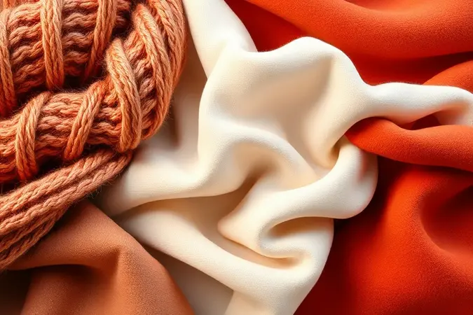
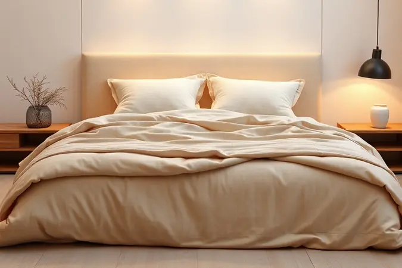
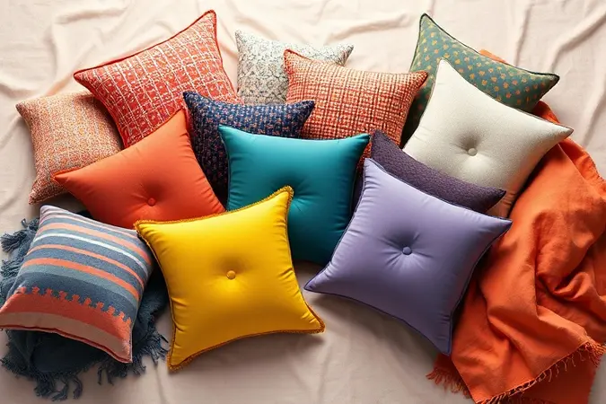
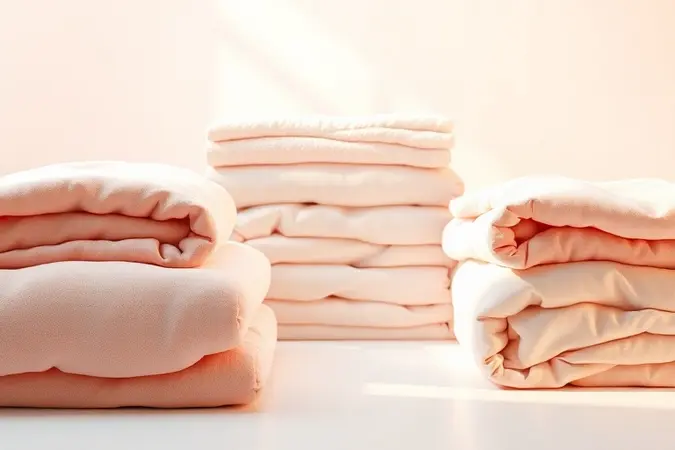

Imagine abrir a porta de casa depois de um dia cansativo e encontrar um convite visual para descansar, sem que você precise ter decorado profissionalmente o espaço.

Esse sentimento de acolhimento imediato que transforma qualquer canto em um refúgio pessoal está mais próximo do que você imagina, e o segredo muitas vezes repousa discretamente sobre um sofá ou no pé da cama.

<SummaryList products={frontmatter.top_products} />

## O Poder das Mantas: Por Que Elas são Essenciais na Decoração?

Mais do que um simples acessório para os dias frios, as mantas são pinceladas de personalidade e camadas de conforto que conversam diretamente com nossos sentidos.

Elas têm essa capacidade única de quebrar a frieza de um ambiente com um gesto simples, adicionando textura onde antes havia apenas superfícies lisas e convidando ao toque, ao aconchego.

A verdadeira magia está em sua versatilidade silenciosa: com um simples drapeado ou uma troca de estação, você renova completamente o clima de um espaço, testando novas combinações de cores e padrões como quem experimenta diferentes humores.

São peças que permitem que seu lar respire e se transforme junto com você, sem exigir compromissos definitivos ou grandes investimentos.

## Principais Materiais e Texturas: Como Escolher a Manta Certa

A escolha do material vai além do visual; é sobre como você quer se sentir ao se envolver nela. Cada fibra conta uma história diferente de conforto e cuidado, e entender essa linguagem é a chave para encontrar sua companheira ideal para momentos de relaxamento.

### Manta de Tricot: O Toque Artesanal e Aconchegante

<ProductBox 
  title={frontmatter.top_products[0].title} 
  image={frontmatter.top_products[0].image} 
  link={frontmatter.top_products[0].link} 
/>

Há algo profundamente reconfortante no visual de uma manta de tricot, como se carregasse consigo a paciência e o carinho de quem a fez (mesmo que tenha saído de uma linha de produção).

Sua textura irregular e trama aparente criam imediatamente uma atmosfera caseira e acolhedora, perfeita para dias de chuva no sofá ou para dar um charme rústico à cama. Elas sussurram intimidade e convidam a pausas mais lentas.

Algumas exigem cuidados especiais na lavagem, mas essa pequena dedicação é recompensada com anos de uma beleza que amadurece com o tempo, envelhecendo com graça ao invés de simplesmente se desgastar.

### Manta de Algodão: Versatilidade e Frescor para o Dia a Dia

<ProductBox 
  title={frontmatter.top_products[1].title} 
  image={frontmatter.top_products[1].image} 
  link={frontmatter.top_products[1].link} 
/>

Se você busca um companheiro para todas as estações, o algodão é sua resposta.

Leve e respirável, é aquele aliado perfeito para as noites de verão em que você quer apenas uma cobertura sutil, ou para o sofá da sala durante o dia, onde oferece conforto sem sobrecarregar o visual com peso.

Sua textura macia e familiar é gentil com a pele, tornando-a ideal para famílias e para quem aprecia a simplicidade prática.

Sim, pode pedir lavagens mais frequentes para se manter impecável, mas essa é a beleza da sua natureza democrática: está sempre pronta para o uso do dia a dia, sem cerimônias.

### Manta de Pelo Sintético: Sofisticação e Calor para o Inverno

<ProductBox 
  title={frontmatter.top_products[2].title} 
  image={frontmatter.top_products[2].image} 
  link={frontmatter.top_products[2].link} 
/>

Para momentos que pedem um abraço luxuoso e instantâneo, nada supera a sensação aveludada de uma manta de pelo sintético. Ela tem o poder de transformar instantaneamente uma poltrona comum em um trono aconchegante, com um calor que é quase visual.

Perfeita para criar um ponto focal de sofisticação nos meses mais frios, sua variedade de cores, dos neutros elegantes aos tons profundos, permite um jogo ousado na decoração.

Embora possa não ter a longevidade eterna de algumas fibras naturais, sua facilidade de manutenção e impacto estético imediato a tornam um investimento inteligente para quem quer alta dose de estilo com praticidade.

## Como Escolher a Cor e a Estampa Ideal para seu Ambiente

A cor da sua manta é a pincelada final que define o tom emocional do espaço. Em um ambiente de tons neutros, uma única manta em coral, terracota ou verde-esmeralda pode se tornar o herói da sala, atraindo todos os olhares e injectando personalidade.

Se seus móveis já falam alto, opte por tons terrosos ou cinzas suaves que acalmem o visual, criando uma base harmoniosa.

Pense na função: tons quentes como mostarda ou bordô estimulam aconchego em cantos de leitura, enquanto azuis suaves e verdes menta promovem relaxamento em áreas de descanso. O segredo está em ouvir o que o ambiente precisa e responder com cor.

## 5 Técnicas de Profissional para Colocar a Manta no Sofá

O drapeado faz toda a diferença entre uma manta que parece esquecida e uma que parece convidativa. Estas são as manobras que os decoradores usam para criar aquela impressão de conforto espontâneo e intencional.

### 1. O Estilo "Cachoeira" (Waterfall) Moderno

Para um visual que parece saído das páginas de uma revista, deixe a manta cair de um dos braços do sofá até o chão, criando uma linha fluida e orgânica. Esta técnica adiciona movimento e altura ao móvel, quebrando a rigidez de suas linhas.

Funciona especialmente bem com mantas mais longas e fluidas, e transmite uma sensação de abundância e generosidade no espaço.

### 2. Disposição Diagonal Despojada para Conforto Casual

Simples, mas eficaz: jogue a manta diagonalmente sobre o assento, deixando que uma ponta caia levemente no chão. Isto cria um efeito despretensioso que diz "sinta-se à vontade para se aconchegar", ideal para salas de estar onde o confato é prioridade.

É perfeita para quando você quer que o sofá pareça convidativo o tempo todo, sem parecer arrumado demais.

### 3. Dobra Reta e Estruturada no Braço do Sofá

Quando o ambiente pede ordem e sofisticação, dobre a manta em um retângulo limpo e posicione-a cuidadosamente sobre o braço do sofá.

Este gesto meticuloso transforma a manta de um item funcional em um elemento escultural da decoração, demonstrando cuidado e atenção aos detalhes. Além de bonito, mantém o acessório sempre à mão para quando o frio chegar.

### 4. Manta Esticada no Assento: Proteção e Estilo

Estique uma manta sobre todo o assento do sofá como se fosse uma capa. Esta técnica é duplamente inteligente: protege o tecido original do desgaste diário (especialmente útil com pets ou crianças) enquanto introduz uma nova textura e cor ao móvel.

Escolha uma manta de material durável, e tenha a liberdade de mudá-la conforme seu humor ou a estação.

### 5. Uso de Cestos Organizadores com Mantas "Saindo" para Fora

Coloque um cesto de vime ou algodão ao lado do sofá e arrume dentro dele algumas mantas cuidadosamente dobradas, deixando que as pontas escapem levemente.

Esta cena não só resolve o problema de onde guardar esses itens, como cria um cantinho visualmente acolhedor que promete conforto. O cesto vira parte da decoração, e as mantas parecem sempre prontas para uso, num convite tácito ao relaxamento.

## Mantas no Quarto: Criando a Cama Posta dos Sonhos

No quarto, as mantas transcendem a função e se tornam instrumentos para criar atmosfera. Elas são a camada final que transforma uma cama arrumada em um cenário digno de descanso profundo, adicionando profundidade visual e tátil que convida ao sono.

### A Manta como Peseira: Elegância no Pé da Cama

<ProductBox 
  title={frontmatter.top_products[3].title} 
  image={frontmatter.top_products[3].image} 
  link={frontmatter.top_products[3].link} 
/>

Drapear uma manta na horizontal, no pé da cama, é o equivalente decorativo a um ponto final elegante em uma frase.

Esta camada final não só acrescenta um peso visual gratificante que "ancora" a cama ao espaço, como oferece uma fonte prática de calor extra para os pés nas primeiras horas da manhã ou em noites frescas.

Escolha uma textura que contraste com o seu edredom: se este é liso, uma manta de tricot gigante ou com padrão canelado cria interesse; se o edredom já tem padrão, opte por uma manta de material liso em cor complementar.

É o detalhe que faz a cama parecer intencionalmente desenhada para o conforto.

## Como Combinar Mantas com Almofadas: Regras de Ouro

Mantas e almofadas são parceiras na criação de profundidade. Comece por uma cor base comum a ambas, um tom de azul, um terracota, um cinza, e depois brinque com as variações.

Por exemplo: almofadas de veludo caramelo combinam perfeitamente com uma manta de lã em tom areia.

A regra das texturas é sua melhor amiga: combine o brilho suave do cetim com a rusticidade de uma manta de crochê, ou a maciez do pelinho com a estrutura de uma manta de tricot.

Se se sentir ousado, introduza um padrão pequeno (listras, xadrez miúdo) em uma das peças para quebrar a uniformidade sem criar caos visual.

## Mantas em Poltronas e Cadeiras: O Charme nos Detalhes

Uma poltrona solitária no canto da sala ganha propósito e personalidade com uma manta cuidadosamente disposta sobre seu braço ou encosto. Este gesto transforma-a de um simples assento em um destino, um convite para uma xícara de chá ou alguns minutos de leitura.

Em cadeiras de jantar, uma manta dobrada sobre o encosto suaviza a formalidade do ambiente, sugerindo que as refeições ali serão descontraídas e aconchegantes. Nestes espaços menores, a manta atua como um acessório de moda para o móvel, definindo seu caráter e função.

## Cuidados e Manutenção: Como Lavar e Conservar suas Mantas

Para manter o abraço das suas mantas sempre aconchegante, siga a sabedoria das etiquetas de cuidados. A maioria se beneficia de lavagens delicadas em água fria, que preservam as fibras e as cores.

Evite a secadora em altas temperaturas, preferindo estender à sombra ou usar o ar fresco, o tempo extra de secagem é um investimento na longevidade da peça.

Para mantas especiais ou de fios delicados, considere a lavagem a seco profissional como um mimo que prolongará sua beleza por anos. Lembre-se: o cuidado que você dedica a elas é devolvido em conforto duradouro.

## Erros Comuns ao Usar Mantas na Decoração e Como Evitá-los

O equívoco mais comum é tratar as mantas como uma reflexão tardia, escolhendo cores que "mais ou menos" combinam. Em vez disso, compre-as com a mesma intenção com que escolhe uma obra de arte para a parede.

Outro deslize é o excesso: duas mantas bem posicionadas criam mais impacto do que cinco espalhadas sem critério.

Por fim, não limite suas mantas ao sofá; uma cadeira de escritório, o banco da entrada ou até a cadeira de balanço da varanda são candidatos perfeitos para receberem esse toque de conforto, espalhando a sensação de aconchego por toda a casa.

## Conclusão

A verdadeira transformação que uma manta traz para um ambiente vai muito além do visual; ela altera a experiência de habitar o espaço.

É sobre criar cantos que convidam à pausa, sobre adicionar uma camada de conforto que você pode literalmente sentir, sobre ter a liberdade de reinventar o humor de um cômodo com um simples gesto.

Comece com uma peça que fale à sua sensibilidade, seja a suavidade prática do algodão, o charme artesanal do tricot ou o luxo acessível do pelo sintético, e experimente as diferentes formas de apresentá-la no seu espaço.

Observe como um drapeado muda a energia do sofá, como uma cor nova no quarto altera a qualidade da luz.

Aos poucos, você descobrirá que essas peças têxteis são mais do que acessórios: são ferramentas flexíveis e acessíveis para desenhar o tipo de conforto que faz um lar realmente seu. Qual será a primeira manta que vai redefinir o aconchego na sua casa?