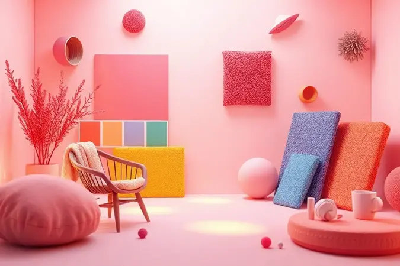
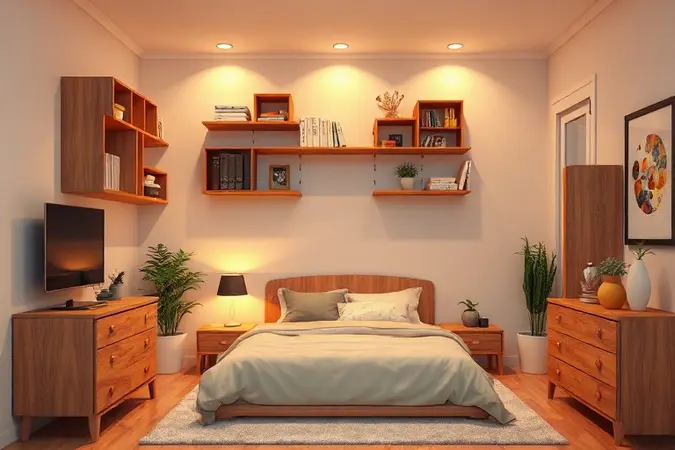
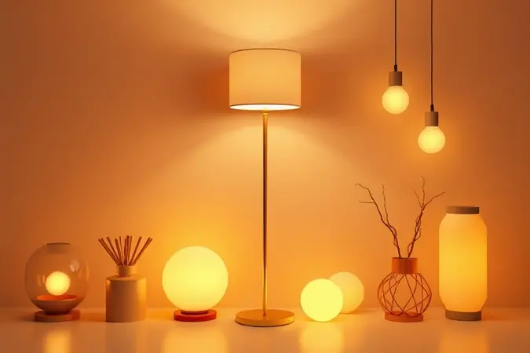

Imagine abrir a porta e entrar em um espaço que é unicamente seu, onde cada detalhe foi pensado para acolher suas histórias e renovar suas energias.

Decorar um quarto de solteiro, especialmente quando o espaço é limitado ou precisa ser mais do que apenas um lugar para dormir, pode parecer um quebra-cabeça criativo.

Neste guia, você vai descobrir como transformar seu ambiente em um verdadeiro refúgio, escolhendo entre estilos que vão do moderno ao rústico, aprendendo truques de mestre para otimizar cada centímetro e selecionando os móveis que unem beleza, conforto e praticidade de forma natural.

<SummaryList products={frontmatter.top_products} />

## A Importância de um Quarto de Solteiro Bem Planejado

Seu quarto é muito mais que um local para dormir. É seu escritório nos dias de home office, seu cinema nos finais de semana, seu santuário nos momentos que precisa recarregar as energias.

Um espaço bem planejado respeita essa multifuncionalidade, transformando limitações de tamanho em oportunidades criativas.

Quando você investe tempo em organizar e decorar esse ambiente, está criando um ecossistema pessoal que promove não apenas descanso, mas também produtividade e bem-estar. O resultado? Um refúgio que reflete quem você é e apoia o seu estilo de vida, todos os dias.

## Estilos de Decoração que Definem Personalidade

A escolha do estilo de decoração é como assinar o seu espaço com sua personalidade. É a primeira impressão que o ambiente transmite quando você entra, e o sentimento que ele devolve quando você precisa de conforto.

Cada estilo carrega uma filosofia diferente de viver e organizar o espaço, criando atmosferas que variam da serenidade minimalista ao aconchego nostálgico.

### Quarto de Solteiro Moderno: Linhas Limpas e Minimalismo

Pense em acordar em um ambiente que respira tranquilidade, onde a simplicidade reina e nada distrai sua paz. Esse é o poder do estilo moderno.

Com paletas neutras que acalmam a vista e móveis de linhas retas que parecem flutuar, você cria um espaço que prioriza a funcionalidade sem abrir mão da elegância. As prateleiras flutuentes não apenas organizam, mas dão leveza visual.

Uma mesa compacta com design clean se transforma no seu ponto de trabalho perfeito, enquanto uma cama com armazenamento embutido mantém tudo no lugar sem ocupar espaço extra.

O segredo está em escolher cada peça com intenção, permitindo que alguns acessórios geométricos ou um toque de material natural (como um vaso de cerâmica ou uma planta) tragam a personalidade necessária sem sobrecarregar os sentidos.

### Quarto de Solteiro Rústico: O Aconchego da Madeira e Texturas

Há algo profundamente reconfortante em um ambiente que parece abraçar você ao entrar.

O estilo rústico captura essa sensação através da madeira em seu estado mais autêntico, seja em móveis de demolição com histórias para contar ou em estruturas de pinho que exalam calor.

Imagine acordar ao lado de uma mesa de cabeceira robusta, sentir o toque do linho nas almofadas e envolver-se em uma manta de algodão nos dias mais frios. As texturas são protagonistas aqui, criando camadas visuais que convidam ao relaxamento.

Prateleiras de madeira exposta e uma iluminação suave (um abajur com tecido natural, talvez) completam a atmosfera, transformando seu quarto em um retiro campestre dentro da cidade, perfeito para desconectar após um dia intenso.

### Estilo Industrial: O Toque Urbano e Despojado

Para quem admira a beleza na simplicidade das estruturas e na honestidade dos materiais, o industrial é uma declaração de estilo.

Este é o visual da cidade que respira dentro de suas quatro paredes, misturando a robustez do metal com a calorosidade da madeira e a textura crua do tijolo à vista.

Uma cama com estrutura metálica, uma luminária pendente com lâmpada Edison e uma escrivaninha com tampo de madeira reciclada criam um conjunto coerente e cheio de personalidade.

A paleta de cores geralmente neutra (tons de cinza, preto e marrom) é pontuada por detalhes em cores terrosas ou um toque de verde através de plantas resistentes.

O resultado é um espaço despojado que não tenta ser perfeito, mas autêntico, ideal para quem valoriza um ambiente que estimula a criatividade sem formalidades.

## Móveis Essenciais para Funcionalidade e Conforto

Os móveis são os aliados que transformam conceitos de decoração em realidade prática. Em um quarto de solteiro, cada peça precisa trabalhar em dobro, oferecendo conforto sem sacrificar espaço.

A escolha certa não apenas otimiza o ambiente, mas também define o ritmo do seu dia a dia, facilitando a transição entre descanso, trabalho e lazer.

### Cama de Solteiro com Baú: Inteligência no Armazenamento

<ProductBox 
  title={frontmatter.top_products[0].title} 
  image={frontmatter.top_products[0].image} 
  link={frontmatter.top_products[0].link} 
/>

Para quem já sentiu a frustração de quartos pequenos que parecem encolher a cada nova aquisição, a cama com baú é uma revelação.

Ela oferece um compartimento secreto no lugar que antes era apenas espaço vazio, perfeito para guardar roupas de estação, calçados ou aqueles itens que você usa apenas ocasionalmente.

A sensação de abrir o baú e encontrar tudo organizado, liberando armários e gavetas para o que realmente importa no dia a dia, é libertadora.

Existem opções para todos os gostos, desde modelos compactos com revestimento em suede até versões mais robustas que suportam colchões de diferentes tecnologias.

Ao escolher, além do estilo, preste atenção na facilidade de abertura do mecanismo, garantindo que a praticidade seja verdadeira no cotidiano.

### Escrivaninha Compacta para Estudo e Trabalho

<ProductBox 
  title={frontmatter.top_products[1].title} 
  image={frontmatter.top_products[1].image} 
  link={frontmatter.top_products[1].link} 
/>

Seu canto de produtividade não precisa ocupar metade do quarto para ser eficiente. As escrivaninhas compactas são mestras em fazer muito com pouco.

Modelos em L, por exemplo, aproveitam cantos esquecidos, oferecendo uma superfície generosa para o notebook, livros e uma xícara de café, tudo sem invadir o espaço de circulação.

Já as opções com prateleiras laterais ou suspensas conquistam o espaço vertical, mantendo materiais essenciais ao alcance enquanto o chão permanece livre. Essa leveza visual cria uma sensação de amplitude mesmo em metros quadrados modestos.

O truque está em medir seu espaço disponível e imaginar seu fluxo de trabalho, escolhendo uma mesa que se adapte às suas necessidades reais, não às teóricas.

### Mesa de Cabeceira: Praticidade ao Lado da Cama

<ProductBox 
  title={frontmatter.top_products[2].title} 
  image={frontmatter.top_products[2].image} 
  link={frontmatter.top_products[2].link} 
/>

A última coisa que você vê antes de dormir e a primeira ao acordar merece atenção especial. A mesa de cabeceira é essa peça de transição, um pequeno altar onde você guarda o livro da noite, o carregador do celular, seus óculos e talvez um copo d'água.

Em quartos pequenos, modelos compactos com design inteligente (como a Mesa de Cabeceira Grécia da Marimix) oferecem superfície útil sem ocupar espaço precioso.

Já para quem precisa de mais organização, opções como a Mesa de Cabeceira Jasper, com gavetas de corrediça suave e até iluminação LED interna, mantêm tudo à mão mas fora de vista, contribuindo para a serenidade visual.

Pense no que você realmente precisa ter próximo à cama e escolha uma mesa que resolva esse problema com estilo, complementando a atmosfera que você já criou no restante do ambiente.

## Como Decorar Quartos de Solteiro Pequenos: Truques de Especialista

Quartos pequenos têm uma magia particular, convidando à criatividade e ao uso inteligente de cada centímetro. O segredo não está em lutar contra as limitações, mas em abraçá-las com soluções que transformam restrições em charme.

A sensação de amplitude começa na paleta de cores (tons claros são seus melhores amigos) e se consolida com estratégias que enganam os olhos e maximizam a utilidade.

### Espelhos Estratégicos para Criar Amplitude

<ProductBox 
  title={frontmatter.top_products[3].title} 
  image={frontmatter.top_products[3].image} 
  link={frontmatter.top_products[3].link} 
/>

Colocar um espelho grande na parede é como abrir uma janela para um quarto paralelo, duplicando visualmente o seu espaço.

Quando posicionado estrategicamente em frente a uma janela, ele captura a luz natural e a rebate por todo o ambiente, iluminando cantos que antes pareciam escuros e dando a impressão de tetos mais altos.

Além do impacto visual, os espelhos acrescentam uma camada de sofisticação, funcionando como peças de arte que refletem não apenas a luz, mas também a personalidade do ambiente.

Para evitar reflexos indesejados de pontos pouco interessantes, experimente posicioná-lo de forma a capturar uma estante decorada, uma planta bonita ou simplesmente a parte mais harmoniosa do quarto.

O resultado é um truque de ilusionista que funciona todos os dias, transformando a percepção do espaço sem mover uma única parede.

### Prateleiras e Nichos: Aproveitando o Espaço Vertical

<ProductBox 
  title={frontmatter.top_products[4].title} 
  image={frontmatter.top_products[4].image} 
  link={frontmatter.top_products[4].link} 
/>

Quando o chão é um território limitado, o olho naturalmente sobe em busca de oportunidades. É aí que prateleiras e nichos entram como heróis silenciosos da organização.

Eles conquistam o espaço vertical que muitas vezes é negligenciado, criando galerias funcionais para livros, plantas, objetos de coleção ou até mesmo um pequeno sistema de som.

Os modelos flutuantes, em particular, são magos da leveza, pois parecem suspensos no ar, contribuindo para a sensação de amplitude.

Nichos modulares com iluminação LED embutida vão além da função, transformando-se em elementos decorativos ativos que destacam seus itens favoritos.

A chave é pensar nesses elementos não como meros suportes, mas como extensões da sua personalidade, curadores do que merece ser visto e apreciado no seu santuário pessoal.

## Iluminação: Criando o Clima Perfeito

A luz é a música de fundo do seu ambiente, capaz de alterar completamente o ritmo e o humor do espaço.

Em um quarto de solteiro, uma iluminação bem planejada é aquela que se adapta aos seus momentos, oferecendo claridade para ler, suavidade para relaxar e praticidade para encontrar o que precisa sem tropeçar no escuro.

### Luminárias de Mesa e Pendentes Modernos

<ProductBox 
  title={frontmatter.top_products[5].title} 
  image={frontmatter.top_products[5].image} 
  link={frontmatter.top_products[5].link} 
/>

Imagine controlar a atmosfera do seu quarto com o toque de um botão.

As luminárias de mesa com tecnologia LED tornam isso possível, permitindo que você ajuste a intensidade da luz conforme a atividade, de um foco brilhante para estudar até um brilho suave para uma noite de filme. São como dimmers de humor que você controla.

Já os pendentes modernos são a joia da coroa da iluminação, criando pontos focais que elevam instantaneamente o visual do ambiente.

Escolha um modelo minimalista com formas geométricas para um quarto moderno, ou uma peça com elementos metálicos e vidro para complementar um estilo industrial.

O importante é que a luminária não seja apenas uma fonte de luz, mas uma extensão da estética que você já construiu, trabalhando em harmonia com o resto da decoração para criar camadas de iluminação que tornam o espaço multifuncional e acolhedor a qualquer hora.

## Como Arrumar a Cama com Estilo de Hotel

Há uma razão pela qual a cama de hotel parece convidativa o tempo todo, e o segredo está em camadas de conforto e uma apresentação impecável. Transforme seu local de descanso em um convite diário começando com um protetor de colchão que garante longevidade.

Em seguida, estique bem os lençóis de algodão percal (aquele toque fresco e suave que faz toda a diferença) e finalize com um edredom ou colcha dobrada elegantemente ao pé da cama.

O toque final são as almofadas decorativas, que adicionam textura e cor, criando uma cena que parece saída de uma revista, mas que está ao seu alcance todas as manhãs.

### Escolhendo o Jogo de Cama e Almofadas Ideais

<ProductBox 
  title={frontmatter.top_products[6].title} 
  image={frontmatter.top_products[6].image} 
  link={frontmatter.top_products[6].link} 
/>

O contato da pele com o tecido ao deitar é uma das sensações mais primárias de conforto. Por isso, investir em um bom jogo de cama é investir na qualidade do seu sono.

O algodão percal, com sua trama mais fechada e toque aveludado, oferece essa experiência premium, respirando bem em noites quentes e mantendo o calor nos dias frios.

Para almofadas, pense em camadas funcionais, uma mais firme para apoio na leitura, outra mais macia para aconchego. As decorativas são sua oportunidade de jogar com estampas e texturas, adicionando personalidade sem comprometer o conforto.

A combinação certa transforma sua cama no epicentro do relaxamento, um lugar onde você realmente quer estar ao final de cada dia.

## Dicas Extras para Renovar sem Gastar Muito

Renovar seu espaço não precisa começar com uma reforma completa ou uma conta bancária generosa. Às vezes, as transformações mais significativas vêm de gestos simples.

Experimente reorganizar os móveis, criando novos fluxos de circulação que podem revelar cantos esquecidos do quarto.

Uma única parede pintada com uma cor ousada ou um papel de parede com padrão interessante funciona como uma obra de arte arquitetônica, dando novo foco ao ambiente sem o custo de pintar tudo.

Reaproveite quadros e objetos, trocando-os de lugar para criar novas composições visuais. Plantas são acessórios de vida que purificam o ar e embelezam qualquer cantinho, trazendo um pedaço de natureza para dentro.

E nunca subestime o poder da luz natural, mantendo janelas limpas e usando cortinas leves que filtram sem bloquear.

Essas pequenas intervenções, feitas com intenção, podem ressuscitar completamente a energia do seu quarto, provando que orçamento limitado não significa criatividade limitada.

## Conclusão

Criar o seu quarto de solteiro ideal é uma jornada de autodescoberta traduzida em espaço. Mais do que seguir tendências ou acumular móveis, trata-se de construir um ambiente que converse com seu estilo de vida, que o receba ao final do dia e o inspire ao amanhecer.

Comece definindo a personalidade do espaço através de um estilo que ressoe com você, traduza essa identidade em móveis funcionais que otimizem cada centímetro, e finalize com camadas de conforto e iluminação que transformem a teoria em experiência sensorial.

Lembre-se que os quartos mais acolhedores são aqueles que contam histórias, então permita-se misturar o prático com o pessoal, o novo com o herdado, o planejado com o improvisado.

O resultado será muito mais que um local para dormir, será seu refúgio pessoal, um testemunho silencioso de quem você é e um porto seguro para quem você está se tornando. Agora, respire fundo e comece a transformar essas ideias no santuário que você merece.

## Perguntas Frequentes sobre Quarto de Solteiro (FAQ)

É natural ter dúvidas ao organizar um espaço que precisa ser dormitório, escritório e sala de estar ao mesmo tempo. Para maximizar o espaço, comece posicionando a cama em um canto, liberando área central para movimento.

Cores claras nas paredes e no piso criam instantaneamente uma sensação de amplitude. Quando o assunto é armazenamento, pense verticalmente com prateleiras e horizontalmente com organizadores embaixo da cama. O elemento mais importante, no entanto, é a personalização.

Fotografias, objetos de viagem, livros favoritos ou uma peça de arte significativa transformam um quarto funcional em um lar com alma, um espaço que não apenas abriga você, mas também conta sua história.