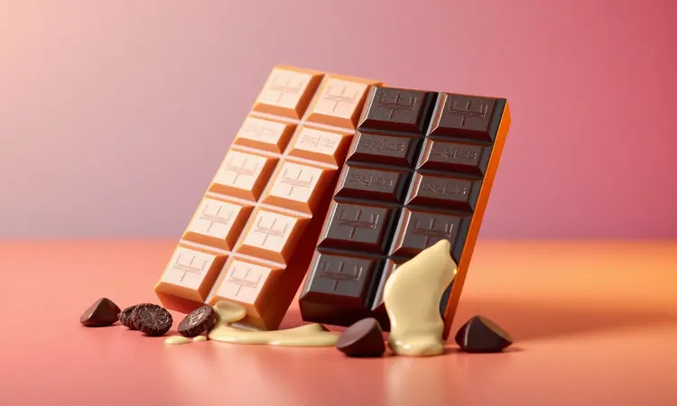
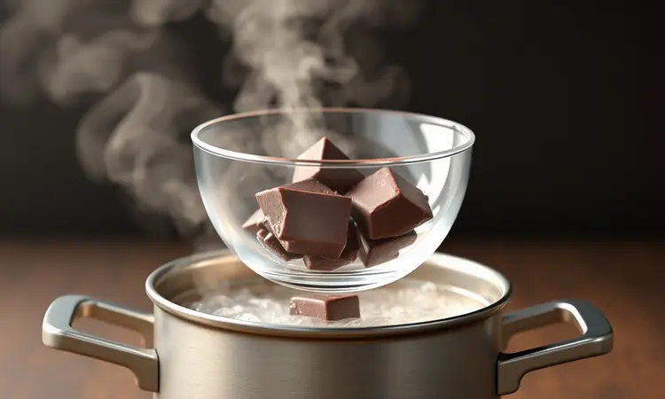
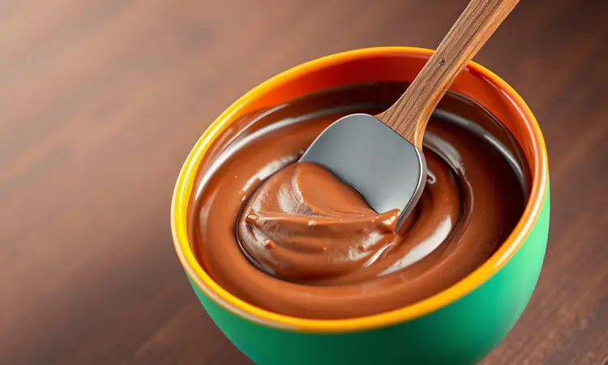
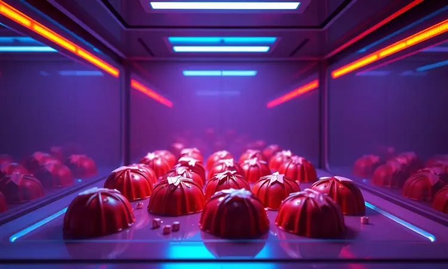

Aquele momento em que você pega uma barra de chocolate inteira e, minutos depois, olha para uma tigela com algo que mais parece cimento endurecido do que um creme sedoso? É uma sensação que todo amante de confeitaria já experimentou.

Dominar a arte de derreter chocolate não é apenas um passo técnico, é a chave que abre as portas para um universo de sobremesas profissionais que antes pareciam distantes.

Aqui, você vai descobrir como transformar frustração em maestria, aprendendo desde os métodos mais seguros até o segredo por trás daquele brilho de vitrine que encanta qualquer um.

<SummaryList products={frontmatter.top_products} />

## Entendendo a Base: Chocolate Nobre vs. Chocolate Fracionado (Qual escolher?)

A escolha entre o chocolate nobre e o fracionado depende muito mais do resultado que você busca do que apenas do sabor. Enquanto um oferece uma experiência de sabor profunda e aveludada, o outro é sinônimo de praticidade e resiliência.

### Chocolate Nobre: O sabor superior que exige técnica

<ProductBox 
  title={frontmatter.top_products[0].title} 
  image={frontmatter.top_products[0].image} 
  link={frontmatter.top_products[0].link} 
/>

Para quem busca o ápice do sabor e da textura, o chocolate nobre é a escolha definitiva. Sua alta porcentagem de manteiga de cacau derrete de forma luxuosa, criando um creme que é pura seda na língua.

No entanto, essa qualidade exige um compromisso: o processo de temperagem. Pense nisso como o ritual que garante aquele "snap" crocante ao quebrar uma trufa e o brilho perfeito que faz qualquer cobertura parecer profissional.

Pode parecer um detalhe técnico, mas é esse cuidado que transforma um simples doce em uma experiência gourmet memorável.

Para derretê-lo, o banho-maria é seu maior aliado, oferecendo o controle fino de temperatura necessário. Se a pressa falar mais alto, o micro-ondas funciona, mas exige intervalos curtos e muita atenção para não cruzar a linha tênue entre o derretido e o queimado.

O esforço extra vale cada segundo quando você prova o resultado.

### Chocolate Fracionado: Praticidade e resistência para coberturas

<ProductBox 
  title={frontmatter.top_products[1].title} 
  image={frontmatter.top_products[1].image} 
  link={frontmatter.top_products[1].link} 
/>

Já imaginou preparar uma cobertura que não derrete no calor e ainda dispensa as complexidades da temperagem? Esse é o superpoder do chocolate fracionado.

Criado com gordura vegetal, ele é estável, previsível e perfeito para quem vive em climas quentes ou quer resultados consistentes sem surpresas. Sua textura fica linda em bolos e docinhos, oferecendo um acabamento brilhante que resiste bem fora da geladeira.

É verdade que o sabor pode ser menos intenso que o do nobre, mas para muitas aplicações cotidianas, onde a praticidade e o tempo são fatores decisivos, ele se torna o herói da confeitaria caseira.

É a ferramenta ideal para quando você precisa de eficiência sem abrir mão de um visual impecável.

## Regra de Ouro: Por que a Água é a Maior Inimiga do Chocolate?

Imagine preparar tudo com cuidado, apenas para uma única gota d'água transformar seu chocolate em uma massa granulada e sem graça. Esse é o risco constante, pois o chocolate e a água são naturalmente incompatíveis.

A gordura do chocolate, quando encontra a umidade, se cristaliza de forma desordenada, arruinando a textura.

A solução é simples, mas não negociável: todos os utensílios, das tigelas às espátulas, devem estar absolutamente secos. Se sua receita pedir um líquido, prefira essências ou óleos que não contenham água.

Dominar essa regra básica é o que separa quem luta contra o chocolate de quem comanda o processo com confiança.

## Método 1: Banho-maria (O Clássico para Resultados Profissionais)

<ProductBox 
  title={frontmatter.top_products[2].title} 
  image={frontmatter.top_products[2].image} 
  link={frontmatter.top_products[2].link} 
/>

Se você quer controle absoluto e um resultado impecável, o banho-maria é o método que nunca falha. A técnica é simples: uma tigela repousa sobre uma panela com água quente, sem tocá-la, criando um aquecimento suave e indireto que derrete o chocolate com paciência.

É como dar a ele todo o tempo necessário para se transformar em creme, sem pressão para queimar.

Ferver a água não é necessário, e pode até ser prejudicial pelo vapor. Mantenha o fogo baixo, mexendo apenas ocasionalmente.

É a técnica que exige um pouco mais de tempo, mas te recompensa com uma fluidez perfeita e uma textura tão lisa que parece ter sido feita por máquina. Para projetos especiais, onde cada detalhe conta, não há substituto.

### Passo a passo para o banho-maria perfeito: Cuidados com o vapor

Comece picando o chocolate em pedaços uniformes para derreter igualmente. Encha uma panela média com cerca de 5 cm de água e leve ao fogo baixo.

Escolha uma tigela de vidro ou metal que se encaixe perfeitamente na boca da panela, criando uma vedação que impede a entrada de vapor. Quando a água estiver quente (não fervendo vigorosamente), coloque o chocolate na tigela e ajuste-a sobre a panela.

Mexa suavemente com uma espátula de silicone até obter um líquido completamente homogêneo, sem um único grânulo. O segredo está na paciência: deixe o calor residual fazer seu trabalho.

## Método 2: Micro-ondas (Rapidez e Praticidade no Dia a Dia)

<ProductBox 
  title={frontmatter.top_products[3].title} 
  image={frontmatter.top_products[3].image} 
  link={frontmatter.top_products[3].link} 
/>

Para aquela cobertura de último minuto ou quando o tempo é escasso, o micro-ondas surge como um salvador. A chave para o sucesso está nos intervalos. Nunca coloque o chocolate por mais de 30 segundos de uma vez. Use potência média (cerca de 50%), aqueça, mexa e repita.

Você saberá que está no caminho certo quando, após alguns intervalos, ainda restarem pequenos pedaços sólidos. Ao mexer, o calor residual terminará o trabalho, criando um creme liso sem passar do ponto.

É um método que exige sua presença constante, mas que entrega velocidade sem sacrificar totalmente a qualidade, perfeito para o ritmo da vida real.

### Qual a potência ideal e o tempo de pausa para não queimar?

A potência é sua maior aliada ou sua pior inimiga. Configure seu micro-ondas para 50% a 60% de potência. Para chocolates escuros, comece com intervalos de 30 segundos. Para chocolates brancos ou ao leite, que são mais sensíveis, reduza para 20 segundos.

Após cada pausa, mexa bem antes de retornar. Lembre-se: o chocolate continua a derreter fora do micro-ondas. A meta é retirá-lo quando ainda pareça pouco derretido; o ato de mexer revelará a textura cremosa e perfeita.

## Método 3: Air Fryer (A Técnica Surpresa que Funciona)

<ProductBox 
  title={frontmatter.top_products[4].title} 
  image={frontmatter.top_products[4].image} 
  link={frontmatter.top_products[4].link} 
/>

Quem diria que o aparelho das batatas crocantes também poderia ser um aliado na confeitaria? A air fryer, com seu fluxo de ar quente controlado, pode derreter chocolate de forma surpreendentemente uniforme.

O truque está na temperatura baixa, nunca ultrapassando os 60°C.

Coloque o chocolate picado em um recipiente pequeno e resistente, pré-aqueça a air fryer na temperatura mais baixa possível (geralmente entre 40°C e 50°C) e monitore a cada minuto.

Em dois ou três minutos, com uma mexida no meio do caminho, você terá um chocolate pronto para uso. É a prova de que, com criatividade, até os eletrodomésticos mais inusitados podem ganhar um novo propósito na sua cozinha.

## O Segredo do Brilho: Introdução à Temperagem (Choque Térmico)

<ProductBox 
  title={frontmatter.top_products[5].title} 
  image={frontmatter.top_products[5].image} 
  link={frontmatter.top_products[5].link} 
/>

O brilho de vitrine e o "snap" característico de um chocolate profissional não são obra do acaso. Eles são conquistados através da temperagem, um processo que reorganiza os cristais de gordura do chocolate, estabilizando-o.

Pense nisso como um ritual de resfriamento controlado.

Existem diferentes formas de fazer, desde adicionar pedaços de chocolate sólido à massa derretida (método de semente) até espalhá-lo sobre uma superfície de mármore fria.

Cada tipo de chocolate tem uma janela de temperatura ideal para trabalhar, geralmente entre 31°C e 32°C para os amargos.

Parece complexo, mas é uma habilidade que, uma vez aprendida, eleva qualquer criação caseira ao patamar de loja especializada, dando aquele toque de maestria que impressiona a todos.

## Solução de Problemas: Como Salvar Chocolate que Empelotou ou Ficou Duro?

<ProductBox 
  title={frontmatter.top_products[6].title} 
  image={frontmatter.top_products[6].image} 
  link={frontmatter.top_products[6].link} 
/>

Antes de pensar em desperdício, respire fundo. Chocolate empelotado por umidade tem salvação. Se foram poucas gotas, remova-as com uma concha e tente misturar vigorosamente.

Para um chocolate que ressecou ou esfriou demais, a adição de uma pequena quantidade de manteiga de cacau derretida ou óleo vegetal neutro pode restaurar sua fluidez.

Se a superfície apresentar um esbranquiçado (o chamado "fat bloom"), saiba que ele ainda é seguro para consumo.

Esse fenômeno é apenas a gordura que migrou para fora, e o chocolate pode ser perfeitamente usado em receitas como brownies ou brigadeiros, onde a aparência final não é crítica.

### Como recuperar chocolate queimado (Se ainda houver salvação)

O aroma amargo e a cor escurecida são sinais claros. O primeiro passo é afastá-lo imediatamente do calor.

Para tentar um resgate, transfira o chocolate para uma tigela limpa e adicione uma colher de gordura, como manteiga ou creme de leite, misturando bem para diluir o sabor queimado. Se o gosto amargo ainda persistir, sua melhor jogada é redirecioná-lo.

Use-o em receitas robustas como um bolo de chocolate denso, onde outros sabores fortes podem mascarar a falha, transformando um aparente fracasso em um novo acerto.

## Armazenamento Estratégico: Como Conservar seu Chocolate Derretido no Calor

Em um dia quente, manter o chocolate na consistência perfeita é um desafio. A estratégia vencedora é a prevenção. Após derreter, armazene-o em um pote hermético, longe de qualquer fonte de umidade ou luz solar direta.

Se precisar mantê-lo fluido por mais tempo para decorar vários doces, recorra a um banho-maria com fogo desligado.

A água morna da panela mantém a tigela aquecida o suficiente sem risco de superaquecimento, garantindo que seu chocolate esteja sempre pronto, maleável e perfeito para dar aquele acabamento impecável.

## Perguntas Frequentes (FAQ) sobre Derretimento de Chocolate

Algumas dúvidas sempre surgem quando começamos a explorar essa arte. Vamos às respostas diretas para as perguntas mais comuns.

### Posso derreter o chocolate direto na panela no fogo?

Tecnicamente sim, mas é um caminho arriscado. O calor direto do fundo da panela queima o chocolate muito rapidamente, antes que o calor se distribua por toda a massa. O resultado é quase sempre um fundo amargo e carbonizado.

Se a falta de utensílios for um impeditivo, use fogo muito baixo, uma panela de fundo pesado e mexa sem parar, deslizando a espátula por todo o fundo.

Ainda assim, considere o banho-maria (mesmo improvisado com uma tigela sobre uma panela com água) uma opção infinitamente mais segura e confiável.

### O que adicionar para deixar o chocolate mais fluido?

Para alcançar uma fluidez que facilite o mergulho de frutas ou o escoamento sobre um bolo, pequenos ajustes fazem toda a diferença. Uma colher de chá de óleo vegetal neutro (como girassol) para cada 100g de chocolate é a fórmula mais comum, pois não altera o sabor.

Para um toque de riqueza, a manteiga derretida funciona maravilhas. Já se o objetivo é uma cobertura mais cremosa e suave, uma colher de creme de leite é a escolha perfeita.

A regra é adicionar aos poucos, misturando bem após cada adição, até atingir a textura dos seus sonhos.

## Conclusão

Dominar a arte de derreter chocolate vai muito além de seguir um conjunto de instruções. É sobre superar a frustração inicial e descobrir que, com o método certo, você tem o poder de transformar ingredientes simples em momentos memoráveis.

Do controle meticuloso do banho-maria à velocidade prática do micro-ondas, cada técnica serve a um propósito na sua jornada culinária. Lembre-se das regras de ouro, entenda as características do seu chocolate e não tema experimentar.

A temperagem, que antes parecia um bicho de sete cabeças, se revela como o gesto final que entrega aquele brilho profissional e a textura perfeita. Agora, com essas ferramentas em mãos, sua próxima barra de chocolate não será mais um risco, mas uma promessa de criação.

Que tal escolher sua técnica favorita e transformar essa confiança em uma sobremesa que vai surpreender a todos?