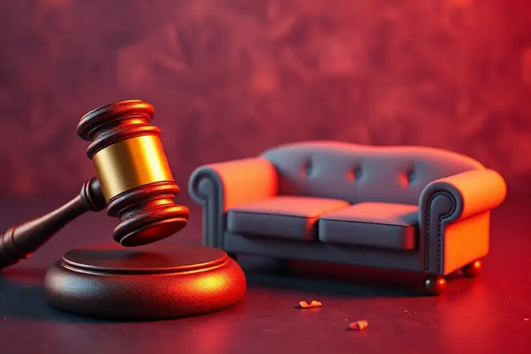
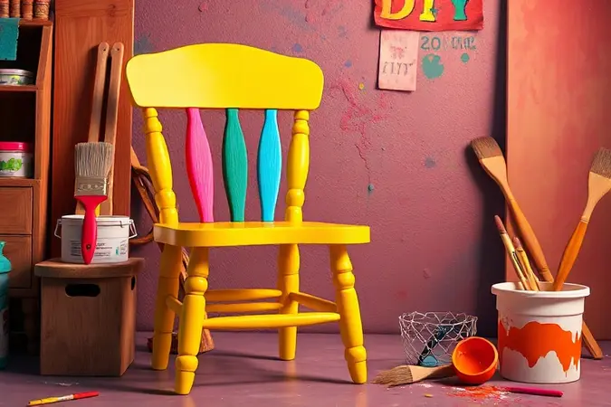

Imagine finalmente renovar a casa e dar aquela modernizada que tanto sonhou. Mas e aquele sofá que viu seus momentos mais marcantes, ou a cama que acompanhou tantas noites?

O impulso de simplesmente deixar tudo na calçada parece tentador, mas é aí que mora o perigo: além de ser crime ambiental, essa atitude pode abrir portas para multas pesadas e problemas de saúde em seu bairro.

A boa notícia é que existem caminhos muito mais inteligentes para essa despedida. Neste guia, você vai descobrir como transformar o que parece um problema em uma oportunidade de economia, sustentabilidade e até mesmo de ajudar alguém.

E tudo isso de forma gratuita, correta e com a tranquilidade de saber que está fazendo a sua parte.

<SummaryList products={frontmatter.top_products} />

## Por que o descarte correto de móveis é fundamental?

Pense no destino daquele armário ou mesa que você considerar 'inútil'. Quando abandonados em lugares inadequados, esses móveis não desaparecem mágicamente.

Eles se tornam fontes de poluição que contaminam solo e água, liberando substâncias que levam anos para se decompor.

Mas o impacto vai além do meio ambiente: muitas cidades têm regras rigorosas sobre despejo de objetos grandes, e ignorar essas normas pode custar caro no bolso.

Por outro lado, quando você escolhe o caminho certo, algo mágico acontece: aquela peça que para você perdeu o valor pode ganhar uma nova vida nas mãos de alguém que realmente precisa.

Ou então, seus materiais são transformados em algo completamente novo através da reciclagem. É a diferença entre criar um problema para sua comunidade e ser parte da solução.

## Onde descartar móveis velhos? Conheça as 4 opções principais

Se a dúvida é 'para onde levar tudo isso?', relaxe: existem mais alternativas do que você imagina, cada uma com seus próprios benefícios.

Desde opções completamente gratuitas até oportunidades de ganhar algo em troca, o segredo está em conhecer todas as possibilidades antes de tomar sua decisão.

### 1. Ecopontos e Pontos de Entrega Voluntária (PEV)

Esses locais são como santuários municipais onde sua consciência pode ficar tranquila. Gerenciados pelas prefeituras ou por organizações ambientais, eles oferecem a segurança de saber que seu móvel será encaminhado para o destino adequado. O melhor?

Normalmente não há custo algum. O que muda de cidade para cidade são os horários e regras específicas de funcionamento, então vale uma rápida pesquisa no site da sua prefeitura para garantir que você está seguindo todos os protocolos locais.

### 2. Operação Cata-Bagulho da Prefeitura

Se transportar móveis grandes parece uma missão impossível, essa iniciativa pode ser sua salvação. Funciona assim: você agenda uma data (normalmente disponível no calendário da prefeitura) e a equipe municipal passa na sua porta para recolher tudo.

É a solução perfeita para quem tem itens volumosos demais para carregar sozinho. Mantendo as ruas limpas e evitando acúmulos em áreas públicas, essa operação não apenas resolve seu problema, mas contribui para um ambiente mais saudável para todos no bairro.

### 3. Doação para Instituições de Caridade e ONGs

Aqui está a opção mais emocionante: dar uma segunda chance para sua mobília e, ao mesmo tempo, transformar o dia de alguém.

Muitas peças que consideramos 'velhas' ou 'fora de moda' podem ser exatamente o que uma família em situação vulnerável precisa para montar seu lar. Algumas instituições até oferecem serviço de retirada gratuita, facilitando ainda mais o processo.

E em alguns casos, essa boa ação pode se traduzir em benefícios fiscais. Basta entrar em contato com as organizações locais para verificar quais itens estão precisando no momento.

### 4. Empresas Especializadas em Descarte Ecológico

Para quem busca o máximo de conveniência aliado à sustentabilidade, essas empresas são a resposta perfeita. Elas não apenas recolhem os móveis no conforto da sua casa, mas garantem que cada componente seja tratado com o respeito ambiental que merece.

O que não pode ser reaproveitado vai para reciclagem especializada, e muitas vezes parte do valor gerado com a venda das peças reaproveitadas é destinada a causas sociais, criando um ciclo virtuoso que começa na sua sala e termina ajudando a comunidade.

## O que diz a legislação: Multas e penalidades por descarte irregular

Antes de considerar 'esquecer' um móvel em qualquer canto, lembre-se deste número: algumas cidades aplicam multas que podem chegar a milhares de reais por descarte irregular.

A legislação normalmente considera essa prática uma infração ambiental grave, e as penalidades não se limitam a pessoas físicas. Empresas que não cuidam adequadamente dos resíduos de seus produtos também podem enfrentar consequências severas.

Mas aqui está o insight mais importante: todas essas regras não foram criadas para punir você, mas para proteger o espaço em que todos vivemos.

Quando existe um sistema organizado de descarte (como aqueles que acabamos de conhecer), jogar móveis em terrenos baldios ou ruas não é apenas errado, é completamente desnecessário.

## Como preparar os móveis para a retirada (Passo a Passo)

Agora que você já sabe onde tudo vai parar, vem a parte prática: como deixar seus móveis prontos para essa jornada final. E acredite, esse preparo pode fazer toda diferença na hora de garantir que cada peça receba o tratamento adequado.

Comece avaliando o estado de cada item: se está em condições de ser reutilizado, uma boa limpeza pode aumentar suas chances de encontrar um novo lar. Para peças que precisam ser desmontadas, o segredo está na paciência e nas ferramentas certas.

### Ferramentas básicas para desmontagem segura

<ProductBox 
  title={frontmatter.top_products[0].title} 
  image={frontmatter.top_products[0].image} 
  link={frontmatter.top_products[0].link} 
/>

Transformar um móvel grande em partes menores não precisa ser um desafio de engenharia. Com algumas ferramentas simples, você consegue fazer tudo com segurança e até aprender algo novo no processo. 

O kit básico começa com chaves de fenda (tanto a comum quanto a Phillips) para lidar com vários tipos de parafusos que você vai encontrar.

Um alicate multiuso é perfeito para segurar ou remover peças menores, enquanto um martelo de borracha permite ajustes suaves sem danificar a madeira ou outros materiais.

Para aqueles parafusos hexagonais tão comuns em móveis modernos, a chave Allen é indispensável. E se você quer praticidade, uma parafusadeira elétrica pode acelerar bastante o processo, desde que usada com cuidado para não danificar as peças.

A trena garante que todas as medidas sejam mantidas, útil caso você queira remontar algo no futuro.

Quando encontrar componentes mais resistentes, ferramentas como macete e talhadeira podem parecer intimidadoras à primeira vista, mas com atenção e movimento controlado, elas se tornam aliadas valiosas para trabalhos mais desafiadores.

### Sacos reforçados para partes menores e entulho

<ProductBox 
  title={frontmatter.top_products[1].title} 
  image={frontmatter.top_products[1].image} 
  link={frontmatter.top_products[1].link} 
/>

Depois de toda a desmontagem, chega a hora de organizar o resultado. Para guardar ou transportar partes menores, pedaços de madeira e outros fragmentos, os sacos reforçados oferecem a segurança necessária para evitar acidentes e facilitar o manejo.

Os sacos de ráfia, feitos de polipropileno, são verdadeiros heróis da resistência: suportam até 50kg de material, sendo ideais para restos mais pesados como madeira grossa ou peças metálicas.

Já os sacos plásticos com espessura de 20 micras oferecem uma barreira extra contra umidade e perfurações, perfeitos para guardar tudo limpo e organizado.

Para volumes realmente grandes, os Big Bags são a solução definitiva. Com capacidade que chega a 1m³ e suportando pesos impressionantes de até 2000kg, eles transformam o transporte de grandes quantidades em uma tarefa simples.

A dica aqui é investir em marcas reconhecidas, pois a qualidade varia bastante e você não quer descobrir a diferença no meio da rua com um saco rasgado.

## Descarte de Cama e Colchão: Cuidados específicos com itens volumosos

Entre todos os móveis, camas e colchões merecem atenção especial não apenas pelo tamanho, mas pela complexidade dos materiais envolvidos. Esses itens não se decompõem facilmente e podem causar sérios problemas ambientais se abandonados incorretamente.

A primeira parada obrigatória é verificar se sua cidade tem programas específicos para coleta desses objetos volumosos. Muitas prefeituras mantêm datas exclusivas ou canais de agendamento diferenciados para esse tipo de material.

Outra rota segura é buscar empresas especializadas em reciclagem de colchões, que sabem exatamente como separar espumas, molas e tecidos para dar o destino adequado a cada componente.

## Reaproveitamento: Ideias de DIY para transformar móveis antigos

Antes de considerar o descarte final, que tal dar uma chance para a criatividade? Transformar móveis antigos em novas peças para sua casa é uma experiência que vai muito além da economia: é sobre contar histórias através dos objetos.

Imagine pegar aquela cadeira de madeira que parece ter vivido mais do que você e, com uma lixada cuidadosa e uma nova cor, transformá-la no ponto de conversa da sua sala.

Ou então, uma mesa de café antiga ganhando nova vida como banco de entrada com o simples acréscimo de almofadas confortáveis. Até portas que perderam sua função original podem se tornar prateleiras charmosas ou painéis decorativos que dão personalidade à suas paredes.

Cada projeto desses é mais do que uma reforma: é uma maneira de manter viva a memória dos objetos enquanto os adapta às necessidades do presente.

## Perguntas Frequentes (FAQ)

No caminho do descarte consciente, algumas dúvidas sempre surgem. Separamos as mais comuns para você já sair com todas as respostas na ponta da língua.

### A prefeitura cobra para retirar móveis velhos?

Na grande maioria das cidades, esse serviço é oferecido gratuitamente aos moradores. O segredo está em seguir os trâmites corretos: normalmente, você precisa agendar a coleta durante a Operação Cata-Bagulho ou em datas específicas determinadas pelo município.

Como as regras podem variar, vale sempre uma rápida consulta no site oficial da sua prefeitura para evitar surpresas. Algumas localidades podem aplicar taxas apenas se o volume exceder o limite estabelecido ou se a solicitação for feita fora dos períodos programados.

### Como descartar móveis em condomínios?

Morar em apartamento traz algumas considerações extras, mas nada que impeça um descarte responsável.

O primeiro passo sempre é consultar o regulamento interno do seu condomínio, que normalmente estabelece horários específicos e locais designados para esse tipo de material.

Muitas administrações organizam mutirões periódicos de descarte, facilitando a vida de todos os moradores. Outra opção prática é contratar um serviço especializado em remoção de móveis, que pode recolher tudo diretamente da sua porta sem perturbara vizinhança.

E se seus itens ainda têm condições de uso, que tal propor uma ação solidária no condomínio, reunindo doações para instituições locais?

## Conclusão

Despedir-se de móveis antigos é mais do que liberar espaço físico na sua casa, é uma oportunidade de fechar ciclos com consciência e propósito.

Cada escolha que você faz nesse processo ecoa muito além das suas quatro paredes: quando doa, está ajudando alguém a construir seu lar; quando recicla, está fechando um ciclo ambiental virtuoso; quando utiliza os serviços municipais, está contribuindo para uma cidade mais limpa e organizada.

Os caminhos estão todos aí, claros e acessíveis. O que parecia um problema logístico se revela como uma chance de fazer a diferença de várias maneiras ao mesmo tempo.

Desde evitar o desconforto de multas até experimentar a gratificação de ajudar quem precisa, cada etapa desse processo pode ser transformada em algo positivo.

Para começar, que tal dar o primeiro passo hoje mesmo? Escolha o método que mais faz sentido para você, prepare seus móveis com carinho e faça parte desse movimento de transformação.

Seu futuro espaço renovado ficará ainda melhor sabendo que o passado foi tratado com o respeito que merecia.