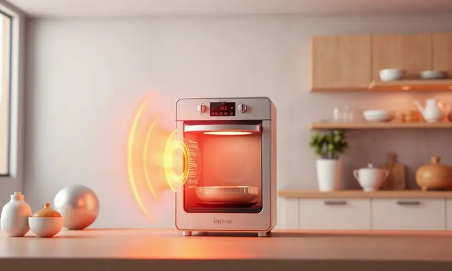
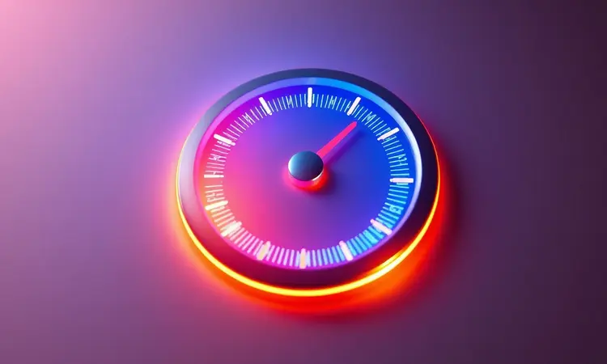
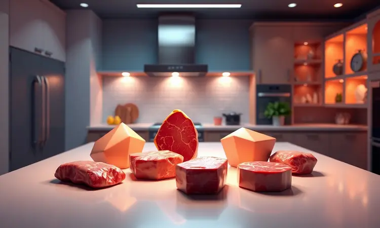

Você já se viu na situação de precisar preparar o jantar e perceber que esqueceu de tirar o frango do congelador? Se sim, você sabe como o micro-ondas muitas vezes entrega um resultado decepcionante, cozinhando as bordas e mantendo o centro congelado.

A boa notícia é que sua Airfryer pode ser a solução definitiva para esse problema, descongelando a carne de forma uniforme e preservando a textura original.

Neste guia completo, você aprenderá o passo a passo seguro para descongelar frango na Airfryer, os tempos ideais para cada corte e os segredos para garantir que sua refeição continue suculenta e saudável.

<SummaryList products={frontmatter.top_products} />

## É seguro descongelar frango na Airfryer? Entenda o processo

A primeira pergunta que vem à mente é sempre sobre segurança. Descongelar frango na Airfryer não apenas é seguro, mas pode ser sua nova arma secreta na cozinha quando o tempo está curto.

A chave está no calor envolvente que circula por todos os lados do alimento, garantindo que descongele uniformemente, sem aquelas zonas perigosas que podem abrigar bactérias.

Porém, mais importante que a técnica é o acompanhamento. Você precisa garantir que o frango atinja uma temperatura interna adequada para eliminar qualquer risco.

Ajuste sua Airfryer para cerca de 160°C e mantenha um olho atento no tempo, que naturalmente varia conforme o tamanho das peças. O segredo é simples: após o descongelamento, cozinhe imediatamente o frango.

Essa transição rápida entre descongelar e cozinhar é o seu maior aliado para garantir segurança e sabor.

## Airfryer vs. Micro-ondas: Por que a fritadeira elétrica é superior para carnes?

Agora vamos ao confronto direto. Você já experimentou aquela frustração de abrir o micro-ondas e encontrar bordas cozidas demais enquanto o centro permanece uma pedra de gelo? A Airfryer muda completamente esse jogo.

Enquanto o micro-ondas aquece de forma desigual, criando pontos quentes e frios, sua Airfryer trabalha com a inteligência do ar em movimento. Esse calor circulante envolve a carne por todos os lados, como se estivesse dando um abraço quente e igualitário em cada pedaço.

O resultado? Uma textura que mantém sua integridade original e todo o sabor que você espera.

Mas vai além da mera descongelação. As airfryers preservam nutrientes que o micro-ondas pode degradar e mantêm a suculência que faz do frango uma refeição realmente especial.

É a diferença entre um alimento que apenas descongelou e um que está pronto para se transformar em algo delicioso.

## Passo a Passo: Como descongelar frango na Airfryer sem cozinhar a carne

A magia acontece quando você domina o equilíbrio entre tempo e temperatura. Para descongelar sem cozinhar, ajuste sua Airfryer para cerca de 80°C. Em apenas 10 a 15 minutos, você terá um frango pronto para ir para a próxima etapa.

O truque está na verificação constante, um toque rápido com o garfo para sentir se ainda há rigidez do congelamento.

### 1. Preparação: O cuidado com a embalagem e o posicionamento

Antes de ligar o equipamento, dê atenção especial à embalagem do frango. Muitos materiais não foram feitos para suportar calor e podem derreter ou liberar substâncias indesejadas. Retire o frango da embalagem original e coloque-o em um recipiente próprio para Airfryer.

Agora pense no posicionamento: uma única camada é sua melhor amiga. Essa distribuição permite que o ar quente flua livremente ao redor de cada pedaço, garantindo um descongelamento uniforme.

Evite a tentação de empilhar, pois isso criaria bolsões de frio escondidos entre as peças.

### 2. Ajuste de temperatura: O segredo dos graus baixos

Aqui está o coração do método. Temperaturas baixas, entre 60 e 80 graus Celsius, são sua zona de segurança. Por quê? Porque elas oferecem calor suficiente para derreter o gelo sem iniciar o processo de cozimento.

Imagine isso como um banho morno para o seu frango. Essa faixa de temperatura trabalha lentamente, derretendo o congelamento de fora para dentro de maneira controlada.

O resultado é uma carne que mantém toda sua suculência natural, pronta para receber seus temperos favoritos sem perder um pingo de sabor.

### 3. O tempo ideal e a importância de virar o alimento

Com a temperatura certa configurada, é hora de sincronizar o relógio. Em média, 10 a 15 minutos a 160°C funciona para a maioria dos cortes, mas ajuste conforme a espessura. O verdadeiro segredo, porém, está no movimento: virar o frango na metade do processo.

Essa simples ação garante que cada lado receba sua dose igual de calor circulante. Sem virada, você pode acabar com uma parte perfeitamente descongelada enquanto outra ainda guarda vestígios de gelo.

É uma dança de calor e movimento que resulta em textura uniforme e sabor consistente em cada mordida.

## Guia de tempo e temperatura por tipo de corte de frango

Nem todo frango é criado igual, e cada corte pede uma abordagem específica. Para peitos, 15-20 minutos a 180°C geralmente funcionam bem. Já coxas e sobrecoxas, com sua estrutura mais complexa, preferem 20-25 minutos na mesma temperatura.

### Descongelando filés de peito de frango individualmente

Os filés de peito são os mais simples de trabalhar. Comece pré-aquecendo sua Airfryer a 180°C por cerca de 5 minutos, criando o ambiente perfeito para receber o frango. Coloque os filés em uma única camada na cesta e ajuste o timer para 10-15 minutos.

A magia está na observação: a cada poucos minutos, verifique a textura. Você sentirá a transição da rigidez do congelamento para a maleabilidade perfeita.

Essa atenção constante garante que cada filé mantenha sua estrutura intacta, pronta para receber marinadas ou temperos.

### Como lidar com coxas e sobrecoxas congeladas em bloco

Aqui encontramos um desafio comum: o bloco congelado que parece uma escultura de gelo. Se possível, separe as peças antes de colocar na Airfryer. Se elas resistirem à separação, uma pausa de 30 minutos em temperatura ambiente costuma amolecer as junções o suficiente.

Com as peças separadas (ou pelo menos mais soltas), programe 25 a 30 minutos a 160°C. A estrutura mais complexa das coxas e sobrecoxas precisa desse tempo extra para garantir que o calor alcance todos os cantos, incluindo as articulações e áreas próximas aos ossos.

### É possível descongelar um frango inteiro na Airfryer?

Sim, mas com considerações importantes. Primeiro, confirme se seu modelo tem espaço suficiente para acomodar o frango inteiro sem tocar nas paredes. A circulação de ar precisa de espaço para trabalhar sua mágica.

O processo exige temperaturas ainda mais baixas e paciência extra. Monitore atentamente, pois diferentes partes do frango descongelam em ritmos diferentes. O peito, mais volumoso, geralmente precisa de verificação mais frequente.

É um método para quando você tem tempo, mas oferece a vantagem de ter o frango todo pronto de uma vez.

### Use um termômetro de cozinha para garantir o ponto certo

<ProductBox 
  title={frontmatter.top_products[0].title} 
  image={frontmatter.top_products[0].image} 
  link={frontmatter.top_products[0].link} 
/>

Um termômetro não é um luxo, é sua garantia de paz de espírito. Quando a agulha marca 75°C internamente, você pode respirar aliviado sabendo que eliminou qualquer preocupação com segurança alimentar.

Os modelos de espeto são os verdadeiros heróis aqui, penetrando rapidamente no ponto mais profundo da carne para dar uma leitura precisa. A tecnologia instantânea de hoje elimina adivinhações e palpites.

O investimento em um bom termômetro retorna em forma de segurança, suculência e a confiança de que cada refeição será perfeita.

## 3 erros fatais que você deve evitar ao descongelar alimentos na Airfryer

A praticidade da Airfryer tem suas armadilhas, e conhecê-las é sua melhor defesa. Primeiro, nunca pule o pré-aquecimento. Ligar o equipamento já com o frango dentro cria um ambiente de temperatura desigual que compromete todo o processo.

Segundo, respeito pelos limites de tempo. Aquela mentalidade de "mais alguns minutos não farão mal" pode transformar seu frango descongelado em frango parcialmente cozido e ressecado. Seguir os tempos sugeridos não é frescura, é ciência.

Terceiro, os recipientes errados podem sabotar seus esforços. Metais inadequados podem interferir com a circulação de ar e até danificar seu equipamento.

Silicone e vidro específicos para Airfryer são seus aliados, garantindo que o calor circule livremente enquanto protegem seu investimento.

## Melhores modelos de Airfryer com controle preciso de temperatura para descongelar

<ProductBox 
  title={frontmatter.top_products[1].title} 
  image={frontmatter.top_products[1].image} 
  link={frontmatter.top_products[1].link} 
/>

Quando cada grau faz diferença, ter o equipamento certo se torna fundamental. A Electrolux Airfryer Oven Digital 12L (EAF85) se destaca por seu controle que vai de 60°C a 200°C, com um painel digital que transforma ajustes precisos em gestos simples.

A Oster OFRT970 segue na mesma linha, oferecendo controle de 65°C a 200°C através de uma interface touch que responde ao toque mais leve. Para quem busca versatilidade, a Britânia BFR2100P e a Philco PFR2200P oferecem a faixa de 80°C a 200°C.

Mas se precisão extrema é sua prioridade, a WAP Barbecue Digital impressiona com sua amplitude de 50°C a 230°C.

Sim, alguns desses modelos ocupam mais espaço na bancada, mas trazem em troca funcionalidades que transformam o descongelamento de uma tarefa em uma experiência.

## Acessórios que facilitam o descongelamento e a limpeza da cesta

<ProductBox 
  title={frontmatter.top_products[2].title} 
  image={frontmatter.top_products[2].image} 
  link={frontmatter.top_products[2].link} 
/>

Os acessórios certos podem transformar uma boa experiência em uma excelente. Um suporte elevador, por exemplo, mantém o frango levantado da base da cesta, permitindo que o ar circule não apenas pelos lados, mas também por baixo.

Já os tapetes de silicone são como um seguro contra grudação. Eles criam uma superfície antiaderente que não só facilita o descongelamento uniforme como transforma a limpeza pós-uso em uma tarefa de segundos, sem esfregar ou deixar de molho.

A verdade é que você pode descongelar perfeitamente sem esses itens, mas eles oferecem aquela camada extra de praticidade que faz você se perguntar como vivia sem eles.

## Dicas extras para um frango perfeito após o descongelamento

A linha entre descongelado e pronto para brilhar é mais fina do que parece. Antes mesmo de ligar a Airfryer, já pense no tempero. Uma marinada rápida enquanto descongela pode infundir sabores que penetram profundamente na carne.

Respeite o espaço na cesta. Superlotar é convidar a frustração, criando zonas de calor desigual. Cada pedaço precisa de seu espaço pessoal para que o ar flua livremente ao redor.

E quando o timer apitar, resista à tentação de cortar imediatamente. Aquele descanso de poucos minutos permite que os sucos, agora aquecidos e em movimento, se redistribuam uniformemente pela carne. É a paciência que paga em suculência.

## Perguntas Frequentes (FAQ) sobre o uso da Airfryer para descongelar

A dúvida mais comum: "Minha Airfryer tem modo descongelamento?" A maioria não tem um botão específico, mas isso não é problema. Temperaturas entre 80-100°C cumprem perfeitamente essa função.

E quanto à verificação? Sim, é essencial. Parar a cada poucos minutos para virar o frango não é perda de tempo, é garantia de qualidade. Assim como usar recipientes adequados não é burocracia, é segurança.

## Conclusão

Descongelar frango na Airfryer vai muito além de simplesmente derreter gelo. É sobre recuperar o controle sobre suas refeições, transformando o esquecimento do congelador de um problema em uma oportunidade para criar algo delicioso.

Cada ajuste de temperatura, cada verificação cuidadosa, cada virada no momento certo são passos em uma dança que resulta em carne perfeita.

Você começou este guia talvez cético, imaginando se realmente valeria a pena trocar a praticidade (e frustração) do micro-ondas por este método.

Agora tem nas mãos não apenas uma técnica, mas uma filosofia: que preparar uma refeição pode ser um processo respeitoso com os ingredientes, mesmo quando o tempo está contra você.

A próxima vez que abrir o congelador e encontrar aquele frango esquecido, você não verá um problema. Verá o começo de uma refeição que, graças ao calor cuidadoso da sua Airfryer, será tão suculenta e saborosa como se tivesse sido planejada com dias de antecedência.

É hora de experimentar e descobrir como algo tão simples pode transformar completamente sua relação com a cozinha do dia a dia.