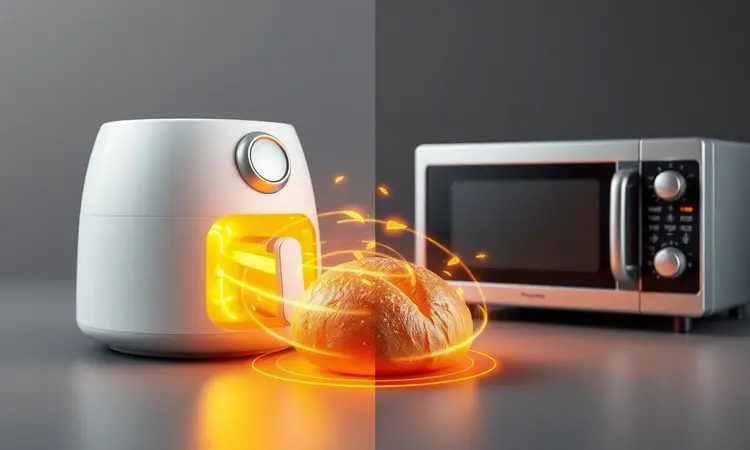
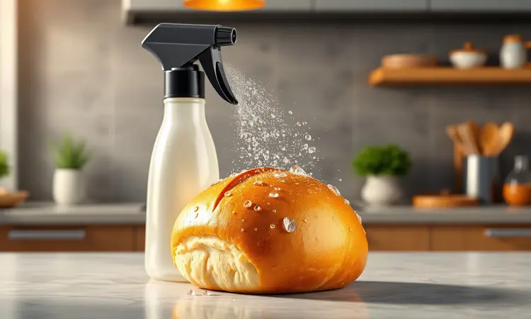
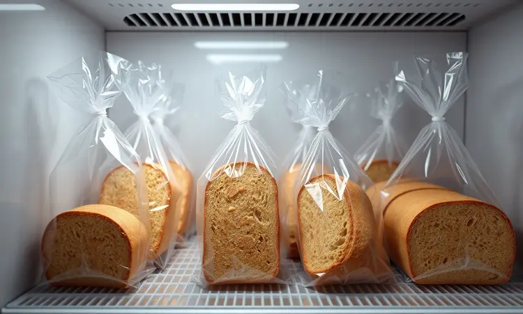

Você já sentiu a frustração de tentar descongelar um pão no micro-ondas e ele sair borrachudo ou duro como uma pedra?

Muitas pessoas acreditam que a única forma de comer pão fresquinho é indo à padaria todos os dias, mas o segredo para a praticidade está guardado na sua cozinha.

Neste guia, você aprenderá a técnica definitiva de como descongelar pão na airfryer, garantindo aquela casquinha crocante e o miolo macio que todo mundo ama.

Vou te mostrar o passo a passo exato, o truque da água para hidratar a massa e como evitar os erros comuns que estragam o café da manhã.

<SummaryList products={frontmatter.top_products} />

## Por que a Airfryer é Superior ao Micro-ondas para Descongelar Pão?

Pense na última vez que você usou o micro-ondas para descongelar pão. Provavelmente se deparou com aquela textura encharcada e borrachuda que ninguém merece.

A airfryer resolve esse problema com um segredo simples: ela usa circulação de ar quente para envolver cada pedacinho do pão de maneira uniforme.

Enquanto o micro-ondas cozinha o pão de dentro para fora (criando o temido efeito borracha), a airfryer trabalha de fora para dentro.

Isso significa que primeiro você ganha aquela casquinha dourada e crocante que estala ao morder, e só depois o calor chega suavemente ao miolo, preservando toda a maciez.

O tempo pode ser semelhante nos dois aparelhos, mas o resultado final é como comparar uma refeição de restaurante com comida requentada. A diferença está nos detalhes que fazem seu café da manhã valer a pena.

## Como Descongelar Pão Francês na Airfryer: Passo a Passo Completo

Esta é a parte prática que você estava esperando. Para ressuscitar aquele pão francês congelado, basta seguir três passos simples:

1. Tire o pão direto do freezer e coloque na cesta da airfryer (sem precisar esperar descongelar)

2. Ajuste a temperatura para 160°C

3. Deixe por 5 a 7 minutos

Sim, é só isso! Enquanto você prepara o café ou organiza a mesa, a airfryer trabalha para devolver ao pão aquela textura recém-saída da padaria. O ponto ideal é quando você sente aquele cheirinho irresistível e vê a casca atingir um tom dourado perfeito.

### O Truque da Água: O Segredo para o Pão não Ressecar

Agora vamos ao verdadeiro segredo dos profissionais. Você já percebeu que às vezes o pão fica perfeito por fora, mas um pouco seco por dentro? A solução está em um simples detalhe: umidade controlada.

Coloque um pequeno recipiente com água na cesta da airfryer, ao lado do pão. Essa água vai evaporar durante o aquecimento e criar um microclima úmido dentro do aparelho. O resultado?

O calor crocante continua atuando na casca, enquanto o vapor suave mantém o miolo macio e úmido.

Use essa técnica especialmente com pães que tendem a ressecar mais rápido, como os integrais ou artesanais. Você vai notar como o interior fica fofinho, quase como se tivesse sido assado na hora.

## Tempos e Temperaturas Ideais para Diferentes Tipos de Pão

Agora que você domina o método básico, vamos ao ajuste fino. Nem todo pão é igual, e cada tipo pede um cuidado específico. A regra geral é 160°C, mas o tempo varia conforme a densidade:

- **Pães brancos** (francês, cacetinho): 5 a 8 minutos - são mais leves e aquecem rápido

- **Pães integrais**: 8 a 10 minutos - por serem mais densos, precisam de um pouco mais de tempo para o calor penetrar

- **Pães doces ou com recheio**: 6 a 9 minutos em temperatura mais baixa (150°C) para não queimar o açúcar ou derreter o recheio descontroladamente

A melhor dica? Fique de olho. Depois de alguns testes, você desenvolve um "instinto" para saber quando está no ponto perfeito pelo cheiro e pela aparência.

### Pão de Forma, Integral e Artesanal: Ajustes Necessários

Cada tipo de pão tem sua personalidade, e entender isso faz toda a diferença:

Pão de forma é o mais delicado. Coloque as fatias na cesta sem sobrepor e mantenha os 160°C, mas reduza o tempo para 5 a 7 minutos. Você quer aquela leve crocância nas bordas sem transformar o centro em torrada.

Pão integral, por ser mais compacto, precisa de um tratamento especial. Baixe um pouco a temperatura para 150°C e deixe por 8 a 10 minutos. A paciência extra é recompensada com um pão quente que mantém toda sua textura característica.

Pão artesanal geralmente já vem com uma casca mais resistente. Aqui você pode ser mais ousado - 160°C por 6 a 8 minutos vão trazer de volta aquela crosta que estala ao ser cortada e o miolo aerado que define um bom pão artesanal.

## Como Recuperar Pão Dormido (Amanhecido) na Airfryer e Deixá-lo Crocante de Novo

Já aconteceu de você abrir o pão pela manhã e perceber que ele perdeu a magia da véspera? Não precisa se conformar com pão "dormido". A airfryer tem o poder de reverter o tempo.

Corte o pão em fatias (isso aumenta a superfície de contato com o ar quente) e coloque na cesta.

Em 3 a 5 minutos a 160°C, você vai ver a transformação acontecer: a umidade excessiva evapora, aquela casca murcha recupera sua crocância e o pão parece ter voltado algumas horas no tempo.

Se perceber que está muito seco, borrife uma leve névoa de água antes de colocar na airfryer. A água ajuda a reidratar o miolo, enquanto o ar quente cuida da crosta. É como um SPA para pães.

## Melhores Modelos de Airfryer para Resultados Perfeitos

<ProductBox 
  title={frontmatter.top_products[0].title} 
  image={frontmatter.top_products[0].image} 
  link={frontmatter.top_products[0].link} 
/>

Para garantir que esses resultados maravilhosos sejam consistentes, é importante ter uma airfryer que seja sua parceira na cozinha. Alguns modelos se destacam por transformar o descongelamento em uma experiência quase mágica.

A Mondial AFDO-25L-FD é a escolha das famílias maiores. Com seus 25 litros, ela tem espaço para descongelar pães para todo mundo ao mesmo tempo. A potência de 2200W garante que o calor circule com vigor, criando aquela crocância uniforme que faz diferença.

Já a Philips Walita Série 1000 XL é como ter um chef profissional na sua cozinha. Seus 6,2 litros são o ponto ideal para quem quer qualidade sem exageros. A construção premium e o controle preciso de temperatura fazem com que cada pão saia exatamente como você imaginou.

Para quem valoriza a praticidade do dia a dia, a Fischer Prime Digital 6L é uma alegria. As funções pré-programadas e o painel digital eliminam as adivinhações. Você seleciona "pão", e ela cuida do resto, deixando você livre para aproveitar o momento.

Independente da escolha, o importante é encontrar uma parceira que se adapte ao seu ritmo de vida e transforme suas manhãs.

## Dicas de Especialista: Como Congelar o Pão Corretamente para Facilitar o Processo

Agora que você já é expert em descongelar, vamos à arte de congelar. Porque um bom descongelamento começa com um congelamento inteligente.

Corte o pão em fatias antes de congelar. Essa simples decisão muda tudo: você passa a descongelar apenas o que vai comer, evitando desperdícios e mantendo o restante perfeito para outra vez.

Embrulhe cada fatia individualmente em papel-filme, ou se preferir praticidade, use um saco plástico hermético. O segredo aqui é remover o máximo de ar possível - é o ar que causa aquelas queimaduras de gelo que ressecam o pão.

Etiquete com a data e tente consumir dentro de três meses para manter o sabor no seu auge. Dessa forma, você cria um ciclo virtuoso: congela com cuidado, descongela com maestria, e sempre tem pão perfeito à disposição.

## 5 Erros Comuns que Deixam o Pão Duro ou Queimado

Mesmo com toda técnica, alguns deslizes podem sabotar seu pão perfeito. Fique atento a estes cinco vilões:

1. **Temperatura muito alta** - Se o calor estiver excessivo, a casca queima antes do interior descongelar. É como vestir um casaco pesado sobre um corpo ainda frio.

2. **Tempo prolongado demais** - A ansiedade de "só mais um minutinho" pode transformar seu pão crocante em uma torrada seca. Confie no tempo sugerido.

3. **Esquecer o papel alumínio** - Para pães muito finos ou que tendem a secar rápido, um envoltório de alumínio protege sem impedir o aquecimento.

4. **Lotar a cesta** - O ar precisa circular livremente para trabalhar sua magia. Pães amontoados criam zonas frias e quentes irregulares.

5. **Ignorar o pré-aquecimento** - Dar à airfryer aqueles 2-3 minutos para atingir a temperatura ideal garante que o pão comece a receber calor consistente desde o primeiro segundo.

Evitar esses erros é mais simples do que parece: observação. Seu pão vai te dar sinais quando estiver pronto.

## Perguntas Frequentes sobre Descongelamento de Pães

Algumas dúvidas sempre aparecem quando começamos essa jornada. Vamos esclarecer as principais:

O pão pode ficar duro na airfryer?
Só se o tempo ou temperatura estiverem inadequados. Quando bem ajustados, a airfryer faz exatamente o oposto: cria crocância externa enquanto preserva a maciez interna.

Quanto tempo leva para descongelar?
Entre 5 e 10 minutos na maioria dos casos. Pães mais finos ficam prontos mais rápido, os mais densos pedem um pouco mais de paciência.

Posso descongelar pães recheados?
Sim, mas com um ajuste: temperatura um pouco mais baixa (150°C) e tempo ligeiramente maior. Isso garante que o recheio aqueça completamente sem queimar a massa.

Preciso virar o pão durante o processo?
Apenas se notar que um lado está dourando mais que o outro. A maioria das airfryers modernas tem circulação tão eficiente que isso não é necessário.

## Conclusão

Descongelar pão na airfryer é muito mais que uma técnica culinária: é recuperar momentos. É transformar a pressa da manhã em um ritual agradável, e o congelador em seu aliado para sempre ter pão fresquinho.

Desde o pão francês soltando aquelas migalhas crocantes até o integral mantenho sua textura densa e saudável, cada tipo encontra na airfryer sua segunda chance.

E com os ajustes certos de tempo e temperatura, você deixa de ser refém do micro-ondas borrachudo ou do pão dormido da padaria.

Experimente. Comece com um pão simples, observe as transformações, ajuste conforme seu gosto pessoal. Em poucos dias, você desenvolverá seu próprio método, seu próprio ritmo.

E descobrirá que ter pão perfeito a qualquer hora não é um luxo, mas uma simples decisão de cuidar bem dos pequenos prazeres do dia a dia.

Agora é sua vez: abra o freezer, pegue aquele pão esquecido, e dê a ele - e ao seu café da manhã - a revolução que ambos merecem.